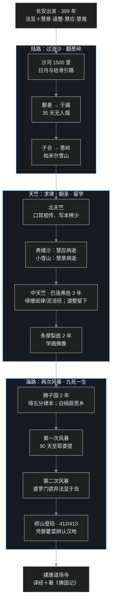

> 公元 399 年，长安。一位六十岁上下（一说已六十四岁）的老和尚，带着四个同伴，悄无声息地出了城门，一路向西。没有官方护照，没有补给车队，前方是流沙、雪山和语言不通的异国。这位老和尚叫**法显**——比《西游记》里那位唐僧的原型玄奘，整整早了二百三十年。法显走了十四年、历经三十三国：陆路去，翻越帕米尔；海路回，从斯里兰卡漂到山东，途中两次遇上大风暴，同船的婆罗门信徒一度要把法显丢到荒岛上去平息海神之怒。而法显一行人里，最后真正回到中国的，只有法显一个。

## 先给小白交个底

正式开讲前，先把四件事交代清楚：

- **西行求法是一场持续几百年的「留学生运动」。** 从三国的朱士行（中03 讲过）算起，到唐宋的玄奘、义净，一批批中国僧人冒着生命危险去印度，目的不只是取经，还包括在印度名师门下就学、朝拜佛陀圣迹。梁启超先生专门写过一篇文章，把这批人称作《千五百年前之中国留学生》。
- **法显是「陆去海还」第一人。** 在法显之前，求法僧人多走陆路，且大多止于西域诸国、极少有人进入印度腹地（据学界一般描述）；法显第一个翻过帕米尔高原、横穿整个印度次大陆，再从海路漂回来——十四年，三十三国。
- **法显出发的真正由头是「戒律不全」。** 当时中国佛教有戒本（一条条的戒律条文），却没有「广律」——解释每条戒律为什么制定、什么情况下算开缘的大部头。僧团遇到具体事，常常各说各话。法显发愿：去佛教的发源地，把完整的律藏请回来。
- **这场运动的生还率，约四分之一。** 以梁启超的统计，西行求法的僧人里，能学成平安回来、姓名可考的大约只占四分之一；死在路上的约四分之一；其余大半半途折返或留在了印度。本篇最后会给出这本「生死账」。

---

## 一、为什么非去不可

### 1. 最完美的佛典是怎么来的

先看一组大背景。世界上的佛教典籍有三大文系：**汉文、巴利文、藏文**。三系的内容构成差别极大：

- **巴利文佛典**＝以原始佛教、部派佛教（上座部赤铜鍱系）为主；
- **藏文佛典**＝以后期大乘和秘密大乘为主；
- **汉文佛典**＝从原始佛教、部派佛教，到初期大乘、后期大乘，再到少数秘密大乘，**四个阶段全部齐备**。

论跨越时间之长、内容门类之全，汉文佛典在三系中首屈一指。近代西方学者写佛学著作，常常要特意加一句：「很遗憾我还不能直接阅读汉文佛典。」可这套宝库不是天上掉下来的——它是靠一代代西行求法僧人，用命换来的。

### 2. 法行人与信行人

佛教把信仰者的根器大致分两类：

- **信行人**：听了就信，多数人属于这一类；
- **法行人**：极其理性，讲的道理不能敬服就不接受——一旦接受，往往信得极深、走得极远。

当年有年轻人要皈依佛陀，佛陀告诉这位年轻人：不要看我出身王子、不要看我僧团人多、不要看多少国王拥护——这些外在条件都不能作数；必须去检验我讲的法，看它合不合理、能不能说服人。这个态度贯穿了整部佛教史：**佛教是「智信」，不是盲信。**

西行求法的高僧，几乎清一色是法行人。法行人对义理、仪轨都要追根究底：经典传译有隔阂（早期翻译在中国文化里找不到对应名词；来华僧人未必是当地最专精的法师），求法僧不满足于二手版本，要直接到源头去。

### 3. 为了「广律」

法显是平阳郡人（今山西临汾一带），自幼出家（据《高僧传》所载，年岁极小便被送入寺院）。到老年时，法显最焦虑的一件事就是戒律：

- 当时中国有各种戒本（《僧祇戒心》之类，中03 讲过昙柯迦罗译《僧祇戒本》），但**没有广律**；
- 广律是大部头的戒律全书：每一条戒为什么制、怎么开遮持犯、衣食住药如何规范，全部有详细解释；
- 没有广律，中国僧团遇事先争：这样做如法吗？那样算不算犯戒？谁也裁不了。

另外一些重要经典也还没译全。公元 399 年（东晋隆安三年，后秦弘始年间；长安时属后秦），法显在长安约同学**慧景、道整、慧应、慧嵬**等人，正式启程西行。

全程路线先一图览尽（分段细节见后文）：

---

## 二、陆路：流沙、于阗与葱岭

### 1. 沙河：1500 里无人区

出长安后一路向西，穿河西走廊，第一大险是「沙河」（敦煌以西的沙漠）。沙漠腹地走不了人，只能沿着沙漠边缘前进。法显后来在《佛国记》里回忆：沙河里辨不清方向，白天靠太阳、夜晚靠星月指引；更多的时候，只能靠地上死人与野兽的枯骨认路。这样走了**一千五百里**，才到鄯善国（今新疆若羌一带）。

### 2. 于阗：35 天不见一户人家

队伍再北上经焉耆（今焉耆一带），又南下横穿塔克拉玛干沙漠西缘，沿和田河走到于阗国（今新疆和田）。这段路走了 **35 天，沿途没有看见一户人家**。

于阗是当时西域的大乘佛教中心（中03 讲过，朱士行就是在于阗取到《放光般若》）。法显一行在于阗看到了盛况空前的「行像」盛典（据《佛国记》所记），短暂休整后继续向西，经子合国（今新疆叶城），直抵葱岭脚下。

### 3. 葱岭：翻越帕米尔

**葱岭就是帕米尔高原**，山上冬夏常积雪，冰河至今犹存。法显一行艰难翻越后，终于进入**北天竺**（今巴基斯坦境内）。

法显注意到一个情况：北天竺的师徒传承几乎全靠口耳相传，写本极少。佛教经典最初本就没有文字记载，直到公元前 1 世纪才开始落成文字，此时在北天竺仍不普及——这也解释了为什么求法要趁早、要找对地方：很多法，只活在当地僧人的记忆里。

### 4. 700 处栈道与新头河

离开北天竺后，队伍沿印度河向西南，要去中天竺。这段路的险峻，法显写得令人头皮发麻：

- 沿河岸要走**七百多处栈道**——在断崖上凿出的简陋木道，直到近代仍有遗迹；
- 再攀着简易绳索吊桥，渡过「新头河」（即印度河，「印度」「新头」都是 Sindhu 的音译）。

渡过印度河后，队伍翻越小雪山。真正的生死考验，来了。

---

## 三、折翼失群：同伴一个个离去

### 1. 慧应之死

早在北天竺的弗楼沙国（犍陀罗地区，今巴基斯坦白沙瓦一带），同行的**慧应**就病倒了，最终客死异乡——佛钵寺旁，一座异国孤坟。

### 2. 小雪山：慧景之死

小雪山（今阿富汗贾拉拉巴德一带的山岭）上严寒难当，**慧景**也生了重病，没能熬过去，死在雪山上。法显抱着道友的遗体放声痛哭，哭完，还得往前走。

《佛国记》里只留下法显抚尸悲号、不得不继续前行的极简记录（据课程对原文的转述，此处不引原句）。

### 3. 道整留下了

翻过雪山，法显与**道整**两人历经万难，终于抵达中天竺（恒河流域）——此时法显已年届古稀。

两人在中天竺共同学习了几年，但道整最后做出了决定：**不回中国了。** 一来年纪大了，经不起回程；二来眼见印度僧团戒律严谨、道风淳正，心生追慕。道整留在了天竺。

### 4. 慧嵬折返

另一位同伴**慧嵬**，则在更早的路上便折返回了国。

——数年前从长安出发的五人队伍，慧应病死、慧景冻死、道整留印、慧嵬折返。法显，成了孤身一人。

---

## 四、中天竺：取经、朝圣与三年留学生活

### 1. 巴连弗邑三年

中天竺的中心是**巴连弗邑**（华氏城，今印度巴特那一带，摩揭陀国故都）。法显在这里停留了 **3 年**，做的事和所有留学生一样：

- 学习梵文、梵书（印度的语言文字）；
- 寻访、抄录梵文经律写本。

法显在巴连弗邑求得的典籍包括：

- 《**摩诃僧祇律**》——大众部的广律（这是法显最想要的东西之一）；
- **萨婆多部律**（说一切有部的律藏）；
- 《**杂阿毗昙心**》；
- **六卷《泥洹经》**——就是后来在南京掀起轩然大波、被竺道生抓住「一阐提也有佛性」的那部经（中08 主角戏，此处回收）。

### 2. 朝圣：佛陀的脚印

在中天竺期间，法显还完成了另一桩夙愿——朝拜佛陀圣迹。佛临涅槃时安慰弟子：怀念我，就去我出生、成道、说法、入灭的地方看看。阿育王后在这些地方广建舍利塔。法显一一走访：

- 迦毗罗卫（佛诞生地）；
- 菩提伽耶（佛成道处）；
- 鹿野苑（初转法轮处，番外一讲过）；
- 舍卫城祇树给孤独园；
- 王舍城、灵鹫山……

许多在印度本土已经荒芜的圣地，这位中国老僧拄杖一一走到。

### 3. 多摩梨：两年学画佛像

之后法显东行至**多摩梨底国**（今印度加尔各答西南、孟加拉湾沿岸的古港 Tāmraliptī），又住了 **2 年**，在这里学习绘制佛像，继续抄写经书——画像技艺后来随法显一起回了中国。

至此，陆路的求法已圆满。但怎么回？法显做了个当时没人敢做的决定：**走海路。**

---

## 五、海路：狮子国、风暴与崂山

### 1. 狮子国两年

法显搭乘商船，在海上航行了 **14 天**，抵达**狮子国**（今斯里兰卡）。当时的斯里兰卡是南传佛教重镇，法显在无畏山寺住了 **2 年**，又求得一批典籍：

- **弥沙塞律**（化地部的广律，后来译出称《五分律》）；
- 《长阿含》《杂阿含》的梵本（据课程所述）；
- 杂藏等。

### 2. 白绢扇：一念思乡

在狮子国，法显遭遇了一次「破防」。一位商人在佛前供养，拿出的供品是一把**汉地的白绢扇**——远离故土多年的法显，忽然看见故国之物，一时老泪纵横。

身边都是异域人，说的是异域话；这把扇子提醒这位七十多岁的老僧：家乡，还在万里之外。

### 3. 第一次风暴

法显备好粮食淡水，登船东归。船开了 **3 天**就遇上大风暴，在海上漂流十几天，漂到一座岛屿，众人修好船继续前行。直到出发后第 **90 天**，才抵达**耶婆提国**（今印尼苏门答腊或爪哇一带），下船补给。

### 4. 第二次风暴：差点被祭海神

在耶婆提换了去广州的大船，法显再次遭遇特大风暴。船完全失控，只能随风浪漂流。船上有一批信仰婆罗门教的客商，私下商量：就是因为船上载了个佛教和尚，得罪了海神——要把这和尚丢到海岛上去自生自灭，海神才会息怒。

关键时刻，船上一位**佛教徒施主**厉声呵斥、拼死保护，婆罗门客商才没敢动手。而法显当时心里想的不是自身安危——按《佛国记》所记（据课程转述），法显顾念的是：这一船经律若断送在海上，**无人可托**。

### 5. 藜藿菜与两个猎人

船在海上漂到粮食和淡水都将用尽，终于靠岸。本来要去广州，靠的是哪里？法显上岸后看见一种「藜藿菜」（旧时中国北方常见的野菜）——凭这棵菜，法显断定：回到中国了。

随后遇上两个猎人，一问之下才知道：此地是**崂山**（青州长广郡，今山东青岛崂山湾）。地方太守听说有僧人从印度回来，惊喜万分，亲自派人迎接。

按法显自己的记录：海路回程前后漂了 **330 多天，两次遇难**。

### 6. 晚年南京：译经与《佛国记》

法显没有在山东停留，很快南下抵达建康（南京）道场寺，投入译经：

- 与**佛陀跋陀罗**合作，译出《**摩诃僧祇律**》（大众部广律）、六卷《**大般泥洹经**》等；
- 写下《**佛国记**》（一名《法显传》《历游天竺记传》），将十四年行程和沿途各国的政治、民俗、语言、宗教、传说全部记录。

法显后来迁往荆州辛寺，约 **420 年前后圆寂**（世寿有八十二、八十六等不同记载）。法显带回的**弥沙塞律**，后来由罽宾律师佛陀什译出，即《五分律》。

---

## 六、卓越贡献：五本账

按汤用彤、梁启超等先生的总结，法显的贡献可算五本账：

**第一本：开路。** 陆去海还、环游三十三国、去国十四年，自古未有；第一次把中国人的足迹印到了中印度的大地上。

**第二本：《佛国记》。** 西域、印度三十余国的实录——政治、民俗、语言文字、宗教地理、传说故事，是研究 5 世纪初亚洲历史的第一手资料，英、法、德早有译本。当年法显走过的许多国家后来都已消亡，本国又不重史书——没有《佛国记》，那段历史几乎是空白。近代英、俄等国学者在西域、印度做考古发掘，很多遗址就是按《佛国记》的坐标找到的。

**第三本：广律齐备。** 法显西行的本意就是请律。下面这张表，把汉传四大广律一次摆清：

| 广律 | 部派 | 译者 |
|---|---|---|
| 《十诵律》 | 说一切有部 | 鸠摩罗什、弗若多罗、昙摩流支等 |
| 《四分律》 | 法藏部 | 佛陀耶舍、竺佛念 |
| 《摩诃僧祇律》 | 大众部 | **法显**、佛陀跋陀罗 |
| 《五分律》 | 弥沙塞部（化地部） | 法显带回梵本，佛陀什译出 |

这四部广律，加上后来义净译回的根本说一切有部律，使汉文戒律藏的完备程度远超巴利、藏文两系（巴利只有赤铜鍱律，藏文只有有部律）——研究戒律，汉文资料最方便比较。法显西行期间，《十诵律》《四分律》已先后在长安译出；法显又补回大众部、化地部两部，功莫大焉。

**第四本：阿含具足。** 在法显前后，四《阿含经》陆续译全：《长阿含》（佛陀耶舍译）、《中阿含》《增一阿含》（僧伽提婆等译）、《杂阿含》（求那跋陀罗译）。四阿含分属**不同部派**——不像南传巴利三藏只属赤铜鍱一部，所以汉译四阿含可以和巴利文本对读研究。《杂阿含》尤其珍贵：它保存的就是第一次结集时阿难诵出的核心法语（修多罗部分）。

梁启超先生说：不读阿含，大乘义理便无从了解——阿含是佛教的基本教育，大乘经的听众都懂阿含，所以经文不重复；后人要读大乘，阿含这一课不能缺。

**第五本：涅槃学派。** 法显第一个把《泥洹经》带回并组织译出，涅槃义学由此在南京开讲，研究者越来越多，发展成中国最早的佛学学派之一——涅槃师。中08 竺道生的整出大戏，脚本就是法显带回的这部经。

还有一笔「看不见的贡献」：以法显为代表的求法僧，把印度的绘画、雕塑、建筑、音乐元素带回中国，对南北朝以后的中国艺术影响深远——法显本人就专门学过佛像绘制。

---

## 七、求法者群像：一本死亡账单

法显不是一个人在战斗。东晋南北朝间投身西行的僧人，姓名可考的数以百计，这里举两位：

### 1. 智猛：15 人同行，2 人归来

**智猛**，雍州人，404 年在长安招集同志 **15 人**出发。结果：

- 至葱岭，9 人不支退返；
- 沿途又有道友病死；
- 智猛本人在中天竺华氏城求得《大般泥洹》《摩诃僧祇律》等梵本；
- 最终完成求法、与**昙纂**两人结伴归国。

15 去，2 人还。

### 2. 法勇（昙无竭）：25 人同行，5 人抵达中天竺

**昙无竭**（法名法勇），幽州黄龙人，420 年集同志 **25 人**西行。翻越兴都库什山的悬崖时：

- 峭壁上没有路，只有前人凿出的小孔；每人手携四根木橛，两根插在上方手攀、两根插在下方脚踏，走一步拔一根、再往更下面插，就这样一寸寸下悬崖；
- **12 人**失手坠落，摔死在崖下；
- 下山后沿途又有 **8 人**病死。

抵达恒河流域时，25 人只剩 **5 人**。沿途两山之间只有简陋绳索桥，山雾里看不见对面，一个人先过，平安到对岸后**举火为号**，第二个人才敢上桥。

### 3. 总账：1/4 回来，1/4 死在路上

梁启超先生对西行求法者做过统计（据其《千五百年前之中国留学生》一文）：

| 结局 | 比例 |
|---|---|
| 学成平安归来（姓名可考） | 约 **1/4** |
| 死于路途（去途、归途皆有） | 约 **1/4** |
| 半途折返、或留在印度 | 约 **1/2** |

另外还有个有趣的籍贯统计：西行僧人里竟没有一个江浙人。梁启超、印顺都推测过原因：江浙是三论宗、天台宗的诞生地，当地人理解力强、好学深思，或许正因为此，体魄不够强悍；又兼当地富裕文弱——**爱思考的人与敢拼命的人，常常不是同一批。**

### 4. 为什么不走海路

既然法显走通了海路，后人为何仍多走陆路？原因很现实：

- 当时去印度的商船只在**广州、交趾**（今越南北部）发船，而那时南方湿热多疫，北方人南下还没上船就先病倒；
- 商船没有班期，等船可能要等很久；
- 航海技术落后，风暴迷航是家常便饭——海路未必比陆路安全。

### 5. 中国僧人的「游记传统」

印度、西域都不重写史，中国恰是最重视历史的国家——西行僧人普遍有写游记的习惯。可惜多数游记早已亡佚，完整流传至今的只有四部：

- 法显《**佛国记**》；
- 玄奘《**大唐西域记**》；
- 义净《**南海寄归内法传**》；
- 义净《**大唐西域求法高僧传**》。

这四部书，至今仍是全世界研究中亚、印度古史的瑰宝。这场运动还有一个绝妙的镜像：隋唐时日本派来的学僧（最澄、空海等），走的正是法显们的同一条路——把中国的佛法、宗派，连同花道、茶道、书道，整套搬回日本。法显带回的东西，后来又这样接力传了下去。

---

## 程序员类比

- **西行求法像什么？** 像线上系统的文档只有残缺的中文版，一群工程师不满足，直接杀到原厂总部去读源码、拜访核心维护者、参加内部培训——回国后不止把文档补全，还把整套研发流程和工具链带了回来。
- **法显最像那种「为解决一个具体问题而出差」的老工程师**：出发目标极其明确——广律（接口规范全集）；顺带完成了十四年的环游。目的清晰的人，路上不容易被风景带偏。
- **折翼失群五人小队**，像五个合伙人一起去九死一生的无人区做项目：病退的、冻死的、留下不回的、中途折返的，最后只有一个人带着成果交付——功劳簿上的名字，背后是整支小队的命。
- **1/4 的生还率**，在今天看就是「高风险职业」：行业的知识边界，就是被这样一批拿命去探路的人一寸寸拓宽的。
- **四阿含分属不同部派**，像同一套核心协议的四个不同实现版本——彼此对读，才能看出哪些是协议本体、哪些是各家的方言扩展。
- **戳个洞：** 法显带回的「佛说」，其实在印度口传过程中早就掺进了后人不断添加的东西——连阿难在世时，年轻比丘都在背诵「不见水老鹤」这种以讹传讹的句子；阿难出面纠正，其师反说「老人家记错了」，让弟子照旧背诵。源头崇拜解决不了版本污染：所有的「原教旨」，拿到的都不是真正的第一版。

---

## 吵架现场

**争点一：法显出发时到底是几岁？**

课程里两个口径：慧琏法师按生年约 339、卒约 420 推算，399 年出发时约六十岁；《概说》课程讲「64 岁才去印度」。这不是谁对谁错，是法显确切生年史无明文（世寿又有八十二、八十六两说），用哪个数字都是在不同史料版本间做选择。

**争点二：法显「带回」的经，有多少算请回来的？**

《长阿含》《杂阿含》等经的现存译本，译者分别是佛陀耶舍、求那跋陀罗等人，梵本与法显的关系，史料只能提供间接关联。把汉译阿含的功劳全记在法显头上不严谨；但没有法显开创的求法—译经网络，这些经能否在那个年代译全，也要打问号——个人英雄与时代网络，账怎么分，一直是佛教史书写的争论点。

**争点三：西行求法值不值？**

一派看：四分之三的人没有回来，用这么多条命去换一批书，代价过于惨重；另一派（也是课程立场）看：没有这批人，就没有完整的汉传佛教与后世整个东亚文化圈——伟大的文明工程从没有低成本的。这是「生命账」与「文明账」之间永远无法互相说服的争论。

**争点四：佛教到底是智信还是迷信？**

课程反复强调法行人的理性精神，但同一时期的佛教实践里，神异、咒术、海神信仰泛滥（连船上的宗教冲突都因海神而起）。推崇者看，理性是佛教的内核；批评者看，历史上的佛教多数时候活在信行人的现实需求里。「应然的佛教」和「实然的佛教」，在每一部史书里都在打架。

---

## 卡壳角

写这篇时踩在资料边界上的点，统一交代：

- **法显的确切生卒年无定说。** 生年有 337/339 等推法；卒地有建康道场寺、荆州辛寺两说，卒年有 418–423 多种记载，世寿有八十二、八十六两说。本文取课程口径（生约 339、卒约 420），出发年龄如实并呈「约 60／64」两个课程版本。
- 去国「**14 年、33 国**」出自《佛国记》与汤用彤的概括；《佛国记》自身另有「六年到中国、停六年、还三年」的笼统说法，按整年计算与 14 年略有出入，本文取通行表述。
- **崂山登陆的年份**史料有义熙八年（412）、九年（413）两说，本文不系死。
- 《**长阿含**》《**杂阿含**》梵本为法显在狮子国求得一说，出自慧琏课程口语；现存经录只记译本（佛陀耶舍、求那跋陀罗等译），梵本来源与法显的关系无法以经录逐字坐实，正文已加「据课程所述」。
- 《**摩诃僧祇律**》《**六卷泥洹**》的译经过程是法显与佛陀跋陀罗合作，时在建康道场寺；《高僧传》《出三藏记集》对起译年份与译地细节记载不完全一致。
- **智猛、昙无竭的人数账**（15→2、25→5）出自《高僧传》本传；其中退返、病死各阶段人数，诸本转述略有出入。
- 梁启超关于 1/4 生还率的统计是其个人对史料的估算（《佛学研究十八篇》所收），并非精确普查；籍贯「江浙无人」一条同样是梁氏的观察，印顺的评论为课程引及。
- 「藜藿菜」是《佛国记》原文所载（凭此辨认汉地）；白绢扇故事出《佛国记》狮子国无畏山寺一节；婆罗门投岛之议、佛教徒施主保护之事，均见《佛国记》原文。
- 阿难「水老鹤」故事见于《杂阿含经》相关序分及《付法藏因缘传》一系文献，细节传本不一；「若人生百岁，不解生灭法」的偈子，课程引《杂阿含》。
- 四阿含的部派归属（法藏部、有部、大众部等）学界尚有争论，本文取通行的对应表；汉译四阿含可与巴利本对读是学界共识，但具体经的对应关系并不整齐。
- 第一次结集「七叶窟」、阿难侍者 25 年等，为佛教传统通说；考古与历史层面的细节学界另有讨论。

---

## 术语表

| 术语 | 一句话解释 |
|---|---|
| 法显 | 约 339–420，平阳（今山西临汾）人，西行求法「陆去海还」第一人 |
| 西行求法 | 中国僧人亲赴印度、西域取经求学的运动，梁启超称最早的留学生运动 |
| 梁启超《千五百年前之中国留学生》 | 统计西行运动的专文（收入《佛学研究十八篇》），得生还率约 1/4 |
| 三大文系 | 汉文、巴利文、藏文佛典；汉文内容最完备 |
| 法行人 | 理性根器者，道理敬服方信；西行僧多属此类 |
| 信行人 | 听闻即信的根器，居多数 |
| 智信 | 以理智检验而信仰，区别于盲信 |
| 广律 | 解释全部戒条制戒因缘与开遮持犯的大部律书 |
| 戒本 | 戒律条目的单行本（如《僧祇戒本》），无广律之详解 |
| 399 年 | 东晋隆安三年，法显自长安出发之年 |
| 慧景、道整、慧应、慧嵬 | 法显最初的四位同行者 |
| 沙河 | 敦煌以西的沙漠，法显沿边缘走 1500 里 |
| 鄯善国 | 今新疆若羌一带，法显出沙后第一国 |
| 于阗 | 今新疆和田，西域大乘佛教中心 |
| 子合国 | 今新疆叶城一带 |
| 葱岭 | 帕米尔高原，法显翻越后入北天竺 |
| 北天竺 | 今巴基斯坦一带，法显入印第一站 |
| 新头河 | 即印度河（Sindhu 音译），靠索桥渡过 |
| 弗楼沙 | 犍陀罗地区（今白沙瓦），慧应病逝之地 |
| 小雪山 | 今阿富汗东部雪山，慧景病逝之地 |
| 中天竺 | 恒河流域，法显留学核心区域 |
| 巴连弗邑 | 华氏城（今巴特那），摩揭陀故都，法显住 3 年 |
| 多摩梨底 | 孟加拉湾古港 Tāmraliptī，法显住 2 年学画佛像 |
| 狮子国 | 今斯里兰卡，法显住无畏山寺 2 年 |
| 无畏山寺 | 斯里兰卡古寺，法显驻锡地 |
| 白绢扇 | 商人以汉地绢扇供养，法显见物思乡落泪（《佛国记》） |
| 耶婆提 | 今印尼苏门答腊或爪哇一带，法显换船补给之地 |
| 海神之难 | 婆罗门客商欲弃法显于海岛，佛教徒施主呵止 |
| 藜藿菜 | 法显在崂山凭此野菜辨认出回到汉地 |
| 崂山 | 青州长广郡，今山东青岛崂山湾，法显登陆处 |
| 道场寺 | 建康（南京）名寺，法显译经地 |
| 荆州辛寺 | 法显晚年所住、圆寂之地（一说） |
| 《佛国记》 | 法显游记，一名《法显传》《历游天竺记传》 |
| 《摩诃僧祇律》 | 大众部广律，法显、佛陀跋陀罗共译 |
| 六卷《泥洹经》 | 法显带回、与佛陀跋陀罗译，涅槃学派所依（中08） |
| 《五分律》 | 弥沙塞（化地部）律，法显带回梵本、佛陀什译出 |
| 萨婆多部律 | 说一切有部律，法显在中天竺求得 |
| 《杂阿毗昙心》 | 有部论书，法显带回 |
| 四阿含 | 《长》《中》《杂》《增一》，分属不同部派 |
| 《长阿含》 | 佛陀耶舍、竺佛念译，法藏部 |
| 《中阿含》 | 僧伽提婆译，说一切有部 |
| 《杂阿含》 | 求那跋陀罗译，第一次结集核心法语所在 |
| 《增一阿含》 | 僧伽提婆等译，或属大众部 |
| 《十诵律》 | 说一切有部广律，罗什等译 |
| 《四分律》 | 法藏部广律，佛陀耶舍、竺佛念译 |
| 佛陀跋陀罗 | 天竺禅师（觉贤），法显译经搭档（中07 出场） |
| 求那跋陀罗 | 中天竺译师，译《杂阿含》等 |
| 佛陀耶舍 | 罽宾译师，罗什之师辈，译《四分律》《长阿含》 |
| 智猛 | 雍州僧，404 年 15 人同行、与昙纂 2 人归来 |
| 昙纂 | 智猛的同伴，二人同还 |
| 昙无竭（法勇） | 幽州黄龙僧，420 年 25 人西行、5 人达中天竺 |
| 兴都库什 | 法勇一行翻越之雪山，12 人坠崖、8 人病死 |
| 木橛 | 法勇一行下悬崖时插入壁孔的四根短木 |
| 举火为号 | 索桥先渡者在雾中举火报平安 |
| 义净 | 唐代求法僧，著《南海寄归内法传》《大唐西域求法高僧传》 |
| 《南海寄归内法传》 | 义净游记，记南海印度佛教实况 |
| 玄奘 | 唐代求法僧，著《大唐西域记》（比法显晚约 230 年） |
| 最澄、空海 | 日本入唐僧，将佛法与花道茶道书道传回日本 |
| 七叶窟 | 王舍城外，第一次结集处（大迦叶主持） |
| 阿难 | 佛陀侍者 25 年，第一次结集诵出经藏 |
| 水老鹤 | 以讹传讹的偈语：「不见水老鹤」，阿难纠正为「不解生灭法」 |

---

## 结尾

公元 5 世纪初的中国人，大多以为世界的中心就在长安与建康。法显用十四年走出来的三十三国告诉世人：往西，还有另一个完整的文明世界；而把那个世界最精华的典籍背回来，一个七十岁的老人就够了——代价是两位道友的命、其余同伴的离散，和一世孤独。

法显、智严、宝云、智猛、法勇……这一批名字，为「佛法西来」的大时代画下了句点：从公元前 2 年伊存口授《浮屠经》，到法显西行请回三藏，四百多年间，以法显为代表的西行求法，把汉译三藏推向大体完备——余下的经典，此后数百年仍在不断补入。

而随着汉译三藏的完备，佛教在中国也即将翻开新的一页：南北两地各自发展、学派林立，印度的概念正在被一个个中国头脑重新熔炼。下一站，第二部，南北朝——先看南朝的梁武帝：这位四次「舍身出家」的皇帝，如何把佛教推上国教的宝座，又如何在一场叛乱中饿死台城？中10，台城见。
