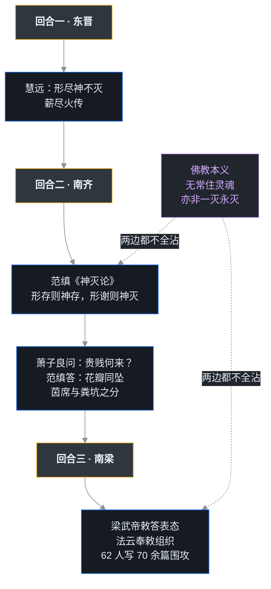

> 公元 549 年，建康台城。一位八十六岁的开国皇帝被困在宫殿里，口苦，求一口蜜水不得，在两声「荷！荷！」中咽了气。这个人叫**萧衍**——南朝宋齐梁陈第三个朝代「梁」的建立者，中国历史上护持佛教最力的帝王，自称「皇帝菩萨」。511 年，萧衍颁下《**断酒肉文**》，把素食写进汉传佛教的基因；梁武帝中后期，传统说法里达摩渡海来，皇帝兴冲冲地问：「我建寺度僧、供僧无数，有多大的功德？」达摩一句话把萧衍噎住：「**没有功德。**」萧衍还四次把自己「舍」进同泰寺，群臣凑亿万钱才把皇帝赎回。而最后，东魏降将侯景起兵，把这个 48 年的盛世连同王谢门阀一起碾成齑粉。「皇帝信佛所以亡国」——这句话对不对？本篇给皇帝菩萨算三本账。

## 先给小白交个底

正式开讲前，先把四件事交代清楚：

- **梁武帝是个「3/4 个好皇帝」。** 他在位 48 年（502–549，首尾计 48 年，实际 47 年有余），前半段勤政好学、制礼作乐，把南朝国力推到顶峰；后半段沉迷佛教、宽纵宗室，最后连首都都守不住。评价这个人不能只看开头或只看结尾。
- 《**断酒肉文**》是中国佛教「素食传统」的起点。佛教本来没有要求所有僧人吃素——印度僧团托钵乞食，檀越给什么吃什么。汉传僧人不能托钵、自己开伙，梁武帝认为自己开伙还杀生说不过去，用皇权把素食推向全国。「和尚吃素」这个大众印象，实际是他塑造的。
- 本篇另一条暗线是「**形神之辩**」：人死神识到底灭不灭？慧远（中07 讲过）说「形尽神不灭」；范缜写《神灭论》硬刚，把富贵贫贱比作一阵风把花瓣吹进厅堂或粪坑；梁武帝则组织了六十多位朝臣写文章围攻范缜。这是中国思想史上最出名的大论战之一。
- **节奏变了。** 中01–中09 讲「佛法西来」：佛教如何从丝路挤进来、如何在乱世扎根；从中10 起进入第二部「南北相望」——佛教已不是客人，它开始与皇权深度捆绑，开始重塑中国人的餐桌、葬礼和思想战场。

## 一、换防：刘宋退场，南齐上场

### 1. 残暴昏庸的刘宋尾巴

中09 结尾处提到，法显 412 年回国时正赶上东晋最后的年头。420 年，刘裕代晋建宋，开启南朝。刘宋初年有武帝的立国，接着宋文帝一朝创下「元嘉之治」，尾巴上的帝王却残暴昏庸，宗室相杀几乎成了家风。掌握军政大权的**萧道成**（齐高帝）也是在这种血雨腥风里篡宋自立，改国号为「齐」，史称南齐——距法显的时代已经过去半个多世纪。

齐高帝和儿子齐武帝，跟刘宋的武帝、文帝一样，能够崇信佛教、礼遇僧人。不过南齐佛教最特殊的两位护法，不是皇帝本人，而是齐武帝的两个儿子。

### 2. 真正把佛教活出来的两位皇子

齐武帝的长子**文惠太子**、次子**竟陵王萧子良**，兄弟俩同母所生（裴皇后）、极为友爱。二人对佛教的信奉跟一般宗室公卿求功德福报的心态大为不同——他们真正了解佛教的慈悲精神，并且身体力行：

- 文惠太子建立「**六疾馆**」，收容养护贫苦病人（六疾是各种疾病的统称，这是史书所载较早的公立医疗机构雏形）；
- 有一年浙江吴兴遭遇大水，萧子良开仓赈灾，又在王府北边建房舍收容流离失所的灾民，供给医药；
- 萧子良自号「**净住子**」，一生劝人为善、从不厌倦；他礼贤下士，才智之士云集门下；他偏爱大乘空理，对般若经类与《中论》《百论》《十二门论》三论极为爱好，在王府建精舍、请高僧讲经，还聘口才好的名僧四处弘法；斋会、放生、布施这些佛教界的大事，他无不亲自主持。

经这对兄弟提倡，南朝佛教达到东晋以来最兴盛的地步。

### 3. 萧子良门下的「竟陵八友」

萧子良的西邸是当时的文化中心，门下最出名的八个人称「**竟陵八友**」：沈约（后来写诗律「四声八病」的那位）、谢朓、王融、萧琛、范云、任昉、陆倕——还有一个人，就是后来的梁武帝**萧衍**。

也就是说，未来的开国皇帝年轻时是竟陵王读书会的核心成员，佛法、玄学、诗文都是在这张沙龙椅上泡出来的。这条人脉，后来直接决定了南朝的走向。

### 4. 南齐译经与《夷夏论》的初澜

萧子良活跃的时代，译事仍在继续。课程提到几位译者：僧伽跋陀罗译出《**善见律毗婆沙**》（律藏要籍）；求那毗地译出《**百喻经**》（以寓言譬喻说法，流传极广）与《十二因缘经》；还有译《无量义经》者，经属大乘。

另一面，佛教快速壮大，难免与本土的儒家、道教摩擦。刘宋末年，道士**顾欢**写下著名的《**夷夏论**》：强调「夷」「夏」之别——夷是外族、夏是华夏，反对「以中夏之性，效西戎之法」；他从礼仪、服饰、音乐、葬俗逐项申论中国与印度不同，认为印度文明野蛮落后，字里行间偏袒道教。这篇文字在南朝引发了持续很久的大辩论。课程里有一句公道话：南方的路线分歧到底只有口舌之争，不至于动用强烈手段；外来宗教与本土思想的摩擦，每个文明都要经历，等到隋唐以后佛教融入中华文化，反而生出三教合一的思想，与《夷夏论》时代的紧张全然不同。

## 二、八友之一做了皇帝

### 1. 雍州起兵

萧衍的哥哥**萧懿**，在南齐朝廷做重臣，被荒唐出了名的东昏侯萧宝卷所杀。当时萧衍正任职雍州（治所襄阳），手握强兵，一怒之下起兵东下，攻下建康；南齐的末代皇帝齐和帝下诏让位，萧衍即位，改国号为「梁」——因为也姓萧，史称**萧梁**。这一年是 502 年。

### 2. 从道教家庭走出来的皇帝菩萨

梁武帝的家庭本来信奉道教。因为年轻时与竟陵王萧子良过从甚密、常出入王府，在那种氛围里结识了许多高僧，也对佛法义理产生了真兴趣，后来正式改信佛教。傅新毅课程里有个判断：中国社会很现实，帝王信佛往往掺杂统治需要、个人祈福；若要找一个真正把佛当真的皇帝，大概就是萧衍——他甚至自称「**皇帝菩萨**」。这并非全是谀词：在梁初的朝堂上，它更像一个给自己立的修行目标。

### 3. 天监之治：前半场是明君

梁武帝尊重儒术，制礼作乐、勤政爱民，对学术的赞助不遗余力。他在位首尾 48 年、实际 47 年有余，活到 86 岁，是南朝在位最久、最高寿的皇帝。前半生的萧衍，是配得上「明君」两个字的：政治稳定、文化繁荣，建康城里名士盈门、寺院林立。这个年号叫「天监」的时期，就是整个南朝的顶点。

## 三、想学阿育王的人

### 1. 偶像：印度那个「法王」

梁武帝心里一直装着一个偶像——印度的**阿育王**（中01 讲过）。阿育王皈依佛教、自身素食、派遣高僧四出弘法，佛教从一个地方性教派变成世界性宗教，与阿育王的推动大有关系。梁武帝几乎处处模仿这位「法王」：自己素食、护持三宝、广建寺院、举办大施会。

### 2. 同泰寺与四次舍身

梁武帝修建了不少佛寺，如光宅寺、开善寺、爱敬寺、智度寺等，其中规模最大的是皇家寺院**同泰寺**。据考，其位置在今天南京太平南路迤北直至北极阁一带，地处宫城之北、南对宫城，占地面积极大（讲者久居南京，特意辨析了这一沿革）。他为同泰寺开了直通宫门的大门，早晚往返，方便得很。

「**舍身佛寺**」是梁武帝最出名、也最受争议的动作：把自己整个人「舍」给寺院，去做服役的义工，等于出家；国家不能没有君主，群臣只好凑出巨额钱财去寺院把皇帝「赎」回来，回宫理政。通行说法他先后四次舍身同泰寺，赎金动辄以亿万钱计（具体次数、数额诸本不一）。这当然是在模仿印度奉佛君王的做派，但客观上也给财政和朝纲开了个恶例。

### 3. 无遮大会与「义务讲经」

梁武帝还多次举办「**无遮大会**」——「无遮」即不分贵贱、僧俗、男女，一律平等布施的大法会，这种大会也是印度传统，阿育王、戒日王都常举办。他本人又极爱义学：为《大品般若经》作注，亲自登座讲《涅槃经》，对般若、涅槃之学相当精通。一个皇帝把「讲经法师」也兼职了，南朝义学的热度可想而知。

### 4. 皇室里的「读书会基因」

这家人的好学是有遗传的：

- 长子**昭明太子萧统**，崇信三宝，请高僧到东宫讲经，讨论得忘了时间；他信佛不是只求自了福报，而是慈悲的实践者——久雨久雪，就派亲信四处查访贫困流离者，暗中接济、不让对方知道是太子所施；冬天备衣食济贫，为无力安葬的死者准备棺木；听到百姓服徭役辛苦，忧形于色。当然，他更为后世熟知的身份是《**文选**》（中国现存最早的诗文总集）的主编。
- 三子**简文帝**萧纲，同样酷爱学问、博览群书，擅长玄理。
- 七子**梁元帝**萧绎，早年瞎了一只眼，好学不辍，叫人念书（包括佛经）给他听；他闭目静听，侍者以为他睡着了稍一停顿，立刻催促继续。他自己也常讲《法华经》《成实论》。

## 四、一道《断酒肉文》，刻进汉传佛教的基因

### 1. 印度僧团为什么不强制素食

先看印度的规矩。印度僧团没有「全员必须吃素」这一条，原因很简单：比丘靠**托钵**过活，檀越（布施者）给什么吃什么，挑不得。不过印度出家人吃到素食的机会其实很高——印度是全世界最爱好素食的民族之一，民间有长斋月（初一、十五斋戒的传统至今可见），所以印度比丘虽不能保证常年吃素，吃素的机缘却常常有。

### 2. 中国僧人为什么没法托钵

佛教到了中国，「托钵」这条路走不通了，课程讲了两条硬原因：

1. **粮食逻辑不同。** 黄河流域一年一熟（不像恒河流域可一年三熟），百姓辛苦劳作、储粮过冬，普遍看不起乞讨行为——这与印度尊重乞食修行人的风气完全不同；
2. **气候不允许。** 黄河流域冬天冰天雪地，僧人根本没法出门乞食。

所以汉地寺院只能自己起灶做饭。可早期佛教并没有素食规定，自己开伙就要上街买肉、鱼，**自己动手，丰衣足食——也可能沾血**。

### 3. 511 年的那道敕文

梁武帝的逻辑是：既然饭是自己做的，为什么还要杀生？当然要素食。**天监十年（511）五月，他在华林殿颁下《断酒肉文》**，召集僧尼，劝导兼以威势，要求僧团断酒、断肉。他一方面用政治力量强制，一方面辅导安排，先在南方推行，后来影响到北方，僧团集体素食，一直延续到今天。他本人也以身作则：素食、布衣，生活极为简朴。

梁武帝的素食逻辑还继续外溢：他后来甚至规定**宗庙祭祀**也要用素食，不许再用牛羊牺牲。这一条触犯了「国之大事」的传统，民间很难接受，于是变通出用面团捏成猪牛羊形状的「**面牲**」来行礼——面食做的牺牲，既守了皇帝的戒，又保住了祭礼的形。这类东西流传了一千多年，直到今天寺庙周边还常能看到。另外，他严管僧团纪律，汉传佛教「**独身、素食**」两条最基本的外在特征，都在这一朝定型；赵朴初后来特别强调过：这两点若都废弃，汉传佛教的基本面貌就不存在了。

### 4. 《梁皇宝忏》

今天汉传寺院常用的忏法里，篇幅最大的一部叫《**梁皇宝忏**》（全名《慈悲道场忏法》），相传就是梁武帝为超度皇后郗氏，请宝志禅师等高僧编纂，书名里的「梁皇」指的正是他。忏法之盛与梁武帝关系极深，这是他留给后世佛教仪轨的另一份遗产。

### 5. 达摩一句「没有功德」

就在梁武帝醉心建寺、度僧、办会的鼎盛期，西天二十八祖**达摩**渡海抵达建康。著名的对答随之而来：梁武帝问，我这一生造寺、写经、度僧、供僧，不可胜数，有什么功德？达摩答得干脆：「**没有功德。**」梁武帝愕然，追问缘由。按禅宗一系的解释（《六祖坛经》后来把这层意思讲得最透）：这些行为感得的是世间**福报**——像账户里的积分点数，再多也有用完的一天；真正的「功德」是向内用功、明心见性，是生命底层的升级，与外在的项目数量无关。话不投机，传说中达摩折苇北上，入嵩山面壁。

## 五、形神之辩：人死神识灭不灭

从东晋到南梁，这场论战打了三个回合，战线先拉出来：

### 1. 第一阶段：慧远把「神」扶上台

从东晋到南朝，思想界有一个绕不开的议题：**神灭，还是神不灭**。中07 讲过，东晋慧远提倡「形尽神不灭」：色身会死，但作为轮回所依的「神」不会随之消灭；一期生命结束，神识迁入另一个形体，如同柴烧尽了、火传到了下一根柴（薪尽火传）。现代学者通常认为，这一思想讲实体相续，与佛教本源的无我、缘起无自性是错位的，明显吸收了老庄玄学的内容；但慧远去世后，如来藏系经典陆续译出（中08 的脉络），与这一理论合流，「神不灭」在中国反而慢慢成了主流定论，少有人再追问它合不合印度佛理。

### 2. 第二阶段：范缜《神灭论》硬刚

到了南齐，终于有人从另一头发难。**范缜**（字子真）写出《**神灭论**》，主张「形存则神存，形谢则神灭」：身体在，精神才在；身体消亡，精神跟着消灭——说白了就是人死神灭、一了百了。站在佛教的立场，这属于「**断灭论**」（印度古时也有同类断见外道）：佛教固然讲无常、讲一切终将变异消散，但不认为死后是一刀切的虚无——因缘散尽还会随业再聚，生命相续是业力牵引的流转，既没有常住灵魂，也不是一灭永灭。

《神灭论》在佛教最兴盛的年代抛出，立刻引来朝野围攻，信佛的王公大臣群起驳难。范缜则极有「虽千万人吾往矣」的胆气。

### 3. 花瓣之喻：萧子良与范缜的名场面

最精彩的一次交锋在竟陵王府。萧子良质问范缜：你不相信因果，那世间为什么会有富贵贫贱？为什么我贵为王爷，你却是布衣平民？范缜的回答成了名篇，大意是：

> 就像同一棵树上开满花，一阵风吹来，花瓣随风飘落：有的拂过帘幌，落在锦茵坐席之上；有的穿过篱笆，落到了粪坑旁边。落在茵席上的，就是殿下您；落在粪坑的，就是下官我。

范缜用「**偶然论**」破「**因果论**」：出身差异是随机飘落，不是什么业力账本。萧子良听了很不服气，终究只是哈哈一笑，没有再难为范缜。课程讲到此处有一段辨析：「偶然」本身其实破不了因果——任何一阵风都不是凭空的「真随机」，气象条件、地形、花期，环环有因缘可推（讲者还举了赤壁冬季东风、华航澎湖空难证件被气流送回故乡海边的例子，说明科学家眼中万物皆有缘起）；以偶然取消意义，逻辑上并不成立。在论敌看来，神灭论一旦流行，便会有人借「既然一了百了」之名纵欲胡为、败坏道德；范缜并不接这个话——历史上真正的儒家不信来世，却照样追求「仰不愧于天，俯不怍于人」「富贵不能淫，贫贱不能移」，这种不问回报、只求人格完满的精神，连反驳者也是心存敬重的。

### 4. 第三阶段：皇帝亲自下场组织围攻

萧衍做了皇帝之后，论战升级到「国家级」。据《弘明集》所载，梁武帝亲自下达敕答、表态批评《神灭论》，名僧**法云**奉敕把问题遍送王公朝贵，组织起六十二位朝臣、写了七十余篇驳论，群体围剿。范缜仍不屈服，据理回应。傅新毅课程一语点破这场论战的结构：「神灭还是不灭」成了当时信佛与反佛的**标志性命题**——信佛者几乎必然持神不灭，反佛者则抓住神灭；而印度本有佛理其实两边都不完全沾边：从缘起看，根本不存在永恒不灭的灵魂，但业果相续也绝非一灭永灭。中国人把佛教「中间化」的复杂立场，改写成一道「有魂／无魂」的单选题——这个错位，就是南北朝思想最大的热闹，也是最大的陷阱。

## 六、梁代高僧与两部不朽史书

### 1. 梁代三大法师

佛法兴盛，必有高僧。当时最负盛名的是「梁代三大法师」：光宅寺**法云**、开善寺**智藏**、庄严寺**僧旻**——三人都是义解、成实、涅槃一系的领袖，登坛说法，听众往往成千。

### 2. 僧祐：律学大家，史学开山

比三位法师更让后人受惠的是**僧祐**。他是律学名僧，更是中国佛教史学的开山人物，留下三大成果：

- 《**出三藏记集**》——现存最早的佛教经录，详载每部经何人何时何地译出、流传经过，还收有译者传记，保留了译经史上的大量一手资料；
- 《**释迦谱**》——把佛陀生平与佛教早期发展的资料汇编成书，是汉人编写佛传类著作的先驱；
- 《**弘明集**》——从汉末到南朝护教、论争文章的总集，《神灭论》论战、《夷夏论》辩难的文字靠它才得以存世。要了解佛教传入后五百年间的思想交锋，绕不开这部书。

### 3. 慧皎：把「名僧」改叫「高僧」

另一部传世不朽的名著出自僧人**慧皎**之手——《**高僧传**》。书名本身就有故事：当时宝唱先写了一部《名僧传》，慧皎偏不沿用「名」字——世间「有名而不高」和「高而不名」的都大有人在，立传该看重的是德行高僧，不是名气大小。

《高僧传》以「**十科**」（译经、义解、神异、习禅、明律、忘身、诵经、兴福、经师、唱导）给僧人分类：译经列在第一，因为在史家看来，没有译经就没有中国佛教，后来更不会有朝鲜、日本、越南的佛教；第二是义解——法义不通，修行的方向可能整个走偏；神异（神通）排在中间，书中特别记下佛陀的态度：禅修可能发神通，这是事实，外道也有，但佛陀严禁弟子以神通接引民众（课程转述：以神通引导众生的，不是佛陀的弟子），因为这会助长侥幸、让人放弃踏实修学；习禅、明律同样重要——戒定慧三学本应等量齐观，只是个人根机或有偏重；其余还有忘身（为法忘躯）、诵经、兴福（慈善布施）、经师（梵呗）、唱导（说法）诸科。

这部传的记事，上起汉明帝永平十年（67），下至梁武帝天监十八年（519），前后 453 年，收南北高僧正传 257 人、附录 239 人，详实典雅。此后中国佛教的史传传统——唐代道宣《续高僧传》、宋代《宋高僧传》——全部沿「高僧」之名、依十科之例。僧祐的弟子宝唱还撰有《**比丘尼传**》，为女众高僧立传：比丘尼传能出现，说明当时出家女众人数可观、且不乏杰出人物。

### 4. 从柬埔寨来的译经僧

梁代译经者里还有三位特殊的客人——来自**扶南国**（今柬埔寨一带）的僧人。僧伽婆罗译《阿育王经》《**解脱道论**》；《解脱道论》是南传禅修要典，与著名的《清净道论》体例内容大同小异。曼陀罗等译出《宝云经》《法界体性无分别经》等。课程提醒说，别以为当时柬埔寨落后——扶南在南传佛教系统里保留了相当多较早期的经典和禅修方法，此时来中国弘法的已不只是印度、西域僧人，也有南洋一路的高僧。

## 七、台城落日：侯景之乱

### 1. 547 年，来了个降将

**太清元年（547）**，北方东魏的大将**侯景**提出投降。当时梁朝与北方关系正缓和，许多朝臣反对接纳；梁武帝心里却有北伐的算盘，想借北方降人的力量北伐，最终纳降。随后梁与东魏几次交战都失败，议和过程中，朝廷有意把侯景交回北方——消息泄露，侯景索性扯旗造反。

### 2. 台城陷，皇帝死

**太清二年（548）** 侯景起兵，次年攻陷建康宫城（**台城**），86 岁的梁武帝被困宫中，饮食被裁减，困厄忧愤而死——史载他临终口苦求蜜水不得，在「荷！荷！」声中去世。一代开国之君、护教法王，以最屈辱的方式收场。

### 3. 求娶王谢被拒：门阀的最后颜面

侯景到南朝后，朝臣心里看不起这个北方武人。侯景想通过联姻抬高门第，托梁武帝做媒，想娶门第最高的王、谢两家的小姐。梁武帝一口回绝，据史所载大意是：王谢门高，你高攀不上；即便次一等的门第，也未必能成；还是往更低的士族里去找吧。侯景大怒，据说当时就咬牙切齿，发誓得志之后必报此辱。造反之后，王、谢家族及其他望族惨死在其手下的不计其数——六朝门阀的血肉之躯，经此一劫再未复原。

课程特别解释这种门第社会：王谢人家在南朝后期未必握有朝廷实权，但社会等级上永远高踞顶峰，婚姻圈封闭，这种世界今天已很难想象。

### 4. 「信佛亡国」之辩

梁武帝晚年过于宽纵，可能确有佛教信仰的因素——对宗室百般宠溺、对官吏贪腐约束不力，政风、军纪都在败坏。所以从南朝到今天，一直有种流行说法：**他因为信佛，所以亡国身死**。这个判决对不对？

课程借佛教史学家**汤用彤**的考证给了反方意见，而反方最有力的证据，来自两位侯景之乱亲历者的笔：

- **庾信**：战乱时在宫中率文武千余人抵抗侯景，失败后逃出；后来出使北周被强留北方，终身南望。他在千古名篇《**哀江南赋**》里追忆败亡前的朝局，课程引的两句是「宰衡以干戈为儿戏，缙绅以清谈为庙略」——宰相们承平日久，把战争当儿戏；士大夫以清谈治国，朝政空疏不实际。
- **颜之推**：战乱中差点被侯景杀掉，后来趁黄河暴涨，带着妻儿冒险乘船顺流奔逃到北齐，被北齐文宣帝赏识留下。他在《**颜氏家训**·涉务篇》里写南梁士大夫：生活骄奢、肤脆骨柔，乱起时连路都走不动，身体羸弱不耐寒暑，坐待死亡的到处都是。

两个人的结论一致：南梁之亡，亡在**承平日久、危机意识荡然，风气文弱浮华**，是政治、军事、社会积弊的总账；佛法讲缘起，任何结局都是众多因缘合成，不能把国破身亡简单记在「信佛」这一条上——阿育王不也信佛，国家反而鼎盛？唐代佛教也极盛，国势照样强盛。理性的结论是：信仰若脱离了现实的治理责任，会成为衰败的助缘；但要让它单独背锅，是便宜了那些「干戈儿戏」的宰衡们。

## 给程序员打个比方

梁武帝这个人，活脱脱一个**技术理想主义的创始人 CTO**：

- 公司前半场（天监之治），他亲自定架构、立规范、带团队，产品做到行业第一；
- 后半场他迷上一套「最佳实践」（佛教），不仅自己全情投入，还**全公司强制推广**——《断酒肉文》就像一道「即日起所有项目必须素食式编码、统一我认定的规范」的行政命令，好处是留下了深远的标准（汉传素食、僧团纪律），代价是一刀切、不顾现实差异；
- 「舍身同泰寺」就像 CEO 放着公司不管，反复跑去开源社区做免费义工，每次还要公司掏巨额「赞助费」才能把他请回来；
- 最妙的是达摩那一课：福报 vs 功德，像极了「**积分点数** vs **真实能力**」——刷项目数量、攒 KPI 点数（福报），点数随时清零；真正的成长（功德）是认知和内核的升级，报表上看不到，却谁也夺不走。达摩像一个直言的架构顾问，创始人听不进去，顾问当晚就走了；
- 而侯景像一个收编进来的敌对团队负责人，创始人既想用他开疆拓土，议和时又打算把他当筹码送回——这种摇摆，任何技术并购教科书都会标红。最后公司崩盘，复盘会上大家说「都怪 CEO 迷那套最佳实践」，但真正的老工程师翻一遍事故时间线都清楚：根因是一串的，架构老化、团队松弛、风险敞口，信仰只是其中一行配置。

## 吵架现场

写这篇时，耳边一直有几种声音在吵：

- 如果你站在「**君主责任**」的立场：皇帝的首要职责是治理，萧衍大办法会、四舍佛寺、宽纵贪腐，就是怠政，任何信仰都不能为此开脱；
- 如果你站在「**文化贡献**」的立场：没有梁武帝，就没有汉传佛教的素食、僧团纪律、忏法传统和一整代的译经史学，他以皇权完成了佛教中国化最关键的一次定型；
- 如果你是**范缜**：无论你们说多少遍，形谢神灭，这是常识理性；把富贵贫贱归于因果，不如归于偶然的风；
- 如果你是**梁武帝**：我一生效法阿育王，以佛法治国、以戒律化俗，难道帝王就不能同时是修行人？
- 如果你是**达摩**：你问的全是点数，我答的是内核——咱俩说的根本不是一回事。
- 历史最后端上的是一桌冷席：明君与昏君、法王与亡国君，原是同一个人在不同阶段的侧影。

## 卡壳角

写这篇时踩在资料边界上的点，统一交代：

- 《**断酒肉文**》的具体系年，本文取课程口径「天监十年（511）五月华林殿」；学界另有天监十六年（517）、天监十八年（519）等考证，所据不同，读者须知这不是一个钉死的年份。宗庙祭祀改面食、去牺牲之事，诸书系年亦不完全一致。
- 梁武帝**受菩萨戒**的时间与戒师（传世记载涉及慧约等），以及「皇帝菩萨」之称起于自称还是臣下尊称，史料层次不同，正文按课程表述写，未逐一系年。
- 「**四次舍身**」同泰寺是通行概括，具体次数与年份（大通元年、中大通元年、中大同元年、太清元年等说法）诸本小有出入；赎金数额也只是「亿万」一类笼统记载，不可当作精确账目。
- 范缜《神灭论》**初稿成于南齐竟陵王府时期**，梁武帝朝再掀论战；花瓣粪坑之喻出自梁代萧子显《南齐书》与《南史》一系记载（《弘明集》亦收相关论文），引文为现代语译、非逐字直引。「六十二人、七十余篇」驳难是据《弘明集》所存篇目的约数。
- 临终「**口苦求蜜水**」及「荷！荷！」出于《资治通鉴》一系记载，课程口径只说「困厄忧愤而死」，正文两者都保留了出处层次；「折苇渡江」是后世禅宗传说，非课程所述史实。
- 「**王谢门高非偶，可于朱张以下访之**」一语出自《南史》一系，引文为语译；顾欢《夷夏论》的著作时间跨刘宋末南齐初，具体年份说法不一。
- 僧伽跋陀罗、求那毗地、扶南僧伽婆罗等人的译名与所译经，课程为概述，细节以历代经录为准；《解脱道论》与《清净道论》「大同小异」是课程的评价。
- 汤用彤为「信佛亡国」之辩的评析者，系课程明确引及；庾信、颜之推的生卒和经历依据史传，引文分别出自《哀江南赋》与《颜氏家训》，个别字词传本不一。

## 术语表

| 术语 | 一句话解释 |
|---|---|
| 梁武帝（萧衍） | 464–549，字叔达，梁朝开国皇帝，在位 48 年（实际 47 年有余），自称「皇帝菩萨」，台城陷后困厄而死 |
| 齐高帝萧道成 | 479 年代宋建齐的开国君主 |
| 文惠太子 | 齐武帝长子，建六疾馆，与弟萧子良同倡佛教 |
| 竟陵王萧子良 | 齐武帝次子，自号净住子，西邸集「竟陵八友」，崇般若三论 |
| 竟陵八友 | 萧子良门下八位文士：沈约、谢朓、王融、萧琛、范云、任昉、陆倕、萧衍 |
| 萧懿 | 萧衍之兄，南齐重臣，被东昏侯所杀，成为萧衍起兵的导火索 |
| 东昏侯萧宝卷 | 南齐荒唐皇帝，以荒淫残暴著称 |
| 齐和帝 | 南齐末帝，让位萧衍后南齐亡 |
| 《夷夏论》 | 道士顾欢所作，辨夷夏之别、贬佛尊道，引发南朝长期论战 |
| 顾欢 | 南齐道士（著作跨宋齐），《夷夏论》作者 |
| 僧伽跋陀罗 | 南齐译僧，译《善见律毗婆沙》 |
| 求那毗地 | 南齐译僧，译《百喻经》《十二因缘经》 |
| 《无量义经》 | 南齐译出的大乘经典 |
| 同泰寺 | 梁武帝建的最大皇家寺院，在台城北面，四度舍身之处 |
| 光宅寺 | 梁武帝所建名寺，法云曾居此 |
| 舍身佛寺 | 帝王把自身舍给寺院服役，群臣须集资赎回 |
| 无遮大会 | 不分贵贱僧俗一律平等布施的大法会，源自印度 |
| 《断酒肉文》 | 梁武帝颁行（课程系于 511 年），禁僧尼饮酒食肉，开汉传素食传统 |
| 面牲 | 以面团捏成牺牲形状代替真牲畜祭祀，因梁武废宗庙牺牲而起 |
| 独身与素食 | 汉传佛教僧团两条最基本的外在特征，萧梁一朝定型 |
| 《梁皇宝忏》 | 汉传大忏，传梁武帝敕令宝志等编纂（《慈悲道场忏法》） |
| 达摩 | 南印度来华禅师，西天二十八祖，答梁武帝「没有功德」，后北上嵩山面壁 |
| 福报与功德 | 福报＝有漏的世间果报（如积分会用尽）；功德＝向内修证的成长 |
| 形尽神不灭 | 慧远所倡：身死神识相续，如薪尽火传 |
| 范缜 | 字子真，南齐至梁初思想家，《神灭论》作者，旧教科书称「战斗的唯物论者」 |
| 《神灭论》 | 范缜所作，主张形谢神灭，被佛教方面判为断灭论 |
| 断灭论 | 认为人死后一切归于虚无的见解，佛教斥为邪见 |
| 花瓣之喻 | 范缜以同树花随风落茵席或粪坑，说明贵贱出于偶然 |
| 法云 | 梁代名僧，奉敕将《神灭论》驳难遍送朝贵；亦为三大法师之一 |
| 梁代三大法师 | 光宅寺法云、开善寺智藏、庄严寺僧旻 |
| 智藏 | 开善寺高僧，三大法师之一 |
| 僧旻 | 庄严寺高僧，三大法师之一 |
| 僧祐 | 445–518，律学名僧、佛教史学开山，著《出三藏记集》《弘明集》《释迦谱》 |
| 《出三藏记集》 | 现存最早的汉传佛教经录，僧祐撰 |
| 《弘明集》 | 僧祐所编护教论争文章总集，神灭论战文献靠它存世 |
| 《释迦谱》 | 僧祐编纂的佛陀生平资料汇编 |
| 慧皎 | 497–554，《高僧传》作者 |
| 《高僧传》 | 慧皎撰，14 卷，257 正传，起 67 年讫 519 年，分十科 |
| 十科 | 高僧传分类：译经、义解、神异、习禅、明律、忘身、诵经、兴福、经师、唱导 |
| 宝唱 | 梁代僧人，撰《名僧传》《比丘尼传》 |
| 《比丘尼传》 | 宝唱撰，现存最早的比丘尼传记 |
| 扶南国 | 古柬埔寨一带，梁时派僧来华译经的南洋国家 |
| 僧伽婆罗 | 扶南译僧，译《阿育王经》《解脱道论》 |
| 《解脱道论》 | 扶南系统禅修要典，与《清净道论》相近 |
| 曼陀罗 | 扶南译僧，与僧伽婆罗译《宝云经》等 |
| 侯景 | 东魏降将，548 年叛梁，549 年陷台城，史称侯景之乱 |
| 台城 | 建康宫城，梁武帝被困饿死于其中 |
| 太清 | 梁武帝最后一个年号（547–549） |
| 庾信 | 梁臣，乱后滞留北方，作《哀江南赋》 |
| 《哀江南赋》 | 庾信名作，追写梁亡经过，「宰衡以干戈为儿戏」出此 |
| 颜之推 | 由梁入北齐的学者，《颜氏家训》作者 |
| 《颜氏家训》 | 颜之推撰，涉务篇批评南梁士大夫骄奢文弱 |
| 昭明太子萧统 | 梁武帝长子，501–531，主持编纂《文选》 |
| 《文选》 | 昭明太子主编，中国现存最早的诗文总集 |
| 简文帝萧纲 | 梁武帝三子，爱好玄理文学，侯景所立傀儡后被杀 |
| 梁元帝萧绎 | 梁武帝七子，眇目好学，平侯景后即位，都江陵 |
| 汤用彤 | 现代佛教史学大家，《汉魏两晋南北朝佛教史》作者 |

## 结尾

梁武帝的 86 年，是佛教从「客人」变成「主人」的 86 年：餐桌因他改变（素食）、戒律因他定型（独身）、史书因他齐备（僧祐慧皎）、论战因他白热化（形神之辩），最后又以一座围城给「皇帝菩萨」四个字画了个血色句号。他信的佛教到底有没有错，后人吵了一千五百年；但谁也否认不了——**我们今天熟悉的「汉传佛教」，有一半面貌是萧衍给的**。

就在台城火光前后，一位比法显走得更远、带回来的东西更「难啃」的译经大师已经抵达建康——他叫**真谛**，将在战乱里译出《摄大乘论》《俱舍释论》，把唯识学的火种第一次播进汉语世界。他这一路的颠沛，比小说还离奇。中11，接着讲。
