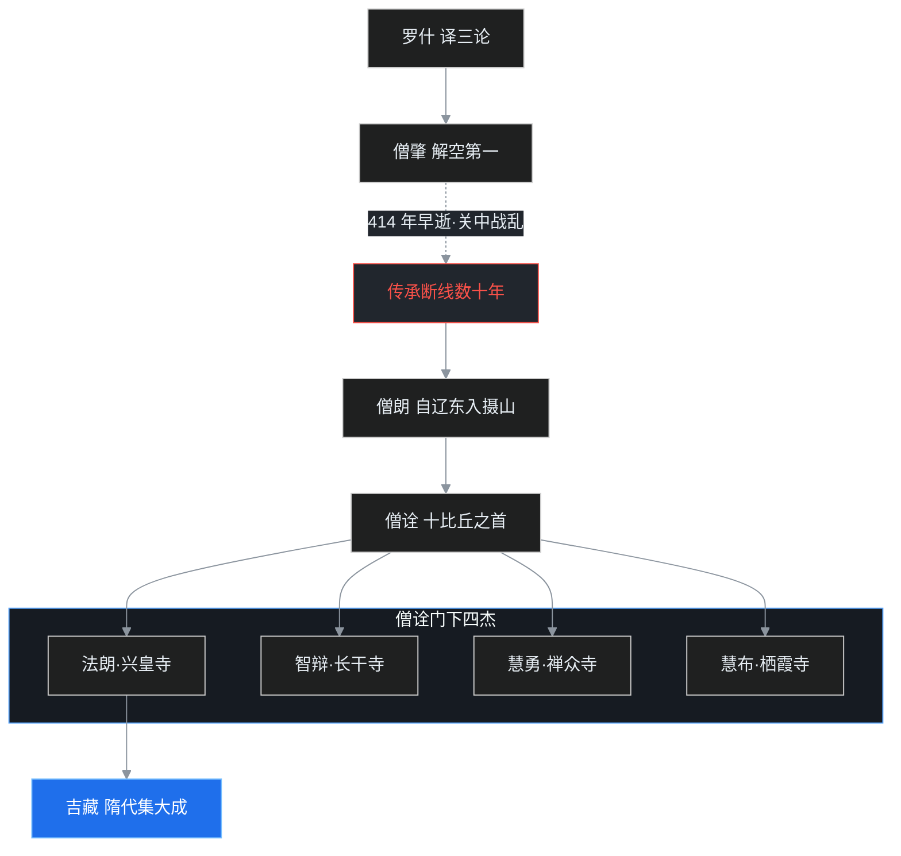
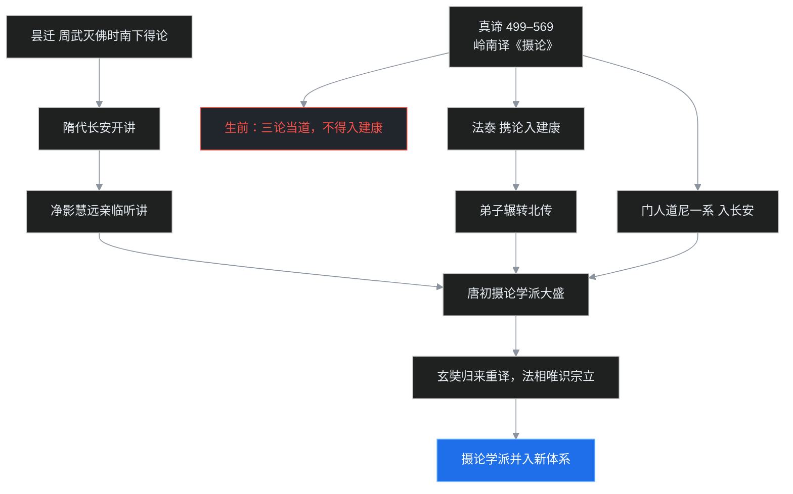

569 年，陈朝太建元年，广州。

一位来自西印度的老人在南海之滨走到了生命尽头。老人叫真谛，这一年 71 岁，来华已经二十多年。二十多年里，老人几乎没过上几天安稳日子——刚到建康就撞上侯景之乱，此后一路被战火驱赶，从江苏到浙江，从浙江到安徽、江西、福建，最后落脚广东。

临终前，真谛最放不下的不是自己的身后事，而是一部《摄大乘论》。老人反复叮嘱身边弟子：这部论里的义理太好了，你们无论如何要把它传扬出去。真谛最得力的弟子慧恺已经先老师而去，丧讯传来时，老人悲痛得不能自已。

此时此刻，千里之外的首都建康，讲台上的主流是另一套学问：三论。兴皇寺的法朗大师在首都高坐法筵，门下一千多人，声势如日中天。真谛的《摄论》，恰恰被这主流挡在城门之外，终其一生，没能进入老人心心念念的学术中心。

一个在岭南含恨而终，一个在首都高坐法筵。这不是好人与坏人的故事，而是两套世界级思想体系在同一座台面上短兵相接的故事。这一篇，就讲南朝思想战场上的四条战线：涅槃师、成实师、摄论师，以及卷土重来的三论。

## 先给小白交个底

南北朝一百七十年，南朝换了四个朝代：宋、齐、梁、陈。上一篇讲了梁武帝那个时代，这一篇把南朝其余的思想账一并结清。

读这一篇，先记住四句话：

- **建康一直在译经。** 从刘宋到陈，首都的译经事业没断过，求那跋陀罗这样的海路高僧还把四《阿含》补齐了最后一块。
- **真谛是最坎坷的译经大师。** 与罗什、玄奘齐名，一路被战乱追着跑，二十三年译出经论三百多卷。
- **学派如雨后春笋。** 南朝出现了三个新学派：涅槃师、成实师、摄论师。争论的焦点之一是：佛性是本来就有，还是修出来才有？
- **三论复兴了。** 罗什当年最看重的三论，沉寂了几十年，在齐梁之际经僧朗、僧诠两代重续灯火，到陈代由法朗在首都发扬光大，后来由吉藏集大成。

下面慢慢展开。

## 一、建康译经的小半个世纪

先把时间拨回真谛来华之前，看看建康这个译经中心的家底。

### 刘宋：祇洹寺里的海上来客

420 年刘裕代晋建宋，十九年后北魏太武帝统一北方，南北对峙的格局正式成形。南朝的佛教没有大规模流血冲突，主要是口舌之争——真正的刀兵在北方，那是下一篇的内容。

建康的译经，刘宋一朝很热闹。

法显当年从印度带回的梵本律藏《五分律》，由刘宋的佛陀什译出。斯里兰卡的比丘尼两批来华，到元嘉十一年（434），僧伽跋摩主持，在南京依二部众受戒法授予比丘尼戒——所谓二部受戒，是先在比丘尼僧团中受戒，再到比丘僧团处审核确认。这是比丘尼戒法传承上的一件大事。与此相关，佛陀为比丘尼制定了八敬法，根本几条包括二部受戒、不在无比丘处独居结夏安居、安居结束后到比丘僧团报告等，后世长老又有所添加。

元嘉十二年（435），求那跋陀罗从海道抵达中国，宋文帝迎请安置于祇洹寺。这位译师的译作清单分量极重：

- 《杂阿含经》——四《阿含》就此全部具足汉译本；
- 《胜鬘经》《四卷楞伽经》——如来藏系的核心经典，后来对禅宗传法影响极大；
- 《相续解脱经》——法相唯识一系的典籍。

还有一部大经的「南方改编本」也诞生在刘宋：涅槃南本。

此前昙无谶在北方译出的四十卷《大般涅槃经》（北本），与法显带回的六卷本详略不同。慧观、慧严两位法师，加上大文豪谢灵运，把两个本子综合改定，成三十六卷的南本。南本文字润畅，流行于南方，涅槃一学就此在江南扎根。

### 陈代：旧传统与两位译师

侯景之乱后，陈霸先起兵收拾残局。陈霸先在始兴（今韶关一带）起兵讨侯景、执掌大权，557 年废梁敬帝建立陈朝。陈朝国祚不长，三十三年而亡，但王室沿袭梁代传统：舍身佛寺、办无遮大会、延请高僧，一样不少。

陈代译经可记的有两位：月婆首那，优禅尼国人——正是真谛的同乡——译出《胜天王般若经》；扶南国来的须菩提，译出《大乘宝云经》。

译经的线索一直没断。但陈代佛教最重头的戏，不在新来的译师，而在真谛留在身后的那批论典，以及首都讲台上重新杀回来的三论。

## 二、被战乱追着跑的译经人

真谛的故事，值得单独细讲。

### 从扶南到建康

真谛是西印度优禅尼国（Ujjayinī，今印度乌贾因一带）人，后来到扶南国（今柬埔寨）弘法。当时梁武帝遣使南下，武帝还特地嘱咐使节：若遇到高僧，一并请回。使节团就这样在扶南找到了真谛。

一位西印度高僧，从柬埔寨海路远赴南京，皇帝在首都等着听法。这剧本本来是罗什第二。可真谛抵达建康前后，正赶上南朝最大的一场塌天之祸：侯景之乱。

皇帝自身难保，最后饿死台城。远道请来的译经上座，瞬间流落民间。

### 六省流亡路

战乱中真谛一路逃亡，路线在今天的地图上是一个巨大的弧线：江苏、浙江、安徽、江西、福建，最后到广东。哪里相对安定，真谛就在哪里停下来译经；战火逼近，就再往南走。老人甚至几度动念离开中国、返回印度——一个被东道主的乱世伤透了心的客人。

从梁到陈，二十三年，真谛译出三百多卷。和罗什偏重经论兼顾不同，真谛的重头译作几乎都是「论」：

- 《摄大乘论》及《释》——真谛一生心血所系；
- 《中边分别论》——唯识学要典；
- 《十七地论》——《瑜伽师地论》的部分，后来深深影响了玄奘；
- 《俱舍论释》；
- 《大乘起信论》（旧题真谛译，译者归属素有争议）。

得力的助手并不好找。晚年弟子慧恺赶来相助时，真谛感慨地说：你要是能早点来就好了。译经是团队工程，梵义、笔受、润文环环相扣，罗什身后有三千门人之盛，真谛身边却始终凑不齐一个稳定的译场——这是真谛与罗什命运最直观的差距。

## 三、涅槃师：佛性本有，还是始有

译事之外，南朝佛学最大的特征是学派林立。江南自三国、东晋以来，根底是般若学；到了南北朝，涅槃师、成实师、摄论师三家接连冒头，《法华经》的研究在酝酿后来的天台，三论则重新复兴。这一节先讲涅槃师，成实、摄论与三论随后专章展开。

### 涅槃师：佛性是本有，还是始有

涅槃学派自道生、慧观弘扬以来，长盛不衰。核心问题听上去简单，吵起来却无穷无尽：众生的佛性，是**本有**——本来就具备，只是被烦恼盖住了；还是**始有**——要经过修行，到某一刻才「有」？

梁武帝之时，关于佛性的解说有「十家义」之多。本有与始有的争论从刘宋一直延续到唐初。后来玄奘之所以下决心西行，原因之一就是中国诸师说法彼此矛盾、莫衷一是，这才要亲去印度读原版。

道生当年「孤明先发」，主张一阐提也能成佛（中08 讲过），背后的立场正是偏向本有；但争论没有随道生的胜利而终结，因为「本有」二字同样有解释空间——是现在就完完整整地有，还是以种子的方式有？这就为后来的论师留足了笔墨官司。

### 法华：会三归一

《法华经》由罗什译出，最著名的宗旨是「会三归一」：声闻、缘觉、菩萨三乘，归根结底是同一佛乘的不同方便，就像一位长者用羊车、鹿车、牛车把孩子们从着火的房子里引出来，门外真正给的是最贵重的大白牛车。

南朝的法华研究还在积蓄阶段，真正把它建成庞大体系要到隋代的智顗——天台宗的实际创始人，中16 再讲。

## 四、成实师：差点被当成大乘的「过渡版本」

三个新学派里，成实师的故事最有戏剧性：一部论被热捧了近两百年，最后被认定为「不够纯粹」，黯然退场。

### 一部罗什本不想译的论

《成实论》的由来有点意思。后秦弘始年间，尚书令姚显请罗什翻译这部论，时间大约在 411 至 412 年前后。罗什本人对这部论兴趣不大——一门心思都在《大智度论》这样的纯粹大乘论典上。

作者诃梨跋摩（Harivarman），出自说一切有部，却不满有部的繁琐教义，转而引用大量大乘经论立说。所以这部论的定位先天微妙：它站在有部的门墙内，却把大门朝大乘打开了一半。

### 彭城、寿春：长江流域的成实热

罗什译出后，弟子僧嵩、僧导分别在彭城（今徐州）、寿春（今安徽寿县）两地传播。关中后来陷入战乱（罗什圆寂、姚兴身故、刘裕北伐撤军、赫连勃勃侵扰），僧团四散，这部论反而顺着两条路线在长江流域大兴。

要注意：成实是**学派**，不是严格意义上的宗派——后世日本称之为「成实宗」，在中国它从未立宗。到了梁代，讲说《成实论》的法师往往用大乘教义配合来讲，被称为「成论大乘师」：他们真心认为自己讲的是大乘，听众也这么信。

### 出局：被判为「不纯粹」

但三论和天台后来给这部论定了性：它不是纯粹的大乘。一旦思想舞台上有了更彻底的体系，这种「半成品」的位置就尴尬了。隋代以后，《成实论》乏人问津，成实师作为学派烟消云散。

这和技术史上反复出现的一幕一模一样：一个过渡方案在标准真空期独领风骚，等正统方案成熟，它就成了被嘲笑的对象——但在它当红的近两百年里，它确实完成了自己的历史任务：把一代中国学人从有部旧框架里，往大乘方向推了一大步。

## 五、三论的复兴：从摄山山林到首都讲坛

接下来是这一篇的主线之一：罗什当年最看重的三论，是怎么活过来的。

三论，指龙树的《中论》《十二门论》，加上提婆的《百论》。

### 长安断线

罗什圆寂后，被罗什评为「解空第一」的僧肇在 414 年早逝，年仅三十出头；416 年后秦君主姚兴去世，晚年的姚兴与周边国家连年交战，忧愤成疾。姚泓继位，宗室兄弟争位作乱，国中大乱。

东晋大将刘裕看准时机北伐——在当时人心中，北伐英雄声望最隆，刘裕正需要这份功业为篡位铺路。北府精兵攻破潼关、进入长安，后秦灭亡。可紧接着，刘裕留守建康的心腹刘穆之突然病死，刘裕不得不火速南归。留守将领们互不服从，在长安自相残杀，北府精兵死伤殆尽；加上西秦、北魏、赫连勃勃交相侵扰，关中兵连祸结，僧团无法安住。

大德们四散：有的逃往彭城、寿春，有的躲进终南山。罗什门下最精华的三论传承，就这样断了线。后来史书连僧肇之后三论传给了谁都记不清楚。

### 摄山两代：僧朗与僧诠

历史的下一幕，出人意料地出现在南齐的一座山上。

辽东来的高僧僧朗，南下江南，住在建康附近的摄山——也就是今天南京东北的栖霞山——在山上教禅观、弘扬三论。梁武帝得知后，选派十位年轻比丘上山跟随僧朗学习，其中学得最好的是僧诠。在僧朗、僧诠两代相继努力下，三论再度行世。

僧朗的三论从何而来？史书上记载得不很明白。据印顺法师的研究，僧朗入南之后，其学应与当时南方残存的三论旧学，以及居士周颙等人的论议相呼应——周颙著有《三宗论》，是当时谈空的名士。印顺的判断是：僧朗正是在这种氛围中确认三论超越众流，才立定宗旨，再传僧诠。

但僧朗、僧诠两代有个共同特点：**在山林里谈法义，不主动进城弘扬**。两代人更重禅修，一边讲三论一边领众坐禅，所以三论虽复明于世，影响却始终困在摄山的云雾里。

### 僧诠门下四杰

僧诠的弟子里出了四位高僧，分驻四寺：

- 兴皇寺法朗；
- 长干寺智辩；
- 禅众寺慧勇；
- 栖霞寺慧布。

四杰之中，最得摄山两代相传法髓的是栖霞寺慧布——不只是义理深入，禅修功夫更让同辈折服。慧布曾北上游历，见到禅宗二祖慧可，慧可听了慧布的讲述后说：这般说法，可以破我执、除边见。慧布又与天台的慧思（智顗之师）连日论义，慧思以铁如意击案赞叹：万里空矣，再没有这样的智者。

### 法朗进城：三论成为主流

三论真正大行于世，靠的是法朗。因为法朗做了师祖、师父都不肯做的事：**从山林走进城市**。

法朗进入首都建康，弘法二十多年，亲近法朗的常有一千多人。在法朗来之前，南京城是涅槃、法华、成实的天下；法朗登坛，毫不客气地逐一批判这些学说，最终使三论成为陈代佛教思想的主流，并为后来三论宗的建立铺平了道路。

法朗的风格也惹来了麻烦。当时一位法师写下《无诤论》批评法朗，说法朗有「荣进之心」——抢风头、争地位——和山林里的师祖僧朗风格不同，不够厚道。但有一位居士写下《明道论》反驳：法朗大师在都城之内平破各家之说，是为了真理不得不如此，并非贪图名位。

法朗后来传法给吉藏。吉藏在隋代集三论之大成，正式开宗——那是中16 的内容。三论复兴的传承，一图概括：

注意法朗和真谛的关系：建康讲三论的法朗，之所以排斥真谛传来的唯识诸论，不是出于嫉妒，而是真的认为三论的空义才是继承佛陀本怀的正统——在三论学者看来，真谛那套后期大乘唯识学，在心识问题上建构得太「实」了。

两种「最正确」撞在一起，失败者是那个身在广东、进不了城门的人。

## 六、摄论学派：一场南北接力，最后并入干线

真谛圆寂后，《摄大乘论》的命运出现了反转。这部真谛生前送不进建康的论，在真谛死后开始了一场接力式的远征。

### 南传建康

真谛去世后，门人法泰带着《摄大乘论》和真谛的注疏来到建康弘扬。法泰的弟子一系又辗转把论义传向北地。真谛的另一位门人道尼远赴长安，在那个高僧云集的城市里，培养出几位擅长摄论的法师。

### 北传长安：昙迁与净影慧远

真正让摄论在北方炸开局面的，是昙迁。

北周武帝灭佛时（北方的大法难，下一篇细讲），昙迁南下避乱，到了建康，意外得到真谛译传的《摄大乘论》及《释》。隋代统一前后，昙迁把这部论带回北方，在长安开讲，轰动一时。听众里甚至有净影寺慧远——中国佛教史上有两位著名的慧远，一位是庐山慧远（中07 主角），另一位就是这位净影慧远。以净影慧远在僧界的德望，亲自来听昙迁讲论，影响力可想而知。

于是大批优秀比丘聚集到昙迁门下。到唐初，摄论一系在佛教学术界仍有极大声势。真谛当年临终的嘱咐，在北方的土地上应验了。

### 谢幕：玄奘归来

摄论学派怎样从历史上消失？答案是玄奘。

玄奘西行的初衷之一，本来就是要弄清包括摄论在内的诸家分歧。玄奘从印度取经回来后，重新翻译了《摄大乘论》和《摄论释》。以玄奘新得的唯识学标准衡量，真谛旧译里的一些义理表述被认为于真理多有乖违——其实未必是真谛译错，而是真谛所承的唯识旧说，与玄奘在印度学到的护法一系本就有差异。

玄奘的译本和思想形成了法相唯识宗，摄论学派的精华与问题一起被收进这个更精密的体系。学派失去了独立存在的理由，就此谢幕。

真谛若在天有灵，大概会感到一种复杂的安慰：真谛的《摄论》没有失传，它以被后来者吸收的方式活了下去。

## 如果把它放进一个程序员的世界

叶扬读到这一段时，脑海里浮现的是一个技术社区里再熟悉不过的剧本：**同一时期的四条技术路线，争夺同一批用户和「正统」名义。**

- **涅槃师**像是在争论一个底层数据问题：用户的「高级权限」是数据库里本来就有的字段（本有），还是完成某个流程后才写入的（始有）？这个争论吵了近两百年没结果，最后有人拍板：去读上游官方文档——于是玄奘买了去印度的机票。
- **成实师**像是一个成功的过渡框架：旧标准（有部）太笨重，新标准（大乘）还没落地，它在中间地带火了近两百年，无数项目用它完成了迁移；等真正的大乘方案成熟，它立刻被贴上「不纯粹」的标签，README 里只剩一句「已废弃」。
- **三论的复兴**像是一个沉寂多年的经典项目靠开源社区续命：原作者团队（罗什-僧肇）因为战乱团灭，仓库几十年无人 commit；直到两位坚持在偏远山区维护的爱好者（僧朗、僧诠）把代码读懂，又出了一位敢进一线城市布道的社区领袖（法朗），项目才重回主流，最后由一位划时代的维护者（吉藏）发布 2.0。
- **真谛和摄论学派**最像一个「叫好不叫座」的先驱团队：创始人带着超前设计来到新市场，正赶上经济危机，一生在各个分部之间颠沛流离，产品始终进不了总部采购名录；创始人死后，门徒在另一个地区把它做大；最后市场上出现了一家技术更精密、背书更硬的公司（玄奘的法相宗），把先驱的产品连团队带思想一并收购。

技术史和思想史最残酷的共同点是：**正确，从来不能保证你活着看到胜利。** 但好消息是：真正有价值的设计不会真的死去，它只会换个名字、换个仓库，活在后来者的代码里。

## 吵架现场：两回合

**第一回合：法朗 vs 《无诤论》**

- **质问方（一位法师）：** 你师祖僧朗在摄山山林里清修，你却跑到建康城里把各家学说批了个遍，门人上千、声势喧天。佛说「无诤」，你这分明是荣进之心、好胜之心，厚道吗？
- **回应方（一位居士，《明道论》）：** 在山林里独善其身，当然可以不诤；但在首都讲台上，众说淆乱、后学无所适从，为真理平破各家，是「不得不诤」。动机是道还是名利，要看法朗破的是什么、立的又是什么，不能以「嗓门大」定罪。

**第二回合：三论师 vs 真谛《摄论》**

- **三论师（建康主流）：** 佛的本怀是「空」。你们唯识一系铺陈阿赖耶识、三性、种子，把世界建构成一座精密的识变大厦，众生听了，只会把「识」执成新的实有。三论才是嫡系。
- **摄论师（真谛遗教）：** 不谈阿赖耶，轮回的主体是谁？业力如何相续？凡夫如何一步步转识成智？光说「空」，初学者容易滑向否定一切的恶取空。建构，是为了给修行一张可执行的地图。

这场架没有当场分出胜负，历史用了一个谁都没想到的方式调解：玄奘从印度带回了第三种答案。

## 卡壳角：容易卡住的地方

- **怎么区分「学派」与「宗派」？** 学派是围绕一部论或一类经义形成的师承讲说网络，没有排他性的组织、戒律和传承法统；宗派则有明确的创始人、寺院体系和判教框架。涅槃师、成实师、摄论师都是学派，三论到吉藏才真正成宗。
- **真谛翻译的到底「错」了没有？** 现代研究者多倾向：不是语言层面的误译，而是唯识学内部本有不同流派——真谛承的是较旧的一系（且可能有意凸显如来藏方向），玄奘学的是护法一系。用新版本判定旧版本「错误」，是宗派立场，不是纯客观结论。
- **两位慧远怎么分？** 庐山慧远（334–416），东晋人，念佛立誓、神不灭论；净影慧远（523–592），隋代人，地论、涅槃学大师，净影寺住持。两人相隔一个多世纪。
- **三论不是「新」学问，为什么叫复兴？** 因为它是罗什旧学的重新光大。僧朗之前，三论在汉地几乎失传；复兴靠的不是新译，而是把已有译本重新讲出生命力。

## 术语小本本

| 术语 | 一句话解释 |
|---|---|
| 三论 | 《中论》《十二门论》《百论》，龙树、提婆的中观核心论典 |
| 涅槃师 | 研究弘扬《大般涅槃经》的学派，争佛性本有与始有 |
| 本有 / 始有 | 佛性本来具足 / 修行之后才成就，两派争论数百年 |
| 十家义 | 梁代关于佛性的十类解说，极一时之盛 |
| 成实师 | 弘扬《成实论》的学派，被梁代法师当成大乘，后判为不纯粹 |
| 诃梨跋摩 | 《成实论》作者，出自有部而引大乘，约 3 至 4 世纪 |
| 摄论师 | 弘扬真谛译《摄大乘论》的学派，唐初兴盛，后并入法相宗 |
| 摄大乘论 | 无著所造，唯识学纲领性论典；世亲作《摄大乘论释》 |
| 阿赖耶识 | 唯识学所说第八识，含藏种子、执持身心，是轮回与业力相续的所依 |
| 三性 | 遍计所执性、依他起性、圆成实性，唯识学对世界的三层分析 |
| 种子 | 阿赖耶识中潜在的功能习气，遇缘现行，与现行互为因果 |
| 转识成智 | 转舍有漏八识、转得无漏四智，即唯识学所说的成佛 |
| 恶取空 | 不解空义而否定因果、否定一切的邪见，为佛所诃斥 |
| 真谛 | 499–569，西印度优禅尼国人，梁陈之际译经三百余卷 |
| 慧恺 | 真谛最得意的弟子，先真谛而卒 |
| 法泰 | 真谛门人，真谛圆寂后携《摄论》入建康弘扬 |
| 昙迁 | 隋代高僧，避周武灭佛时南下得《摄论》，北传长安 |
| 净影慧远 | 523–592，隋代义学领袖，与庐山慧远并称「两位慧远」 |
| 求那跋陀罗 | 刘宋译师，435 年海道来华，译《杂阿含》《胜鬘》《四卷楞伽》 |
| 四《阿含》 | 《长阿含》《中阿含》《杂阿含》《增一阿含》四部原始佛教经典汇编的合称 |
| 涅槃南本 | 慧观、慧严、谢灵运综合北本与法显本改定的三十六卷本 |
| 僧朗 | 辽东来的高僧，南齐住摄山，重续三论传承 |
| 僧诠 | 僧朗弟子，梁代十比丘之首，弘三论于摄山 |
| 法朗 | 507–581，僧诠弟子（僧朗再传），入建康弘法二十余年，三论成主流 |
| 四杰 | 僧诠门下法朗、智辩、慧勇、慧布四位高僧 |
| 《无诤论》 | 时人批评法朗好诤争胜的文章；居士作《明道论》反驳 |
| 二部受戒 | 比丘尼先于尼众僧团受戒、再由比丘僧团审核的制度 |
| 八敬法 | 佛陀为比丘尼制定的八条根本敬法，后世复有添加 |
| 吉藏 | 549–623，法朗传人，隋代三论宗实际创始人 |
| 月婆首那 | 陈代译师，真谛同乡（优禅尼），译《胜天王般若经》 |

## 收个尾

南朝的账，到这里基本结清：建康译经百余年不绝；真谛以流亡之身译出唯识大厦的图纸；涅槃、成实、摄论三家学派各领风骚；三论从摄山山林杀回首都讲坛。

下一篇，渡江北上，看同时期的北朝。那里没有这么多温和的笔墨官司——北魏太武帝、北周武帝两次灭佛，刀是真架到脖子上的；但也正是北朝，在悬崖上凿出了云冈、龙门两大皇家石窟，给佛教立了另一种形态的纪念碑。一灭一立之间，就是北朝佛教的全部张力。

南方论辩，北方造像。下一篇见。
