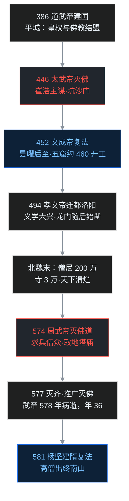

577 年正月，北齐都城邺城，一队北周铁骑开进了城门。

率军的皇帝叫宇文邕，史称北周武帝，时年 35 岁。这年武帝刚灭掉北齐、统一北方，进城后办的头一批大事里，有一件让所有僧道脊背发凉：把北齐境内的佛教、道教一并废除，经卷佛像毁掉，出家人全部还俗。

一位僧人当面质问这位征服者：陛下仗着皇权灭佛，就不怕死后下地狱吗？

唐代佛教文献《广弘明集》记下了武帝当时的回答，大意是：**只要百姓能得安乐，朕不辞地狱之苦。**

这句话是理解整个北朝佛教的钥匙。说它的皇帝不是疯子，也不是单纯厌恶宗教——史家对北魏太武帝、北周武帝这两位灭佛皇帝的评价，其实相当高：英武、节俭、勤政，都有统一天下的大志。那为什么偏偏是这样的皇帝，向佛教抡起了刀？而且百余年里抡了两次？

这一篇渡江北上，讲北朝佛教最强烈的一组张力：一边是灭佛的刀，两次架在出家人脖子上；一边是凿进山崖的大佛，亡国毁经之后照样让佛法复活。一灭一立之间，全是制度与人性的账。

## 先给小白交个底

读这一篇，先记住五件事：

- **北朝是鲜卑人的天下。** 北魏 386 年建国，439 年统一北方；后来分裂成东魏、西魏，再变成北齐、北周，最后由北周的家底孕育出隋朝。
- **两次法难都在北朝。** 北魏太武帝 446 年灭佛、北周武帝 574 年起灭佛道，加上后来的唐武宗、后周世宗，合称「三武一宗」四次法难。
- **推手不只有皇帝。** 第一次的前台推手是信道的权臣崔浩；第二次的深层原因，是僧团自己烂了。
- **僧团膨胀到了吓人的程度。** 北魏僧尼从孝文帝时的不到 8 万人，涨到北魏末年的 200 万——而北魏盛时总人口，学界估计约 3000 万。
- **石头是最后的防线。** 高僧坚持在山崖上造大佛，今天去云冈、龙门看，佛像还在。纸经会烧、木寺会塌，雕进石头的东西，乱世里删不掉。

下面把这些账一笔一笔摊开。

## 一、北魏开头：草原政权为什么敬佛

北魏是鲜卑族拓跋部建立的政权。淝水之战后，386 年拓跋珪自称魏王，后来史称道武帝，398 年定都平城——今天的山西大同。

道武帝虽然来自被中原视为「胡族」的草原，却很敬重沙门和道士，定都平城之初就下令营建寺塔、讲堂、禅堂。道武帝的儿子明元帝接着在都城和各地造佛像，还下令沙门用佛法教导老百姓。

这是一个很现实的安排：鲜卑统治集团清楚自家部族文化简朴，面对千百万编户齐民又缺乏统治工具，而佛教有成熟的因果、业报、伦理说教，正好承担基层教化。外来的宗教与草原的政权，在平城完成了结盟。

可是结盟里埋着一颗雷：**出家人不用纳税，不用服兵役、劳役。** 这道优待在国顺民安时是双赢，等到天下大乱、赋税兵役压得人活不下去时，佛门就会变成全天下的避税港——后面的祸根，开头已经种下。

## 二、第一次法难：太武灭佛

### 少年英主与两位身边人

北魏第三个皇帝太武帝拓跋焘，16 岁即位。史书上的评价极高：聪慧、英武、果断，生性节俭、异常勤政。祖父道武帝生前就断言：将来能成就我家业的，必是这个孩子。

太武帝心里装的是武力扩张，对佛教义理既没兴趣也不关心——和后来深研义理的孝文帝完全两种人。真正把皇帝一步步推向灭佛的，是两位身边人：一个推，一个拉。

**推的人是崔浩。** 崔浩出身北方顶级门阀清河崔氏，历仕道武、明元、太武三朝，深得太武帝信任，学问和权势都顶到了天花板。崔浩的本土意识极强：崇奉儒家、只信道教，把外来的佛教视为必须清除的夷狄之物。崔浩常年在皇帝耳边数说僧侣的不法、佛教的弊端，还把自己的道教老师寇谦之引荐给太武帝。太武帝跟着寇谦之学道，觉得清静无为、长生羽化这一套很好，对佛教的观感一天差过一天。

崔浩对佛教的敌视到了不近人情的地步。《魏书》记载，崔浩的妻子郭氏敬重佛经、时常诵读，崔浩一怒之下把经书抢来烧掉，烧完的灰还倒进厕所。亲友同事信佛的，崔浩一律冷嘲热讽，连佛教讲的道理究竟是什么，都不屑于了解。

**拉的人正是寇谦之。** 寇道士虽然自己修道，却不赞成灭佛，更不赞成杀人——这一点和崔浩根本不是一路。

### 灭佛的前兆

正式动手前，早有信号。

- 太延四年（438），太武帝下令 50 岁以下的沙门一律还俗。当年七月北魏正要北伐柔然，这条令的直接目的是汰取壮丁从军；客观上也让佛门难以再补进年轻人。
- 太延五年（439），北魏灭北凉、统一北方。北凉（以今甘肃武威为中心）是当时的佛法重镇，战乱后大批凉州僧徒被徙往平城，朝廷也开始对僧团做严格管控。

### 长安佛寺：一场彻查点燃炸药

太平真君六年（445），盖吴在关中起兵反魏，声势浩大，太武帝亲率大军西征。第二年（446）二月，皇帝抵达长安。

事情是从一匹马开始的。皇帝的御马需要放牧，随从看中了某座佛寺旁的麦田，把马群赶了进去。太武帝亲自到寺里看马，寺中沙门设酒招待皇帝的侍从官。侍从端着酒走进一间暗室，竟发现里面堆满了弓、箭、矛、盾。

侍从出门后立刻密报皇帝。太武帝的第一反应是：这些兵器不该是出家人的东西，僧人与盖吴必有勾结。于是下令查封全寺、彻查财产，结果越查越惊心：抄出大批酿酒器具；抄出州郡长官和地方富豪寄存在寺里、数以万计的财物；寺里还另造了密室，与富家妇女在其中私行淫乱。酒戒、淫戒、蓄财戒全破，还有兵器——太武帝由此认定，这座寺就是叛军埋在长安的内应。

盛怒之下，崔浩再三进言：杀掉所有沙门。寇谦之力争，说一座寺出了问题，不能让天下所有出家人偿命。寇道士争到激烈处，对崔浩抛出一句重话：卿如此行事，他日必遭灭族之祸。

但皇帝采纳了崔浩的主张。

### 一道坑杀令，一位缓诏太子

太武帝先诛杀长安全部沙门，捣毁佛像，随即下诏全国：所有佛像、佛经一律击破焚烧，沙门无论年长年幼，一律坑杀。

诏书从皇帝行在发出，要先送到首都平城，再由监国的太子转发全国。太子拓跋晃是虔诚的佛教徒，太子先上书力谏，皇帝不听；于是太子用了一个不硬顶的办法：**把诏书故意缓发，拖一拖再转发。** 这一缓，就是给天下僧人放出的逃亡时间。

所以这场法难的实际结果是：长安的僧人几乎被杀尽，外地僧人遇害的不算太多；但全国寺院被没收，佛像被砸，经卷被烧，佛法在北魏的公开传播中断了近七年。

## 三、崔浩灭族与佛法重兴

### 国史之狱：推手的结局

崔浩的下场，比所有政敌预想的都来得快。

崔浩奉命主编魏国国史，修成后刻成石碑立在大道旁。国史里如实写了鲜卑早年的一些事情，措辞对皇室先祖多有不恭。太平真君十一年（450）六月，太武帝震怒，下令诛杀清河崔氏全族，连与崔家有姻亲关系的几个士族也一并被杀。

崔浩被押赴刑场时，几十名卫士一路朝崔浩头上、身上小便，昔日权倾朝野的三朝老臣，在屈辱和哀嚎中死去。当时的人议论：这就是劝主灭佛的果报。

### 宦官弑君与文成帝复法

太武帝晚年对诛杀崔浩颇有悔意，但皇帝始终没有松过佛教之禁。

正平二年（452）二月，太武帝被身边的宦官宗爱所弑。宗爱随后立南安王拓跋余为帝，七个月后又把拓跋余杀掉。同年十月，太武帝的嫡孙拓跋濬被大臣迎立即位，就是文成帝——太子拓跋晃此前已经忧惧而逝。文成帝在十二月下诏复兴佛法，还亲自为灭佛期间被迫还俗的高僧师贤重新落发，任命师贤做道人统——中央最高僧官。

这里要交代一句僧官制度。中国的官僚政治早熟，政府面对日益庞大的宗教团体，很早就建立了分级管理：中央有中央僧官，地方有地方僧官，都是政府任命、吃朝廷俸禄的职位，和后世僧团自选的方丈完全是两回事。这套制度在后秦、东晋之际已经出现，北魏把它进一步系统化。

## 四、昙曜五窟：石头上的灾备

### 为什么偏要在山崖上凿佛

文成帝复兴佛法后，另一位高僧昙曜登场。昙曜向皇帝请求：在首都平城以西的武州山，开凿石窟、雕造大石佛。

为什么是石窟？课程里把这层苦心讲得很透：木构的寺院会被烧、纸抄的经卷会成灰、泥铸的佛像会被砸，可山崖上的石像，人除非把整座山推倒，否则它就一直在。今天回头看，阿富汗的巴米扬大佛也是同理——在山崖上立了一千几百年，持续向经过的人证明：这里曾是佛教的国家，直到 2001 年才被人为炸毁。

**只要石头上的佛像还在，万一再遇法难，佛法就有复兴的种子。** 这不是宗教建筑工程，这是高僧给佛法做的灾备方案：把最重要的数据，刻进谁也删不掉的离线介质里。

### 五座窟，七丈高

昙曜共开五所大窟，史称「昙曜五窟」，每窟各镌一尊大佛。最大的一尊高 70 尺，其次 60 尺。北魏一尺约合今天 24 厘米——70 尺相当于 16 米还多。其中大佛冠绝当世，庄严高大，无出其右。

这五座窟，就是今天山西大同云冈石窟的起点。

昙曜还做了一件「证据工程」：与从西域来北魏的僧人吉迦夜合作，译出六卷《付法藏因缘传》，把佛陀之后一代一代传法的世系讲清楚。学者多认为，这是在回应太武帝灭佛诏书里的一句蛮横话——诏书说佛教不过是汉朝几个无赖凭空捏造的邪说。一部传法史摆在那里：佛法东传，历历可考，无赖汉写得出什么深妙义理？

## 五、洛阳时代：永宁寺、龙门与译经高峰

### 从平城到洛阳

文成帝之后的北魏皇帝，大多是佛教的大护法。

献文帝在平城建永宁寺，造七级木塔，塔高 300 多尺，号称天下第一，几十里外就能望见；又在天宫寺造释迦立像，像高 43 尺，据说耗费赤金十万斤（赤金即紫铜，铜像鎏金）、黄金六百斤。

太和十八年（494），北魏孝文帝把首都从平城迁到洛阳，推行全面汉化。洛阳从此再度成为北方佛教中心。孝文帝重视义理，鼓励出家人研究经论、四处讲法。孝文帝的儿子宣武帝同样崇佛，常在宫中亲自讲经。龙门的开凿约始于太和十七年（493）前后，古阳洞最早由贵族发愿开凿；景明初年（500），宣武帝下诏比照平城云冈，以皇家力量开凿宾阳洞。龙门石窟经北魏动工、隋唐续凿，前后修了四百多年。

### 洛阳译场：地论学派的诞生

孝文帝、宣武帝时期，国势强盛、通往西域的道路畅通，西来译师云集洛阳：

- **菩提流支**：宣武帝时抵达洛阳，在洛阳先后译出《金刚般若经》《入楞伽经》《深密解脱经》《无量寿经论》等大批经论，声闻乘、大乘、后期大乘、净土各系都有，后来被安置于洛阳永宁寺译场；
- **勒那摩提**：译出《宝性论》《宝积经论》；
- 永平元年至四年（508–511），菩提流支与勒那摩提合作译出《十地经论》，围绕这部论形成的学派，就是地论学派，下一篇再细讲；
- **佛陀扇多**：正光六年（525）才抵达洛阳，后在洛阳、邺城译出与真谛同本的《摄大乘论》等；
- **瞿昙般若流支**：译出《正法念处经》《回诤论》《顺中论》。

北方也有自己的西行求法。孝明帝神龟元年（518），临朝的胡太后派遣慧生、宋云一行前往西域求取佛经，使团走到犍陀罗（今巴基斯坦一带），正光二年（521）前后回到洛阳，取回经论 170 部。宋云把沿途见闻写成《宋云行纪》，是与《佛国记》同类的西域地理文献。

## 六、僧团膨胀：8 万到 200 万

### 乱世里的佛门，为什么挤破头

兴旺的表面之下，制度性溃烂同时进行。

根子还是开篇那道优待：出家人免除赋税、兵役、劳役。太平年月，出家靠的是信仰；乱世一来，出家就成了一门生存经济学。孝文帝、宣武帝、孝明帝祖孙三代四十多年间，假托佛教的「沙门造反」，课程统计多达八次。朝廷当然知道闹事的不是真僧人，可这已经说明佛门里混进了什么人。

朝廷的对策是严禁私度：剃度必须有朝廷的名额，由僧官审查资格。文成帝复法时还定下硬规矩：只有良家子——家世清白的好人家子女——才许出家。可古代交通不便、皇权不下县，禁令在州县执行得漏洞百出，私度始终禁而不绝。王公大臣又动辄砸重金做功德、修大寺，客观上把更多人吸进佛门。

### 六镇之乱：压垮财政的最后一根稻草

宣武帝去世后，孝明帝年幼，胡太后临朝，信用亲信、朝政日坏。正光年间，六镇之乱爆发。

六镇，是平城时代设在北方边境、拱卫首都的六大军镇。迁都洛阳之后，朝廷觉得六镇离洛阳遥远，对这支旧边防军越来越轻忽，粮饷常拖欠。边军积怨成反，叛乱牵动连锁兵变，随后又爆发尔朱氏之乱，战火自此燎原，天下失控。

国家要打仗，就得加税、征兵；百姓为了逃税、逃役，只剩一个去处：**佛门**。哥哥拉弟弟、堂兄弟表兄弟相约出家，一个时期里剃度的几乎全是青壮年男丁——因为男丁才是兵役和赋税的主要承担者。

### 《魏书》记下的惊人数字

孝文帝时，全国僧尼总数不到 8 万；到北魏末年，《魏书·释老志》给出的估计是：**僧尼大众 200 万，寺院 3 万有余。** 书中这几句的大意是：正光以后，天下多事，赋役尤其沉重，各地编民相率出家，假装仰慕沙门，其实是为逃避赋税劳役……粗略计算，僧尼已有 200 万，寺院 3 万多所，流弊竟至于此。

而北魏盛时总人口学界估计约 3000 万。等于十几个人里就摊到一个僧尼；当时的道教也享有若干免役优待，只是道士人数远少于僧尼，没有可靠的高数字。无论如何，国家的税基和兵源被挖走了一大块，可想而知。

僧团的膨胀，直接为第二次灭佛备好了干柴。

## 七、僧祇户与佛图户：善政怎么变成苛政

### 制度的初衷：替僧人解决吃饭问题

除了免税优待，北魏还推行过一套配套制度：僧祇户与佛图户。《魏书》把昙曜的奏请系于文成帝时并获准许；不过僧祇户的主要来源平齐户，要到皇兴三年（469）北魏夺得青州后才产生，晚于文成帝去世（465），所以学界多推定这套制度实际铺开在献文帝、孝文帝之际。制度的初衷，是解决中国僧团特有的经济难题。

印度和南传的僧人三衣一钵、日中一食，饭食全靠居士托钵供养；中国僧人没法照搬：社会上看不起乞讨，北方寒冷需要四季衣物和坚固房舍，大寺院清扫维护也要大量人工。僧人若天天为柴米操劳，就无暇修行。

于是两类人口被安排进来：

- **僧祇户**：主要是北魏平定山东后纳入管理的平齐户等归附人口，每年向地方僧曹缴纳六十斛粟米，称「僧祇粟」。粮食平时囤积，荒年开仓赈灾，丰收年再连本带微薄利息收回；余下的利息用于僧团用度、修缮寺院、举办法会。
- **佛图户**：重罪犯和官奴——重罪犯中够不上死罪的，罚在寺中服苦役；家人犯法被没入官的奴婢也拨给寺院，专做打扫、耕种，每年还要承担营田、输粟。

设计上，僧祇户、佛图户也不向官府纳税服役，专门服务僧团，好让出家人安心办道。

### 变质：救灾粮变成高利贷

坏就坏在执行层。

僧祇粟名义上岁输僧曹、属于济施的公益粮，国家只能逐渐加强监察。可随着僧团里钻营之徒越来越多，管事的不法僧人逐渐把僧祇粟当成私产：荒年囤着粮食不肯平价出卖，转头拿去放高利贷。还不起债的百姓被逼得卖儿卖女，《魏书·释老志》记载，自缢、投水而死的就有五十多人。

民怨、朝议、帝怒，被这套恶政一齐点燃。课程因此特别强调一个判断：**灭佛这笔账，不能全算在皇帝头上。** 第一次太武灭佛，主要是崔浩这类本土主义者的宗教偏执加皇帝的武功冲动；第二次北周武帝灭佛，账主要在僧团自己——制度被自己人蛀空，恶性肿瘤已经影响到整个国家的生存。

## 八、北魏分裂与北齐的困局

### 天下裂成两半

六镇之乱后，北魏皇权旁落。永熙三年（534），孝武帝受权臣高欢逼迫，西逃长安投奔宇文泰；高欢另立孝静帝，迁都邺城（今河北临漳），这就是东魏。第二年（535），宇文泰毒杀孝武帝，另立文帝，定都长安，这就是西魏。

550 年，高欢的儿子高洋废东魏孝静帝，国号齐，史称北齐。557 年，宇文泰的儿子宇文觉废西魏恭帝，国号周，史称北周。北方进入北周、北齐对峙。

### 北齐：四百万出家人的帝国

北齐人口较多、物产较丰，但皇帝一个比一个骄狂凶暴，现代研究者甚至怀疑这个家族有遗传性精神疾病。不过为了给自己求福田，北齐皇帝照样礼僧译经、大修塔寺。

数字比北魏末年更夸张：佛教文献称北齐僧尼达 200 万；而北齐灭亡时在籍人口约 2000 万——僧尼占比之高，已经足以让朝廷坐立不安。

连信佛的文宣帝高洋都坐不住了，下诏讨论「沙汰」佛道——注意，沙汰是整顿、不是消灭，只把逃避役税的伪滥出家人清退。诏书里有两句骈文形容：「缁衣之众，参半于平俗；黄服之徒，数过于正户。」这是激愤的修辞，并非户口统计——「道士比纳税编户还多」显然不可能照字面相信；但诏书把话说到这个程度，足见国家财力已被僧道两界拖累。

可问题实在太烫手，北齐君臣终究没敢动手。这个烂摊子，连同统一北方的任务，一起留给了北周武帝。

## 九、第二次法难：周武灭佛

### 蛰伏 12 年的皇帝

北周武帝宇文邕，是宇文泰的第四个儿子、北周第三任皇帝，18 岁即位。登基之后的头 12 年，朝政掌握在堂兄宇文护手里。宇文邕把聪明和锋芒全收起来，深沉到喜怒哀乐一点不上脸，直到建德元年（572）一举除掉宇文护，才真正亲政。

亲政第二年，关中遭遇大荒。据课程与佛教文献所述，武帝命令富户和僧团把余粮拿出来救命——僧团手里管着的，正是历年囤积的僧祇粟；僧团却推说没有余粮，既不肯交，也不肯平价卖，实则囤粮待价而沽。

30 岁的皇帝被彻底激怒，立下重誓（此句由唐代《广弘明集》转述）：「**求兵于僧众之间，取地于塔庙之下。**」要从伪滥僧里征兵源，要从寺院手里夺回土地。灭佛之意，就此定死。

武帝没有立刻动手：亲政未久，北周的王公大臣多是佛教徒，只能一步步来。

### 三教论衡：佛道一起灭

当时有两位人物在旁边推波助澜：还俗僧人卫元嵩和道士张宾。卫元嵩的主张很有代表性：僧人分有德、无德，无德之僧对国家毫无贡献，凭什么享受免税免役？不肯服役，就该纳税代役。

武帝的办法是开会：多次召集儒、释、道三家公开辩论，评定三教优劣。皇帝本人内心最欣赏儒家——儒家讲的治国平天下，与富国强兵最对路。辩论会上道士猛攻佛教，僧人也毫不客气地回敬，把道教的弊端一件件抖出来。

武帝听完得出一个谁都没料到的结论：佛教既该废，道教同样该废——两教的出家人都在免役逃税，道观的毛病也不比寺院少，凭什么只废一个？

建德三年（574）五月，武帝下诏同时废除佛、道二教：经卷佛像全部毁弃，沙门、道士一概令其还俗；能当兵的编入军队，其余的编入民籍，自食其力、照章纳税。

### 灭齐、灭佛、早逝

建德六年（577），北周大军东出，一战灭齐。佛教文献《历代三宝纪》称，灭佛之后「三方释子，减三百万」——关东、关西、南方后梁的僧尼还俗总数约 300 万。史家有论：兵源和财力同时充实，正是北周能打赢这一仗的重要原因。

武帝进入邺城后，把灭佛令推广到北齐全境。于是有了开篇那一幕——僧人以地狱相警告，皇帝答以「百姓得乐，不辞地狱」。北齐还俗的僧尼比北周关陇更多。

武帝本打算挟这股新征的军力南下灭陈、一统天下。可天不假年：灭齐第二年（578），武帝在北征途中病逝，年仅 36 岁。

两次法难先并排摊开，一张对照表看清分野：

两次法难的时间线和「灭→兴」循环，一图概括：

## 十、割肿瘤之辩，与护法的种子

### 为什么说灭佛像割肿瘤

怎么评价周武帝灭佛？课程给的比喻是：僧团溃烂到那个地步，就像一个人长了巨大的恶性肿瘤——不整个切除，人活不下去。

逻辑有三层：

1. 伪滥僧把持着道场，真正想修行的人反而被排挤、居无定所。出家人的数量已经膨胀到正常人不可能理解的比例，说明混在里面的绝大多数本就不该出家。
2. 灭佛的一刀切当然伤了无辜——高僧被迫还俗、经像大量损毁，这是永远无法弥补的文化损失。但它同时把佛门里的污秽一并清出，税基兵源恢复，国家活了过来。
3. 此后再兴佛教，帝王普遍改了规矩：出家要考试、要审查家世、要严格限定名额。门槛立起来，真正愿意为佛法献身的人才进得来。

这不是说灭佛是好事，而是说：**僧团的无限膨胀，对佛教自己才是最致命的伤害。** 刀是皇帝抡的，肿瘤是僧团自己养的。

### 一个冷知识：戒律、从军与舍戒

为说明僧籍特权并非天经地义，课程还交代了印度戒律的实际情况。戒律本禁止比丘涉入军务：比丘主动去观看军队列阵，或在军中连住超过两夜，都犯波逸提；《增支部》里也有经文，对以征战杀人为业的职业军人开示杀生的果报，并非鼓励从军。

但戒律同时给还俗留了极简的出口：比丘舍戒还俗的手续非常简单。男众舍戒之后还可以重新受戒（说一切有部称至多七次），所以赶上举国征战，僧人还俗从军在技术上完全可行，战后可再回佛门；部派戒律传统中，比丘尼再受具足戒的限制则远比男众严格。讲者特别提到，中国台湾地区的出家人没有免役特权，近年多以宗教因素替代役的形式服役，认为这反倒是防止佛门混入伪滥之徒的好制度。

### 山陵深处的火种

武帝去世后，太子宣帝、孙子静帝相继在位，加起来不过几年。大权很快落入外戚杨坚之手。杨坚是极虔诚的佛教徒，一心想做阿育王第二，在正式受禅之前，就已经推动朝廷恢复佛教。581 年杨坚建立隋朝，佛法正式重兴。

复兴靠谁？靠灭佛期间两类僧人：一类南逃到陈朝，一类躲进山林——长安附近的终南山上，就藏了大批有道有学的出家人，岩居穴处、守戒不改。杨坚重抄经卷、重组僧团，骨干全是这批保住了火种的人。

而南逃的僧人还意外完成了一次南北学术大交流：这批僧人在陈朝与南方的三论、成实诸家切磋，等隋统一天下再回北方，把南方义学一并带回。隋唐大乘诸宗的地基，正是在僧侣的这场流亡中夯实的。

## 如果把它放进一个程序员的世界

叶扬读到北朝这段，看到的是四个再典型不过的工程与治理场景。

- **僧籍免税＝税收洼地。** 政策本意是扶持一小撮人专心搞「基础研究」（修行）。经济健康时这是好政策；一旦经济崩盘，空壳公司一窝蜂注册进税收洼地，没人再做实业，国家税基被掏空。优惠区没有错，无门槛、无退出机制才是错。
- **僧祇粟＝政策性小微贷款。** 设计图很美好：低息、救急、丰年回笼。可一旦基金管理员（不法僧官）监守自盗，把救灾款拿去放高利贷，善政就比苛政杀人更快——技术再好的系统，烂的权限模型一样把它变成作恶工具：管账的人同时拥有放贷权和拒绝审计权，不出事才怪。
- **灭佛＝无差别的强制注销。** 像一次极端粗暴的税务大清查：空壳公司被清退了，正常企业也被连坐注销，大量数据（经像）物理销毁。管理者当然知道误伤，可系统已经烂到无法逐户甄别，只能一刀切。好的制度设计，本不该把系统逼到这一步。
- **昙曜五窟＝air-gapped 异地灾备。** 这是全篇最精妙的一笔：纸经是热数据，一删就没；山崖石像就是离线、只读、物理隔离的备份，攻击者（灭佛皇帝）拿不到这台「服务器」的删除权限。只要备份还在，灾难恢复（复法）就有可能。高僧一千五百年前就懂了备份的 3-2-1 原则：多一份介质（石头）、换一个地方（山崖）、离线保存（不可改写）。

而崔浩这种角色，技术圈同样不陌生：「**Not Invented Here**」的极端本土主义者——外来的东西一律敌视，连家里亲人读个外来文档都要烧掉。这种人若同时握着架构决策权和最高领导的信任，灾难就进入了发布倒计时。

## 吵架现场：两回合

（以下依据《广弘明集》所载邺城往复敷演，口吻为便于阅读的现代改写，非逐字译文。）

**第一回合：僧人 vs 周武帝（577·邺城）**

- **质问方（僧人）：** 陛下毁佛灭法、焚经驱僧，就不怕死后堕入地狱、受无量苦？
- **回应方（周武帝）：** 朕知道地狱之说。但佛说以慈悲为本，如今僧团奢靡、避役逃税，百姓困穷而僧院盈满。只要百姓得安乐，朕一个人下地狱，也认了。

**第二回合：卫元嵩 vs 佛门（灭佛前夜）**

- **质问方（还俗僧人卫元嵩）：** 僧人里有德高的，也有无行的。有德之僧修行度人，免税免役理所当然；无行之僧不耕不战、囤积放贷，对国家有何功德？凭什么一样享受特权？
- **回应方（僧团）：** 佛门良莠不齐，僧官自当整顿，何必废尽天下佛寺、连经像一起毁掉？一人犯法，天下僧人连坐，这是整顿，还是以整顿之名行消灭之实？

两回合都没有当场吵出共识。历史给出的折中也很残酷：佛教活了下来，但特权被收回了大半，出家从此有了门槛。

## 卡壳角：容易卡住的地方

- 「**三武一宗**」到底是哪四位？北魏太武帝（446）、北周武帝（574）、唐武宗（845，会昌法难）、后周世宗（955）。北魏太武、唐武、周武年号或朝代里带「武」字，故称「三武」；加上后周世宗，合称「三武一宗」。本篇覆盖前两次。
- **太武帝和崔浩谁该负主责？** 太武帝本就崇武轻佛、信任崔浩，但灭佛的具体方案——尽杀天下沙门——主要出自崔浩的极端主张，连道教的寇谦之都明确反对。皇帝给了刀，崔浩定的是斩尽杀绝。
- 「**灭佛**」是不是全国僧人都被杀了？不是。太武灭佛因太子缓诏，外地僧人大多逃亡，真正大规模死难的主要是长安僧团；周武灭佛以强迫还俗为主，不杀僧人。两次法难的重点打击对象其实是寺院经济和经像，而不只是人命。
- **僧祇户、佛图户是奴隶吗？** 僧祇户不是奴隶，是缴纳定额粮（僧祇粟）的特殊依附人户，人身受到僧曹监管；佛图户则是服刑重犯和官奴，地位更低。这套制度后来因僧官舞弊而声名狼藉。
- 云冈和龙门哪个更早？云冈更早，文成帝时昙曜始凿五窟（约 460 年前后）；龙门约 493 年先由贵族始凿古阳洞，500 年宣武帝以皇家力量开宾阳洞。云冈在山西大同、龙门在河南洛阳，正好对应北魏的两个首都。

## 术语小本本

| 术语 | 一句话解释 |
|---|---|
| 三武一宗 | 北魏太武帝、北周武帝、唐武宗、后周世宗四次灭佛事件的合称 |
| 北魏 | 386–534，鲜卑拓跋部建立，先都平城、后迁洛阳 |
| 平城 | 北魏前期首都，今山西大同，云冈石窟所在地 |
| 道武帝 | 拓跋珪，北魏开国皇帝，398 年定都平城、首建寺塔 |
| 明元帝 | 拓跋嗣，道武帝之子，令沙门以佛法教化百姓 |
| 太武帝 | 拓跋焘，北魏第三帝，446 年发动第一次灭佛 |
| 崔浩 | ？–450，清河崔氏，三朝重臣，信道排佛，灭佛主要策划者 |
| 寇谦之 | 北魏道教领袖，崔浩之师，但反对诛杀沙门 |
| 盖吴 | 445 年关中起义首领，事件成为太武灭佛导火线 |
| 拓跋晃 | 太武帝太子，虔诚信佛，缓发灭佛诏以救僧人 |
| 宗爱 | 北魏宦官，452 年弑太武帝，后被诛 |
| 文成帝 | 拓跋濬，452 年即位，下诏复兴佛法 |
| 师贤 | 灭佛时被迫还俗的高僧，文成帝复法后任道人统 |
| 道人统 | 北魏中央最高僧官，后改称沙门统 |
| 僧官制度 | 政府任命、分级管理僧团的制度，后秦、东晋之际已出现 |
| 昙曜 | 复法后的高僧，主持开凿云冈昙曜五窟 |
| 昙曜五窟 | 云冈最早的五座大窟，大佛最高 70 尺 |
| 武州山 | 云冈石窟所在，平城以西 |
| 巴米扬大佛 | 阿富汗山崖立佛，存世一千几百年，2001 年被炸毁 |
| 付法藏因缘传 | 昙曜与吉迦夜译，六卷，列印度传法世系 |
| 吉迦夜 | 北魏时来华的西域僧人，与昙曜合作译经 |
| 永宁寺 | 北魏前后两座：献文帝在平城建、塔高 300 余尺；胡太后 516 年在洛阳建，后为菩提流支译场 |
| 献文帝 | 北魏皇帝，文成帝之子，大修寺院 |
| 孝文帝 | 拓跋宏（元宏），494 年迁都洛阳、推行汉化 |
| 宣武帝 | 元恪，孝文帝之子，崇义学、始凿龙门石窟 |
| 龙门石窟 | 洛阳伊阙，北魏始凿、隋唐续凿 |
| 菩提流支 | 北魏译师，508 年起在洛阳译经，后住永宁寺，译《入楞伽》等 |
| 勒那摩提 | 北魏译师，译《宝性论》，与菩提流支合译《十地经论》 |
| 佛陀扇多 | 北魏译师，525 年到洛阳，译《摄大乘论》等 |
| 瞿昙般若流支 | 北魏译师，译《正法念处经》《回诤论》 |
| 十地经论 | 菩提流支、勒那摩提合译，世亲释《十地经》之作，地论学派所依 |
| 地论学派 | 依《十地经论》形成的北方学派，后分南道、北道两系，中13 细讲 |
| 慧生 | 北魏求法僧，518 年与宋云奉胡太后命西行 |
| 宋云 | 北魏求法使者，著有《宋云行纪》 |
| 六镇之乱 | 正光年间北方六镇兵变，北魏衰亡的转折点 |
| 私度 | 未经朝廷批准、私自剃度出家，北魏厉禁而不止 |
| 良家子 | 家世清白人家的子女，文成帝复法后出家的资格条件 |
| 尔朱氏之乱 | 六镇之乱后军阀尔朱荣等制造的连续祸乱 |
| 胡太后 | 孝明帝时临朝称制，遣使西行，朝政败坏 |
| 僧祇户 | 每年纳六十斛僧祇粟的归附人户（平齐户等） |
| 僧曹 | 地方管理僧团事务的机构，僧祇粟岁输于僧曹 |
| 僧祇粟 | 僧祇户缴纳、名义用于赈灾济施的粮储 |
| 佛图户 | 配于寺院服苦役的重罪犯与官奴 |
| 魏书·释老志 | 《魏书》专篇，记载佛道二教，含 200 万僧尼的关键数据 |
| 东魏 / 西魏 | 534/535 年北魏分裂出的两个政权 |
| 高欢 / 宇文泰 | 东魏、西魏的实际掌权者 |
| 北齐 | 550–577，高洋所建；佛教文献称僧尼 200 万 |
| 文宣帝 | 高洋，北齐开国皇帝，曾议沙汰佛道未果 |
| 北周 | 557–581，宇文氏所建，都长安 |
| 北周武帝 | 宇文邕，574 年灭佛道，577 年灭齐，578 年病逝，年 36 |
| 宇文护 | 武帝堂兄，专权 12 年，572 年被武帝所诛 |
| 卫元嵩 | 还俗僧人，主张无德僧不应免税，推动灭佛 |
| 张宾 | 北周道士，与卫元嵩一同推动废佛 |
| 建德 | 北周武帝年号；三年 574 灭佛道、六年 577 灭齐 |
| 沙汰 | 整顿僧团、清退伪滥出家人，非整体消灭 |
| 终南山 | 长安附近，灭佛时大批高僧隐居于此 |
| 阿育王 | 古印度孔雀王朝护法名王，杨坚自比的榜样 |

## 收个尾

北朝的账，本质是一组惊险的攻防：皇权给佛教免税的甜头，佛教用这份优待长成了国中之国；皇帝两度抡刀割瘤，高僧一边挨刀一边把佛像凿进山崖、把僧人藏进终南山，为下一次复活留好种子。灭佛的帝王和护法的僧人，谁都没能真正消灭对方——两方共同塑造了一个更成熟的结果：佛教从此有了门槛，也从此有了灾备意识。

至此，南北朝的镜头全部拍完。下一篇回到中13，把北方最后一块义理拼图补上：地论学派的南北道之争、菩提达磨禅法的东来，以及昙鸾、道绰种下的净土根芽——它们将在隋唐直接长成大宗。

南方论理，北方坐禅。下一篇见。
