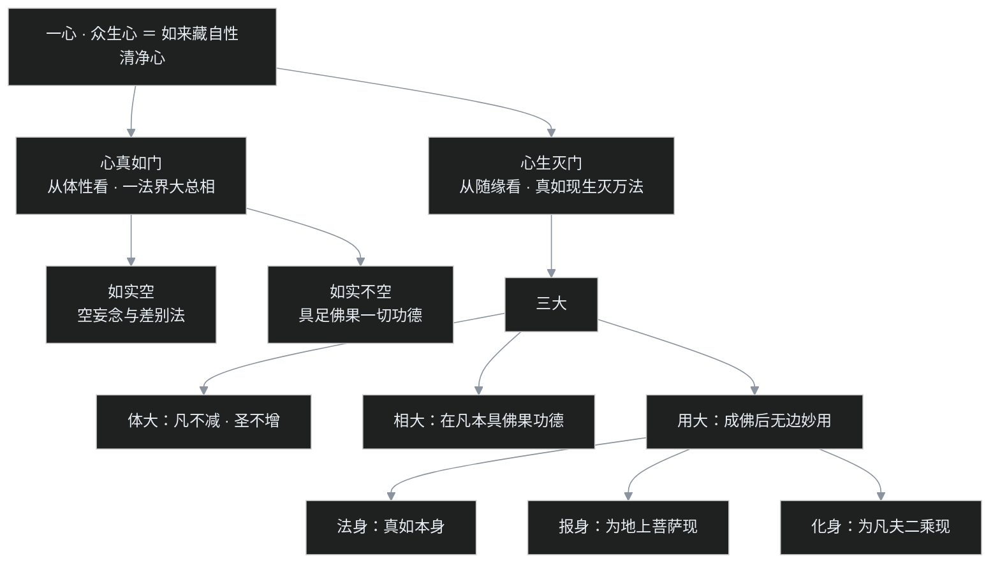
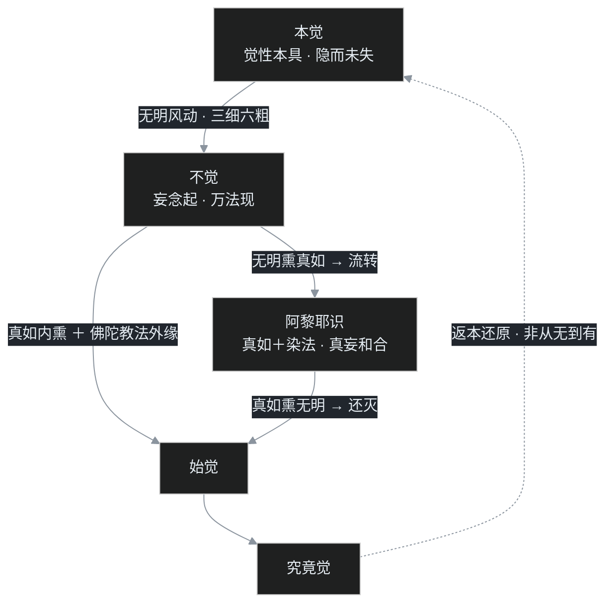

6 世纪的某座寺院里，一位僧人伏案写完了最后一个字。

案头是一卷只有一万多字的论书，没有神通故事，没有咒语，篇幅短得几乎不起眼。论中只反复谈一件事：众生自己的这一颗心，为什么会从清净变成烦恼，又为什么能从烦恼回到清净。

当时谁也想不到，这卷小论后来会成为中国佛教的「操作系统内核」。课程里有一句分量极重的判断：**湛然以后的天台宗、全部的华严宗、绝大部分的禅宗，都是奠基在《大乘起信论》之上的**。换句话说，没有这卷小论，就没有后来中国化的佛教宗派。

更戏剧的是，这卷小论从「报户口」的第一天起，身份就有疑点：它题名为印度大论师马鸣菩萨所造、由真谛三藏汉译，可隋代官府编经录时，直接把它列入了「疑惑」一档——这桩版权案，一争就是一千四百年，直到今天还没有完全画上句号。

这一篇是南北朝部分的收官篇。账要分三笔算清：**这卷论的身份之谜、它究竟说了什么、它凭什么撑起整个隋唐佛教**。

## 先给小白交个底

- **一部论，一卷，一万多字。** 《大乘起信论》题名「马鸣造、真谛译」，是中国佛教影响最大的论书之一，也是争议最大的论书。
- **总纲六个字：一心、二门、三大。** 一心＝如来藏自性清净心；二门＝从两个角度观察这颗心（心真如门、心生灭门）；三大＝体大、相大、用大。
- **「本觉」是它首出的核心概念。** 众生本来就具有佛的智慧（本觉一词由此论首出，本觉思想则为如来藏系共有），烦恼只是遮蔽，不是把觉性消灭了；所以成佛不是获得新东西，而是返本还原。
- **它和唯识学正面冲突。** 唯识学认为能熏所熏必须都是生灭变化的有为法，《起信论》却让不生不灭的真如又能熏、又被熏——唐代以来为此吵了几百年。
- **它还深刻影响了宋明理学。** 朱熹的理一分殊、王阳明的四句教，背后都有这卷论所代表的思想脉络的影子。

## 一、一千四百年的版权案

### 「出生登记」时就有疑点

按照论书自己的题名，《大乘起信论》为马鸣菩萨所造。题名所托的马鸣是古印度著名论师，后世常将其与龙树、提婆并视为大乘史上的标志性人物；译本则出自真谛。

可就在真谛圆寂后仅仅 25 年，隋代开皇年间，由僧人法经主持编撰的官方经录《众经目录》（后世简称「法经录」），已经把《大乘起信论》列入了「众论疑惑部」——也就是说，**官府编目的人当时就怀疑：这卷论到底是不是印度传来的，要打个问号。**

### 慧均的指控：地论师写的

另一位隋代学僧慧均（因做过僧正，又称均正，与吉藏大致同时，也有人说慧均本是高丽人），在自己的著作《四论玄义》中留下了更直接的判断：这部论是「地论师所造」——即地论学派的中国僧人自己写的，并不是马鸣造、真谛译。可惜《四论玄义》今天只剩残本，文字讹误不少。

### 20 世纪的大论战

时间快进到 20 世纪初。日本著名佛教学者望月信亨系统考证后提出：《大乘起信论》是中国人自己造的，在日本学界激起激烈争论。

1922 年，梁启超把日本学者的观点摘译成长文《大乘起信论考证》，此文在中国学界引起轩然大波。梁启超本人的态度很特别——不是惋惜，而是欣喜赞叹：中国人能在那么早的年代写出这样系统清晰、框架完整的论，实在了不起。

但另一条战线火药味浓得多。南京方面，自杨文会创办金陵刻经处以来，法相唯识的绝学因杨文会与日本南条文雄的交流而重新传回中国；杨文会的后继者欧阳竟无（名渐，以字行）创办支那内学院，宗旨是「辨伪存真」，认为唯识学才是佛法的正义。在这一立场下，《起信论》既被判为伪论，奠基其上的汉传佛教便也根基可疑。内学院一系中王恩洋的措辞最为激烈，直斥其为「相似佛法」「伪佛教」。

### 太虚的护持与印顺的折中

护持一方以太虚大师为代表。太虚主张八宗平等，认为《起信论》同样是如来藏学说的重要经典；课程还提到太虚一个用心良苦的解释：此论或许是马鸣菩萨造好之后「藏之名山」、迟至后世才流通出来的，所以在印度找不到同期记载。

太虚的弟子印顺，态度则是折中：在事实上基本承认《起信论》是中土所造，但提出一个价值判断——**印度传来的未必就好，中国人造的未必就不好**；出处是出处，义理是义理，不必捆死。

### 批判佛教：最近的一波浪潮

到了 20 世纪末，日本兴起「批判佛教」思潮，锋芒所指正是以《起信论》传统为核心的如来藏学说：批判者认为如来藏主张「界」（dhātu，基体）是一切法的本性与根源，这是「界论」（基体论），不是佛教的正义。

课程特别提醒，这一思潮有其日本本土的现实针对性：批判者任教于曹洞宗创办的驹泽大学，矛头首先指向日本天台宗、禅宗的传统——批判者一度几乎丢掉教职。所以把它简单理解为「针对中国」并不准确，人家首先清算的是日本自家的佛教传统。

### 课程的立场：史料已尽，回到义理

讲到这里，授课的傅老师给出了自己的判断：从史料上说，能用的材料早已用尽，现有史料既不能证真、也不能证伪；除非地下再挖出古代写本，历史考证已经走到尽头。任何硬要从史料上断定「真谛确于某一年译出此论」的推理，逻辑链都是断裂、跳跃的。

所以真正有意义的问题只剩一个：**这种思想，有没有可能在印度出现？** 傅老师的答案是：总体上看，只有在地论学派、特别是地论南道的传统中，才能找到《起信论》出现的土壤。

下面就进入这卷论本身，看它到底说了什么。

## 二、一心二门三大：总摄一切佛法

### 「大乘起信」是什么意思

从字面讲，「大乘起信」就是发起大乘正信。但傅老师提醒，这并不表示它只是一部入门读物——论中自己说得很明白，真正的意图是「总摄如来广大深法无边义」，即把一切佛法都统摄进一个框架里。

这个框架的总纲，就是一心、二门、三大（另有四信、五行，属于修行层面，这里从略）。

### 一心：是真心，不是一念心

「一心」，论中界定为「众生心」。但这个众生心，不是普通人日常任何时候生起的一念心——这一点至关重要。

后来天台宗与华严宗长期争论，争的正是这个「一心」到底是日常生起的一念心，还是如来藏真心。《起信论》这里的一心，明确指的是**如来藏自性清净心**。

### 二门：两个观察角度，不是切成两半

由一心开出二门。要特别注意：「门」是观察角度的意思，**并不是把一颗心切成两半**。同一颗如来藏真心，可以从两个角度来看：

- **心真如门：** 从体性上看，这颗心的本质就是真如；
- **心生灭门：** 从真如随缘显现、产生生灭万法的角度看。

### 三大：体大、相大、用大

正因为开了二门，「大乘之所以为大」才体现得出来。这个「大」分三面：

1. **体大：** 真如的体性，在凡夫身上不会减少一分，在佛陀身上也不会增加一分；无论凡圣，都圆满无缺。
2. **相大：** 如来藏在凡夫位虽然被妄念遮蔽，但它本来就具有佛果位的一切无边功德——遮蔽是遮蔽，功德并未丢失。
3. **用大：** 一旦摆脱烦恼遮蔽而成佛，真如便能生起无边妙用，教化、救度众生。

「用大」具体表现为佛果三身：

- **法身：** 真如本身，以真如法为身；
- **报身：** 为教化「地上菩萨」所示现的身；
- **化身：** 为教化一般凡夫、二乘所示现的身。

这里补一个概念：什么叫「地上」？修行以见道为转折点，见道之后进入初地（欢喜地），称为登地、地上菩萨；还没进入初地的，仍是凡夫位。

### 心真如门的两个含义

心真如门，论中给了一个全称式表述：「一法界大总相法门体」。意思是，真如平等不二，在凡在圣都是同一个法的本性、成佛的因；真如所显现的万法虽千差万别，真如本身却是统摄一切的「一」。

这一门又有两个含义，来自如来藏系经典《胜鬘经》中的空如来藏、不空如来藏：

- **如实空：** 真如上没有任何妄念，也没有由妄念产生的差别法。**注意，空掉的是妄念和差别法，不是把真如自己空掉**——这是如来藏最容易被误解处。
- **如实不空：** 如来藏本来具足佛果位的一切功德，所以不空。功德无量，其中最重要的是菩提：经论表述为「大智慧光明」「遍照法界」——佛的觉悟、觉知能力，本来就在如来藏当中。

那么，「菩提本来具足」到底意味着什么？这正是全论最核心、也最招争议的地方。

## 三、本觉：全论最核心的一个词

### 唯识学的口径：空性本有，菩提始起

要理解《起信论》的革命性，先看它的对手怎么说。

按照瑜伽行派（唯识学）的讲法，必须区分两件事：

- **空性（所证的对象）：** 无论众生还是佛陀，空性本来平等、一直都在；
- **菩提（能证的智慧）：** 众生本来没有，只有圣者才具有，必须通过修行，让它从无到有地生起。

课程用了一个极形象的比喻：有一座宝山，山上珍宝无数，不管去不去，山都在那里，对穷人富人完全一样。那么贫富的差别从哪来？差别在于——穷人不肯上山开宝，富人跑上山去把宝藏开采了回来。**山是大家的，开宝的功夫却是自己的。**

借亚里士多德的四因说来说：涅槃（空性）是目的因，但目的自己不会动；真正的动力因是智慧的生起。也正因为「生起菩提的因」在不同众生那里各不相同，才有五种种姓的学说——解脱的可能性，因此有了差别。

### 如来藏的口径：能与所，合二为一

如来藏学说的特点，正是把这两件事合而为一：**如来藏，本质上就是「能证的智慧」与「所证的空性」的统一体**，没有能与所的截然分界，也没有动力因与目的因的分界。

于是，「众生本具如来藏」就意味着：众生本来就具有佛的智慧。这就引出了《起信论》里最关键的术语——**本觉**。

「本觉」这个词，正是在《大乘起信论》中首次出现：菩提不是从无到有生起的，觉性为众生所本具；凡夫与佛的差别，只是觉性被遮蔽还是已显现，是「隐显」的不同，不是「有无」的不同。

### 性寂与性觉：吕澂的判断与修正

现代佛学大家吕澂据此做过一个著名归纳：印度佛教的根本立场是「性寂」——本性空寂；中国佛教的根本立场是「性觉」——本性是觉悟。吕澂认为这是中印佛教的根本差别。

傅老师对此做了一个修正：这个说法不完全准确。准确的定位是——**性寂与性觉，是瑜伽行派与如来藏系的差别**。印度其实也有如来藏学说（如《宝性论》），只是没有成为主流；所以不能说「性觉只有中国才有」。

### 同一个词，三种含义

傅老师还把问题往深里引了一层，提醒读者切勿「寻文摘句」——看见相同的词就以为含义相同。以「真如」为例，在三个系统里其实有三层意思：

- **中观：** 空纯粹是否定性概念，只是对自性的否定，不正面陈述任何东西。《中论》说得决绝：「若复见有空，诸佛所不化」——谁要是把空本身当成一种存在，就无可教化了。
- **唯识：** 把否定性的空，转成一个正面的东西——「空性」，即空的体性；所以唯识的真如只有空性义，不可能含菩提义。
- **如来藏：** 再进一步，把觉性的含义赋予这个空性——空性与觉性统一，才成为如来藏、佛性。

所以读佛典的纪律是：哪怕用的是同一个「真如」「法界」「如来藏」，也要追问：这个概念里，到底包不包含「本具菩提」的含义？

## 四、流转与还灭：心生灭门的总账

### 两条方向相反的路

众生既然与佛同具真如，为什么还会流转？凭什么修行能够成佛？这正是心生灭门要回答的。

答案极简：

- **流转：** 从本觉到不觉——体性本觉，因迷失而落入不觉；
- **还灭：** 从不觉到始觉——开始觉悟，终点是究竟觉。

关键在于：这个「始觉」并不是时间上从无到有的新东西。**究竟觉的实质，就是返归于本觉**——本觉从未丢失，去掉遮蔽便是。傅老师指出，这就是汉传佛教极重要的观念「返本还原」，后来华严宗对此发挥最多。

### 无明风起：三细六粗

那么，平等的一心上，怎么会生出千差万别的世界？答案是：无明的介入。

无明像风一样吹动本来平静的心，真心上便产生从细到粗的各种妄念，以及由妄念产生的种种差别相——经论中把这套展开细分为「三细」「六粗」：三细相、六粗相，由细至粗，一切万法就此生起。一，就这样变成了多。

### 水波之喻

最著名的比喻是水波：

- 大海水平等一味，湿性是其体性——比喻真如；
- 风来吹动，海面波浪翻滚——风喻无明，波喻妄念万法；
- 波浪虽多，波的体性就是海水，波在水之外没有自己单独的体性，也改变不了海水的湿；
- 风一停，波自息，重归平静海水。

同理，无明风动而现万法，万法并不在真如之外另有体性，也改变不了真如的清净。

### 一个两难：无明与真如是什么关系

但傅老师提醒，这个比喻经不起细抠，因为它藏着一个《起信论》框架里极难解决的问题：**无明，到底从哪来？**

无非两种可能，而两种都不成立：

1. **无明在真如之外：** 不行。真如既是一切法的体性，理应包含无明；若真如之外另有无明，就有了两个来源、善恶二元——那是诺斯替主义的思路，佛教不能是二元论。（水波喻里风确实是海水之外来的，所以这一点不能照搬比喻。）
2. **无明在真如之内（真如能自己产生无明）：** 问题更大。成佛就是证得真如——若真如能内生无明，那佛陀成佛之后，岂不是还会再生出无明？

《起信论》本身的处理是「无明无始」：众生无始以来有真如，无始以来也有无明，二者并存，不再追问关系。后世的注家则以「非一非异」来回应——既不是同一、也不是截然两物，借此把问题消解。

### 最「中国化」的地方

讲到这里，傅老师给出一个点睛式的判断：《起信论》最中国化的地方，**并不在「本觉」这个概念**——印度如来藏学说里也可以有本觉；最根本的中国特点，是它整套的「体用」框架：由体起用、一生多、静生动。

这个提问方式，接续的是魏晋玄学的体用观念，源头可追溯到老子：道是静、生物是动。从老子到魏晋玄学，再到《起信论》、宋明理学，「一多、动静、体用」这组问题贯穿始终，而在印度佛教里，这并不构成根本问题。

## 五、熏习：唯识与《起信论》的正面冲突

### 熏习本来是什么意思

「熏习」这个概念本来自唯识学，有一个日常来源：古印度人把香花和胡麻放在一起，胡麻本来无味，放久了便染上花香，榨出的油就是香油；衣服与香料久放，也会带上香气。

唯识学借此说明：过去的行为如同香花，能以潜势力的方式存留起来——这种潜势力就是习气（种子），存放在阿赖耶识中；此后习气又能生起新的行为。

但唯识学对熏习有一条极严格的界定：**能熏的一方和所熏的一方，都必须是生灭变化的有为法**；无为法不生不灭，既不能熏，也不能受熏。

### 《起信论》的互熏

《大乘起信论》借用了「熏习」一词，说的却是无明与真如互相熏习：

- **无明熏真如：** 无明作用于真如，真如上生起种种染法——这就是流转；在这里，真如成了所熏。
- **真如熏无明：** 真如反作用于无明，推动众生修行解脱——这就是还灭；在这里，真如成了能熏。

傅老师特别点出《起信论》中「阿黎耶识」的独特含义：真如受无明熏习而现染法，于是，**不生不灭的真如与生灭变化的染法，二者和合统一，就叫阿黎耶识**——简单说就是「真妄和合」。这与唯识学里阿赖耶识的内涵完全不同。

「真如熏无明」又分两种表现：

- **自体相熏习：** 真如自身的内熏作用，是内因——前述真如作为内在驱动力，使人厌离世间、走上修行路；
- **用熏习：** 听闻佛陀教法、蒙受佛陀救度，是外缘——佛陀本质上也是脱离烦恼的真如。

### 冲突摆上桌面

矛盾一眼可见：真如是无为法，唯识铁律是无为法不能熏；《起信论》却让真如既当所熏、又当能熏。

玄奘一系唯识学传来之后，唐代的中国学僧**首先发现的就是这个问题**——《成唯识论》白纸黑字写着能熏所熏必须是有为法，与《起信论》字面上直接冲突，无须推导。

于是产生两条解释路线：

1. **唯识学立场：** 仍承认此论是马鸣所造、真谛所译（没有判它伪），但认为是**真谛翻译出了错**。
2. **维护《起信论》的立场（以华严宗为代表）：** 区分两种熏习——《起信论》所说的是「不可思议熏习」，唯识学所说的是「可思议熏习」。「不可思议熏、不可思议变」一语出自《楞伽经》；再与华严判教结合，可思议熏习被判为「始教」（不了义），不可思议熏习被判为「终教」（了义）——高下由此反转。

## 六、余响：从「两经一论」到宋明理学

### 两经一论

傅老师提醒，被学界判为中土撰述的佛教典籍中，最重要的是「两经一论」：《圆觉经》《楞严经》，加上《大乘起信论》（佛教界当然不认同此判，两经在佛教信仰中地位极高）。另有一部《占察经》，义理与《起信论》基本一致，还附带占卜善恶业报的方法。

### 宋明理学的地下潜流

不懂佛教、尤其不懂《起信论》与禅宗，很多宋明理学的问题就讲不清楚。课程举了两组实例：

- **理一分殊与格物致知：** 「理」遍在万物，每一物都含着理的全体（华严的影子）；所以今日格一物、明日格一物，格到某一天可以豁然贯通。
- **王阳明四句教：** 「无善无恶心之体，有善有恶意之动，知善知恶是良知，为善去恶是格物。」当年在天泉桥上，钱德洪主「四有」、王畿主「四无」（四无说推到尽头便是「满街都是圣人」，后来泰州学派、李贽都沿此路走）。而《圆觉经》里早有「作病」（执着功夫、忽略本体）与「任病」（执着本体、废弃功夫）两种偏差，正与四有四无之辩遥相呼应。

傅老师说得直白：**否定了《起信论》，在某种意义上就是否定中国化佛教的合法性**——不管它出自印度还是中国，一个事实已经铸就：它奠定了中国佛教的基本框架。

## 如果把它放进一个程序员的世界

叶扬把这一卷小论看成一套「大一统内核」的诞生史，处处是熟悉的工程场景：

- **一心二门＝同一内核的两个视图。** 同一份数据（如来藏心），从「体性」看是一张静态架构图（心真如门），从「运行时」看是一条随缘起灭的事件流（心生灭门）。高明的设计不在把数据切成两半，而在让两个视图读同一底层。
- **本有 vs 始起＝配置项是出厂自带还是首次启动时生成。** 唯识派认为「觉悟」这个能力出厂没有、要靠漫长的构建流程从无到有编译出来，所以不同机器的编译环境（种姓）决定了能不能出包；《起信论》却说能力出厂已内置，只是被一层层脏配置盖住了，排障的正道不是加功能，而是把脏配置一层层剥掉——返本还原。
- **熏习之争＝接口契约冲突。** 老契约（唯识）规定：只有 mutable（生灭变化）的对象才能当发布者和订阅者；新系统却让一个 immutable（不生不灭）的核心对象既收消息又发消息。唐代工程师一比对两份契约文档，当场报警。
- **两条解决路线＝工程史上的两种老套路。** 唯识派：不怪架构，怪当年那位翻译文档的人（真谛）译错了；华严派：另立一条更高阶的总线标准（不可思议熏习），把老契约降级成「初级模式」（始教），自家是「高级模式」（终教）——当你没法在老规则里赢，就换一条让老规则失效的规则。
- **体用框架＝最隐蔽的「文化遗产代码」。** 《起信论》真正的中国底色不是某个术语，而是整套提问方式：一个静态的本体，怎么产生动态的现象（一生多、静生动）？这是从老子、玄学一路继承下来的「祖传问题」，连后来的儒家（朱熹「理乘气动」、王阳明四句教）都在同一个框架里打转——**技术可以进口，提问方式往往是本地的。**

## 吵架现场：两回合

**第一回合：王恩洋 vs 太虚（20 世纪上半叶·南京与武昌）**

- **质问方（王恩洋）：** 《起信论》来历不明，立义又与唯识明文相违；以「真如熏习」等说混淆能所，是相似佛法。整个汉传千余年建在这一卷伪论之上，何来正统可言？
- **回应方（太虚）：** 佛法不是唯识一家之学；大乘八宗平等，如来藏系圣典自有其一贯脉络。此论纵传世年代有异，马鸣先造、后世流通之说亦不无可能；岂可以一宗之准绳，废千余年之教化？

**第二回合：唯识家 vs 华严家（唐代以来）**

- **质问方（唯识家）：** 《成唯识论》明文：能熏所熏必是有为。《起信论》却令真如无为而作能熏、所熏，前后矛盾——当年翻译必是有误。
- **回应方（华严家）：** 《起信论》所说是出世间「不可思议熏习」，《楞伽经》明载；唯识「可思议熏习」乃始教方便，终教圆义不可以常情测量。高下不在谁合谁的规则，在谁了义、谁不了义。

两回合的共同主题：**事实层的「出处之争」，迟早要升格为价值层的「判教之争」——当规则对自己不利，就争夺「谁的规则才算数」。**

## 卡壳角：容易卡住的地方

- **「一心」是不是指我现在这个念头？** 不是。这是最常见的误读。《起信论》的一心是如来藏真心、自性清净心，不是日常起灭的一念妄心。后世天台讲「一念无明法性心」是另一套诠释，不可直接混为一谈。
- **「二门」是不是把心分成两半？** 不是。门是观察角度：从体性看＝心真如门，从随缘起灭看＝心生灭门，两面看的是同一颗心。
- **如实空，是不是说真如什么都没有？** 恰恰相反。空掉的是妄念和妄念所生的差别法，真如自身不空，而且具足佛果一切功德（如实不空）。把「空」理解成「不存在」，就掉进恶取空了。
- **本觉和成佛矛盾吗？既然本来就觉，何必修？** 不矛盾。本觉是体性上的「有」，现实中被无明遮蔽；修行不是制造觉性，而是去除遮蔽、让本觉显现——像宝珠蒙尘，擦去尘，珠本就在。
- **无明到底从哪来？** 《起信论》的回答是「无始」：不给第一因。因为一旦说无明有起点，就会落入「在真如内／在真如外」的两难。这个问题在论中是被悬置的，后世以「非一非异」消化。
- **它到底是不是中国人造的？** 课程的口径是：史料层面无法定案，思想层面高度可能——它是地论南道思想的产物。但作者归属不影响另一事实：它实际奠定了中国佛教的框架。

## 术语小本本

| 术语 | 一句话解释 |
|---|---|
| 大乘起信论 | 一卷一万多字的论书，题名马鸣造、真谛译，中国佛教的奠基性著作 |
| 马鸣 | 古印度大乘论师，《起信论》题名的作者 |
| 法经 | 隋代僧，主持编撰《众经目录》 |
| 法经录 | 法经《众经目录》的简称，最早把《起信论》列入疑惑部 |
| 众论疑惑部 | 法经录中对真伪存疑论典的类目，距真谛卒仅 25 年 |
| 慧均 | 隋代学僧，又称均正，《四论玄义》判定《起信论》为地论师所造 |
| 均正 | 慧均因曾任僧正而得的称呼 |
| 四论玄义 | 慧均著作，今仅存残本 |
| 望月信亨 | 日本佛教学者，20 世纪初系统论证《起信论》为中国人造 |
| 梁启超 | 1922 年撰《大乘起信论考证》，对中土造论持赞叹态度 |
| 大乘起信论考证 | 梁启超 1922 年摘译日本研究的长文 |
| 欧阳竟无 | 名渐，支那内学院创办者，承杨文会法相唯识之学 |
| 支那内学院 | 欧阳竟无创办的佛学研究机构，宗旨「辨伪存真」 |
| 王恩洋 | 支那内学院一系，斥《起信论》为相似佛法、伪佛教 |
| 杨文会 | 金陵刻经处创办者，与日本南条文雄交流传回唯识典籍 |
| 南条文雄 | 日本学者，协助杨文会寻回中土失传的佛教典籍 |
| 太虚 | 近代高僧，主八宗平等，护持《起信论》 |
| 印顺 | 太虚弟子，承认《起信论》可能中土造，但主张价值不系于出处 |
| 批判佛教 | 20 世纪末日本思潮，判如来藏为「界论」、非佛教正义 |
| 界论 | 界（dhātu）论，又称基体论，批判佛教对如来藏的定性 |
| 驹泽大学 | 日本曹洞宗创办的大学，批判佛教倡导者任教之处 |
| 一心 | 《起信论》的核心范畴，指如来藏自性清净心 |
| 二门 | 心真如门与心生灭门，观察一心的两个角度 |
| 心真如门 | 从真如体性角度观察一心 |
| 心生灭门 | 从真如随缘、生灭万法角度观察一心 |
| 三大 | 体大、相大、用大 |
| 体大 | 真如体性凡不减、圣不增，圆满无缺 |
| 相大 | 如来藏在凡夫位虽被遮蔽，本具佛果一切功德 |
| 用大 | 成佛后真如所起无边妙用，表现为三身 |
| 法身 | 佛三身之一，真如本身 |
| 报身 | 佛为教化地上菩萨所示现之身 |
| 化身 | 佛为教化凡夫、二乘所示现之身 |
| 地上菩萨 | 见道后登初地（欢喜地）以上的菩萨 |
| 见道 | 由凡入圣的转折，证见真理 |
| 欢喜地 | 菩萨十地之初地，登地的起点 |
| 一法界大总相法门体 | 《起信论》对心真如门的全称表述，统摄万法的平等一真 |
| 如实空 | 心真如门二义之一，无妄念及妄念所生差别法 |
| 如实不空 | 心真如门二义之一，具足佛果一切功德 |
| 胜鬘经 | 如来藏系经典，空如来藏、不空如来藏的出处 |
| 空如来藏 | 《胜鬘经》概念，即如实空的源头 |
| 不空如来藏 | 《胜鬘经》概念，即如实不空的源头 |
| 菩提 | 能证悟的智慧、觉悟，《起信论》认为众生本具 |
| 空性 | 所证的对象、真理，凡圣平等 |
| 本觉 | 《起信论》首出的概念，众生本具佛的觉性 |
| 始觉 | 从迷失中开始觉悟，回归本觉的过程 |
| 究竟觉 | 始觉的圆满终点，实质即返归本觉 |
| 返本还原 | 成佛即回归本有清净觉性，华严宗发挥最多 |
| 性寂 | 吕澂所归纳的瑜伽行派立场，本性空寂 |
| 性觉 | 吕澂所归纳的如来藏系立场，本性觉悟 |
| 吕澂 | 现代佛学大家，原说性寂性觉为中印佛教根本差别；傅老师修正为瑜伽行派与如来藏系的差别，印度《宝性论》一系亦主性觉 |
| 宝性论 | 印度如来藏系论典，证明印度亦有如来藏学说 |
| 无明 | 不觉、迷惑的根源，《起信论》称「无始」 |
| 三细六粗 | 无明心动后，妄念万法从细到粗的展开次第 |
| 水波之喻 | 海水喻真如、风喻无明、波喻万法，波不离水 |
| 诺斯替主义 | 善恶二元、两个本源的思想，佛教所不取 |
| 非一非异 | 后世注家处理真如与无明关系的范式 |
| 体用 | 中国哲学的核心范畴：本体与现象／发用 |
| 由体起用 | 本体显现、生发万象，《起信论》最中国化的框架 |
| 熏习 | 本为唯识概念，行为以习气存留的作用 |
| 习气 | 过去行为留下的潜势力，即种子 |
| 胡麻之喻 | 香花熏胡麻而带香，说明熏习的由来 |
| 有为法 | 生灭变化的现象，唯识学认为只有它能参与熏习 |
| 无为法 | 不生不灭的真理（真如），唯识学认为不能熏习 |
| 无明熏真如 | 《起信论》说：由此生起染法、成流转 |
| 真如熏无明 | 《起信论》说：由此趋向还灭解脱 |
| 阿黎耶识 | 《起信论》概念：真如与染法「真妄和合」的统一体 |
| 真妄和合 | 《起信论》阿黎耶识的定义，与唯识阿赖耶不同 |
| 自体相熏习 | 真如自身的内熏作用，内因 |
| 用熏习 | 佛陀教法的外在熏发，外缘 |
| 成唯识论 | 玄奘系唯识根本论，明文言熏习必须是有为法 |
| 不可思议熏习 | 华严宗对《起信论》熏习的定性，语出《楞伽经》 |
| 可思议熏习 | 华严宗对唯识熏习的判摄 |
| 始教／终教 | 华严判教：唯识为始教、如来藏为终教 |
| 圆觉经 | 被学界判为中土撰述的经典，讲作病、任病等 |
| 楞严经 | 即《大佛顶首楞严经》，被学界判为中土撰述 |
| 占察经 | 义理近《起信论》，附占卜善恶业报方法 |
| 理一分殊 | 宋儒命题，理遍在万物而万物各一其分，有华严背景 |
| 四句教 | 王阳明宗旨：无善无恶心之体等四句 |
| 天泉证道 | 王阳明与钱德洪、王畿论四句教的公案 |
| 钱德洪／王畿 | 前者主「四有」，后者主「四无」 |
| 泰州学派／李贽 | 沿四无一路推到「满街圣人」的明代思想流派与人物 |
| 作病／任病 | 《圆觉经》二病：执事废理／执理废事 |

## 收个尾

一卷一万多字，从一个「身份有疑点的外来户」，变成了整个汉传世界的地基——这是《大乘起信论》最不可思议处。

回头清点南北朝这五篇（中10–中14）：南朝有梁武帝的素食定型、真谛的译经流离、成实涅槃的师说消长；北朝有两次灭佛、石头上的灾备，有地论南北道，有达摩面壁、昙鸾念佛；而收官的这一卷论，把南义北禅全部收拢进一个框架——一心开二门，真如随缘现万法，迷则流转、悟则返本。

理解了它，隋唐佛教的山门才真正向读者敞开。第三部「宗派鼎盛」就在眼前：天下一统的隋代，文帝何以在全国广建舍利塔、南义北禅如何在统一帝国里汇流，天台智顗、三论吉藏又怎样开出各自的宏大体系——这些都是中15 以后的故事了。

南北朝落幕，隋唐开场。下一篇见。
