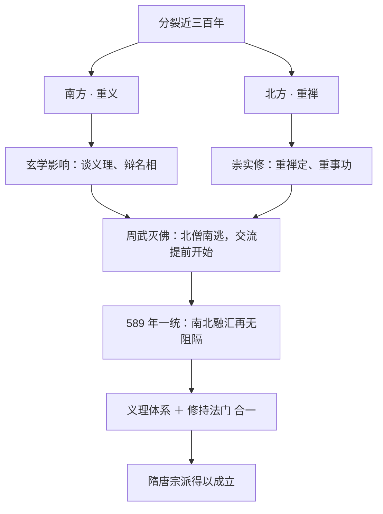
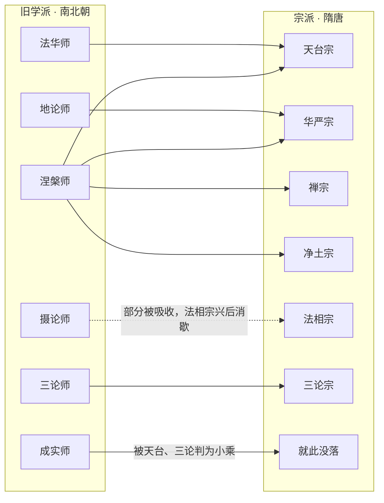

601 年，长安。

一道诏书从长安发出：数十个州，每州建塔一座，安置佛舍利。据记载，各州择同一吉日同时安奉，如同数十个节点在同一个时辰同步上线。

这样的全国性「同步发布」，在仁寿年间一共搞了三次，覆盖 110 余州。一个结束了三百年分裂的新生帝国，用一种极有想象力的方式，把佛陀的舍利「部署」到了帝国版图的每一个角落。

搞这场大工程的皇帝，本人就出生在佛寺里、由比丘尼一手带大。

上一篇中14 收官南北朝，这一篇正式进入第三部「宗派鼎盛」。隋代国祚只有 37 年，却是中国佛教的枢纽：没有隋代的制度铺排，就没有隋唐八宗。账分四笔：**三百年分裂如何终结、南义北禅怎样合流、文帝炀帝父子做了什么、学派如何变成宗派**。

## 先给小白交个底

- **一个 37 年的短命王朝。** 隋 581 年代北周、589 年灭陈，结束西晋永嘉之乱以来近三百年分裂；和秦朝类似，寿命短，但为后续大时代铺路。
- **隋代有两大宗派萌芽。** 天台宗、三论宗都在隋代形成（唐代又开出六个，合称隋唐八宗）。
- **隋文帝是佛教「大护法」。** 生于佛寺、比丘尼抚养；即位后复兴佛法、度僧二十余万、广建寺院、组织译场、设立国家佛学讲习制度。
- **110 余州舍利塔是隋代佛教的标志工程。** 模板是印度阿育王：同一套「佛舍利＋全国建塔」的方案，被中国皇帝复刻成国家工程。
- **南义北禅在统一后合流。** 南朝重义理、北朝重禅修，分裂时代两套学风；大一统把两者熔于一炉，直接催生了中国化宗派。

## 一、三百年分裂的终结

故事要从北周武帝说起。577 年北周灭齐、把灭佛令推广到全境；仅仅一年之后，578 年，周武帝就病死了。

即位的宣帝是个荒唐主，579 年二月就把帝位让给年仅几岁的儿子静帝，自己当太上皇；让位后一年多，宣帝也死了。小皇帝压不住朝局，大臣们心向身为外戚的汉人杨坚。

北周大象三年（正月改元大定，即 581 年），杨坚逼静帝禅让，建立隋朝，是为隋文帝。

统一的节奏很快：

- **587 年：** 废后梁。后梁是梁武帝太子昭明一系的萧詧在荆州建立的小朝廷，一直依附北朝生存；
- **589 年：** 大军南下灭陈，南北一统。

从西晋永嘉之乱（311 年）算起，到 589 年灭陈，分裂持续了将近 280 年（历史叙述中通称「近三百年」）。秦汉以来的大一统格局，至此重新接续。而隋唐两代，也把中国古代社会推向鼎盛——课程里有一个很高的评价：隋唐八宗并立，是继春秋战国、诸子百家之后中国的**第二个哲学黄金时代**。

## 二、南义北禅：一条江两边的佛学

分裂的三百年里，南北佛教长成了两种模样，史称「南义北禅」：

- **南方重义：** 东晋衣冠南渡，魏晋玄风也跟着过江；南方僧人受玄学影响，喜欢谈义理、辩名相，讲经说法、务求渊博；
- **北方重禅：** 北方政权多由匈奴、鲜卑等少数民族建立，其佛教崇实修、重禅定与事功。

这不是优劣之分，而是同一套佛学在不同文化土壤里的自然分化。

交流其实在统一之前就开始了：周武帝灭佛时，许多北方僧人南逃避难，把禅修传统带进南朝。等到天下一统，南北融汇再无政治阻隔，迅速达到顶峰——北方的禅与南方的义互相补足，这正是隋唐宗派能够成立的思想温床：**宗派的特征，恰恰是「义理体系」与「修持法门」合一，缺一不可。**

## 三、佛寺里长大的皇帝

隋文帝对佛教的支持，与唐代皇帝的「利用式尊佛」不同，带着私人感情——因为文帝本人就是在佛寺里长大的。

### 般若寺出生，智仙抚养

541 年，杨坚出生在冯翊（今陕西大荔）的般若寺。据说杨坚出生时，一位叫智仙的比丘尼对其母亲说：这孩子不是凡人，不能在俗世养育。智仙于是亲自抚养，杨坚在寺中度过幼年，到读书年龄才回家。

课程还提到一种学者推测：智仙可能是杨坚父亲的妾室，生下孩子后出家，又不放心才将孩子带在身边。比丘尼当年还预言杨坚将来能做帝王、统一天下——这类叙事当然带有神化色彩，但客观效果是真实的：杨坚以复兴佛法为己任，周武帝灭佛的政策在杨坚手里彻底反转。

### 复兴佛法的一揽子举措

即位之后，文帝的动作几乎是逐项反转周武帝的灭佛措施：

1. **下诏听任出家。** 想出家者可以出家，但仍有限制：必须是良家子。据记载，当时出家僧尼多达 23 万人。
2. **修复、广建寺院。** 先把北周废掉的官寺修起来，又在京城和地方大量新建；其中最重要的是长安大兴善寺——以国寺规格扩建，成为推行国家宗教政策的核心寺院。大兴善寺至今仍在西安，历代几经重修，已非隋时旧观。
3. **造像、写经。** 文帝令民间按人丁出钱，用以铸造佛像、抄写佛经（周武帝灭佛时大量经典被烧）。《隋书·经籍志》记载，民间佛经的数量比儒家的六经「数十百倍」（课程里引作五经的上百倍）——这个对比本身就说明佛教在隋代的普及程度。

## 四、110 余州舍利塔：阿育王模板的中国复刻

隋文帝佛事里最有想象力的一件，是全国舍利塔工程。

### 从一包舍利说起

文帝说，即位之前，曾有人送来一包佛舍利，一直珍藏（传世记载作一位印度来的婆罗门沙门，见王劭《舍利感应记》）。仁寿元年（601 年）开始，文帝三次下诏，在全国建塔安置舍利，前后覆盖 110 余州。

为什么是建塔？因为文帝要效仿一个人——印度的阿育王。

### 阿育王模板

课程先把印度背景讲了一遍：佛陀涅槃后举行荼毗（火化），周边八个国家赶来分舍利，由香姓婆罗门主持平均分配（据说香姓婆罗门在瓶里放蜜，瓶壁沾上的舍利被其悄悄留下）；八国各归本国建塔供养，剩下的骨灰由当地人建了灰塔。

阿育王后来皈依佛教，在鹿野苑、菩提伽耶等与佛陀生平有关的圣地广建舍利塔，塔旁立石柱——最著名的鹿野苑石柱上刻有四头石狮，那个图案今天是印度国徽。

**「佛舍利＋全国建塔＋圣地纪念」，就是阿育王模板。** 隋文帝把整套方案原样搬到了中国：同一批舍利，分发到百余州；统一的时间、统一的规制、国家级的仪式。

今天隋代所建的塔几乎已无存；天台山国清寺前有一座隋塔，始造于杨广为晋王时（开皇末年），塔旁一株传为隋代所植的古梅（隋梅），算是那个时代留下的实物记忆。

## 五、五众与二十五众：国家佛学讲习制度

文帝不是只求福报、糊涂信佛的帝王。文帝对佛教有完整规划，证据是「五众」和「二十五众」两套制度。

### 五众

文帝在京城设立五种教化团体（「众」就是僧团教化组织），每众立一位「众主」领衔，对应当时最主流的五门学问：

| 众名 | 所学 |
|---|---|
| 涅槃众 | 《涅槃经》与涅槃佛性学说 |
| 地论众 | 《十地经论》、地论学派之学 |
| 大论众 | 龙树《大智度论》（鸠摩罗什译） |
| 讲律众 | 戒律之学 |
| 禅门众 | 禅修法门 |

五众覆盖了**义理（涅槃、地论、大论）、戒律、禅法**三大块——这正对应佛教学问的完整结构：慧（义理）、戒、定三学。课程特别强调：文帝希望僧团戒定慧三学增上，与梁武帝、北魏孝文帝是同一思路。

### 二十五众

开皇十二年（592 年），文帝又从全国遴选 25 位高僧，成立「二十五众」讲习机构：每位高僧讲自己最专精的一门学问，分科教学、各尽所长。

这相当于一套由国家组织、按专长分科的佛学院体系。在南北朝，高僧通常是广学一切经论；二十五众把「通学」变成了「专科教学」——这也为后来宗派「各有一门核心经典」的格局做了制度预演。

## 六、炀帝的三座城市：扬州、长安、洛阳

炀帝（当时为晋王、后来为皇太子、再即位）对佛教的热情不输其父，沿着炀帝的人生轨迹，有三座城市值得讲。

### 扬州：两道场收纳南僧

平陈之役，炀帝任行军元帅，后为扬州总管。当时佛教最盛的建康（南京）城因战乱残破，炀帝便在长江北岸的扬州建起慧日、法云两道场，专门延揽南朝高僧：陈朝的义学僧人们被请入两道场担任住持、弘法授徒。

这是「南义北禅合流」的一次制度性操作：把南方义学僧团整体接入北方王朝的体系。

炀帝本人对天台宗的智顗执礼极恭，「智者大师」的赐号就出自炀帝；炀帝和后来的萧皇后（后梁的末代公主）都曾随智者大师受菩萨戒。顺带一提，炀帝的长公主南阳公主，在隋亡之后削发出家——两代皇室与佛教的纠葛，可见一斑。

### 长安：日严寺

当皇太子时，炀帝在长安建起日严寺，把全国高僧请入寺中居住，各讲法义、各授禅修，长安再度成为全国佛教中心。

### 长安与洛阳：两朝译场，三位译师

文帝朝与西域交通频繁，印度僧陆续来华，文帝在长安大兴善寺设立译场，专掌译经之事；炀帝时代又在洛阳上林苑立翻经馆，译事组织更正式。三位主要译师恰好分属文、炀两朝，接续了南北朝的译经传统：

- **那连提黎耶舍（文帝朝）：** 开皇二年（582 年）入大兴善寺译场，译《大方等日藏经》《莲花面经》等八部，开皇九年（589 年）卒；
- **阇那崛多（文帝朝）：** 译《佛本行集经》等 37 部，是三人中译籍最多的，开皇二十年（600 年）卒；
- **达摩笈多（炀帝朝）：** 大业年间为洛阳上林苑翻经馆译主，译《摄大乘论释论》《菩提资粮论》等，入唐后于武德二年（619 年）卒。

《佛本行集经》是佛传文学的集大成之作，后世讲佛陀生平大量取材于此；而《摄大乘论释论》的再译，也说明同一部论在中土多有异译、流传不绝。

## 七、经录与遣隋使：从输入国到输出国

### 两部经录

译事既盛、典籍既多，整理目录就成为必需。文帝两度下诏编撰全国众经目录：

- **开皇十四年（594 年）：** 敕大兴善寺法经等编撰，即《众经目录》，后世简称「法经录」。据课程介绍，法经还曾为文帝授菩萨戒。
- **仁寿二年（602 年）：** 再编目录，即「仁寿录」，精通梵文的彦琮等人参与。

另有费长房个人编撰的《历代三宝纪》（成于开皇年间），是一部佛教编年体经录，保存了大量早期译经史料；但各家普遍认为它的编撰态度不如两部官修目录严谨——中14 那桩《起信论》版权案，最早的「疑惑」记录就出在法经录里。

### 遣隋使：佛教开始反向输出

隋代还出现了一个历史性转折：朝鲜（高句丽、百济、新罗）和日本派出遣隋使、遣隋僧来华，学习汉文与佛法。当时朝鲜、日本都还没有自己的成熟文字，直接以汉文为书面语。

炀帝挑选高僧为这些留学生、留学僧授课。课程点出这件事的意义：经过东晋南北朝近三百年的吸收、消化，**佛教在中国已经能够独立开创新局——中国从佛教输入国，变成了向汉字文化圈（朝鲜、日本、越南）输出佛教的国家。** 日本、朝鲜的早期佛教，几乎都是汉传佛教的分支；越南自秦汉以来长期与中原版图关系密切，其佛教同样属于汉传系统。

## 八、学派退场，宗派登场

最后讲一个承前启后的变化。

南北朝的佛学形态是「学派」：僧人广读一切经论、学风自由，围绕某一部经或论形成共同研究的群体，如涅槃、成实、地论、摄论、毗昙、三论、法华诸师。

隋唐的佛学形态则是「宗派」：高僧在固定地方开创山门、设立门庭，有核心经典、有独特的义理体系、有专属的修持法门与规矩仪式，并且代代传承。

从学派到宗派，大致有这样几条归流线：

| 旧学派 | 去向 |
|---|---|
| 涅槃师 | 「佛性本有」的基本论调被天台、华严、禅宗、净土共同吸收 |
| 成实师 | 天台、三论兴起后被批判为小乘，就此没落 |
| 地论师 | 主要流入华严宗，成为华严义理的核心要素 |
| 摄论师 | 其学先被地论诸家部分吸收；玄奘归来、法相宗兴起后渐乏人问津而消歇 |
| 三论师 | 发展为三论宗 |
| 法华师 | 发展为天台宗 |

课程也记下了这一转变的另一面：学派时代学风自由、务求渊博；宗派时代定于一尊、各守门风，佛学视野反而越来越窄——这为后世汉传佛教某些法门逐渐失传、整体走向衰微，埋下了远因。

## 如果把它放进一个程序员的世界

叶扬把隋代佛教看成一次「大一统之后的系统重建」，处处是熟悉的工程场景：

- **天下一统＝两个分裂了三百年的代码库合并。** 北方仓库偏底层（禅修实修），南方仓库偏架构设计（义理名相）；合并之后第一波产出，全是「设计＋实现」一体化的新系统——宗派就是这种 full-stack 团队。
- **舍利塔工程＝一次全国 CDN 节点部署。** 同一份「核心资源」（佛舍利），统一时间、统一脚本，110 余州分三批同步上线；模板直接复用印度阿育王的成熟方案——架构界的真理：**最好的原创，常常是把别人验证过的方案在自己的规模上重做一遍。**
- **五众、二十五众＝按专长划分的技术委员会与团队矩阵。** 五众是五个技术方向（涅槃、地论、大论、律、禅），二十五众是 25 位 Tech Lead 各自带专科；从「人人全栈的通学时代」进入「分科教学的专科时代」，组织能力上了一个台阶。
- **扬州两道场＝并购后的团队整合。** 把南朝最优秀的义学团队整建制接入新帝国，给编制、给场地、给项目——技术整合靠的不是强制重写，而是保留对方、接入平台。
- **遣隋使＝开源项目反向输出。** 中国这个 fork 自印度的项目，经过三百年本地化开发，主干特性已经超过上游，开始向周边国家输出发行版——朝鲜、日本、越南拿到的都是「汉传佛教发行版」。

## 吵架现场：两回合

**第一回合：神异叙事 vs 学者考据（关于文帝的出生故事）**

- **叙事方（史书与僧传）：** 文帝生而有异象，比丘尼智仙识其非凡，亲自抚养、预言其终将统一天下为帝王——圣人受命，自有其征。
- **质疑方（后世学者）：** 比丘尼为何独独抚养重臣之子？有学者推测，智仙或为杨忠之妾，生子后出家、携子于寺中。所谓神异，不过是后来为皇权加持的修饰；帝王诞生的异象，历代史书还少吗？

**第二回合：学派旧风 vs 宗派新制（隋唐之际）**

- **守旧方（旧学派僧人）：** 学佛本应广读经论、务求渊博，自由论辩；一旦各立门庭、定于一尊，学人视野日狭，法门之衰，自此而起。
- **开新方（宗派创立者）：** 经论浩繁，不立核心、不建门庭，则传承无据、修持无门；以一部宗经、一套观行统摄群学，才能传之久远。渊博若无纲宗，终归散乱。

两回合的共同主题：**新秩序的诞生，总要一边征用旧叙事证明自己「受命于天」，一边淘汰旧组织证明自己「代表未来」。**

## 卡壳角：容易卡住的地方

- **隋和秦为什么老被放在一起说？** 两者都是结束数百年分裂、却二世而亡的短命统一王朝（秦 14 年、隋 37 年）；都搞了大工程（长城／大运河），制度都被后续王朝（汉、唐）继承。隋的制度成果，实际在唐代开花结果。
- **「南义北禅」是不是说南方人不修禅、北方人不读书？** 不是。这是侧重的描述，不是有无的判决：南方也有禅修，北方也有译经讲论（达摩、佛陀禅师都在北方）；只是文化风气各有偏重。
- **隋文帝的舍利是真的佛舍利吗？** 这不是历史学能回答的问题，属于信仰领域。课程只交代「即位前有僧人赠舍利」的来源叙事与工程本身；无论舍利本身如何，三次建塔的史实、百余州的覆盖是确凿的。
- **舍利塔为什么今天几乎看不到了？** 不少塔为木构等易毁材料，加上一千四百年间的兵火、灭佛、自然倾圮，隋塔实物极罕；天台国清寺隋塔始造于杨广为晋王时（历代有重修），隋梅为古树实物。
- **五众、二十五众是不是寺庙？** 不是。它们是**教学组织／制度**：按学问方向设立的僧团教化机构，有众主负责讲学，依托大兴善寺等寺院活动，不要和寺院建筑混为一谈。
- **隋代的宗派到底算不算正式成立？** 课程口径是：天台、三论「最早形成于隋代」；宗派的制度要素（传法定祖、祖庭、门风）在隋代逐步成型，到唐代完备。中16 会一并细讲天台、三论与三阶教。

## 术语小本本

| 术语 | 一句话解释 |
|---|---|
| 隋 | 581–618 年，杨坚建立，结束近三百年南北分裂，国祚 37 年 |
| 隋文帝 | 杨坚（541–604），生于冯翊般若寺，由比丘尼智仙抚养，隋代开国皇帝 |
| 隋炀帝 | 杨广（569–618），先为晋王、扬州总管，后为太子、皇帝，尊智者大师 |
| 北周武帝 | 578 年病死，灭佛次年而亡，是隋代复法的直接前因 |
| 宣帝／静帝 | 北周最后两任君主；宣帝 579 年让位，静帝幼年即位，杨坚以外戚代周 |
| 大定元年 | 581 年，杨坚受禅代周建隋 |
| 后梁 | 萧詧（昭明太子一系）在荆州建立的小朝廷，依附北朝，587 年被隋废除 |
| 陈 | 南朝最后一个朝代，589 年为隋所灭，南北统一 |
| 永嘉之乱 | 西晋末匈奴攻陷洛阳、士人南渡，南北分裂自此近三百年 |
| 南义北禅 | 南朝重义理、北朝重禅修的学风分化 |
| 冯翊般若寺 | 隋文帝出生地，在今陕西大荔 |
| 智仙 | 抚养隋文帝的比丘尼，曾预言其将为帝王 |
| 大兴善寺 | 长安国寺，隋代国家宗教政策的核心，今在西安 |
| 23 万 | 隋初听任出家后，记载中的度僧尼之数（须良家子） |
| 良家子 | 出家的身份限制，清白人家子弟 |
| 数十上百倍 | 《隋书·经籍志》载隋代民间佛经数量比儒家六经多出的倍数 |
| 舍利 | 梵文 śarīra，佛或高僧火化后的遗骨、结晶体 |
| 仁寿 | 隋文帝年号（601–604），三次下诏建舍利塔 |
| 110 余州 | 仁寿年间三次建舍利塔覆盖的州数（三批分别约 30、53、30 州，见王劭《舍利感应记》等记载，合计约 113，史称 110 余州） |
| 荼毗 | 又译阇维、耶旬，即火化（古印度葬法的音译） |
| 阿育王 | 古印度孔雀王朝国王，佛教大护法，在圣地广建舍利塔、石柱 |
| 香姓婆罗门 | 传说中主持八国分舍利的婆罗门 |
| 八国分舍利 | 佛陀涅槃后八国平分舍利、各自建塔的史传 |
| 鹿野苑石柱 | 阿育王所立，柱顶四石狮，为今印度国徽图案 |
| 国清寺 | 天台山名寺，寺前隋塔始造于杨广为晋王时，另有古隋梅 |
| 隋梅 | 国清寺旁传为隋代所植的古梅 |
| 五众 | 文帝设立的五种教化团体：涅槃、地论、大论、讲律、禅门 |
| 众主 | 五众各众的主讲、领衔僧人 |
| 涅槃众／地论众 | 分别研治《涅槃经》与《十地经论》之学 |
| 大论众 | 研治《大智度论》的僧团 |
| 讲律众／禅门众 | 分别研治戒律与禅法的僧团 |
| 二十五众 | 开皇十二年选 25 位高僧分科讲学的国家讲习制度 |
| 戒定慧三学 | 佛教修学总纲：戒律、禅定、智慧 |
| 慧日道场／法云道场 | 炀帝于扬州所建两道场，延揽南朝高僧 |
| 日严寺 | 炀帝为太子时在长安所建，聚全国高僧 |
| 上林苑翻经馆 | 炀帝时立于洛阳上林苑的译经机构，达摩笈多为译主 |
| 那连提黎耶舍 | 文帝朝大兴善寺译僧（589 年卒），译《大方等日藏经》《莲花面经》等 |
| 阇那崛多 | 文帝朝大兴善寺译僧（600 年卒），译《佛本行集经》等 37 部 |
| 达摩笈多 | 炀帝朝上林苑翻经馆译主（619 年卒），译《摄大乘论释论》《菩提资粮论》等 |
| 佛本行集经 | 阇那崛多（文帝朝）译，佛传文学的集大成之作 |
| 法经录 | 法经等 594 年奉敕编撰的《众经目录》，最早记录《起信论》之疑 |
| 法经 | 大兴善寺僧，奉敕撰经录；据课程介绍曾为文帝授菩萨戒 |
| 仁寿录 | 602 年奉敕再编的众经目录，彦琮等参与 |
| 彦琮 | 隋代学僧，精通梵文，参与仁寿录 |
| 历代三宝纪 | 费长房撰佛教编年经录，史料丰富但被认为严谨性不足 |
| 费长房 | 《历代三宝纪》的作者（隋代） |
| 遣隋使／遣隋僧 | 朝鲜、日本派往隋朝的使节与留学僧 |
| 汉字文化圈 | 以汉文为书面语、深受中国文化影响的区域：朝、日、越等 |
| 涅槃师 | 研治《涅槃经》的旧学派，佛性本有论影响后世各宗 |
| 成实师 | 研治《成实论》的学派，被天台、三论判为小乘而衰 |
| 地论师 | 研治《十地经论》的学派，主要流入华严宗 |
| 摄论师 | 研治《摄大乘论》的学派，其学部分被吸收，唐初法相宗兴起后渐乏人问津 |
| 法华师 | 研治《法华经》的群体，发展为天台宗 |
| 三论师 | 研治《中论》等三论的群体，发展为三论宗 |
| 八宗 | 隋唐形成的八个汉传佛教宗派（天台、三论、唯识、华严、律、禅、密、净土等之通行合称，具体名目诸书略异） |
| 萧皇后 | 后梁公主，炀帝之后，曾随智者大师受菩萨戒 |
| 智者大师 | 智顗，天台宗实际创立者，「智者」为炀帝所赐号 |
| 南阳公主 | 炀帝长女，隋亡后削发出家 |

## 收个尾

隋代 37 年，干的全是「给大时代搭底座」的活：政治上重归一统，学风上熔合南义北禅，制度上立起五众二十五众，空间上用百余座舍利塔把帝国连成一张佛网，对外则第一次以佛教输出国的姿态面对汉字文化圈。

而学派到宗派的质变，就在这片地基上发生。

下一篇中16，要正面走进隋唐宗派的第一座高峰：一个叫智顗的僧人，怎样在天台山把鸠摩罗什传来的般若、汉地涅槃师的佛性论、北方的禅法熔铸成一个宏大精密的体系——五时八教怎么判、一心三观怎么观、一念三千又是什么意思；与智顗几乎同时，长安的吉藏怎样以三论立宗。第三部「宗派鼎盛」的正戏，这才开场。

下一篇见。
