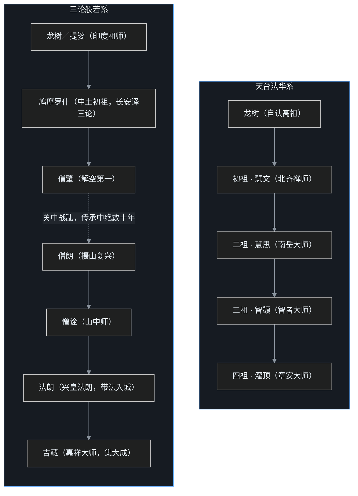
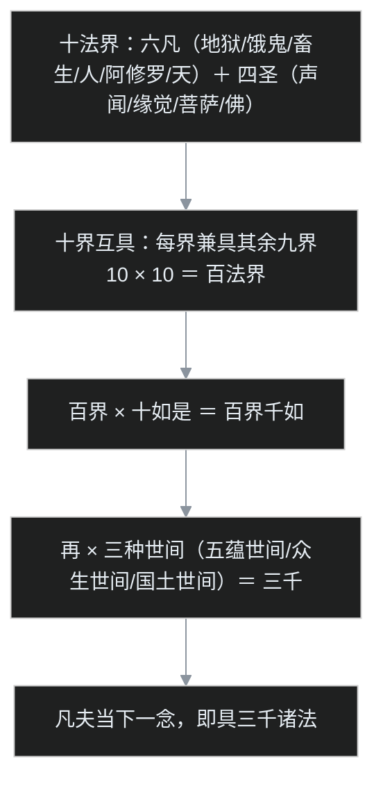

591 年，扬州。

一位 54 岁的僧人被晋王杨广恭恭敬敬请上法座，为杨广本人授菩萨戒。戒后，杨广赠僧人一个称号——「智者」。这就是「智者大师」一名的由来。

把时间线倒回去看会发现：这个称号不是白发的。此前三十年间，这名僧人经历了大苏山的法华三昧、金陵城的万人空巷、天台山的日夜禅修；在此之后，还有荆州玉泉寺、天台山国清寺，以及道路尽头的圆寂。

那位僧人名叫智顗（yǐ），天台宗的实际创立者。几乎同时，另一个同样宏大、同样综合了南北学养的宗派——吉藏的三论宗，正在从南京城外的摄山林木间走入城市。而一个叫信行的人，正带着数量大得惊人的信众，按「三阶」的设计图，一边积聚无尽藏财物，一边把一切众生当佛来拜。

上一篇中15 讲「学派变宗派」，这一篇就是第一批成品：**三条线——天台、三论、三阶教**——三条线里出了两个正式宗派、一个被两度查禁的庞大教团，以及一个贯穿此后整部隋唐佛教的核心动作：判教。

## 先给小白交个底

- **两个几乎同时成熟的宗派。** 天台宗尊《法华经》，实际创宗是智顗；三论宗尊《中论》等三部论，集大成是吉藏。两者都把自己法脉接到龙树（中观）名下。
- **什么叫判教？** 面对一堆来源不同、说法不一的经典，按自己的理解给它们排座位：哪部先说、哪部说给谁听、哪部最究竟。天台的「五时八教」就是最精密的一套排法。
- **一心三观是天台的招牌心法。** 当下这一念心，同时观空、观假、观中，不必分三步走。
- **一念三千是一心三观的升级版。** 当下一念，即整个缘起世界——十法界、十如是、三种世间，乘积是「三千」。
- **三论宗的方法论是「只破不立」。** 破掉一切错误的说法，正解自然显现，像国画里烘云托月。
- **三阶教是隋代「隐形巨头」。** 信行创教，信众与财富远超天台、三论；因为「无尽藏」财务问题及「普法」越界，隋文帝开皇二十年被查禁，清末才因敦煌文献重新被人知道。

## 一、两条传灯线：一在天台，一在摄山

先上族谱。两个宗派的法脉一南一北起头，最终都汇聚到陈隋之交的江南。

两条线有两个共同点，值得先划重点：

1. **都认龙树为源头。** 天台这边，初祖慧文依《大智度论》《中论》修持，所以自视为龙树学；三论这边更直接——三部论中两部是龙树的、一部是龙树弟子提婆的，全部由鸠摩罗什在长安译出，故以罗什为中土初祖。
2. **都是「教观双美」。** 教，是研究法义；观，是修行直观（止观）。北方重禅、南方重讲，两宗祖师都是先对南北各家法门下过功夫，再发展出自家体系——这正是中15 讲的「南义北禅合流」的具体成果。

## 二、智顗的一生：从大苏山到石城寺

智顗（538–597），俗姓陈，荆州华容（今湖北一带）人。课程里讲，智顗先祖与南朝陈的皇室一样出自颍川陈氏——这是中古士族常见的谱系追述，理解成「本是名门之后」即可。

### 家道中落，长沙出家

17 岁那年（554 年），西魏攻破江陵，梁元帝被杀，梁朝名存实亡，家道中落。第二年，据僧传记载，18 岁的智顗到湘州（长沙）果愿寺，随法绪出家。

### 大苏山：二祖慧思的考场

23 岁（560 年），智顗北上光州大苏山（今河南光山一带），亲近从北方来的慧思。据僧传记载，智顗在大苏山修**法华三昧**——一种围绕《法华经》设计的专项修行——精进之余有所开悟。《智者大师别传》记载，慧思得知智顗的悟境后叹道：「**非尔弗证，非我莫识。**」——意思是：除了你，没人证得到；除了我，没人识得破。

前面中15 提到过：慧思本人就是「白天谈义理、晚上精禅修」的样板，精通大小乘，还用《法华经》的「十如是」来解释实相——这些全部传给了智顗。

### 金陵：30 岁的当红讲者

567 年前后，慧思劝智顗往南朝都城建康（金陵，今南京）弘法。30 岁的智顗一到金陵大受欢迎——据《续高僧传》描写，法会听众多有恍然自失之感，听得入神，连自己都忘了。

可讲了几年，智顗自己先不满意：听法的人多、讲法的人多，但**真正在禅修上有成就的人太少**。讲法者本人也要禅修，而禅修是要下死功夫、要专心的。575 年，智顗带着一批弟子离开金陵，直奔当时还偏远幽静的天台山。

### 天台山：白天讲课，夜里坐禅

天台山在今浙江台州，风景优美、远离烦嚣。智顗在山中领众修行：白天为弟子讲经，夜里认真禅修，有时独自闭关坐禅；据说在华顶峰又一次深悟。因为在天台山开悟、立宗，后世便称其「天台大师」，宗也因地得名——又称「法华宗」，因为抉择法义一律以《法华经》为准则。

### 晚年：玉泉寺、国清寺与赐号

晚年的几个节点：

- **荆州玉泉寺：** 隋平陈（589 年）后，智顗一度隐居，591 年被晋王杨广迎至扬州授菩萨戒、得「智者」赐号；随后返回故乡荆州，住当阳玉泉寺，在那里开讲《摩诃止观》《法华玄义》——玉泉寺因此也被视为天台祖庭之一。
- **国清寺：** 据僧传，智顗在天台山草创寺院，圆寂前画好寺院图样；598 年（开皇十八年）杨广按图建成，601 年（仁寿元年）取智顗「寺若成，国即清」之语赐额「国清寺」——今天仍是天台山最著名的道场。
- **石城寺圆寂：** 杨广后来多次遣使迎请，597 年智顗不得已出山，行至石城寺（今浙江新昌大佛寺一带）病重，如入禅定般圆寂，享年 60 岁。

### 著作：三大部与小止观

研究天台的人必读「三大部」，全部由智顗讲述、弟子灌顶笔录成书：**《法华文句》《法华玄义》《摩诃止观》**。另有入门级的《修习止观坐禅法要》（世称《小止观》或《童蒙止观》，据课程介绍是为俗家兄长修学而说），还有《六妙门》《金刚般若经疏》等。一直到今天，想学禅修入门的人，多半还要读这本《小止观》。

弟子灌顶（章安大师，561–632）也不只是书记员：除了笔录三大部，还著有《国清百录》《涅槃经疏》以及《智者大师别传》——天台早期史，大半靠灌顶保下来。

## 三、五时：给佛经排一张五期课表

接下来进入天台最硬的理论：五时八教。这套判教不是凭空长出来的——早在东晋南朝，慧观（刘宋初年）等人就开始判教；到南北朝，南方三家、北方七家，合称「南三北七」，共十家说法。智顗把十家说法加以鉴别、抉择，完成自家的「一家之言」：**五时八教**。

### 五时：华严 → 阿含 → 方等 → 般若 → 法华涅槃

五时把佛陀成道后的说法排成五期：

| 五时 | 说什么 | 说给谁 |
|---|---|---|
| 华严时 | 《华严经》，成道后最初所说 | 大根利智的菩萨 |
| 阿含时 | 四《阿含》，小乘经典 | 声闻、缘觉，根基较浅者 |
| 方等时 | 方等类一般大乘经典 | 已学小乘者，引小向大 |
| 般若时 | 般若类经典，明空性、中道 | 根器转好者 |
| 法华涅槃时 | 《法华经》《大涅槃经》，最后所说 | 一切有缘，「会三归一」 |

### 五味：从乳到醍醐

五时还有一个很妙的配套比喻，依据来自《涅槃经》本身：牛乳加工有五个阶段——**乳 → 酪 → 生酥 → 熟酥 → 醍醐**。《涅槃经》用这五味形容佛经流出的先后，醍醐是乳的终极形态。

天台据此配对：华严时如**乳**，阿含时如**酪**，方等时如**生酥**，般若时如**熟酥**，法华涅槃时如**醍醐**——味道最醇厚的在最后。

### 先泼一勺冷水：五时不合历史

课程在讲完五时后反复提醒：五时把所有经典都当成佛陀成道后几十年间亲口宣说——这**不合历史实况**。实际上，所有经典（尤其大部头的大乘经典）是在漫长时间里慢慢结集、层层编集而成，大乘经典是后起的。中国没有单独发展小乘的历史机缘（印度、斯里兰卡有，所以清楚最早的是阿含），大小乘经典几乎同时涌入，中国僧人便以自己的判断来安排先后——五时代表的是中国僧侣的智慧：**对经典不同种类的区别，已经看得非常清楚**；但今天讲佛教史，不能再拿五时当史实。

## 四、八教：四个「怎么说」，四个「说什么」

八教分两半：**化仪四教**（说法形式，像药方的煎服法）和**化法四教**（说法内容，像药味本身）。

### 化仪四教：顿、渐、秘密、不定

所谓「佛以一音演说法，众生随类各得解」——佛说的是同一个法，但每个听众所得不同：

- **顿教：** 对利根人直接讲顿入的法门，不经过阶梯（如最初直说《华严》）；
- **渐教：** 对根基浅者由浅入深渐次说，从苦、无常、无我讲起（阿含→方等→般若，逐步加深）；
- **秘密教：** 同一场法会，大众同听，各人所得大小乘义各不相同，**彼此互不相知**——这叫「同听异闻，互不相知」；
- **不定教：** 各人所得同样交错（听顿教得渐义、听渐教得顿义），但**彼此知道对方所得**——区别就在「相知还是互不相知」。

课程还补了一个学术细节：智顗本人从「教观一致」出发，本来只讲三种教相——顿、渐、不定，对应三种止观；**化仪四教里「秘密」独立成一，可能是到灌顶之后才系统总结的**。所以严格说，「八教」有一个发展过程。

### 化法四教：藏、通、别、圆

这是说法的内容，从浅到深四档，每一档都配上了对应的「观法」：

| 化法 | 经典层级 | 核心内容 | 对应观法 |
|---|---|---|---|
| **藏**（三藏教，不是西藏！） | 阿含、原始/部派佛教 | 生灭四谛：万法有生有灭 | 析空观：把法分析到五蕴，见人我空 |
| **通**（通前通后） | 初期大乘般若系，三乘共学 | 无生四谛：诸法本不生 | 体空观：不必分析，直接体证空性 |
| **别**（大乘不共，独为菩萨） | 后期大乘，尤其如来藏系 | 无量四谛：菩萨观差别假名 | 从空入假、从假入中，**次第三观**，所证「但中」 |
| **圆**（圆满圆融） | 《法华经》（天台自家判准） | 无作四谛：法尔如是，不假造作 | **一心三观／圆顿三观**，所证「圆中」 |

「藏」字必须单独提醒：常有信徒把「藏教」理解成西藏的佛教——大错。智者大师的时代密教还没传入汉地，藏教就是「三藏教」，指阿含；至于西藏传来的佛教，在天台这一话语体系里被归入密教（秘密教）来称呼——这是天台语境里的判摄，不是说两者可以划等号。

### 判教判的不是「法高低」，而是「人根基」

傅老师特别强调天台判教的一个突破：五时的「时」，**不是教法本身有高低上下，而是针对众生根基（「对基」）**——因听法者根器不同，佛才说不同的法。如果是法本身有高低，那第二时说的阿含岂不是比第一时的华严「更高」？显然荒谬。隋唐之前（慧观以来）的旧判教多在教法本身上分高下；从天台开始，「时」主要是对基分派——后来窥基判教也沿用这个口径。

## 五、一心三观：一念心中同时观空假中

讲完「教」，进入「观」——课程里说，天台宗的要规「不出止观」，止观学说是全部学说的核心。

### 慧文的配对：三智配三谛

一心三观的源头在初祖慧文。慧文读《大智度论》第二十七卷，里面讲佛智有三种：**道种智、一切智、一切种智**，而且是「三智一心中得」——到佛果位，三种智同时具足。慧文又把三智分别对应《中论·观四谛品》的「三是偈」：

> 众因缘生法，我说即是空，亦为是假名，亦是中道义。

三智各有照境：

- **道种智是菩萨智：** 菩萨要普度千差万别的众生，所以照见一切法的**差别相**——配「假」；
- **一切智是二乘智：** 二乘证入空性、断烦恼入涅槃，所得是空性的**总相**——配「空」；
- **一切种智是佛智：** 既要普度众生又已彻证空性，空与差别相同时照见——配「中」。

既然果位上三智可以一心中得，慧文推论：**因位（修行过程中）也可以在一念心中同时观空、观假、观中**——这就是「一心三观」。

### 三谛圆融：即空即假即中

到智顗，一心三观进一步发展为「圆融三谛」：空、假、中三谛本身不是三块割裂的东西，三者圆融互具——**即空、即假、即中**。说空谛时，里面就包含假与中；说假谛时，包含空与中；说中谛时，也包含空与假。讲一谛就是讲三谛，「有一必有其二」。

与之相对的是「次第三观」：先观空、再观假、最后观中，三步走。第三步观到「中」的时候，这个中与空、假是隔别的、不互相具足——这种中叫「**但中**」（仅仅是中）。一心三观里那个中同时具足空与假，叫「**圆中**」（不但中）。

### 「三谛」其实是中国概念

学术上还有一层更深的考据：印度中观本来只讲**二谛**——俗谛（缘起假名）与胜义谛（空），没有「三谛」。「三谛」作为空假中并列的概念，主要出现在《仁王经》《菩萨璎珞本业经》里——这两部经现代学者一般认为是中国人自己撰造的。把空与假、中三者相并列，才有「三谛」。这也说明：一心三观名义上是「依《中论》立」，实际上已经是汉地的再创作。

### 六即佛：从「资格上是佛」到「事实上是佛」

天台还把成佛的过程分为六个阶段，称「六即」（「即」是「就是」的意思，每一阶都「即」是佛，但差距实实在在）：

| 阶位 | 含义 |
|---|---|
| 理即佛 | 众生皆有佛性，道理上就是佛——哪怕此人根本不信佛。**有资格，没激活** |
| 名字即佛 | 听闻佛法、弃恶向善，名义上是佛教徒了——「放下屠刀，立地成佛」说的是这一层 |
| 观行即佛 | 开始实修止观，真上跑道 |
| 相似即佛 | 菩萨五十二阶位的前十位（十信位），仿佛见道，「相似」而已 |
| 分证即佛 | 从第十一位到第五十位，逐步分证，越证越满（课程口径数到第五十位；天台通说还含第五十一位等觉） |
| 究竟即佛 | 彻证佛果，比赛完赛 |

这套设计的用心，后世天台注疏总结为防两种过失：一是「**上慢**」——怕人听到「众生即佛」就狂妄得不肯修行（那只是「理即」）；二是「**退屈**」——怕人以为成佛高不可攀而放弃（因为本来「即」是佛）。这与阿含里「断什么烦恼、证什么果位」讲得斩钉截铁的口径，已经是两种思路。

## 六、一念三千：一念心就是整个缘起世界

圆顿三观的顶峰，是智顗从「十如是」推出的「一念三千」。

### 十如是：《法华》里的十个维度

《法华经·方便品》说：唯佛与佛，才能究尽诸法实相，具体是十个维度——**如是相、如是性、如是体、如是力、如是作、如是因、如是缘、如是果、如是报、如是本末究竟等**：

- 相，是表现于外的差别形状；性，是内在的本性依据；体，是事物的体；力，是具有的功能；作，是造作活动；
- 因，是主导的原因；缘，是辅佐的条件；果，是因直接生起的结果；报，是善恶业招感的报应；
- **本末究竟等：** 本是相、末是报，「等」是平等——从头到尾，十者同以实相为体，平等不二（「等」不是「等等」，别漏读）。

这十个维度，其实就是把缘起世界里逃不掉的范畴——现象、本质、实体、功能、造作、因缘、果报——全部点了一遍，而每一者「如是」（恰如其分、本来如此），当下即是空性。

课程还提醒：十如是这段文字，**不见于更早的竺法护译本《正法华经》，现存梵文本中也没有对应段落**——来源学界有讨论（有认为可能与《大智度论》有关）；慧思首先把它拿来论实相，智顗接着大加发挥。

### 三千是怎么乘出来的

「三千」的计算像一道连乘题：

- **十法界**出自《华严经》的世界图景：六凡＋四圣；
- **十界互具：** 每一个法界都兼具其余九界——佛界也不例外，佛界显现的是佛、暗具其余九界；地狱界显现地狱、暗具其余九界；只是「显」「隐」不同。于是 10×10＝百法界；
- **百界千如：** 百界每界具十如是，乘出千如；
- **三种世间**出自《大智度论》：五蕴世间（五蕴本身）、众生世间（一切有情，业报上叫「正报」）、国土世间（有情居住的山河大地，叫「依报」）——再乘，正好三千。

### 一念无明法性心

观心从哪儿下手？智顗的答案是：**取当下任何一念心**。观众生，众生太多；观佛，佛太高；观世界，世界太广——而《华严经》说「心、佛、众生，三无差别」，最近便、最切实的就是当下这一念。

这一念心是**无明心**（凡夫的念头没有不带无明的），但**无明不在法性之外**——如同假不在空与中之外。所以一念无明心当下就与法性相通，全名叫「**一念无明法性心**」。这一念心展开，就是六道轮回的世界：六道众生，皆由一念无明、善恶不同而招感；在这缘起世界里分别观空、观假、观中，就成二乘、菩萨、佛。

### 非生成、非包含，而是「即」

一念与三千是什么关系？智顗否认两种常识答案：

- 不是**生成**（纵向：一念心生出三千世界）；
- 不是**包含**（横向：一念心里装着三千世界）。

两种都还属于「可思议」的范围。真正的关系是「即」：**一念即三千**——因为一念心即空即假即中，三千缘起总体也即空即假即中，在法性的层面，两者圆融互具。于是三千之中任取一法，一色一香，同样即具三千。

课程点出这个结论的性质：这是**现象论，不是本体论**——是从三千差别的现象中，因其同即空假中而「见出统一」，统一以差别为前提；不是先有一个统一的理体，由它产生出差别。后一种「由理体产生差别」，正是中14 讲过的《起信论》思路，也是后来华严宗的思路——两条路线在这儿分岔。

### 性具善恶：佛也没删九界的代码

从「十界互具」再推一步，推出后期天台最有辨识度的主张：**性具善恶**（性恶说）。

佛界本具九界，意味着成佛之时并没有「断除九界」这回事——九界的差别法，包括地狱、畜生等界与善恶诸法，在佛的本性里依然具足。所以天台讲：**佛不断性恶**——佛断的是「修恶」（恶行上不表现出来），但「性恶」不可断，因为差别法本身不能被删。

作为对比，《起信论》系（天台判作「别教」）的路线是：**别理随缘，缘理断九**——不具差别的「但中」之理，随无明之缘生出差别；成佛时翻转九界差别、归于佛界纯一、无差别的理，那等于佛是纯善。天台则坚持：不存在那样一个纯善无差别的理体，差别本来具足，佛也带着全部「兼容性」，只是不去运行——代码库一个文件没删，坏进程一个不起。

## 七、吉藏与三论宗：破邪显正的集大成者

镜头切到三论。三论宗的「三论」是：龙树《中论》《十二门论》、提婆《百论》——全部由鸠摩罗什在长安译出。

### 中绝与复兴：从摄山到金陵

罗什把三论传给「解空第一」的僧肇；可罗什圆寂次年，年轻的僧肇也去世了；随后姚兴去世、姚泓战乱，关中兵连祸结，僧团四散，三论传承就此不明。助译的僧睿、僧导、道生等人研读过三论，后来居士周颙、比丘道亮一系也在传播，但始终不受重视——直到僧朗出现之前，连中国人最看重的《大品般若》都乏人问津。

复兴的关键在南京城外的摄山（栖霞山）：

- **僧朗：** 辽东人，从何而来已不可考，来到摄山栖霞寺。寺本是北方南下的居士明僧绍舍宅所建，第一任法师为法度；五世纪末法度过世后，僧朗继任住持，开始弘扬三论。梁武帝闻其名，派十位比丘入山就学，最有成就的是僧诠。
- **僧诠：** 世称「山中师」，一直在摄山讲学，门下人才辈出。
- **法朗：** 僧诠弟子，据僧传载陈代奉敕入金陵，住兴皇寺——三论就此从山林带入城市，在陈代朝野大受欢迎。
- **吉藏：** 法朗门下的集大成者。

### 吉藏：安息后裔，真谛取名

吉藏（549–623）的生平颇有传奇色彩：

- **安息后裔：** 祖籍安息（今伊朗一带），祖先从海路来到南方，后辗转到金陵，吉藏就生在城里。僧传里说，其相貌一看便有西域特征，可谈吐与中国人全无二致——家族来华已经几代，多半是混血。
- **真谛取名：** 四岁时随父亲去见真谛三藏。真谛问孩子喜欢什么，四岁的吉藏回答：愿到一个吉祥而安乐的地方藏身。真谛便为其取名「藏」（传统念 zàng，取「宝藏」之义）。
- **早慧：** 七岁随法朗出家（父亲也在法朗所在的寺院出了家），十四岁已能领会三论精微，二十岁登坛说法——三论理解已属不易，还能讲给人听，足见根器。
- **嘉祥十年：** 隋灭陈时吉藏已入中年，战乱中离开金陵，一路东行到会稽（今绍兴）嘉祥寺，一住约十年，世称「嘉祥大师」。逃难路上别人忙着保命，吉藏每到一座寺院就搜集、整理文献——学问是在战火里抢救出来的。
- **长安岁月：** 杨广在扬州建慧日道场时即曾延请；后来吉藏被召入长安日严寺，入唐后仍受礼遇，623 年圆寂于长安。

著作有《三论玄义》《中论疏》《十二门论疏》《百论疏》《大乘玄论》《二谛义》以及《法华》《维摩》《华严》诸经的义疏、游意，合计约 26 部——三论是招牌，但吉藏的研究覆盖当时所有主流经论，是把南北各派学问继承、整合并能逐一精确批判的集大成者。

### 两类经典与三法轮

吉藏的判教比智顗简易。经典先分两类：**声闻藏**（小乘，不了义、不究竟）与**菩萨藏**（大乘，了义、究竟）。再用「三法轮」概括佛陀一代说法：

| 法轮 | 对应经典 | 内容 |
|---|---|---|
| 根本法轮 | 《华严经》 | 一佛乘：众生毕竟皆当成佛 |
| 枝末法轮 | 华严之后、法华之前三乘分说诸经（阿含、方等、般若） | 从一乘根本分出三乘的方便说 |
| 摄末归本法轮 | 《法华经》 | 会三归一：声闻、缘觉、菩萨三乘终归一佛乘 |

这里的「一乘」是《华严》《法华》意义上的「一切众生皆有如来智慧德相、毕竟成佛」，和原始佛教「一乘道」（八正道）不是一回事，别串台。「会三归一」则是《法华经》的要旨。

### 三大纲领：破邪显正、真俗二谛、八不中道

1. **破邪显正——只破不立。** 吉藏不正面回答「什么是正」：任何语言文字一说出口，就落在相对待中、落在世间法里，没法彰显真谛。所以破掉一切邪见，正解自然显现——像国画的烘云托月：不画月亮，只画云，月亮反而从云间显露。
2. **真俗二谛。** 真谛是空，俗谛是假名安立；二者都是佛的言教——**佛依二谛为众生说法**，二谛是教学工具，不是两个实体。
3. **八不中道。** 八不是四对：**不生不灭、不常不断、不一不异、不来不去**。世人看世界，总落两边：见生就执为真实生、见灭就执为真实灭；或执有永恒（一个不变的东西带着人轮回），或执断灭（人死如灯灭）。佛说不落二边——依俗谛了知缘起无常，依真谛了知空性，这就是中道。

### 三论宗为什么在中土消失

印顺导师有一个判断：与其叫「三论宗」，不如叫「三论学」——它把当时所有名经论（法华、涅槃，尤其如来藏系经典）都吸收进来，了解三论不能只读三论。中国人认定诸经皆佛说、必有一贯性，又重融通，所以在异中求同，把诸经摄入自家体系。

至于宗派本身的消亡，印顺的分析有三层：

- **学风偏移：** 僧朗、僧诠教观并重；法朗、吉藏进入城市后偏重义理辩证。寺中另有慧布一系继承山中禅修传统，而这一支的禅法后来被达摩禅吸收；
- **只破不立的代价：** 义理这一支破邪而不建体系——等到法相宗、华严宗各自立起严密宏大的哲学大厦，三论在正面战场上不是对手；
- **会昌一炬：** 唐武宗灭佛（845 年）后，三论宗在中土彻底断绝。

但三论的**思想**从未消失：被吸收进天台、华严乃至禅宗的言教里，只是别宗谈得不够明确深入。近代受西方、日本的中观研究刺激，龙树学在中土复兴，印顺导师成就最大，门下演培、厚观等继之——三论可谓「慧日重光」。

## 八、三阶教：隋代的隐形巨头

最后讲一个被历史遗忘了一千年的庞然大物。

课程用了一个很有冲击力的对比：隋代有个佛教团体，**信众之多、财富之巨，天台、三论远远无法相比**——信行禅师创立的三阶教。

### 三阶：正法、像法、末法

信行（540–594）本在北方修学禅法，后来立教。三阶教把佛灭后的历史分三段（课程口径各取五百年）：

- **第一阶：** 佛灭后第一个五百年，正法时期，法还纯正；
- **第二阶：** 第二个五百年，像法时期，不那么纯正，但有方便法门；
- **第三阶：** 此后进入末法时期，弊端丛生。

信行判定自己所处的已是末法，末法众生根器恶劣，不能靠讲高深义理得度，必须推行「**普法**」：

- **不堕空有两边，普敬一切：** 对众生无爱无憎，「一切众生是真佛」——把每个众生都当佛一样来礼拜，普真普正，没有拣择；
- **不分别出家与在家：** 教团里没有僧俗的严格界限（这是最被正统僧界诟病的一条），强调苦行，头陀风格；
- **普行布施：** 普遍地施舍财物，为此设立「**无尽藏**」——一个聚积了大量财富、用于布施和救济的机构，「无尽」是形容其施财不断、福报无尽。

### 两度查禁与一千年湮没

无尽藏的巨量财富很快引出问题：参与者中难免起贪念，甚至拿藏中财物去放高利贷；与此同时，教界大德普遍认为三阶教违背佛教教义——不能算正经佛教。**隋文帝开皇二十年（600 年），三阶教遭敕令查禁。**

入唐以后三阶教一度复兴（武周时期信众仍多），最终还是栽在无尽藏的财务问题上：**唐玄宗开元年间再度被禁断**。到武宗灭佛之后，这个曾经的隋代第一大教团就此湮没无闻——好像从未存在过。

### 敦煌与矢吹庆辉

清末，敦煌莫高窟藏经洞被打开，洞中出土了大批三阶教文献，世人才重新知道它（汉文传世史料其实留有零星线索：《续高僧传》里有信行的传记，但教团既亡，无人留意）。日本学者**矢吹庆辉**利用敦煌资料写成《三阶教之研究》，此后中国、日本、韩国的佛教学界才共同补上了这一课：隋唐之际，曾有这样一个信众数量极为庞大的佛教团体。

## 如果把它放进一个程序员的世界

叶扬把这一整篇看成「第一批成熟系统上线前后的工程故事」：

- **判教＝给一堆无版本号的遗留系统做协议梳理。** 佛经涌入汉地时既没署名时间、彼此说法还冲突；天台做的事相当于写出一部 RFC：按「客户端能力」（众生根基）路由，给每部经典标上适用范围和兼容级别。判教判的不是数据本身的高下，是请求方的能力——这个设计思想相当现代。
- **五时五味＝发布时间线 ＋ 成熟度模型。** 乳到醍醐不是五个竞争产品，是同一套数据在五个迭代阶段的加工形态；当然，作为「考古报告」它不成立——课程自己也承认——但作为「分类学」，它精确得惊人。
- **一心三观＝同一请求并发返回三个一致视图。** 空、假、中不是三次查询，是一个事务里同时读出的三个 projection；次第三观是串行调用三次、最后拿到的还只是个孤立字段（但中），圆顿三观是一次 fan-out、三视图强一致（圆中）。
- **一念三千＝最小运行单元里映出整个集群拓扑。** 一个进程的最小调度单位，按「同构互具」原理内含全系统信息——它不「生成」集群，也不「装着」集群，它「就是」集群的一个完整投影。全息拍摄了解一下：底片摔碎后，每一小块仍能还原整张影像。
- **性恶＝build 里保留全部兼容模块。** 成佛不是 format 后重装系统，九界代码一个文件没删——断的是运行（修恶），不是库本身（性恶）；对比《起信论》系的方案：把九界模块全部卸载、回归单一纯净内核。两种发布哲学，高下另说，区别就在这。
- **三论宗＝只做 critique 层、没做框架。** 吉藏的烘云托月在方法论上漂亮极了——像用反证法和 fuzzing 排除全部错误答案；但没有给开发者留下可上手的 SDK 与文档结构，等法相、华严带着完整框架入场，正面对位就落了下风。好在 critique 层的成果变成了「公共库」，被各宗吸收——项目死了，代码活着。
- **三阶教＝一个失控的「公益超级池」。** 愿景是普世救济，工程上却没有风控：无尽藏成了任何人都可挪用的资金池，放贷丑闻一起，外部监管（皇权）第一次关停；复活后仍不补风控，第二次关停，之后一千年无人问津，最后靠一份「敦煌备份」才恢复了自己的历史存在——备份的意义，怎么强调都不过分。

## 吵架现场：两回合

**第一回合：判教系统 vs 历史考据（五时八教之辩）**

- **判教方（天台学者）：** 诸经皆佛金口所说，依五味次第井然有序；若非五时，群经何以安顿？判教正是把佛法组织成可传可学的体系。
- **历史方（印顺等现代学者）：** 五时把上千年的结集史压缩成佛陀几十年的日程，全世界佛学研究者（印顺特别点名：欧洲、美国、日本皆然）都确认其不合史况；但化法四教藏通别圆，倒确实暗合印度思想史的真实次第——阿含、般若、如来藏，义理的台阶没有排错，错的是给它们安的「时间表」。
- 印顺还补了关键的第二刀：一心三观的「三谛」依据也有争议——《中论》明说「诸佛依二谛为众生说法」，没说依三谛；中道是以空即假、以假即空，空假之外没有另立一个「中谛」；而「三智一心中得」，按三智分属菩萨与佛、证得有先后来看，也不是字面意义上的「同时」。话说回来，印顺对智顗的止观著作推崇备至——六妙门、次第禅门、摩诃止观皆是「不朽」，智顗仍居中国佛教史上最伟大者之列。

**第二回合：正统诸宗 vs 三阶普法（关于「一切众生是真佛」）**

- **正统方（教界大德与朝廷）：** 僧俗不别、凡圣不分，把凡夫当真佛来拜，违背教义；无尽藏敛财放贷、伤生害众——名为佛教，实则异端，查禁有理。
- **三阶方（作者代拟信行与信众立场，非原话）：** 末法众生不堪受胜法，唯有普敬一切、不起爱憎，才与本具佛性之义相应；布施供养、救济贫乏，何错之有？禁教是出于世俗猜忌。
- 历史的判决很耐人寻味：两度禁教的直接导火索都是**财务**，而不是教义辩论；真正让它没能活下来的，或许是它「不建哲学体系、只搞组织与供养」——和三论恰好相反的另一种偏科：一个只有破、没有立；一个只有组织、没有义理护城河。隋唐宗派的生存密码至此揭晓：**义理体系、修持法门、制度组织，三足缺一不可。**

## 卡壳角：容易卡住的地方

- **天台和三论到底是不是同一个东西？** 不是。两者都宗龙树、都讲空，但路子差别明显：天台以《法华》为最高，大搞判教、建立系统，正面讲「一心三观」；三论以三部论为核心，判教简易，方法上「只破不立」。打个比方：天台是自带完整文档和接口规范的框架，三论是一套极锋利的代码评审规则。
- **「一心三观」是不是说胡思乱想也算修行？** 不是。观，是有明确对象和方法的觉察（空、假、中各有确定内涵），不是躺着想想；六即佛里「理即佛」与真正的「观行即佛」之间，隔着实打实的止观功夫——别把入场券当成完赛奖牌。
- **一念三千的「三千」是实数吗？** 是教义建构的象征性数字，由十界、十如、三世间连乘而得，重点不在算术而在结论：**当下一念与整个缘起世界同构**。课程明确说，计算方式不是关键，「三千」指的就是缘起总体。
- **「性恶」是不是说佛也会做坏事？** 不是。性恶说的是佛在本性（存在结构）上仍具足九界一切法，包括「恶」的可能性；但佛在现行（实际表现）上不起修恶——断修恶而不断性恶。区别「库还在」和「程序在跑」，就不会误读。
- **三论宗既然失传，是不是义理被驳倒了？** 恰恰相反。它的核心思想被各宗吸收，失传的是**宗派传承**，不是义理；其消亡更多是组织和竞争的结果（偏重义理、只破不立、会昌法难），不是一场决定性的教义败诉。
- **三阶教被禁，是因为「佛教辩输了」吗？** 两度禁断表面由头都是无尽藏的财务丑闻，背后还有「判为异端」的教界压力与朝廷管理宗教的考量；不能简单看成辩论失败。它的再发现靠敦煌文献，这也是史料分层的典型案例：僧传里有名字，教义细节却要靠出土文献补齐。
- **这一篇为什么三个主角里两个都算「失败」？** 三论宗传承断绝、三阶教两度被禁——但正是它们的「不完整」，反证了成功宗派的必备条件。历史不只写赢家，输家的墓志铭往往是最好的架构评审报告。

## 术语小本本

| 术语 | 一句话解释 |
|---|---|
| 智顗 | 538–597，天台宗实际创立者，「智者」为晋王杨广所赐号 |
| 天台宗／法华宗 | 形成于天台山、以《法华经》为抉择准则的宗派 |
| 慧文 | 北齐禅师，天台初祖，读《大智度论》倡一心三观 |
| 慧思 | 515–577，天台二祖（南岳大师），教观双美，以十如是论实相 |
| 灌顶 | 561–632，章安大师，笔录天台三大部，著《国清百录》 |
| 天台三大部 | 《法华文句》《法华玄义》《摩诃止观》，智顗讲、灌顶记 |
| 小止观 | 《修习止观坐禅法要》，天台禅修入门要籍 |
| 法华三昧 | 围绕《法华经》修持的一种三昧，智顗于大苏山修此有悟 |
| 大苏山 | 在今河南光山一带（古光州辖境），智顗 23 岁亲近慧思之处 |
| 国清寺 | 天台山名刹，598 年杨广依智顗遗图所建 |
| 玉泉寺 | 在今湖北当阳，智顗晚年讲《摩诃止观》处，天台祖庭之一 |
| 石城寺 | 在今浙江新昌，智顗 597 年圆寂之处 |
| 判教 | 对诸经按自家理解重排地位与次第；隋唐宗派的标志性动作 |
| 慧观 | 东晋末刘宋初僧人，早期判教代表 |
| 南三北七 | 南北朝十家判教学说的合称，智顗五时八教的直接前身 |
| 五时 | 华严时、阿含时、方等时、般若时、法华涅槃时 |
| 五味 | 乳、酪、生酥、熟酥、醍醐，出自《涅槃经》的比喻 |
| 醍醐 | 牛乳加工的最上味，配法华涅槃时 |
| 八教 | 化仪四教（顿渐秘密不定）＋化法四教（藏通别圆） |
| 化仪四教 | 顿教、渐教、秘密教、不定教，就说法形式判 |
| 化法四教 | 藏教、通教、别教、圆教，就说法内容判 |
| 秘密教 | 同听异闻、互不相知，各人所得不同 |
| 不定教 | 各人所得交错但彼此相知的教法 |
| 藏教 | 三藏教，指阿含等原始/部派佛教，非指西藏 |
| 通教 | 通前通后的初期大乘般若教，三乘共学 |
| 别教 | 大乘不共之教，菩萨别学，次第三观，证「但中」 |
| 圆教 | 圆满圆融之教，以《法华》为归，一心三观，证「圆中」 |
| 析空观 | 分析诸法至五蕴而见人我空，配藏教 |
| 体空观 | 不待分析、直接体证空性，配通教 |
| 生灭／无生／无量／无作四谛 | 分别配藏、通、别、圆四教的四谛说 |
| 一心三观 | 一念心中同时观空、假、中，慧文所倡 |
| 三谛圆融 | 空假中即一即三、圆融互具，智顗所发展 |
| 但中／圆中 | 与空假隔别之「中」 vs 具足空假之「中」 |
| 次第三观／圆顿三观 | 空假中分步而观 vs 同时并观 |
| 六即佛 | 理即、名字即、观行即、相似即、分证即、究竟即 |
| 十如是 | 相、性、体、力、作、因、缘、果、报、本末究竟等 |
| 本末究竟等 | 十如是的归结，「等」是平等：本末同以实相为体 |
| 正法华经 | 竺法护译《法华经》早期异译本，无十如是段 |
| 十法界 | 六凡（地狱等六道）＋四圣（声闻、缘觉、菩萨、佛） |
| 六凡／四圣 | 轮回中的六道众生 ／ 出世间的四种圣者 |
| 十界互具 | 每一法界兼具其余九界，10×10 成百法界 |
| 百界千如 | 百法界各具十如是的合称 |
| 三种世间 | 五蕴世间、众生世间（正报）、国土世间（依报） |
| 正报／依报 | 有情自身业报身 ／ 其所居住的国土环境 |
| 一念三千 | 当下一念即具三千诸法，即整个缘起总体 |
| 一念无明法性心 | 当下一念虽是无明，而无明不出法性，当下即通法性 |
| 性具（性恶） | 佛界本具九界，佛断修恶不断性恶 |
| 修恶／性恶 | 现行上的恶行（可断）／ 存在结构上的恶法（不可断） |
| 别理随缘，缘理断九 | 《起信论》系路线：但中之理随缘生差别，成佛断九界归一理 |
| 三论 | 龙树《中论》《十二门论》、提婆《百论》，罗什译 |
| 三论宗 | 以三论立宗，罗什为中土初祖，吉藏集大成 |
| 僧朗 | 辽东人，齐梁间住摄山复兴三论 |
| 摄山／栖霞寺 | 在今南京郊外，三论中兴之地 |
| 明僧绍 | 舍宅为栖霞寺的居士 |
| 僧诠 | 僧朗弟子，世称山中师 |
| 法朗 | 507–581，兴皇法朗，将三论从摄山带入金陵 |
| 吉藏 | 549–623，安息后裔，嘉祥大师，三论宗集大成者，著述 26 部 |
| 真谛取名 | 吉藏四岁语称愿藏于吉祥安乐处，真谛为其取名 |
| 嘉祥寺 | 在今浙江绍兴，吉藏避乱住锡约十年 |
| 日严寺 | 长安寺院，吉藏晚年被召入居之处 |
| 声闻藏／菩萨藏 | 吉藏对小乘（不了义）与大乘（了义）的区分 |
| 三法轮 | 根本法轮（华严）、枝末法轮（阿含）、摄末归本法轮（法华） |
| 会三归一 | 《法华经》要旨：声闻、缘觉、菩萨三乘同归一佛乘 |
| 破邪显正 | 吉藏方法论：破邪即显正，只破不立 |
| 烘云托月 | 喻只破不立：画云而月自现 |
| 八不中道 | 不生不灭、不常不断、不一不异、不来不去 |
| 真俗二谛 | 俗谛假名、真谛空，佛依二谛说法 |
| 信行 | 540–594，三阶教创立者 |
| 三阶 | 正法（第一个五百年）、像法（第二个五百年）、末法（第三阶） |
| 普法 | 三阶教法：普敬一切、视一切众生为真佛 |
| 无尽藏 | 三阶教聚财布施的机构，因放贷丑闻两度肇祸 |
| 开皇二十年 | 600 年，三阶教第一次被敕禁 |
| 矢吹庆辉 | 日本学者，据敦煌文献著《三阶教之研究》 |
| 会昌法难 | 845 年唐武宗灭佛，三论宗、三阶教此后均绝传 |

## 收个尾

陈隋之交短短几十年，佛教在汉地完成了一场「系统升级」：智顗在天台山立起五时八教、一心三观、一念三千，把南北诸学组织成一个教观双美的完整体系；吉藏在摄山到长安的路上，以三论磨砺出只破不立的批判锋芒；信行的三阶教则用最朴素的普敬与布施，动员了数量最庞大的人群。

三种活法，三种结局：天台传之久远，三论宗亡而学存，三阶教一禁千年、靠敦煌重生。它们合写了同一份「宗派成立说明书」：**核心经典、判教体系、修持法门、组织制度，缺了哪一样，都熬不过下一个百年。**

下一篇中17，要走进整个中国佛教史上名气最大的那位僧人：玄奘。一个青年僧人如何混出玉门关、走过八百里莫贺延碛、在那烂陀寺成为一代论师，又如何在曲女城的辩经大会上面对五印群雄，以及此后在钵罗耶伽无遮大施会上的五年一度大布施——真实历史的精彩程度，远超《西游记》。

下一篇见。

