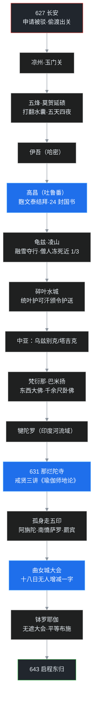

贞观元年，公元 627 年，秋天，长安。

一个二十六岁的僧人向官府递了申请：他要出境，向西，去天竺。申请被驳了回来——当时大唐正和突厥对峙，边境戒严，老百姓不许私自出关。

这个僧人没有死心。他把申请放在一边，趁当年关中歉收、朝廷放百姓沿陆路往甘肃「逐粮」的机会，夹在逃难的饥民队伍里出了长安城。出关是偷渡；等他再次踏上大唐土地，已经是十八年后、名满五印、手持外交国书的人物。

这个僧人俗名陈祎，法名玄奘。后来的神话小说给他配了三个徒弟、一匹白龙马；真实历史里，他只有一个人，一匹老瘦的赤色老马。

上一篇中16 讲的是天台、三论与三阶教——中国人判教、立宗的时代。这一篇往回接上一条线：从三国时朱士行第一次西行，到东晋法显陆去海还，求法运动走到唐代，终于等来了它的最高峰。叶扬把它拆成上下两篇：上篇讲「去」——偷渡、九死一生的西行路、那烂陀寺的留学、走遍五印、曲女城辩经；下篇讲「回」——东归、译场、法相宗和《大唐西域记》。

## 先给小白交个底

- **玄奘不是「奉旨取经」。** 和《西游记》正相反，他是违法偷渡出境的；等他真在印度出了大名，朝廷的态度才一百八十度转弯。
- **他为什么非要去？** 不是为了旅游，是被一个佛学问题逼的：佛性到底是「本有」还是「始有」？国内的经典互相打架，听说中印度那烂陀寺有位戒贤大师能给答案。
- **那烂陀寺是什么地方？** 当时全印度最大的佛教大学，常住一万多人，入学要一门一门考试，佛学和世间学问一起教——相当于古印度的「双一流」。
- **孤身走五印。** 玄奘是中国求法僧里唯一一个把东、南、西、北、中五个印度走遍的人，这也是他后来能写《大唐西域记》的本钱。
- **曲女城大会。** 北印度共主戒日王为他专门办的辩经法会，他把自己的论点挂在会场门外，十八天没人能改一个字，被尊为「大乘天」「解脱天」——这是一个外国留学生在异国能拿到的最高学术荣誉。
- **路线。** 他走的不是传统南线（翻葱岭），而是经高昌、绕凌山、过碎叶水城，拜见西突厥统叶护可汗，再南下今阿富汗、巴基斯坦——几乎绕着中亚走了一个大圈。

## 一、大唐：八宗并立，四教来朝

先看时代底色。

618 年李渊在长安称帝建唐。太宗贞观初年完成全国统一，此后经高宗、武后、中宗、睿宗，直到玄宗天宝年间，大唐维持了一百二十多年的盛世。国威远达中亚——所谓盛唐，强在什么地方？一个直接证据：后来中亚的佛教国家陆续改宗伊斯兰教，转折点正是 751 年怛罗斯之战高仙芝败于大食，唐的势力退出中亚。大唐的进退，决定的是一整片区域千万人的信仰走向。

国威盛、交通便，四面八方的宗教都往长安汇聚。除了佛教之外，至少还有三教：

| 宗教 | 来头 | 今天的物证 |
|---|---|---|
| 祆教 | 波斯琐罗亚斯德教，拜火，三教里来得最早 | 唐墓出土祆教祠遗存 |
| 景教 | 基督教的一支（聂斯托利派） | 西安碑林《大秦景教流行中国碑》 |
| 摩尼教 | 明教的源头，后来在民间反复转生 | 敦煌出土摩尼教残经 |

再加上伊斯兰教（当时称「回教」，因回人信奉得名）。但这些宗教在华的声势，没有一个能与佛教相提并论。佛教在中国，到唐代真正到了巅峰。

巅峰的标志是宗派。唐代新成立六大宗派：法相宗、密宗直接自印度输入；华严、禅、净土、律四宗，是在中国土地上长期酝酿长成的。再加上隋代的天台、三论，合称**隋唐八宗**。八宗里除法相、密宗之外，六宗都带鲜明的中国特色——佛教传入几百年后，中国已经能把它消化、重组，再反向输出到朝鲜、日本、越南和周边游牧地区。各国学僧于是纷纷奔赴长安、洛阳。

玄奘就站在这个时代的入口。有意思的是：唐代佛教这么盛，朝廷偏偏最尊崇道教——因为皇室姓李，自认是老子李耳的后人，再加帝王们普遍迷恋长生丹药。道教在唐代始终压着半个头，后来还因此酿出一次灭佛事件（那是中22 的故事）。但道教始终没能成为事实上的国教：佛教译经的辉煌成绩摆在那里，佛门龙象大德一个接一个，把儒家和道教的人物衬得黯然失色。当时甚至有这样的说法：那些最杰出的头脑，两晋以来都跑去出家了。

玄奘，就是这些头脑里最亮的一个。

## 二、少年陈祎：洛阳净土寺

玄奘生于隋文帝仁寿二年，公元 602 年。另有 600 年出生一说，但已被多数学者推翻。俗姓陈，洛州缑氏人，即今河南偃师一带。

陈家的远祖可以追溯到东汉名士陈寔。陈寔有两个出色的儿子：长子陈纪，字元方；幼子陈谌，字季方。两个儿子都聪慧出众，于是有了那个著名的故事——有人问陈家两兄弟的儿子，你们俩的父亲谁更高明？两个孩子各夸各的爹，争不出结果，闹到祖父陈寔那里，陈寔说：「元方难为兄，季方难为弟。」意思是兄弟俩水平齐平，做哥哥的不容易胜过弟弟，做弟弟的也不容易赶上哥哥。成语**难兄难弟**就出在这里。至于玄奘是元方一支还是季方一支的后人，史料就分不清了。

玄奘的父亲陈惠，曾任江陵令，是位很典型的儒家士人；母亲早逝，老父亲自教这个小儿子读书。玄奘的早慧有个细节：父亲为他讲《孝经》，讲到孔子的弟子曾子避席起立的段落，小玄奘忽然从座位上站了起来。父亲问他做什么，他回答：曾子听老师孔子讲经都要避席（古人表示恭敬的礼节，白话注释：离开坐席站起来），如今父亲亲自为我讲书，我怎么敢安坐不动？

玄奘的俗名「祎」，就是美好的意思。

不幸的是，玄奘十岁时父亲去世。他有个二哥已经出家，法号长捷，住在洛阳净土寺。于是十一岁的玄奘到净土寺，跟着哥哥学习。

这里要交代一个制度背景：隋朝是在北周灭佛之后复兴佛教的，但也亲眼见过北魏、北周僧团膨胀的麻烦——出家人太多，免赋税免徭役，扛不住。所以出家要考试：先做小沙弥，考试合格，政府发给度牒（白话注释：出家的官方许可证，后来还得受具足大戒、领正式戒牒），才算数。这套「出家身份由国家认定」的办法一直延续到后世。

十一岁的玄奘年纪太小，连考场都进不去。他就在考场门外徘徊，不肯走。这孩子相貌堂堂，看起来比实际年纪成熟高大，正好被主考官撞见——当时主理此事的是大理卿郑善果。郑善果见这孩子容貌出众，好奇地问他：几岁了？为什么不进考场？玄奘答：年纪太小，不够资格。郑善果又问：那你为什么想要出家？

一番对答之后，郑善果大为惊奇，破格让他参加考试，并当场录取。身边有人觉得这破坏了规矩，郑善果对同僚们说了一段很有分量的话，大意是：论诵经写字，考好不难；但要找那种将来能继承佛陀法身慧命、扛起佛门家业的人才，太难得了。这个孩子将来一定会成为佛门龙象——只怕我已经活不到那一天。

郑善果果然没有等到那一天。但他的判断，后来一字不差地应验了。

## 三、半个中国：本有与始有之惑

做了小沙弥的玄奘住在净土寺，听当时最流行的两部大论：《涅槃经》和真谛一系传下来的《摄大乘论》。

好景不长，隋末战乱，洛阳待不住了。他和二哥长捷先奔长安，在庄严寺听道基法师说法；可当时长安也很凋敝，兄弟俩又翻越秦岭到了成都——那时蜀中富庶安定。路上跟一位景法师学法，到成都后在空慧寺听讲真谛译的《摄大乘论》和《俱舍论》，系统接触了法相唯识的学问。

二十一岁，玄奘在成都受具足戒（白话注释：出家人的正式大戒，从此成为资格完整的僧人）。

几年后天下安定，玄奘想离开成都。二哥劝他走老路，翻秦岭回长安、洛阳；他不愿意——他想顺长江出三峡，因为听说长江中下游一带有许多大师。于是他一个人沿江而下，此后行脚遍及湖北、湖南、安徽、江苏、河北、河南，再回到长安：沿途只要有大德讲法，没有一场不赶去听，没有一处不跟着一起研究。

这一路他还深研了《成实论》，以及东晋以来大量传译的毗昙（白话注释：佛教早期的系统性哲学论书，阿毗达磨）。这些「杂学」底子，对他日后回国翻译帮助极大。其中有一部书特别让他卡住：真谛译的《**十七地论**》，又名《决定藏论》——它其实是《瑜伽师地论》的一部分，真谛当年没有把全论翻完，只译了局部。

真正把玄奘逼上西行路的，是一个理论死结：

- 当时流行的涅槃学派主张：佛性是**本有**的——众生本来就有佛性，像矿藏，挖不挖它都在。
- 真谛译的《摄大乘论》却讲：佛性是**始有**的——要修行之后才有，是「成佛的可能性」由修行触发，当果（白话注释：将来证得的果位）不是本有的。

本有，还是始有？玄奘把国内能找到的经论都翻遍了，越看越糊涂：经文互相矛盾，老师们各执一词，加上《十七地论》本身是个残本——有些问题，在中国没有人能给他一个自洽的答案。

转机出现在贞观元年（627）。曾经在那烂陀寺跟随戒贤大师学习唯识的天竺僧人**波颇**（全名波罗颇迦罗蜜多罗）来到长安。玄奘赶去向他打听那烂陀寺和戒贤的情况，确认了两件事：那里有全印度最顶尖的唯识大师，能为他抉择法义；那部让他牵肠挂肚的《瑜伽师地论》，全本就在那里。

玄奘就此下定决心：西行求法，自己去源头找答案。

## 四、偷渡：五烽与莫贺延碛

但那年头不是想走就能走的。大唐与突厥战事正紧，严禁百姓出境。玄奘正式申请，被驳回——于是有了本文开头那一幕：贞观元年八月，他混在饥民中离开长安，向甘肃而去。

> 说明一个考据细节：玄奘出发之年，课程取贞观元年（627）说；学界另有贞观三年（629）出发的一派考证。两说各有依据，本文按课程口径叙述。

人到了甘肃，就有人向官府告发玄奘私自出走，通缉文书一路追来。好在沿途河西的佛教徒一路护送，他才走出玉门关——一出玉门关，就是西域。

玉门关外还有五座烽火台，称「五烽」，都有守军。他白天潜伏、夜间赶路，过关时几乎被守军的箭射中。他孤身一人，骑着一匹老瘦赤色老马——真实历史里没有孙悟空，也没有猪八戒。

最险的一关在**莫贺延碛**（今新疆东部的大戈壁，玉门关到伊吾之间八百里沙海）。他失手打翻了水囊，五天四夜没有水喝，几乎渴死在沙中。人到最后已经陷入昏迷，他心里那口气还没散：我发过愿，不到天竺求到正法，绝不回头。就在人马都要倒毙的绝境，那匹老马忽然自己挣扎着跑起来，带着他找到了一汪泉水——人马双双缓了过来。

走出沙海，他先到伊吾（今新疆哈密），再被接到**高昌国**（今新疆吐鲁番一带，高昌故城今天还在）。

## 五、高昌结拜，凌山雪路

高昌王**麴文泰**给了玄奘最大规格的欢迎，但紧接着提了一个让玄奘为难的要求：不让他走了，要把他留在高昌当国师，举国供养。

玄奘以绝食相拒。麴文泰的母亲是汉人，劝儿子不能这样逼迫一位为法忘身的僧人。麴文泰最终松口，但提了三个条件：两人结拜为兄弟；玄奘取经归来，要在高昌住三年，为他讲法；路上一切由高昌安排。玄奘全都答应了。

这一结拜，改变了整个西行路线。

当时西域几十国，加上数不清的绿洲小国，大多依附西突厥的**统叶护可汗**；麴文泰与统叶护私交很好。他建议玄奘别走传统的葱岭南线，而是向北翻越凌山，进入今吉尔吉斯一带，到碎叶水城（今托克马克附近，相传也是李白出生地——这是另一种说法）拜见统叶护可汗：只要拿到可汗一道诏令，沿途各国都要护送，麻烦少得多。

麴文泰派出大队人马，备下厚礼，又写了二十四封国书给沿途各国。玄奘从高昌出发，在龟兹国（今库车，正是中05 罗什的故乡）住了一段时间——天气太冷，雪山封路。负责行程的人估计错了时令，等到开春才去翻凌山，结果赶上融雪。

融雪比下雪还冷。**凌山隘口**，多数学者认为在今新疆乌什西北的别迭里山口（也有不同说法），一行人攀越时冻死、坠亡惨重：随从中的僧人死了将近三分之一，牛马骆驼损失不计其数。玄奘仗着年轻、身体好，硬熬了过来。

下山之后到碎叶水城，拜见统叶护可汗。可汗收到高昌的厚礼和国书，又见玄奘远道而来，十分高兴，当即发布国书，命沿途各国保护。玄奘在护送下穿过中亚——今乌兹别克、哈萨克、塔吉克一带都留下了足迹——再向南翻越兴都库什山，进入今阿富汗境内。

## 六、梵衍那：巴米扬大佛

玄奘在今阿富汗的巴米扬峡谷，看到了让他终生难忘的景象。

当时的**梵衍那国**（巴米扬）佛事极盛，峡谷中遍布僧寺洞窟，绘画雕塑无数。最壮观的是两尊摩崖大佛，一东一西凿立在崖壁上：大佛的脸部构造精巧，用宝石嵌成眼睛嘴唇，夜里仿佛能放光。翻山越岭而来的商旅、僧人，远远望见大佛，没有不匍匐礼拜、感泣不已的。

玄奘还记下峡谷中另有一尊长达千余尺的入涅槃卧佛——千余尺约合三百多米，一个足球场都摆不下。《大唐西域记》里这段记载，后来真的引出了故事：2001 年巴米扬两尊大佛被塔利班政权炸毁后，阿富汗有位教授想把那尊卧佛发掘出来，他的理由是——玄奘不会欺骗我们；当地居民也说，祖祖辈辈相传，黄土之下确有一尊庞大的卧佛。

玄奘翻越兴都库什山时评价过：这里比走沙漠还要苦。而他从巴米扬再往东、向南，就进入了今巴基斯坦的印度河流域——犍陀罗故地。他一路走一路学：印度传统哲学、外道学说、各部派佛学，什么都不放过。

他凭什么能这样学？两个底子：其一，玄奘西行之前梵文已经很好——唐代的长安、洛阳有大量印度高僧可以教佛学梵文，那时在中国学梵文，条件比后世好得多；其二，他本人是不世出的语言天才。日后他在印度能直接用梵文与人辩论而无敌手，靠的就是这两条。

贞观五年，公元 631 年，玄奘抵达中印度王舍城附近，他走了四年的目的地——**那烂陀寺**，终于到了。

## 七、那烂陀寺：万人佛教大学

当时的那烂陀寺，常住僧俗学徒一万多人，是全印度最大的佛教寺院兼最高学府：世间学问、佛教学问，全印度最好的老师都在这里。

进那烂陀不容易。寺院每一道门都设考试，来访者要回答门师的提问，一道一道通过，才能正式入学——很多外来者在头一道门前就被问倒，知难而退。但玄奘还没到，大名已经先传进了寺里：他是被全寺迎接进去的。

寺中住持**戒贤大师**，已经一百多岁，据说一直在等玄奘来。玄奘向他行过礼，却没有立刻留下听课——他先去各处佛教圣地巡礼。在佛陀成道的菩提伽耶，他放声大哭：佛陀成道的时候，我不知道还在哪一道里轮回；如今佛早已灭度，我才来，太迟了。巡礼归来，他才回到那烂陀，正式随戒贤受学。

那烂陀的生活，他后来详细回忆过：

| 项目 | 一般道场 | 玄奘在那烂陀的待遇 |
|---|---|---|
| 日常劳作 | 要做职事：打扫、煮饭 | 全免，专心研究 |
| 日常所行 | 义理与禅修并重 | 无杂务，生活就是读书 |
| 出行 | 步行 | 可乘一头大象（极少数名德才有） |
| 供给 | 普通饮食 | 特殊供给，还有每日若干槟榔——按他自己打趣，是没裹石灰的那种，吃了嘴不红 |

礼遇比照当时的著名老师。而戒贤这位百岁老人为玄奘授课的安排，今天读来仍然动人：

- **《瑜伽师地论》**——玄奘西行最想求的书，全论一百卷——戒贤为他讲了**三遍**；
- 《顺正理论》《显扬圣教论》《对法论》各讲一遍；
- 因明（逻辑学）、声明（语言文字学）、医方明（医学）以及俱舍等论各讲两遍；
- 中观学派的《中论》《百论》各讲三遍。

当时印度最盛行的正是法相唯识学，玄奘在那烂陀专心攻读，以此为专长——但他和鸠摩罗什一样是大通家，大小乘、外道哲学，没有不通的。日后他回国传法相宗，就是以《瑜伽师地论》作为抉择一切佛法的标准。

在戒贤门下学习五年之后，玄奘不满足于只在寺里读书：他要亲自去看整个印度。

## 八、孤身走五印

玄奘从恒河流域出发，开始了中国求法史上前无古人的行程——**周游五印**。

- 向东，他到过今阿萨姆一带（古迦摩缕波，红茶的故乡）。有人考证说他未必真到过，但阿萨姆当地学者坚持他来过——直到今天，那一带的路边、村口还常立着牌子：「玄奘曾经经过这里」「玄奘曾在此过夜」。和一位世界级伟人沾上边，是地方上的光荣。
- 从东海岸折回，沿海南下，他一直走到南印的南憍萨罗，接近印度半岛最南端。他原本打算从那里渡海去师子国（今斯里兰卡），却遇上从师子国逃难来的大批比丘——岛内正打仗。他和逃难比丘讨论佛法，发现对方的水平远不如那烂陀的师友，于是判断：不值得冒这个险，放弃了渡海。
- 向西北，他参访了今天举世闻名的**阿旃陀石窟**：整座石山凿成一连串洞窟，里面满是雕塑、佛塔、佛像、石柱和壁画。这座石窟前后修凿了近九百年（约公元前 2、3 世纪到公元 7 世纪），后来佛教在印度衰亡，它埋没在荒烟蔓草之间，直到 1819 年一个英国军官约翰·史密斯受当地藩王邀请打猎、追老虎时无意中撞见，才重新震动世界。
- 他还到过北方的罽宾（今克什米尔一带）。

但他偏偏错过了两处近在咫尺的名胜。其一是**桑奇大塔**——阿育王时代的佛塔，桑奇不在佛陀一生的活动范围内，佛本人从未来过，是阿育王因护法而在此建塔；塔下还供奉着佛陀两大弟子舍利弗、目犍连的舍利塔（这两位才是佛陀在世时真正的左右助手，阿难随侍是后来传统；大塔舍利在近代被英国人挖走，二战后经印度、斯里兰卡追索归还，现供奉于桑奇）。其二是其他几处阿育王遗迹。桑奇大塔的雕刻精美绝伦、保存极好，可惜玄奘行色匆匆，与之擦肩而过。

玄奘是中国求法僧里**唯一一个走遍五印**的人。其他求法僧大多只奔中印度恒河——佛教发源地——求了经就回；像他这样把整个印度走穿的，只有他一个。这份经历的回报是：归国之后，他有能力写出一部覆盖整个南亚、中亚地理人文的《大唐西域记》。

游学路上还有一段插曲，能看出他在那烂陀的学术地位：寺内中观与唯识两派长期争执，玄奘用中国人擅长的「融贯」思路——异中求同——写了一篇《**会宗论**》调和二家，戒贤读后大为赞叹，全寺师生都没想到一个「支那」来的留学生能这样立论。他还曾辩败一位立誓「输了就自杀」的婆罗门，却告诉对方：中国人辩论只为求真理，没有输了寻死的规矩；你自由了，不必做奴仆。后来再有人挑战，玄奘反过来向这位被他折服、心怀感激的婆罗门请教，再上辩场，又胜。

走遍五印、回到那烂陀之后，真正的大场面来了：北印度的共主——**戒日王**，要召见这位支那僧人。

下面把十九年的路画成一张图——这也是中国求法史上最漫长的一条线：

## 九、曲女城：十八日无人改一字

戒日王是当时北印度的霸主，经他的盛情邀请，由戒贤大师陪同，玄奘前往**曲女城**，参加专为宣扬大乘举办的大法会。

法会上，玄奘把自己用印度因明学（逻辑）精心写成的《**制恶见论**》悬挂在会场门外——公开叫阵：谁能驳倒其中任何一个字，尽可站出来。结果整整**十八天**，到场的各国国王、僧侣、外道，没有一个人能对这篇论文增减一字。

> 术语说明：这篇论的核心比量（白话注释：因明论式，相当于一套严密的逻辑论证），后世称为「真唯识量」；玄奘也因这场法会被大乘徒尊为「大乘天」（Mahāyānadeva），被小乘徒尊为「解脱天」（Mokṣadeva）。「天」是印度语言里对最尊贵者的称号。

这件事的难度，要放在当时的学问风气里才看得出来：印度人做学问最擅长「辩异」——在同中求异，逻辑辨析入微；中国人做学问更擅长「融汇」——异中求同。玄奘作为一个外来者，却用印度人最看家的因明本领，把印度本土最优秀的头脑全驳倒了。这不仅是语言天才，更是思想天才。

戒日王对这位支那僧人的兴趣，还引出一段文化对话。他向玄奘打听「支那」的国情——他知道支那的意思是「思惟、思虑」，那个国家的人长于思虑、创造文物；他把中国称作**摩诃支那**，意即「伟大的文明国」。近代日本有些军阀望文生义，以为「支那」是贬称，完全搞反了；欧阳竟无当年创办佛学院，干脆取名「支那内学院」，取的正是对这个文明国号的敬意。也是因为玄奘的关系，戒日王在他回国之前，就已与大唐建立了外交关系。

## 十、无遮大会与启程东归

曲女城法会之后，戒日王又邀请玄奘参加了另一场盛会：**无遮大会**。

「无遮」的意思是不分贵贱、不分信仰，没有任何阻拦条件——这是一场全民大布施，大会上戒日王把国库积蓄拿出来，向僧侣、婆罗门、外道和穷苦人平等施舍。大会举办地在钵罗耶伽（今印度普拉亚格拉杰一带，旧称阿拉哈巴德，恒河与亚穆纳河交汇处；具体地点据《大唐西域记》，课程里未具名）。曲女城是辩经，钵罗耶伽是布施，是前后两场不同的会，不要混为一谈。

无遮大会之后，玄奘启程东归。时为贞观十七年，公元 643 年，春夏之交。戒日王派了使者、备了国书和礼物，一路护送——他出发时是违法越境的偷渡者，归来时是五印共主背书的国宾。

只是玄奘心里还记着另一桩约定：当年高昌结拜时，他答应过麴文泰，回程在高昌住三年讲法。他不知道的是，此时高昌已经换了人间——麴文泰在大唐兵临高昌的前夕病逝，高昌早已并入大唐版图。这桩约定，注定无法兑现了。

归途不会一帆风顺：过印度河时经书遇险，在于阗又要停下来上表朝廷、等候太宗皇帝的态度——这些是下篇的故事。

## 如果把它放进一个程序员的世界

叶扬说，玄奘这一路，到处是技术世界熟悉的影子。

**① 偷渡＝绕过生产环境的封禁去找 root cause。** 国内的依赖包（经论）版本互相冲突，文档还残缺（《十七地论》是残本），线上问题在本地环境怎么都复现不了根因；申请访问上游主仓库被驳回，于是有人宁可背上合规风险，也要直接去源码作者（戒贤）那里问答案。这种「为了一个 bug 把整条技术栈翻个底朝天」的劲，资深工程师都懂。

**② 那烂陀寺＝开源世界的核心维护者营地。** 入学要过维护者的 gate 审查（一门门考试），进来之后不做杂务、只做研究，高权限的 committer 出门有专门的「大象席位」（commit bit，白话注释：代码库的提交权限）。玄奘在这里不是简单地 clone 代码：他听了三遍核心源码（《瑜伽师地论》），把上下游依赖（中观、因明、医方明）全读了一遍，这才具备了回国独立维护一个发行版（法相宗）的资格。

**③ 曲女城十八日＝一场开放的公开攻防，规则是「零分即胜」。** 把 PoC（验证性论证）挂在会场门口，公开 invite 所有人来打：十八天没有人能提交一个有效的 issue。「大乘天」这个称号，相当于整个国际社区一致通过的 maintainer 认证——而且拿到它的，是一个来自竞争社区的外国人。

**④ 最传神的一条：他为什么坚持走遍五印？** 因为只读核心仓库，写不出可靠的架构文档。玄奘走遍每个「模块」、和各派「维护者」面对面辩论，所以《大唐西域记》不是二手转述，是一张他亲手踩点画出来的全系统拓扑图。文档质量来自路径覆盖——这和做系统排查是一个道理：没走到的地方，你写不出真话。

## 吵架现场：两回合

**第一回合：佛性本有，还是始有？（玄奘西行的引爆点）**

- **本有方（涅槃学派）**：众生佛性本来具足，但凡夫被烦恼盖住看不见；修行做的是「去除遮蔽」，不是「制造新东西」。
- **始有方（真谛《摄论》一系）**：当果不是本有的，佛性是修行之后才现起的可能性；若本来圆满，凡夫与佛凭什么是两种状态？

这一吵，从南朝吵到初唐，吵出了一场西行。有意思的是，玄奘在印度取到的答案并不是简单站队——瑜伽行派讲「五种性」（白话注释：众生的修道资格分五类，有一类「阐提」能否成佛长期有争议），而后期唯识与如来藏思想又各有展开。这个问题的完整结账，要等到下篇法相宗。

**第二回合：中观与唯识，在那烂陀寺内部对垒**

- 寺内中观（讲空）与唯识（讲唯识所现）两派长期论争。
- 玄奘的处理不是加入一方压倒另一方，而是写《会宗论》做会通——戒贤大师这位唯识泰斗看了都认可。
- 但请注意分寸：「会宗」是玄奘个人的调和努力，不代表印度两派从此合一；两派在印度始终各有传承。曲女城大会上他以唯识立场立宗，《制恶见论》护的就是唯识。

## 卡壳角：容易卡住的地方

- **玄奘和《西游记》的唐僧有什么区别？** 几乎处处相反：小说里是奉旨取经、徒弟护送、动辄惊慌落泪；历史上是违法偷渡、孤身匹马、九死一生，辩才和意志都强到在异国论无敌手。唐僧这个文学形象，是把真人的骨头全抽掉了。
- **「五印」到底是哪五印？** 古印度的地理概念，依方位分东、南、西、北、中五部，不是五个国家，而是整个次大陆的五大区域。
- **曲女城和无遮大会是不是一回事？** 不是。曲女城开的是辩经法会，主题是学术论战；钵罗耶伽开的是无遮布施大会，主题是平等施舍。两场会一前一后，常见的混淆是把「无遮」二字安到曲女城头上。
- **玄奘为什么没去成斯里兰卡？** 不是不知道路，是当时岛内有战乱，渡海风险大；他在南印与逃来的岛僧讨论后判断对方学问不过如此，「去了也学不到更多」，于是主动放弃——这是成本核算，不是失败。
- **他到底哪年出发的？** 贞观元年（627）与贞观三年（629）两说并存，课程取元年说。读不同的书遇上不同年份，不必以为是谁写错了。
- **一个容易误读的数字：** 莫贺延碛是「五天四夜」无水，不是五年四月；巴米扬卧佛是「千余尺」（约三百多米），不是一千零几十尺。古数字常带「余」字，表示约数。

## 术语小本本

| 术语 | 一句话解释 |
|---|---|
| 玄奘（602–664） | 俗名陈祎，洛州缑氏人，法相宗创始人，中国最伟大的译经家之一 |
| 长捷法师 | 玄奘二哥，携玄奘在洛阳净土寺学习 |
| 陈惠 | 玄奘之父，曾任江陵令，儒家士人 |
| 陈寔／元方·季方 | 东汉名士与两个儿子，「难兄难弟」典故的来源 |
| 郑善果 | 隋大理卿，主理度僧，破格录取年幼的玄奘 |
| 净土寺 | 洛阳名寺，玄奘少年出家之处 |
| 度牒／戒牒 | 出家僧人的官方许可证；受大戒后另发戒牒 |
| 具足戒 | 出家人的正式大戒，玄奘 21 岁在成都受戒 |
| 空慧寺 | 成都名寺，玄奘在此听《摄论》《俱舍》 |
| 本有／始有 | 佛性本具 vs 修行后始现，初唐佛学最大争论之一 |
| 波颇（波罗颇迦罗蜜多罗） | 天竺僧，曾学于那烂陀戒贤，促成玄奘西行之念 |
| 五烽 | 玉门关外五座烽火台，玄奘偷渡险地 |
| 莫贺延碛 | 玉门关至伊吾间的大戈壁，玄奘失水五天四夜 |
| 伊吾 | 今新疆哈密，玄奘出沙海后第一站 |
| 高昌国／麴文泰 | 今吐鲁番一带的佛国与国王，与玄奘结拜，厚资送西行 |
| 凌山／别迭里山口 | 西行翻越的雪山隘口，融雪夺行，随行僧人冻死近三分之一 |
| 碎叶水城 | 今托克马克附近，玄奘拜见统叶护可汗处；传为李白生地 |
| 统叶护可汗 | 西突厥强盛期可汗，应高昌之请颁令护送玄奘 |
| 梵衍那国 | 今阿富汗巴米扬，东西大佛与千余尺卧佛的所在地 |
| 兴都库什山 | 今阿富汗大山，玄奘称其险过沙漠 |
| 犍陀罗 | 今巴基斯坦印度河流域，佛教艺术重镇 |
| 那烂陀寺 | 中印度万人佛教大学，玄奘留学地，印度佛学最高学府 |
| 戒贤 | 那烂陀寺住持，百余岁，为玄奘三讲《瑜伽师地论》 |
| 瑜伽师地论 | 唯识根本大典，一百卷，玄奘西行所求第一书 |
| 五明 | 古印度五类学问：声明、因明、医方明、工巧明、内明 |
| 五种性 | 瑜伽行派对众生修道资格的五类分法；阐提能否成佛长期有争议 |
| 因明 | 印度逻辑学，玄奘立《制恶见论》的论证工具 |
| 五印 | 古印度依方位分的东、南、西、北、中五大区域 |
| 迦摩缕波 | 今阿萨姆，古东印国度，以红茶闻名 |
| 南憍萨罗 | 南印古国，玄奘此行最南端附近 |
| 师子国 | 今斯里兰卡，玄奘因战乱与学问考量放弃渡海 |
| 阿旃陀石窟 | 南印石窟群，1819 年因英国军官打猎重新发现 |
| 约翰·史密斯 | 1819 年追虎发现阿旃陀石窟的英国军官 |
| 桑奇大塔 | 阿育王时代佛塔，雕刻精美，玄奘错过 |
| 舍利弗／目犍连 | 佛陀两大上首弟子，桑奇曾供其舍利 |
| 会宗论 | 玄奘调和中观、唯识的著作，戒贤所赞 |
| 戒日王 | 北印度共主，为玄奘办曲女城法会，与大唐通交 |
| 曲女城 | 今恒河上游一带，玄奘辩经十八日之地 |
| 制恶见论 | 玄奘曲女城会所悬之论，因明立宗，无人能改一字 |
| 真唯识量 | 《制恶见论》核心比量的后世专称 |
| 大乘天／解脱天 | 曲女城会后大乘、小乘分别尊奉玄奘的称号 |
| 摩诃支那 | 梵语「伟大的文明国」，对中国的美称 |
| 钵罗耶伽 | 两河交汇处，无遮大会举办地 |
| 无遮大会 | 不分贵贱信仰的全民大布施法会 |
| 贞观十七年（643） | 玄奘启程东归之年 |

## 收个尾

一个二十六岁违法出关的偷渡者，一个在沙海里五天四夜没喝上水还不回头的求法者，一个在异国把全印度最聪明的头脑一一辩服、十八天无人能改一字的留学生——玄奘把「求法」这件事做到了人类的极限值。

但上半场再辉煌，也只是铺垫。他西行的真正目的从来不是名声，而是把那几匹骡子驮不动、后来又险些沉入印度河的经卷带回来：六百五十七部梵文经书，二十年译场，一千三百多卷译作，以及一个全新的宗派。下篇中18，讲玄奘东归：归途的惊涛、长安的迎接、译场的制度、法相唯识的完整教理，和那部让他至今仍是世界级历史地理学家的《大唐西域记》。

王玄策后来出使天竺、借兵擒叛臣的传奇，也放在下篇——它恰好和玄奘译经同期，是玄奘身后中印交往的另一个高潮。
