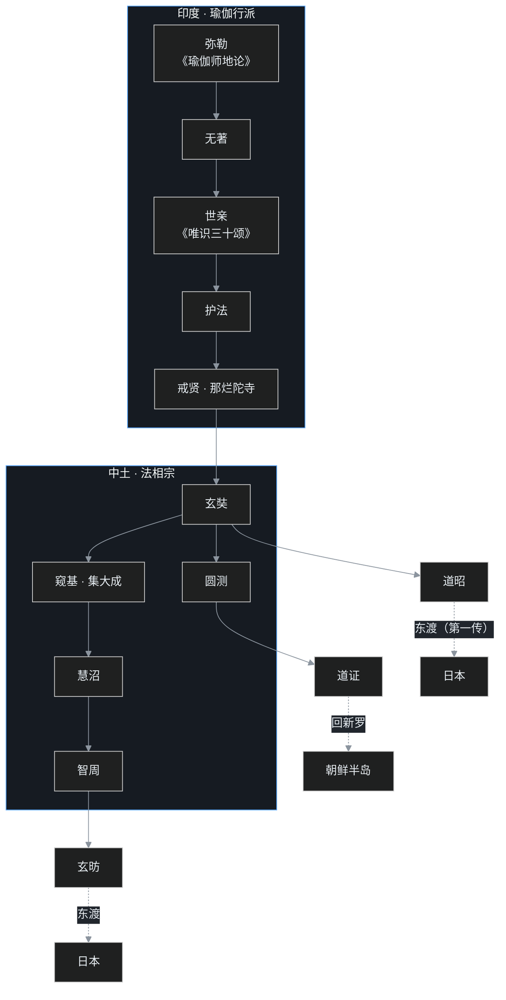

> 这是「中国佛教史」第十八篇。上篇讲到玄奘在曲女城十八日辩经大会上辩倒五印，会后便启程东归。这一篇讲他回到大唐之后的十九年：怎么过葱岭、怎么以国家工程的排场译经、亲手立起的法相宗到底在讲什么，以及那本千年后反过来指导欧洲人挖出佛陀遗址的奇书——《大唐西域记》。

## 小白交底

贞观十九年（645）正月，长安城万人空巷。

百姓挤在朱雀门大街两侧，看一支队伍缓缓入城：走在前面的是二十匹马，驮着佛像、佛舍利和 520 夹梵本经卷——据《大慈恩寺三藏法师传》，玄奘带回的梵本共 520 夹、657 部，正由这二十匹马驮来；队伍正中是一位四十多岁、眉目沉静的僧人。官员维持秩序都维持不住，围观的人太多，当夜想靠近瞻仰的人挤到第二天早上都没散。

这位僧人，就是十七年前从凉州偷渡出关、差点在莫贺延碛渴死的玄奘。

一个当年的「偷渡犯」，怎么会以国家英雄的排场回到长安？更怪的是，回来之后的玄奘既没还俗做官，也没安享供养，而是一头扎进译场，十九年译出七十五部、一千三百多卷经书，顺手立了一个大宗派，还写了一本后来轰动欧洲的书。

这一篇，叶扬就陪读者把这十九年走完。先交底几件事，免得读着迷路：

1. **时间坐标**：贞观十七年（643）春夏之交启程，十八年（644）到于阗，十九年（645）正月进长安。
2. **高昌国没了**：玄奘当年和高昌王麴文泰有约在先，本想回程再走高昌；可等他回来，高昌已被大唐灭掉，旧约作废，只好改走沙漠南道。
3. **译经是国家工程**：玄奘的译场不是几个和尚凑在一起念经，而是皇帝下诏、宰相挂帅、军队把守的封闭机构。
4. **法相宗是「进口货」**：隋唐八宗里，严格说只有两宗不是在中国本土慢慢酝酿出来的——法相宗和密宗，都是直接从印度整箱搬来的。
5. **一本奇书**：《大唐西域记》记了一百三十九国，本来是写给唐太宗看的西域情报，千年后竟成了欧洲人在印度考古的「寻宝图」。

## 一、归途：葱岭、失经与于阗上表

回程不用再绕路。贞观十七年春夏之交，玄奘带着戒日王和各国国王送的经书、佛像，从印度启程，直奔西北。

最难走的还是**葱岭**，就是今天帕米尔高原一带。这里终年结冰，玄奘后来在书里记过一个听来的故事：从前有一支上万人的商旅，赶着无数牛羊骆驼载货过山，遇上狂风暴雪；风雪过后，大地白茫茫一片，整支商队连人带畜全没了。玄奘自己都补了一句：这传说恐怕是夸张了。夸张归夸张，葱岭的凶险是真的——这里山口的风大到什么程度？据玄奘形容，**连鸟都飞不过去，只能贴着地面走路过山**。

翻过葱岭，就到了南疆。

玄奘本想走塔克拉玛干沙漠北边那条路，再到高昌国去见麴文泰——当年他在高昌结拜，约定取经回来必再停留讲法。可走到南疆一打听，坏消息：高昌国没了。

原来麴文泰后来依附西突厥，还联手去打邻近的焉耆，惹恼了唐太宗。贞观十三年（639），唐太宗派大将侯君集、薛万均领兵出征；第二年大军压境，麴文泰忧惧交加，没等唐军攻城就病死了，儿子开城投降。高昌国就此灭亡，王室整族被迁到长安，从此再没复国。玄奘闻讯，只好取消北道行程，改走自己当年没走过的沙漠南道，沿着昆仑山北麓向东。

贞观十八年（644），玄奘抵达**于阗国**，就是今天新疆和田，在这里停下来不走了。

停，是因为两件事都必须办。

第一件是**补经**。归途渡河时有一批经书掉进了水里，受潮受损，得派人分头去补抄，要等。据随行弟子后来记录，渡印度河时船遇风浪、几乎倾覆，五十夹梵本失落受湿，只得沿途派人往诸寺补抄。

第二件更要紧——**他是偷渡出去的**。一个私自越境的人，能不能回国、回去还算不算罪人，必须朝廷先给一句话。玄奘就在于阗写好表文，派人飞驰上奏，把自己十七年西行的经过讲了一遍，末了听候发落。

唐太宗的反应出乎所有人意料：**大喜**。这是有缘故的——在玄奘回国之前，戒日王已经因为玄奘的关系，和大唐互派使节、建立了外交关系。唐太宗早就知道印度那边有这么一位大唐僧人，风头出尽。表文一到，唐太宗立刻下诏：命南疆沿途各国派人护送，哪国国王做前导、哪国在后面护送，安排得明明白白；又特命宰相房玄龄总负责，在长安安排迎接事宜。

这才有了贞观十九年正月，长安万人空巷的那一幕。离开十七年的玄奘，终于带着他要的东西回来了。

## 二、还俗做宰相？十九年译场与玉华宫的晚年

玄奘进京之后没歇几天，就东赴洛阳去见唐太宗——当时唐太宗正准备亲征高句丽。

君臣一见面，唐太宗越看玄奘越喜欢，后来对人说：玄奘的仪表、谈吐、学问，就是朝里那帮出色的大臣，也没几个比得上。唐太宗索性劝他还俗入朝、来做宰相。

玄奘一口谢绝。他对唐太宗只有一个请求：**请朝廷用国家的力量护持自己译经**。玄奘原本还提了个地点——希望去家乡附近的少林寺，因为少林寺从北魏时起就有译经的传统。唐太宗没答应：太远了，要译就在京师译，环境舒适，诸事方便，仍叫房玄龄经办。

于是玄奘先在长安**弘福寺**开译，后来移到**大慈恩寺**，其间一度居于**西明寺**。大慈恩寺是皇太子李治（就是后来的唐高宗）为追念母后长孙皇后所建的道场。玄奘在寺里亲自设计、监工，建起一座塔——**大雁塔**，专门用来收藏译好的梵本经书和佛舍利，等于一座皇家经库。唐代大慈恩寺的建筑今天早已不存，可这座塔历经一千三百多年，还立在西安城里。

玄奘的晚年，是在远离长安的**玉华宫**度过的。这背后有一层政治暗流。

唐太宗去世后，唐高宗和武则天想从一帮元老功臣手里把权夺回来——这里头就有唐高宗的亲舅舅、权臣长孙无忌——朝堂上开始了激烈的清算。玄奘是唐太宗一手护持的人，也一直受这帮元老功臣护持，位置就变得微妙：新帝和武后对玄奘不能不有所提防。玄奘何等清醒，主动上表，请求离开长安，到远在坊州（今陕西铜川一带）的皇室夏宫玉华宫去译经，躲开漩涡。

显庆四年（659），玄奘移居玉华宫，在这里译完了最大的一部经——《大般若经》六百卷，龙朔三年（663）十月正式搁笔。据传记记载，后来玄奘在宫里过一条小水沟时不慎跌倒，伤到腿胫，从此一病不起，麟德元年（664）二月在玉华宫圆寂。生年多取公元 602 年说（亦有 600 年说），世寿六十多岁。

十九年，七十五部，一千三百三十五卷。这是个什么概念，下面细说。

## 三、封闭的「小译场」：国家级翻译工程

玄奘当年回国，是轰动全国的大新闻。王公贵族谁都想登门见一面，译场门口天天挤满人。

玄奘做了一件罗什没做过的事：**请朝廷派兵把守译场**。当年鸠摩罗什在长安开的是「大译场」，谁都可以进来听讲观摩，人来人往。玄奘考虑到自己带回的梵本太多、译事太重，耗不起这个热闹，就反其道而行之，组「**小译场**」：只许和译经直接相关的人员进入，译场四周军队把守，闲杂人等一律挡驾。

这个译场的配置，是按国家级工程搭的：皇帝下诏、宰相总持，从全国征召各方面的拔尖人物——精通经、律、论三藏的，精通禅修的，还有懂数学、声韵学的，文学高材，统统召来，分工协作。玄奘自己则是最苦的那个：白天译经之外，每天还把午饭后和黄昏的时间抽出来，为各州郡选送来的优秀青年比丘讲学。一边译，一边弘，十九年没断。

译出来的东西，分量吓人。挑最重要的看：

- **《大般若经》六百卷**——般若类经典的总集，最大的一部；
- **《瑜伽师地论》一百卷**——唯识学根本大典；
- **《大毗婆沙论》二百卷**——说一切有部的百科全书式巨著；
- **《成唯识论》十卷**——法相宗的核心论书；
- 此外还有《俱舍论》《解深密经》《摄大乘论》《显扬圣教论》《顺正理论》《异部宗轮论》等等，唯识、有部、般若、俱舍，条条线都补齐了。

现代人翻译一部梵文典籍都叫苦连天，很难想象一个人怎么能在十九年里译出这么多。说玄奘在翻译上的成就空前绝后，并不算夸张。

## 四、一个奇怪现象：译了那么多，为什么流行的只有《心经》

可这里有个怪现象，得替读者点破。

玄奘译经数量远超罗什，遍及各宗派，但在佛教徒日常诵读里，除了短短一部《心经》之外，他的译本流传之广，远远比不上罗什。直到今天，大家念的《金刚经》《法华经》《阿弥陀经》，主流用的还是罗什的本子。

这不是水平问题，是**翻译策略**不同。

玄奘的原则是**忠于原本、不做增减，走直译一路**。他本人梵文、汉文都精通，从开译到最后校订，一律严格要求贴着原文走，不许添油加醋。这样译出来的东西，准确是真准确，可文笔就不可能像意译那样流畅好读。

罗什正相反。罗什虽然精通梵文，汉文却不能自己执笔，译文的中文文笔怎么处理，实际是由身边那批协助译经的弟子定的——这批人不懂梵文，但个个是文章高手，自然就走意译、求典雅的路子，译出来朗朗上口，自然大受欢迎。

一个是「信」字当头，一个是「达、雅」为先，这就造成了千年的分野。

但直译有直译的长远价值。玄奘译书数量大、覆盖宗派全，尤其译了大量有部论书——有部有「一身六足」七部根本论典，玄奘一个人就译了其中六部。后来印顺法师在佛学批判考据上的成就，很大程度上就得力于这批译本。欧洲学者原来只靠巴利文、梵文做研究，读不了汉文；而汉译佛典保存的范围恰恰最广，经藏、论藏都远比巴利三藏、藏文三藏齐全，印度本土的梵文经典反倒存世极少。近些年不少欧洲学者的著作译成中文，都在感叹：可惜读不了汉文，大批汉文资料用不上。随着中国文化重新受到重视，汉译佛典的学术地位越来越高——从这个角度看，玄奘那套不讨好的直译，反而具有最长久的生命力。

## 五、法相宗：八宗里的「直接进口货」

讲完译经，来讲玄奘亲手立的宗派。

隋唐共有八宗。严格说起来，八宗里有两宗不算「中国酝酿」——法相宗和密宗，都是直接从印度整套输入的；其余六宗，是佛教在中国经过长期消化、演化才长出来的。

唐代较早建立的大宗派之一，就是玄奘从印度直接带回的**法相宗**。它讲万法唯识，所以又叫**唯识宗**；玄奘和弟子窥基都长期住持大慈恩寺，所以又称**慈恩宗**。三个名字，一个宗派。

它的学说，上承印度的**瑜伽行学派**。法脉的传承是这样一条线：

**弥勒 → 无著 → 世亲 → 护法 → 戒贤 → 玄奘 → 窥基**

这里的弥勒，很多人以为就是兜率天的弥勒菩萨；学者们多认为，历史上的弥勒其实是一位印度比丘，传下《瑜伽师地论》——「瑜伽师」就是禅师，这部书就是与禅修相应的论典。无著从弥勒受学，再传给弟弟（也是弟子）世亲，世亲造《唯识三十颂》；世亲的弟子护法为三十颂作注；护法传戒贤，戒贤在那烂陀寺传玄奘。

玄奘回国，传给弟子**窥基**，窥基是集大成的人物，再传慧沼，慧沼传智周。智周的日本弟子玄昉等把法相宗带到日本；其实更早，日本僧人道昭入唐从玄奘受学，已经传回第一波，法相宗在日本延续了很久。

玄奘门下还有一位特别的弟子——**圆测**。圆测是新罗（朝鲜半岛）皇室出身，自幼出家，很小的时候就来到中国，武则天很赏识，不放他回国。圆测这一系后来传给弟子道证，道证回新罗，又把法相宗传到了朝鲜半岛。

玄奘弟子极多，名家辈出：普光、法宝、神泰都有关于《俱舍论》的专著；窥基著述尤其宏富，有「百本疏主」之称。可正因为法相宗太深奥，真正学得进去的人，始终不多。

一条法脉，从印度的禅师一直延伸到日本和新罗，全景是这样的：

## 六、法相宗在讲什么：百法、三性、转识成智

这一节是硬骨头，叶扬尽量说人话。

法相宗的宗名，来自《解深密经》的「法相品」。所谓「法相」，「法」指万法的体性，「相」指万法的状貌。万法多得数不清，整理归并为**一百法**（一百个大类）；万象森罗，从认识的深浅看，略归为**三性**。

三性，其实就是众生认识世界的三个层次：

1. **遍计所执性**：我们日常所以为的那个外在世界——房子、车子、各色东西——其实都是众生用妄情分别、死死执着出来的，是「自以为真」的一层；
2. **依他起性**：透过理解，能看出万法都是仗因托缘、依他而起的，没有独立不变的东西；
3. **圆成实性**：修行圆满后成就的真实性，就是空性。

那「唯识」又是什么？「识」是一种分别、认识的作用：眼根对色尘，产生眼识，我们才分得出红黄蓝绿、看到房子车子；耳根对声尘，产生耳识，我们才听得出各种声音。法相宗以**阿赖耶缘起**为根本理论：阿赖耶识里含藏着各式各样的种子，由种子缘起一切现象；所谓心外之物，都是虚妄不实的。

注意，法相宗既没有像真谛那样另立一个清净的「第九识」，也没有像如来藏思想那样立一个自性清净心。它说修行，不绕弯子：**转染污为清净**，具体就是「**转识成智**」。识一分别，人就容易在里头起贪心、起染着、去追逐、造种种业；修行不是把识灭掉（也灭不掉），而是不跟着识跑，把识转成智慧。八识于是转为四种智慧：

| 转 | 成 |
|---|---|
| 前五识 | 成所作智 |
| 第六识（意识） | 妙观察智 |
| 第七识（末那识） | 平等性智 |
| 第八识（阿赖耶识） | 大圆镜智 |

修行的阶位，则分成五位，像五级台阶：

1. **资粮位**：广修福德、积聚资本，好比出远门前先备足干粮盘缠；
2. **加行位**：在此基础上修止、修观；
3. **通达位**：破除「见惑」——也就是见解、认知层面的根本烦恼，相当于声闻乘的初果（预流果）；
4. **修习位**：继续断另一类「思惑」——情绪、习性上的烦恼，要靠长期实修一点点磨掉，相当于声闻从二果（一来果）往上、直到断尽三界修惑；
5. **究竟位**：功德圆满，即佛位。

最后还有一条，是法相宗后来在中华「水土不服」的关键——**五种种姓说**。玄奘沿用印度瑜伽行派的讲法，认为众生的根基（种姓）不同，共有五类：

1. **声闻种姓**：只能证声闻果；
2. **缘觉种姓**：可以无师自悟、证缘觉果；
3. **菩萨种姓**：走菩萨道，终能成佛；
4. **不定种姓**：往哪边走还不一定，要看机缘；
5. **无种姓**（无性有情）：仍可修世间善法、得人天果报，唯毕竟不能入涅槃、成佛。

在玄奘的体系里，「佛性」就是成佛的可能性、成佛的因缘；而确实有一类众生，不具备这种因缘。

## 七、一本写给皇帝的书，千年后成了欧洲人的寻宝图

玄奘译经之忙，没多少余力写书，但有一本书非写不可——《**大唐西域记**》。

起因是唐太宗反复问他西域各国的情形；再加上中国西行求法的僧人向来有记录行程的传统。玄奘就把自己掌握的全部资料、文献交给弟子，由才华出众的弟子**辩机**执笔整理（辩机后来因事被诛，这是后话），于贞观二十年（646）成书，共十二卷。

这本书记录了玄奘西行亲见亲闻的一百三十九个「国家」（含城邦、地区）：其中近一百一十个是亲身走过的，其余则是传闻所及、并未亲到——比如波斯、比如师子洲（斯里兰卡）。地理范围覆盖今天南亚的巴基斯坦、印度、尼泊尔、孟加拉、斯里兰卡，以及阿富汗、伊朗和中亚（哈萨克、吉尔吉斯、塔吉克、土库曼、乌兹别克），还有中国南疆（于阗、库车、叶城、阿克苏、高昌等）。书里对七世纪上半叶这些地方的疆域、地理、历史、历法、族群、文字、礼仪、饮食、宗教，记得极为详尽。

它真正大放异彩，是在一千多年后的十九世纪。

英国人统治印度之后，对印度本土宗教产生了兴趣，但起初认为佛陀不是历史人物，不过是印度教众神之一；而当时同样受英国影响的斯里兰卡、缅甸佛教徒坚持：佛陀是真人。怎么证明？《大唐西域记》里白纸黑字记着玄奘巡礼过的每一处佛陀圣迹。于是英国考古学者拿着《大唐西域记》、再参考法显的《佛国记》，按图索骥地发掘——**真把佛陀故乡迦毗罗卫遗址和佛舍利挖了出来**：据记载，出土的是两个小罐子，上面用非常古老的印度文字写着，这是释迦族供奉的伟大佛陀的舍利。后来印度方面继续发掘，又出土一批佛陀遗骨舍利，今天供养在新德里博物馆。鹿野苑等圣地的重现，同样得力于这本书的记载。

佛舍利出土，佛陀是真人、是解脱者，而不是印度教的神——英国佛教研究的方向就此扭转。据说英国学者研究之余还惊讶地发现一件事：**这个宗教的历史上，为什么几乎没有宗教战争？** 这让不少西方人对佛陀更生敬意。最早一批皈信佛教、并前往斯里兰卡出家的德籍人士中，有数位是避祸远走的犹太裔德国人——这些东西方的奇妙倒流，追根溯源，都有这本书的影子。

一本本来为回答皇帝咨询而写的行纪，千年后竟成了重光佛教圣迹、接引佛法入欧洲的钥匙——这恐怕是玄奘、辩机当年想都想不到的。

## 八、插曲：王玄策一人灭一国

这里插一段和玄奘同时代、同样惊心动魄的外交传奇。

玄奘回国后，大唐派了一个使节团出使中天竺的曲女城。等使节团到了，戒日王已经过世，国中一个大臣叛变自立，还发兵把大唐使节团扣押起来——不过也不敢真下杀手。这位使节团的正使，叫**王玄策**。

王玄策想办法逃了出来。一般人逃出来，第一反应是往东逃回大唐搬兵；王玄策没走这条路——太远，来不及。他往北直奔**泥婆罗**（尼泊尔）求援，又从泥婆罗发信到**吐蕃**请兵。当时文成公主已嫁与吐蕃赞普松赞干布（唐代史书称弃宗弄赞），两家都和大唐交好，于是吐蕃、泥婆罗都派出军队。王玄策就率领这支借来的联军，掉头南下，直扑曲女城，一战击溃叛军，活捉叛臣，押回长安献俘。

一个大使，靠外交斡旋、就近借兵，在万里之外把一个覆灭友邦秩序的叛乱者生擒回国——这在中国外交史、乃至世界外交史上，都是极令人惊叹的一笔。王玄策还曾到佛陀成道的菩提伽耶巡礼，并在那里立碑；直到宋代，有中国僧人到菩提伽耶，还亲眼见过王玄策所立的碑文。

## 九、大宗派为什么说没就没：法相宗的衰与复兴

说回法相宗。玄奘在世时，历太宗、高宗两朝，都受皇室和大批大臣尊崇，法相宗的势力一度极为显赫，显赫到教内别的派系都侧目。可这么一个声势浩大的宗派，为什么在玄奘圆寂后没多久，就从中国佛教舞台上淡出了？

课程里总结了四条原因：

1. **太繁琐**。体系庞大、名相细密，不是知识分子根本登不了堂奥，自然没法被一般佛教徒接受——它是一套庞大而繁琐的高级哲学，门槛太高；
2. **倡因明**。玄奘大力提倡因明（印度的逻辑学、知识论），用因明来弘法；可中国人向来不喜欢、也不擅长这一路。中国自己的逻辑学传统在先秦名家，代表是惠施、公孙龙。《庄子·秋水》里那段著名的「濠梁之辩」——惠施追问「子非鱼，安知鱼之乐」，庄子答「子非我，安知我不知鱼之乐」，最后庄子用「我知之濠上也」收尾——严格讲，庄子是有点不合逻辑的，可后人读这个故事，几乎都站庄子。一个不欣赏形式逻辑的文化，碰上用逻辑层层推演的唯识，只觉得更繁琐、更头疼；
3. **五种姓说撞车**。「无种姓者不能成佛」，这和中国人的传统正好对立。中国人信的是孟子的性善说，认同「人皆可以为尧舜」；在佛教里，对应的就是竺道生以来「一阐提也能成佛」、众生本具佛性的传统（见[中08](/post/81.html)）。玄奘把「有人天生不能成佛」带进来，等于直接挑战主流，当然吃不开；
4. **没有方便法门**。法相宗不像净土宗有念佛、禅宗有顿悟那样极其简易、能接引广大普通信众的入手方法。少了这层「群众接口」，再深的哲学也只能停在小圈子里。

于是安史之乱（755 年起）以后，法相宗一步步衰退；到唐武宗会昌灭佛（842—845），典籍散佚，这一宗在中国本土近乎断绝，只在日本和朝鲜继续传承。

直到近代，因为西方和日本对唯识学的研究，加上杨文会创办金陵刻经处、欧阳竟无主持支那内学院一系的大力重振，唯识学才在华人世界重新复兴——一门冷了千年的学问，到底靠它的真价值活了回来。

## 程序员类比

读到这里，叶扬把这一篇的门道，翻译成几个程序员一看就懂的画面。

- **「直接进口」vs「本土迭代」**：法相宗、密宗是照搬上游的开源框架，原样集成进中华这套系统；其余六宗，是佛教传入后在本地代码库里被一代代工程师长期改造、演化出来的模块。直接搬来的框架再先进，只要和本地调用习惯不兼容，就推不广——法相宗的遭遇就是例子。
- **转识成智＝换 handler，不是删数据源**：八识这套事件流没法删（感官永远在接收信号），修行做的事是把原来的处理逻辑换掉——旧逻辑一接到事件就触发贪爱、追逐这些副作用；换成「智」之后，同一份事件流变成只读、可观测的镜像（大圆镜智，顾名思义，镜子照物而不留痕迹）。数据源一个没动，副作用全消。
- **五位修行＝上生产环境的五个阶段**：资粮位是立项批预算、备齐人力资源；加行位是搭测试环境、跑通 CI；通达位是第一次全链路打通，把架构层面的系统性误解（见惑）一次清空，相当于初果上线；修习位是反复修剩下的散点 bug（思惑），按模块一个个磨；究竟位才是正式全量发布、佛位收工。
- **五种姓说＝一个合不进来的严格类型系统**：玄奘带回的类型定义是「并非所有实例都实现了 Buddha 接口」（无种姓＝压根没这个接口）；而中国文化的默认类型是「众生皆有佛性」，人人自带该接口。两套类型定义不兼容，这个 PR 再精密也 merge 不进主干——后来被主干长期关闭。
- **直译／意译＝两种本地化（i18n）策略**：玄奘走「信」字优先的逐字直译，适合作为和原文对照的学术底本，学习成本高；罗什团队走「达、雅」优先的意译，为目标语言的可读性做了重写，用户体验顺滑，传播自然更广。要准确还是要好读，这个权衡软件工程里天天在做。
- **《大唐西域记》＝一份千年后才兑现价值的外部接口文档**：写作时只是内部备查的系统对接地图，谁知主系统（古印度诸城邦）下线后，文档成了唯一能复原现场的依据，后人照文档把一个个已下线的服务定位、发掘、重建。文档写得详尽，时间会奖励它。
- **王玄策借兵＝就近跨可用区应急**：线上出事（戒日王死后中天竺大乱），回总部求援往返太久，大使直接在周边可用区（吐蕃、泥婆罗）协调现成资源拉起队伍恢复现场，把肇事进程（叛臣）kill 掉后带回总部处置。预案的关键，是平时就把跨区的协作关系建好。
- **军队把守的小译场＝封闭构建环境**：只有有权限的构建节点才能进入，闲人一律挡驾，既保证构建不被打扰，也杜绝源码（梵本）外泄风险——一个 air-gapped 的皇家 CI 机房。

## 吵架现场

这一篇里有两场「架」，吵了上千年。

**第一回合：圆测到底有没有得到「真传」？**

中国佛教界一直流传一个不太厚道的说法：因为圆测是新罗人、是「外国人」，玄奘便不肯把真正的学问传给他；后世更编出圆测买通门人、多次躲在暗处「偷听」窥基独受的讲解，抢先开讲之类的故事。

课程里明确替圆测辩诬：玄奘自己西行印度，受过多少异国师长的悉心栽培，何至于心胸狭隘到搞地域歧视？真正的分歧根本在学问路线上——圆测深受南朝真谛一系旧译唯识的影响（真谛在八识之外另立清净的第九识），和玄奘新传（只立八识；第八阿赖耶识为杂染诸法所依，其体性是无覆无记，不另立第九识）本来就有差异。弟子择其所好而从，和国籍、和师父藏私都不相干。

**第二回合：「无种姓不能成佛」vs「一阐提也能成佛」**

[中08](/post/81.html) 讲过，东晋竺道生因为孤明先发、唱「一阐提人皆得成佛」，被当时僧团摒出建康；后来四十卷《大涅槃经》译出，果然照道生所说，一朝翻案。到了这一篇，玄奘从印度带回的五种姓说，却白纸黑字写着有一类「无性有情」断无成佛之分。这不是当面打架吗？

表面是矛盾，底下是**两套不同的体系**：五种姓说属于印度瑜伽行派的严格判教，谈的是众生现实的根基差异；「一阐提皆得成佛」属于涅槃、如来藏一系，谈的是一切众生本具的佛性（从最究竟处看，一阐提的佛性也不曾减损）。两派在印度就并行存在。而中国人用脚投票，显然更受用后者——性善、本具、终能成佛，这套讲法才合这片土地的性情。法相宗的式微，在这场「架」开吵时就已注定。

## 卡壳角

最后，替读者把读这一篇最容易卡住的地方，一次性扫清。

1. **玄奘来回到底走了多少年？**　按课程口径，贞观初年（公元 627 年前后）从长安出发，贞观十九年（645）正月回来，往返十七年。
2. **高昌国怎么不等他回来？**　贞观十三年（639）唐廷出兵，十四年（640）侯君集大军压境，麴文泰忧惧先死，高昌灭亡。玄奘到南疆才知道，只好改走南道。
3. **大雁塔是《西游记》里说的那回事吗？**　历史上大雁塔是玄奘亲自设计监工、为安置梵本和舍利而建的「经库塔」，永徽三年（652）落成；今天看到的七层塔身，是后世陆续改建、明代包砖后的样子。
4. **玄奘译经数量碾压，庙里常念的为什么还是罗什本？**　玄奘直译求准、文笔偏硬，罗什意译求顺、朗朗上口；日常诵读选好读的，学术考据用准确的，各占一边。
5. **法相宗为什么有三个名字？**　「法相」是它所宗的经品，「唯识」是它所讲的道理，「慈恩」是玄奘师徒住持的寺院——法相宗、唯识宗、慈恩宗，一宗三名。
6. **无种姓说和「一阐提成佛」不是自相矛盾吗？**　不矛盾，是瑜伽行派和涅槃／如来藏系两个体系各说各话；中国人取后者，这也是法相宗衰落的原因之一。

## 术语表

| 术语 | 一句话解释 |
|---|---|
| 法相宗／唯识宗／慈恩宗 | 玄奘所立宗派，讲万法唯识；因所宗经品、所讲道理、所住寺院而有三名 |
| 瑜伽行派 | 法相宗在印度的源头，因强调瑜伽修行、讲唯识而得名 |
| 弥勒（历史人物） | 学者多认为是一位印度比丘，传下《瑜伽师地论》，非仅指弥勒菩萨 |
| 《瑜伽师地论》 | 弥勒所传、一百卷，唯识学根本大典；「瑜伽师」即禅师 |
| 唯识三十颂 | 世亲造，用三十个偈颂概述唯识要义 |
| 《成唯识论》 | 玄奘以护法注释为主、糅合十家解说译成的十卷论书，法相宗核心经典 |
| 护法、戒贤 | 世亲→护法→戒贤→玄奘，那烂陀寺一系的相承祖师 |
| 窥基 | 玄奘弟子，法相宗集大成者，著作宏富，号「百本疏主」 |
| 慧沼、智周 | 窥基→慧沼→智周，法相宗本土相承的第二、三代 |
| 圆测 | 新罗皇室出身的玄奘弟子，受真谛旧学影响，其学后传朝鲜 |
| 八识 | 眼、耳、鼻、舌、身、意、末那、阿赖耶共八识 |
| 阿赖耶识 | 第八识，含藏一切种子，为万法缘起的根本 |
| 种子 | 阿赖耶识中能生起现行的功能，如植物种子 |
| 阿赖耶缘起 | 法相宗核心理论：万法皆由阿赖耶识中的种子缘起 |
| 百法 | 法相宗把一切法归并为一百个大类 |
| 遍计所执性 | 三性之一：众生妄情分别、执以为实的世界 |
| 依他起性 | 三性之二：万法仗因托缘、依他而起 |
| 圆成实性 | 三性之三：圆满成就的真实性，即空性 |
| 转识成智 | 修行纲领：不随识转，把染污的八识转为清净的四种智慧 |
| 四智 | 成所作智、妙观察智、平等性智、大圆镜智，由前五、六、七、八识依次转成 |
| 五位修行 | 资粮位、加行位、通达位、修习位、究竟位 |
| 见惑／思惑 | 见解认知上的根本烦恼／情绪习性上的烦恼，分于通达、修习两位断除 |
| 五种种姓 | 声闻、缘觉、菩萨、不定、无种姓五类根基；无种姓者无成佛可能 |
| 因明 | 印度的逻辑学、知识论，玄奘大力提倡，却不合中国人脾胃 |
| 第九识（阿摩罗识） | 真谛所立清净识，在八识之外，与玄奘只立八识不同 |
| 一身六足 | 有部七部根本论典；玄奘独译其六 |
| 《大般若经》 | 六百卷，般若类总集，玄奘在玉华宫译成的最大经典 |
| 《大毗婆沙论》 | 二百卷，有部百科全书式巨著 |
| 《大唐西域记》 | 玄奘口述、辩机执笔，十二卷，记一百三十九国，史地名著 |
| 辩机 | 玄奘弟子，《大唐西域记》主要执笔者 |
| 王玄策 | 唐初使臣，借吐蕃、泥婆罗兵平定中天竺叛乱，生擒叛臣 |
| 弘福寺／大慈恩寺／西明寺／玉华宫 | 玄奘先后译经的主要地点 |
| 大雁塔 | 玄奘设计监造，专为安置梵本、舍利，永徽三年落成，今在西安 |

---

玄奘这两笔账——十九年译经、一本书照亮千年考古——到此结清。法相宗虽然在中华本土几起几落，唯识学的理性光芒终究没有熄灭。

同期的大唐，向西求法的脚步并未停止。下一篇，叶扬要讲另一位稍晚于玄奘、走海路往返、在印度求学二十五年的高僧——**义净**，以及唐代其他译经僧与经录、僧史的编纂。一个时代的译经事业，在他那里又翻开新的一页。
