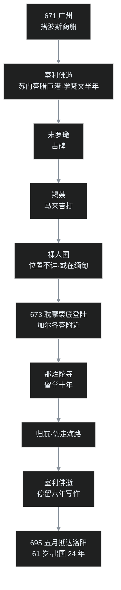

## 小白交底

先把这一篇要聊的家底摊开：

1. **主角是义净**（635—713）。玄奘圆寂之后，大唐最伟大的求法僧人便是义净。和法显、玄奘走陆地不同，义净来回全程走**海路**，从广州搭波斯商船，绕了一大圈。
2. 义净在国外待了 **24 年**，光在那烂陀寺就留学**十年**；回国时 61 岁，武则天亲自出城迎接。
3. 回国后义净译了 **56 部、230 卷**，其中分量最重的是一套**根本说一切有部的律**（11 部、159 卷），还顺手写下两部名著：《**南海寄归内法传**》和《**大唐西域求法高僧传**》。
4. 唐代不止义净一个译经高手：于阗来的**实叉难陀**译出了 80 卷《华严经》，南印度传来的 40 卷《华严经》也在贞元年间译出。
5. 译经太多，就得有人做**目录**和**僧史**：道宣、智昇、圆照三代编目录；道宣还写了《续高僧传》。最后一个话题是**疑伪经**——哪些经可能是中国人自己造的，这事从东晋道安就开始查了。

## 一、37 岁才上船：一个迟来的梦想

义净生于唐太宗贞观九年（635），俗姓张，籍贯有山东、河北两种说法，今天已经难以论定。义净从小就出了家，15 岁那年，听人讲起法显、玄奘西行求法的故事，心里那颗种子就此埋下。

这里可以品一下时间线：玄奘偷渡出发是 627 年，那时义净还没出生；645 年玄奘满载而归、长安城万人空巷，义净 10 岁。义净仰望的两位偶像，一位是两百多年前的法显，一位是正当红的玄奘。20 岁受了比丘的具足戒之后，这个志向不但没消，反而越来越坚定。

一直等到唐高宗咸亨二年（671），义净 37 岁，才真正成行。义净从北方一路到了广州，在广州地方官府的帮助下，搭上了一艘波斯商船——船主和船员多是波斯人，走的是当时最繁忙的南海贸易航线。

有个对比值得记一笔：玄奘当年西行是**混在饥民里偷渡**的，朝廷一路追捕，差点死在戈壁；义净西行则有**官府一路相助**，堂堂正正登船。半个世纪之间，大唐对求法这件事的态度已经天翻地覆。不过官府能帮的只是送义净上船，海上的风浪、语言、疾病和盗贼，一样都得义净自己扛。

## 二、室利佛逝：海上的梵文预备学校

商船南下的第一站，是**室利佛逝**（Srivijaya），在今天印度尼西亚苏门答腊岛的巨港一带。

这个地方在当时了不得：它扼守马六甲海峡的咽喉，是南海贸易的总枢纽；王室信奉佛教，供养僧人，国中住着大批来自印度的僧侣，梵文是这里宗教生活的通用语言。义净一到，就决定停下来——一停就是**半年**，专心学梵文。

为什么不去印度再学？因为室利佛逝既有纯正的梵文环境，又是海路的天然中转：食宿、僧人、经本都现成，生活压力比直接闯进印度小得多。这就好比今天有人想进海外名校，先在一个文化接近、成本低廉的地区读半年语言班，把底子垫好再过去。

室利佛逝的国王对这位大唐来的僧人十分敬重，半年后专门派出一艘船，送义净一行前往印度。

## 三、末罗瑜、羯荼、裸人国：南海三站

从室利佛逝往印度，沿途要经过几个国家，义净都记下了：

- **末罗瑜**：在今天苏门答腊岛的占碑一带，是海峡中段的另一个贸易小国；
- **羯荼**：在今天马来西亚的吉打一带。现代考古在吉打出土过佛教文物，马来西亚佛教界据此认为，这里曾是佛法兴盛之地，与义净的记载可以互证；
- **裸人国**：位置已不可确考。义净记了一条线索：从这个国家的另一边可以通向中国的四川，所以有人推测它可能在今天缅甸一带；后世也有学者据航程位置，把裸人国比定为印度洋上的尼科巴群岛，两说尚无定论。国中居民不穿衣服，商人来了，拿芭蕉、椰子这类物产交换铁器和货物；商人们有时故意拿出衣服开玩笑，对方就会惊逃。这个国家的人善射毒箭，但只要肯与其交易，给什么都高兴，买卖倒还公平。

咸亨四年（673），义净在印度东海岸的**耽摩栗底**（Tamralipti，在今天加尔各答附近）登陆。这一路的航程，走了将近两年。

## 四、登陆即遇险：山贼、烂泥与夜行

在耽摩栗底，义净遇到了一位故人——**大乘灯禅师**，一位早就来到印度的中国僧人，是玄奘的弟子。

玄奘的门下有个有趣的现象：几位得意弟子的名字前面常冠着「大乘」二字。比如**大乘光**就是普光，**大乘基**就是窥基，加上这位大乘灯。有人推测，这与玄奘在印度被尊为「大乘天」的封号有关，弟子们便以「大乘」为号，算是师门的一枚徽章。

义净随大乘灯和一支数百人的商队一起，向中印度的恒河流域进发。走到半路，义净生了病，落在了队伍后面，还撞上了山贼，随身衣物被剥得精光。

这还不是最凶险的。义净知道当地有些部落有个可怕的习俗：捉到白皮肤的外来人，会杀掉用来祭天。一个赤裸的中国僧人落在荒野里，等于把命挂在了刀口上。义净的办法是：白天躲藏，夜里赶路；把烂泥涂黑全身，用树叶遮蔽身体，听见商队的动静就循声追去。就这么昼伏夜行了好几天，义净终于听见前方队伍呼唤自己的声音，追了上去，捡回一条命。

当年玄奘在莫贺延碛失水五天四夜，在恒河边上差点被异教徒选去献祭；如今义净在印度的丛林里涂泥夜行。求法这条路，每一代都有自己的鬼门关。

## 五、那烂陀十年：集梵本五十万颂

进入中印度后，义净抵达了**那烂陀寺**——当时全印度规模最大、学问最高的佛教寺院。玄奘三十多年前在这里跟随戒贤论师学《瑜伽师地论》的往事，还在寺中流传。

义净在这里一学就是**十年**。义净把当时能学到的大乘经论系统学了一遍，尤其用心于戒律，并多方搜集梵文原典，积累的梵本三藏大约有**五十万颂**。「颂」是印度典籍的计量单位，大致以两句或四句为一颂，五十万颂的体量，是个惊人的数字。

那烂陀寺的岁月，是这趟旅行最安静也最扎实的十年。后人说起那烂陀与中国的缘分，总会把两个名字并列：**玄奘和义净**，前后两位中国留学生，都在这座寺里求过学，也都把一生最好的年华交给了经卷。

## 六、归航与佛逝六年：买纸、写书、托书长安

学业完成，义净没有贪恋，踏上归途——仍然走海路，经裸人国、羯荼、末罗瑜，又回到了室利佛逝。

这一次义净没有马上回大唐，而是在室利佛逝住了下来，一住就是**六年**，从事写作和翻译。原因很实际：这里地处中印海路之中，梵文经本和老师都在身边，有疑问随时可以请教，比回长安再做方便。

但有个困难：写作、抄写需要大量纸、墨、笔，佛逝本地供给不上。永昌元年（689），义净索性搭上一艘商船回了一趟广州，买齐文具，还邀请了几位中国僧人——其中包括**贞固律师**——随义净再赴室利佛逝，帮忙抄录经卷。

武则天天授二年（691），义净把一份奏章、一批新译杂经论十卷，以及刚刚写成的两部巨著——《**南海寄归内法传**》四卷、《**大唐西域求法高僧传**》二卷——托弟子大津带回长安，进献给武则天。这两部书后来都成了不朽的名著，下面还会细说。

## 七、61 岁到洛阳：武则天出城迎接

直到证圣元年（695）五月，61 岁的义净终于抵达洛阳。算下来，义净出国整整 **24 年**，经历了 **30 多个国家**。

武则天对这位海归高僧给了最高规格的礼遇：亲自出城迎接，场面盛大隆重。此时武周政权正当为《华严经》的全本翻译而张罗，义净几乎是前脚刚到，后脚就被请进了译场。

从 15 岁少年立志，到 37 岁登船，再到 61 岁白发归来，这个梦做了 46 年。

到此，义净的行程正好可以与法显、玄奘并排摆在一张桌上看：三个人，三种走法。

## 八、56 部 230 卷：最大的功劳在律

回国之后，义净先参与了于阗僧人**实叉难陀**的译场，协助翻译 80 卷《华严经》。之后义净自己另组译场，自武则天久视元年（700）起，历中宗朝，一直译到睿宗景云二年（711），共译出 **56 部、230 卷**。

这 230 卷里，最特别的是**根本说一切有部的律**：一共 11 部、159 卷，占了义净全部译籍的近七成。

这里要稍作解释。当年鸠摩罗什等人译过《十诵律》，那也是说一切有部传承的律，属于「旧律」；义净译的是传统上视为同一部派、在印度本土后来定型的完整律典，卷帙更大、组织更完备，被称为「新律」。智昇在《开元释教录》里给了一句很有分量的评价：义净虽然遍翻三藏经论，但最大的功劳，**在律**。

可惜的是，义净回国时，中国本土的律宗已经由道宣建立起来了，僧团持用的是《四分律》的传承。这套新律来得晚，对实际僧团运作影响不大，但它的**学术价值**极高——今天要研究印度佛教的戒律制度，这 159 卷是最完整的一手资料。

义净还利用译经的闲暇教育年轻僧人。年事虽高，事事以身作则，美名传遍长安、洛阳两京，深受爱戴。唐玄宗先天二年（713），义净在长安**大荐福寺翻经院**去世，享年 79 岁。

### 求法三难

义净对西行求法的难处有切身总结，主要是三条：

1. **语言**：梵文与汉文天差地别，入门全靠硬磨；
2. **气候**：印度炎热，而中国僧人多来自北方，耐寒不耐热，很多人病倒；
3. **食物**：当时中国僧人已经普遍素食，印度僧人靠托钵乞食，乞到什么吃什么，华僧往往难以下咽，肠胃也不适应。

### 两部名著

- 《**大唐西域求法高僧传**》二卷。义净在序里说，感念西行求法僧人那份发心和牺牲：「去者近半百」——出发的有将近五十人，活着回来的却寥寥无几。书记载了从贞观到天授约五十年间，西行到印度、或只走到室利佛逝的一批僧人的简略传记。特别的是，义净把**自己的经历拆散**，夹在好几位僧人的传记里写——要研究义净的行程，这本书是核心史料；而书中对中印海陆交通要道的详细记载，更是研究古代海上交通史的珍宝。
- 《**南海寄归内法传**》四卷。这是研究印度及南海各国佛教教团组织、日常戒律的珍贵资料，近代有英译本。内容繁琐专门，普通读者读起来不轻松，但要想知道当时印度和南海的佛教到底是什么模样，绕不开它。

## 九、唐代的译经僧群像

义净之外，唐代还有几位重要的外来译师，各有各的贡献。

### 实叉难陀与八十华严

**实叉难陀**（Sikshananda）是于阗国人。早在东晋，慧远派弟子支法领西行求经，在于阗找到 60 卷《华严经》的梵本，由佛陀跋陀罗译出，直接催生了华严宗。但到了唐代，流传中逐渐发现这个 60 卷本并不齐全。

武则天于是派出使团，带着国书前往于阗，请求抄录完整的《华严经》，并请一位能主持翻译的高僧同来。于阗方面派出的，就是实叉难陀。圣历二年（699），新的《华严经》译出，共 **80 卷**，后世称为「八十华严」，义净也在译场中参与其事。

课程里有一句公允的评价：玄奘、义净都是兼通梵汉的中国人，译笔的成就在一般外来译僧之上；实叉难陀作为于阗人，汉文终究隔了一层，译经成就无法与玄、义两家比肩。

实叉难陀还译了《**大乘入楞伽经**》七卷。这就要说到《楞伽经》的三个汉译本：

1. **刘宋**时求那跋陀罗译的**四卷本**——禅宗初祖菩提达摩把这一部传给二祖慧可，早期禅宗因此被称为「楞伽师」；
2. **北魏**时菩提流支译的**十卷本**；
3. **唐代**实叉难陀译的**七卷本**。

《楞伽经》有一个鲜明的主题：用极大篇幅**辨析外道**，尤其是数论、胜论等派的思想。经中大慧菩萨专门追问：如来藏和外道所说的「神我」有什么区别？佛陀明确告诫，切莫把如来藏讲成外道之我——如来藏是为接引执我的众生而方便说法。经文里外道思想出现得既多且详，恰恰反映了佛教在印度本土与各派长期共处、辩论的真实生态。

### 地婆诃罗与提云般若

- **地婆诃罗**（Divakara，意译「日照」），中印度人，译有《大乘广五蕴论》等，还补译过《华严经·入法界品》的部分内容；
- **提云般若**，于阗人，译有《法界无差别论》等。

### 四十华严

到唐德宗贞元年间，南印度**乌荼国**的国王派使团来到长安，进献了一部 40 卷的《华严经·入法界品》梵本。德宗大喜，诏命般若法师等主持翻译，贞元十四年（798）译出，后世称为「**四十华严**」。

于是《华严经》有了三个重要的汉译本：**60 卷、80 卷、40 卷**。需要说明的是，40 卷本并非全经，而是大本最后一会《入法界品》的单独足译；但三部经在中国华严思想史上都占有重要位置——同一条血脉，三次流淌。

## 十、给经典做目录：道宣、智昇、圆照

唐代译经数量超前朝数倍，六大宗派纷纷成立，僧人的著作也大量涌现。经典这么多，哪些是真的、哪些该入藏、按什么次序排，就成了必须有人来做的大工程——**经录**。

唐代有三部里程碑式的经录：

1. **道宣《大唐内典录》10 卷**：广泛采集此前各家经录的长处，体例精严；
2. **智昇《开元释教录》20 卷**：唐玄宗时编成，共收录 **1076 部、5048 卷**，是现存所有经录中最完备的一部；后来的经录几乎都模仿它的体例，在它基础上稍作增删；
3. **圆照《贞元新定释教目录》**：唐德宗贞元年间编成，接续开元录，记录其后新译。

和经录互为表里的是**僧史**。道宣除了编经录，还做了一件影响更深远的事：撰写了《**续高僧传**》30 卷，接续梁代慧皎的《高僧传》，收录范围从梁初一直到唐高宗麟德二年（665），正传共 **340 位**、附见 **160 位**（后世足本另有增补，计数更多）。

全书按**十科**分类：译经、义解、习禅、明律、护法、感通、遗身、读诵、兴福、杂科。其中篇幅最重的是前四科——译经、义解、习禅、明律，恰好对应**戒、定、慧**三学。

《续高僧传》还有一份特殊功劳。慧皎写梁传时，南北分裂、交通不便，北方僧人收录得很少；道宣是唐朝人，天下一统，补进了大批北朝僧人，这才把北朝佛教的面貌保存下来。书中还保存了大量正史不载的人物、风俗资料，常常可以反过来补足正史的缺漏。

值得特别记住道宣这个人：道宣是**律宗的开山祖师**，同时写出了一流的经录和一流的僧史。一个人把「规矩、账本、历史」三件事都做到了顶级，在整部中国佛教史上找不出第二个。

## 十一、疑伪经：哪些经可能是中国人造的

最后一个话题，可能也是最敏感的一个：**疑伪经**。

先把两个概念分开：「**伪经**」指确定或基本确定是中国人自己造的经典；「**疑经**」指来源可疑、一时难断的经典。

最早系统处理这个问题的是东晋**道安**。道安在《综理众经目录》里专门列出「疑经录」，把来路不明的经单独登记。此后隋代法经、唐代道宣、智昇的目录里，都有疑伪经的专篇——这是一种相当诚实的学术传统：一边护持信仰，一边坚持给经典验明正身。

历史上几部著名的疑伪经是：

- 《**提谓波利经**》：北魏太武帝灭佛之后，经本大量被焚，社会上又需要基础教化读本，于是有人造出此经。内容讲三归、五戒，大体合于佛法，但掺杂了不少怪力乱神；
- 《**占察善恶业报经**》：讲用木轮相法占察过去的业和未来的果报，迷信色彩重，隋代已疑、唐代判为伪经（中14 已提到，这部经后来还与地藏信仰结合而流传）；
- 《**大乘起信论**》：隋代法经已经怀疑它是中国人所造；后来因它实在太受欢迎，怀疑声渐渐沉寂。近代日本学者**望月信亨**重新发难；支那内学院欧阳竟无领导、王恩洋等著文，斥其为伪经；**太虚大师**起而护持——当时中国佛教内有新学冲击、外有基督教天主教传入，为保卫传统，太虚提出一种可能：或许是马鸣菩萨所造，梵本藏之名山，后来才流通于世。**梁启超**看了日本的研究，也倾向于中国人所造，但梁启超的态度是赞叹：能造出这样一套完整哲学体系的人，本身就了不起（这件公案中14 已专文讨论过：[《大乘起信论》一心二门](/post/87.html)）；
- 《**大佛顶首楞严经**》和《**圆觉经**》：近代学者**陈寅恪**与俄裔学者**钢和泰**合作，尝试以「还原梵文」的方式研究《楞严经》，判其为伪；日本学者则考证《圆觉经》为伪。

《起信论》《楞严经》《圆觉经》这三部，恰恰是中国佛教界流传最广、影响最深、感情最重的经典。判它们为伪，自然引发巨大反弹，这场争论至今也不能说完全平息。

不过课程最后补了一个更宏观的视角：**印度本土的情况其实也差不多**。佛教发展到后期，后世僧人托佛之名结集、编写新经典，规模同样巨大——今天读到的大批大乘经，本就不是释迦牟尼亲口说出、当场记下的，而是几百年间一代代僧侣层累编出的产物。换句话说，「后人造经」是佛教整个传统的共同现象，并非中国独有。疑伪之辨真正的意义，是把**历史真相**和**信仰价值**分开看：一部经在历史上是否「原装」，与它一千年来是否真切安顿过人心，本来就是两个问题。

## 程序员类比

1. **义净的室利佛逝半年**，像不像团队要迁移到一套全新技术栈，先派骨干去一个低成本的地区驻场半年、专攻语言和基础，再正式进驻总部？预科班办得好，进了那烂陀才不慌。
2. **义净 37 岁出发、46 年圆梦**，特别像一个老程序员年轻时埋下的 side project：20 岁想做，37 岁才腾出手启动，做到 61 岁上线。梦想的兑现时间可以很长，但账到底还是结清了。
3. **义净回广州买纸笔、请贞固律师**，就是远程办公发现本地环境资源不足——连不上内网、没有构建机——果断回总部补齐物资、申请人力，再带回去。流程朴素，但解决问题。
4. **罗什旧律／义净新律**，像同一个框架的两个大版本：旧版（《十诵律》）早已全量部署、生态成熟；新版（有部完整律）功能更全、文档更规范，但来得太晚，没人愿意迁移。技术上新版完胜，生态上旧版不死——这种故事程序员见得太多了。
5. **经录就是包管理索引**。智昇的《开元释教录》相当于给五千多卷经建了一份权威的 lockfile：名称、卷数、译者、版本、真伪全部登记。后世 `pip`、`npm` 的锁文件再精密，做的也是这件事：让库存在得可查、可信、可复现。
6. **道宣一个人做律、录、史**，这在技术团队里就是那种一人顶三个岗位的传奇：制定编码规范（律）、维护依赖清单（录）、编写团队技术史（史）。规矩、账本、历史，一个人全包。
7. **疑伪经之辨**像极了代码溯源：一个仓库里哪些文件是上游原作者写的、哪些是后人 commit 时夹带的，用版本考古去查。陈寅恪等人「还原梵文」的方法，本质上就是尝试从中文提交反推原始源码，发现对不上，于是判定这是本地重新实现。
8. 「**印度本土也大量自编经典**」这条收尾尤其释然：开源世界里，fork 之后独立演进、托名主线发布的事同样到处都是。重点不是追究谁「真谁假」，而是每个版本在自己的时代实际提供了什么价值。

## 吵架现场

**回合一：《起信论》到底是不是马鸣写的？**

- **判伪方**（法经、望月信亨、欧阳竟无、王恩洋、梁启超）：文体、思想全是中国味道，梵文原典千年找不到，所谓「马鸣造」没有可靠证据；
- **护持方**（太虚等）：千年里无数人依此论得度，真伪问题关乎千万人的信仰根基；万一真是马鸣所造、梵本秘藏后出呢？

**回合二：《楞严》《圆觉》该不该被拉下神坛？**

- **考证方**（陈寅恪、钢和泰及日本学者）：还原梵文、比对文本，证据指向中国人自造；
- **信仰方**：这两部经是汉传佛教的半壁江山，义理优美、修行体系完备，一句「伪经」岂能抹掉千年法乳？

课程的态度是并呈：考证有考证的诚实，信仰有信仰的分量，把两者硬按成一件事，才是一切争吵的源头。

## 卡壳角

1. **义净为什么非要先在室利佛逝学半年梵文，不直接去印度？**
   那里有纯正的梵文环境、现成的僧团和经本，又是海路必经的中转，生活成本和风险都低，等于先读语言班再进名校。
2. **义净来回都走海路，比玄奘的陆路好走吗？**
   没有「好走」，只有难处不同：海路要面对风浪、瘟疫、海盗和漫长的候船，义净自己就遇贼被剥光、涂泥夜行；只是省去了雪山、戈壁和边关追捕。
3. **义净在那烂陀十年，见过戒贤论师吗？**
   大概率见不到。戒贤是玄奘的老师，到义净入寺时早已圆寂；义净学的是同一座寺、同一个传承，相隔的是一代人。
4. **义净译了 230 卷，为什么说最大功劳在律？**
   因为那 159 卷根本说一切有部律，是印度佛教戒律最完整的一套汉译，填补了根本有部律这一系的空白；经论译得再好，也已有前人在前，律的完整移植则只有义净做到了。
5. **既然新律更完备，为什么当时没流行？**
   律宗已由道宣用《四分律》建立，全国僧团的规矩、师承、仪式都在旧轨道上运行，换律等于换整套基础设施，迁移成本无法承受——技术好坏从来不是普及的唯一理由。
6. **判某部经是「伪经」，是不是等于说它没价值？**
   按课程的口径恰恰不是。真伪是历史问题，价值是信仰与实践问题；《起信论》《楞严经》千年来真切塑造过中国佛教，这份历史影响不会因判伪而消失。

## 术语表

| 术语 | 一句话解释 |
|---|---|
| 义净 | 635—713，唐代求法僧，全程海路往返，留学那烂陀十年，译经 56 部 230 卷 |
| 室利佛逝 | Srivijaya，今苏门答腊巨港一带，南海贸易与佛教重镇，义净往返途中两次久住 |
| 末罗瑜 | 今苏门答腊占碑一带，海路途经国 |
| 羯荼 | 今马来西亚吉打一带，考古有佛教文物出土 |
| 裸人国 | 义净所记海路途经国，位置不详，或在缅甸；居民裸身、以蕉椰易货、善毒箭 |
| 耽摩栗底 | Tamralipti，今加尔各答附近，义净在印度的登陆地 |
| 大乘灯 | 玄奘弟子，义净登陆印度后相遇并结伴同行的中国僧人 |
| 那烂陀寺 | 古印度最高佛教学府，玄奘、义净先后在此留学 |
| 贞固律师 | 义净回广州时邀请、同赴室利佛逝协助抄经的僧人 |
| 大津 | 义净弟子，691 年携两部著作与新译经论回长安进献武则天 |
| 《南海寄归内法传》 | 义净著，四卷，记印度与南海佛教的教团组织、戒律日常，有英译本 |
| 《大唐西域求法高僧传》 | 义净著，二卷，贞观至天授间西行求法僧人的传记合集，兼为交通史要籍 |
| 根本说一切有部律 | 义净新译，11 部 159 卷，印度佛教戒律最完整的汉译；传入时律宗已行《四分律》，未流行 |
| 《十诵律》 | 鸠摩罗什时代译出的说一切有部旧律，与义净所译为同部派的新旧两版 |
| 《四分律》 | 法藏部传承的广律，唐代道宣据之建立律宗，为汉地僧团持用的根本戒律 |
| 实叉难陀 | 于阗译僧，主持译出 80 卷《华严经》与七卷《楞伽经》 |
| 六十华严 | 东晋佛陀跋陀罗译，60 卷，支法领从于阗取回 |
| 八十华严 | 唐实叉难陀译，80 卷，圣历二年（699）译成，义净参与 |
| 四十华严 | 唐般若等译，40 卷，贞元十四年（798）据乌荼国所献梵本译出 |
| 楞伽三译 | 求那跋陀罗四卷本、菩提流支十卷本、实叉难陀七卷本 |
| 地婆诃罗 | 中印度译僧，意译日照，译《大乘广五蕴论》等 |
| 提云般若 | 于阗译僧，译《法界无差别论》等 |
| 乌荼国 | 见称「南天竺乌荼」，地在印度东海岸，约今奥里萨一带；贞元年间国王向唐廷进献 40 卷华严梵本 |
| 《大唐内典录》 | 道宣编，10 卷，集此前经录之长 |
| 《开元释教录》 | 智昇编，20 卷，收 1076 部 5048 卷，现存最完备的经录 |
| 《贞元新定释教目录》 | 圆照编，唐德宗贞元年间的官定经录，续开元录 |
| 《续高僧传》 | 道宣撰，30 卷，正传 340 位、附见 160 位，分十科 |
| 十科 | 《续高僧传》的僧人分类：译经、义解、习禅、明律、护法、感通、遗身、读诵、兴福、杂科 |
| 疑经 / 伪经 | 疑经＝来源可疑；伪经＝判定为后人（多为中国人）托名自造 |
| 道安疑经录 | 东晋道安在《综理众经目录》中最早列出的疑经专篇 |
| 《提谓波利经》 | 北朝疑伪经，灭佛后为补教化而造，讲三归五戒而杂神异 |
| 《占察善恶业报经》 | 讲木轮占察业报的经典，隋代已疑、唐代判伪 |
| 马鸣 | Aśvaghoṣa，约 2 世纪印度大乘论师，传统托为《大乘起信论》的作者，真伪之争的焦点 |
| 钢和泰 | 近代俄裔佛教学者，与陈寅恪合作以还原梵文法考证《楞严经》 |

---

下一篇是中20，要正式进入**华严宗与律宗**：法藏如何把「法界缘起」建成汉传佛教最宏大的哲学体系，道宣又怎样用一部《四分律》给整个僧团立规矩。义净当年晚到一步、新律没能赶上的那个局，正好在这一篇里看明白。
