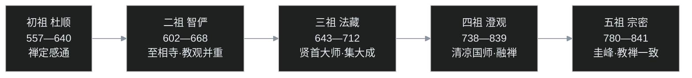

## 小白交底

先把这一篇要聊的家底摊开：

1. **华严宗**是八宗里哲学体系最庞大的，素有「**华严富贵**」之称；**律宗**给整个僧团立规矩。本篇就是这两个「一个最玄、一个最实」的宗派。
2. **华严宗**因《华严经》立宗，传**杜顺→智俨→法藏→澄观→宗密**五世；集大成者是三祖**法藏**（贤首大师），所以华严宗又叫**贤首宗**。
3. 法藏建起的哲学以「**四法界**」「**法界缘起**」为骨架，讲「一即一切、一切即一」「重重无尽」——武则天都听不懂，法藏就用**镜子**和**金狮子**打比方。
4. 判教上法藏把佛法分为「**五教**」（小乘／始／终／顿／圆），把《阿含经》贬为最低的小乘教；这一贬，让《阿含经》被冷落了上千年。
5. **律宗**由道宣在终南山创立（所以叫**南山宗**），依据《四分律》；道宣论证「这部律表面是声闻律，实质**通大乘**」，讲出**止持、作持**两类戒和「戒法、戒体、戒行、戒相」四科。

## 一、华严富贵：八宗里最博大精深的那个

隋唐八宗之中，若论哲学体系的博大精深，华严宗被公认为第一，其他宗派只能望尘莫及，所以古来有「**华严富贵**」的说法——别的宗像清雅的书院，华严宗像殿宇万千的皇家宫苑，层层套叠、无尽庄严。

这跟它出场最晚大有关系。法藏活跃的武则天时代，涅槃学派、地论学派、摄论学派、成实学派都已有深厚积累，三论宗、天台宗、法相宗也已建成。法藏接手的，是整个汉地佛学最浩瀚的一笔遗产。再加上法藏本人是百年一遇的哲学头脑，遂把这一切熔铸重组，搭出了隋唐佛学里体系最严谨、格局最圆满的一套哲学。

需要强调的是，华严宗哲学并不只是《华严经》哲学，它实际上**统合融贯了南北各派**——这是理解它为什么如此庞大的钥匙。

## 二、五祖传承：杜顺、智俨、法藏、澄观、宗密

华严宗的祖师谱很清楚，五世而一脉相承：

**初祖杜顺**（557—640）。这里曾有人起疑：杜顺一生的重心是禅修，罕有华严义学著作，华严宗凭什么认杜顺作初祖？答案是：华严宗与天台宗一样，**既重法义、也重禅观**；就禅观法脉而言，杜顺当之无愧。史传称杜顺是一位禅定深厚、颇有感通色彩的禅师。

**二祖智俨**（602—668）是个关键转折。杜顺传给智俨的主要是禅修法门，智俨的华严义学另有来源：在终南山**至相寺**专门钻研《华严经》，又深受地论学派南道派**慧光**一系华严经疏的影响。智俨把几位老师的长处融于一身，正式开启华严宗「**教观并重**」的格局——「教」是教义讲说，「观」是禅观实践。

**三祖法藏**（643—712）是真正的集大成者，下面单开一节。

**四祖澄观**（738—839），世称**清凉国师**，寿长一百零二岁。澄观其实是法藏的再传而非亲炙弟子，学问极博。此时禅宗、净土都已大兴，澄观主动**融摄禅宗的心性论**，又吸收天台「性具」之说，反过来滋养华严。

**五祖宗密**（780—841），世称圭峰禅师。宗密承澄观之后，更进一步，引用《圆觉经》来**统一当时教界的「禅」与「教」**——各个大宗都有自己的禅修与教义：禅宗长于禅而教义偏弱，净土重信仰而不谈禅；三论、天台、法相、华严则教义详备而禅法一门相对弱（哲学太繁琐，下手不易）。宗密要做的，就是把各派的禅与教打成一片，世称「**教禅一致**」。这种处处讲融摄、讲贯通的做派，正是中国佛教最鲜明的性格。

## 三、法藏：康居后裔、贤首大师

法藏俗姓**康**，祖先是**康居国**人——康居是中亚古国，大体在今天哈萨克斯坦南部、乌兹别克斯坦一带；法藏的祖父一辈迁居长安，所以法藏生在大唐，是个中亚裔，身世与玄奘的高弟窥基（尉迟氏、鲜卑血统背景）相映，都算「混血」。

「贤首」之号与皇室关系密切，华严宗因此又称**贤首宗**。传说法藏少年时曾被列入玄奘译场，课程认为可能性很低：当时译场网罗的都是各有大成的高僧，法藏尚未出家、年又少，几乎不可能厕身其间。

法藏一生有一条若隐若现的主线：**与法相宗的张力**。原因有两层：其一，法藏少年时法相宗声势正盛，某些作风让人观感不佳；其二，也是更根本的，两宗思想本不同路——华严一系接续的是**如来藏、真常**的血脉，主张有清净如来藏般的本体；法相唯识一系则讲「万法唯识」。法藏大力助译、弘扬新译 80 卷《华严经》，讲《华严经》多达三十余遍，在思想史上始终与玄奘的唯识学说相颉颃。

法藏著作等身，流传到今天的有《华严经探玄记》《华严一乘教义分齐章》（即《华严五教章》）、《华严经旨归》《华严金师子章》《大乘起信论义记》等二十余部。又因法藏深受武则天礼重，华严宗在皇室护持下迅速壮大，法相宗的声势则相对转颓。

法藏门下还有一位新罗来学的僧人**审祥**，后来东渡日本，在奈良东大寺一带讲传华严，被尊为日本华严宗初祖——华严的血脉，就此延伸到了海外。

## 四、镜子和金狮子：四法界与法界缘起

华严宗教理的核心，是「**法界缘起**」。先说「四法界」——法藏一系把整个宇宙分成由浅入深的四个层次：

| 法界 | 指什么 |
|---|---|
| **事法界** | 纷然杂陈的现象界：眼前万事万物，一一差别的「事」 |
| **理法界** | 现象所依据的本体：永恒、不生不灭、不增不减的「理」 |
| **理事无碍法界** | 本体与现象交融无碍：理即是事、事即是理，离事无理、离理无事 |
| **事事无碍法界** | 现象与现象互相容摄、各不相碍：**每一法都含全体，一切法中含每一法**——「一即一切，一切即一」 |

最高的「事事无碍」是华严宗独有的境界：任何一个现象都不是孤立的，它与宇宙间一切现象互相缘起、互相含摄，重重无尽。

这套道理玄而又玄，武则天听了也觉得无从把握。法藏于是设了一个著名的善巧方便：在宫殿的**上下八方都安放镜子**，中间安放一尊佛像，再点起一盏灯。于是镜中照佛、镜中映镜，佛像在层层镜子里现了又现、互含互摄，一眼看去便是**重重无尽的法界**——这便是「**十方俱现**」的镜屋之喻，后来「海印三昧」「因陀罗网」之说都是同一意境。

另有一次，法藏指着殿前的**金狮子**为武则天说法：金子是「理」，狮子的种种形相是「事」；狮子的眼、耳、爪、毛各各不同，但一一相中都是那同一尊金狮子——金体一，而狮相万。这部说法记录成书，便是著名的《**华严金师子章**》。

法界缘起讲的是：宇宙间一切法互相为缘，重重无尽；**任何一法都可以作为缘起所依，每一法也成为其他一切法的缘起之源**，万法息息相关。

## 五、四种缘起与五教十宗

华严把佛教各家的缘起说归纳为四层，一级比一级圆融：

| 缘起说 | 所属 | 讲什么 |
|---|---|---|
| **业感缘起** | 原始佛教（《阿含》） | 由业感果、十二缘起 |
| **赖耶缘起** | 唯识法相 | 万法从阿赖耶识种子变现 |
| **如来藏缘起** | 真常系 | 依如来藏、真心而起 |
| **法界缘起** | 华严宗 | 一即一切、重重无尽 |

判教方面，法藏把一代佛法判为「**五教**」：

1. **小乘教**：《阿含经》及小乘阿毗达磨，又称「愚法二乘教」，被认为是为根器最浅者说；
2. **大乘始教**：是大乘的入门，又分两派——「**相始教**」指法相唯识（《解深密经》等），「**空始教**」指般若、中观（《般若经》《中论》等）；
3. **大乘终教**：讲真常唯心，《楞伽经》《胜鬘经》《大乘起信论》《宝性论》等属之；
4. **大乘顿教**：顿悟法门，指《维摩诘经》（不思议法门）一路；
5. **大乘圆教**：最高、圆融无碍，专指《华严经》。

小、始、终三者都属「渐教」，与顿、圆并列。五教之外，法藏又立「**十宗**」：其中六小宗对应部派佛教（部派林立，正好可归为六家，但不含原始佛教），四大宗即始、终、顿、圆。

这套判教的层级意味很明显：**贬小乘、尊大乘；大乘之中又把三论（空始）、法相（相始）判为入门，把真常唯心系判为高一层，华严则高居绝顶**。不独法藏，天台「藏、通、别、圆」对《阿含》也有贬义。中国人谈判教，非用天台、即用华严，一千多年下来，《阿含经》自然被当作「小乘教」，束之高阁、少人通读。

但这里有个深刻的悖论：当年在印度结集大乘经的僧团，没有不熟读《阿含》的——《阿含》讲的恰是佛教最基本的教义核心。**梁启超**说过一段极中肯的话：佛教最根本的教义，四圣谛、八正道、三学、十二支缘起，都在《阿含经》里讲得详详细细；读大乘经的人，若不先读《阿含》，根本无从真正了解大乘——对《阿含》没有清楚观念，也就无从索解大乘的法义。课程对此深表赞同：对《阿含》完全隔膜而谈佛理，注定障碍重重。

## 六、印顺与吕澂：两种针锋相对的读法

如此圆融的法界缘起，后世两位大学者却给出了截然相反的评价，恰好可以对看。

**印顺导师**的批评相当严厉，认为华严的法界缘起，走到了「**真常唯心论的极端**」。问题在于，它太宽泛、太圆融了——既然每一法都与一切法互为缘起、息息相关，那么修行反而**没有了下手处**。真实的修行，要找的是主要对治的烦恼，是「主要的少数」主因与次缘；其余无数的「法」，与当下的修行可能并无直接关系，有也近乎无。把一切等齐，听上去圆满，实践中却无从着力。

**吕澂先生**则提供了另一个视角，认为华严的重重无尽、事事无碍，其实是在回应一种**社会现象**——印度不平等的种姓制度。印度四种姓：**婆罗门**（祭司，最尊）、**刹帝利**（贵族武士）、**吠舍**（平民）、**首陀罗**（奴仆），其下又细分无数等级，壁垒森严、互不通婚，这一传统延续至今，仍造成无数悲剧。佛陀当年收弟子一律平等、不问出身，僧团之内没有阶级种族之别；但印度社会因婆罗门教势力深厚，种姓始终难除。

吕澂指出，华严宗正是要用「事事无碍」向世人宣告：**一切众生本质平等**，彼此相关、互为缘起，没有高下之分，相融相摄而不相妨碍——法界缘起论，是华严学者为对治种姓不平等而发展出的学说。

可是《华严经》和华严宗传到中国后，情况变了：中国本没有那种世袭板结的种姓制度，平民可以经由各种途径上升，贵族也可能没落。于是这套学说失去了原来的社会靶心，**只好胶着在自然现象的比附上**——这也正是后人读华严理论时常感困惑的一个原因：它谈得越宏大，离人间的痛痒反倒越远。

## 七、四分律如何一统天下

讲完「最玄」的华严，转入「最实」的律宗。

唐代以前，汉地的广律已经相当齐全。汉译佛教四大广律，出于印度不同部派：

| 广律 | 所属部派 | 来源 |
|---|---|---|
| 《十诵律》 | 说一切有部（旧律） | 鸠摩罗什等译 |
| 《四分律》 | **法藏部** | 佛陀耶舍译 |
| 《摩诃僧祇律》 | 大众部 | 法显带回、与佛陀跋陀罗译出 |
| 《五分律》 | 弥沙塞部 | 刘宋时译出 |

再加上义净新译的根本说一切有部毗奈耶广律（中19 已详述，[义净海路求法](/post/92.html)），唐代戒律文献之全，前所未有。

《十诵律》先行。罗什译出后，**卑摩罗叉**把它带到安徽**寿春**（今寿县）弘扬，罗什门下另有人在首都建康传习，《十诵律》于是在长江中下游大为流行——**南方重《十诵》**。《四分律》则在北方扎根，关键人物是地论大师**慧光**。关于《四分律》的早期传承，《续高僧传·慧光传》上溯到**法聪、道覆**律师（日本凝然《律宗纲要》所述略同，其学由鉴真一系东传）；但真正把《四分律》发扬光大的，是北朝地位崇重的慧光。

慧光下了一个影响至深的判断：《四分律》**属于大乘**。但戒律（毗奈耶）本是部派所传，律藏一向被视为小乘，硬说成大乘，难免勉强——总得讲出道理。这个论证由道宣最终完成，这就是著名「**律通大乘**」的**五义**：

1. **沓婆回心**：《四分律》中所记的沓婆摩罗子（一位阿罗汉，即「无学」——梵行已成、不须更学），心向菩萨、志求成佛，可见此律许人回小向大；
2. **施生成佛**：律中回向文有「布施众生、共成佛道」之语，明是大乘发心；
3. **相召佛子**：律中彼此召唤用「**佛子**」而不用「比丘」——「比丘」唯局出家，「佛子」兼摄在家、含义更广，自带大乘色彩；
4. **舍财用轻**：僧人若得不净之财，把财物舍给僧团、当众至诚忏悔，便不构成偷盗重罪；声闻律中偷盗本是根本重罪，如此判释，通于大乘的忏悔精神；
5. **识尘非根**：说一切有部讲认识出于「根」（眼根如视觉神经之类），《四分律》则讲六根缘境、由**六识**去分别了知——能了外境的是识不是根，这与大乘唯识之义相通。

五义既立，《四分律》在北方更是风行，但南方依旧通行《十诵律》，南北各守一脉。直到**唐中宗**下达一道诏令，命南方也改学《四分律》，从此《四分律》才真正成为全国僧团共同依止的根本广律，沿习千余年至今。

## 八、律宗三家与南山三大部

《四分律》之学，在慧光之后代有传人：**道云→道洪→智首→道宣**，一脉而下，道宣正是智首的弟子。

道宣长期住在长安附近终南山的**净业寺**（寺院今天仍在），道宣这一系因此称为「**南山宗**」。同一时期，《四分律》学还分立出另外两宗，并称律宗三家：

- **相部宗**：洪渊传**法砺**（569—635），因法砺长期在相州（今河北临漳一带）弘律而得名；
- **东塔宗**：法砺的弟子**怀素**（624—697）因所见与本师不同，另立宗说，称东塔宗。

这里要特别辨一个名：东塔怀素是**律学大家**，著《四分律开宗记》；这位律师怀素与以狂草名世的那个怀素（737—799，俗名钱藏真，「以狂继颠」的醉素）**年代相隔数十年，并非同一人**，读史时极易相混。

道宣的律学结晶是「**南山三大部**」，后世研究四分律者无不从此入手：

- 《**四分律删繁补阙行事钞**》（简称《行事钞》）；
- 《**四分律羯磨疏**》（《羯磨疏》）；
- 《**四分律戒本疏**》（《戒本疏》）。

道宣人品清高、学问淹通，不独精戒律、义理，还兼具史学、文学之才（《续高僧传》《大唐内典录》都出自其手，中19 已述）。道宣处处以身作则，到处传戒，戒弟子遍及天下；众人因敬重其人，也就相随学《四分律》。

## 九、南山教理：止持作持与四科

南山律的教理，骨架是「**两类戒、四科事**」。

先说两类。戒律不只是消极禁止，道宣把它分为：

- **止持戒**：用来「止恶」——诸恶莫作；
- **作持戒**：用来「行善」——众善奉行。

这一区分，把戒律**积极护生**的一面显了出来。比如「不杀生」并非只要不杀便了，更积极的是要**护生**、尊重一切众生的生命；「不偷盗」之外，还要乐于布施、济助旁人。止恶与行善两端，「行善」更能见出戒律的积极精神。

再说四科：

1. **戒法**：佛所制定的戒律。僧团最初本没有戒，只因后来出家者渐众、未得解脱而时有过失，佛陀才随缘逐条制戒——这是「戒本」；后来又有解释全部制戒因缘、持犯、开遮的「广律」：怎样守才如法、什么情况下可以开缘、何时犯重、何时可以忏悔，都在其中。戒律是修行第一步：**戒→定→慧**，先持戒清净，才能修定，由定发慧、断烦恼、得解脱。道宣特别强调，持戒不只是守好微细条文，更是要让心变得清净、慈悲、调柔；若只斤斤于小小戒，而心地不慈悲、傲慢暴躁、固执我慢，这种「持戒」反而无法禅修。
2. **戒体**：受戒之时领纳于心、由此生起的「防非止恶」的功能。它是一种强大的心理建设——「我已受戒、有戒体在身，不可违犯、不可失坏；一旦失去，便丧失出家修禅的资格」。在印度，只说戒体是一种功能、一种让人自尊自爱、积极行善的警觉，并不过问它「是什么」；传到中国，才开始为戒体找本体：
   - **道宣**：依当时如日中天的唯识学，说戒体就是**阿赖耶识中的善种子**；
   - 宋代**灵芝元照**律师：改说戒体是**本来清净的真心、真常之心，即如来藏**——因为唯识之学经唐武宗灭佛后渐衰，两宋是禅宗、真常唯心的天下；
   - **弘一大师**：继承灵芝元照之说，仍以如来藏为戒体。
3. **戒行**：戒律的实践。戒律贵在真实践行，不是纸上、口上的功夫；行为、心地都清净了，才能进一步禅修。
4. **戒相**：戒律的具体条文相状。在家、出家共同的根本是「**五戒**」：不杀生、不偷盗、不邪淫、不妄语、不饮酒；出家预备的沙弥、沙弥尼另有沙弥戒；比丘戒通常说 **250 条**，比丘尼戒 **348 条**。佛世并没有这么多条目，许多微细戒是后世长老随因缘陆续增补的——佛世的戒，大概只有今天的一半多一点。

## 十、律宗的衰落与弘一

道宣之后，律宗的传承就不太彰明了。衰落的原因，课程分析得很平实：唐以后中国人整体的义学能力转弱，对隋唐那种精密体系的研究力不从心；入宋以后禅宗风行天下，禅者重视的是**道德层面的大戒**，认为微细戒条应当**随时空情境而变通**。

这其实不无道理：禅者并非轻戒——禅修本身就要求持戒清净，否则坐禅心中善恶业种翻动，恶业现行反成大障。两宋禅者守的是根本大戒，既然心地已清净、可以入禅，便不再把「研究律宗」当作专门功夫；加上禅宗自立丛林，本就部分起于对律寺过分拘执细戒的不满，龃龉一多，刻意讲南山律的人自然越来越少。唐以后，律宗再没有出现过真正的大师级人物。

直到近代，**弘一大师**（李叔同，1880—1942）出而中兴。弘一出家后由博返约，专研道宣的四分律学、力弘南山宗法，戒律精严，被尊为南山律宗第十一代祖，成为律宗在近代最具象征性的人物。今天许多道场有志复兴南山律，大体也是沿着弘一大师的路径继续研究。

## 程序员类比

1. **华严宗出场最晚、遗产最多**，就像一个团队在 2026 年要做新架构：前人的涅槃、地论、摄论、三论、天台、法相六套方案都开源可读，法藏不必从零造轮子，而是把六套方案的精华整合成一个大一统框架——这是它「博大精深」的真实工程含义。
2. **八方镜屋**，特别像今天的**分布式系统全景**：每个节点（镜子）都持有全量状态的映射，节点映节点、服务调服务，一张 trace 图展开层层嵌套，恰是「重重无尽、一即一切」。调试过微服务网格的人，一眼就懂那个镜屋。
3. **金狮子之喻**则是经典的「数据与视图」关系：金子（数据/模型，理）只有一份，狮子的眼耳爪毛（各个视图，事）形态万千；视图千差，底层是同一份状态——`v=f(state)`。
4. **法藏判五教十宗**，像给框架官方文档做「难度分级」：入门（始教）、进阶（终教）、高阶（顿教）、官方范式（圆教）。判得清楚，推广方便；但把老文档（阿含）打上「过时、给新手看」的标签打入冷宫，也埋下了后人基础不牢的祸根。
5. **印顺的批评**在工程上完全成立：监控面板上若所有指标全部同权、处处相关，告警风暴一来反而**找不到根因**；真正的故障定位，靠的就是抓住「主要的少数」主因——SRE 与修行同理，宏大不等于好用。
6. **《四分律》靠「五义」论证自己通大乘**，很像一个出身传统单机架构的老项目要进云原生名录：它不改核心代码，而是提出五条「架构上确与云原生相容」的证据（可对接容器、支持声明式……），拿到了「云原生兼容」认证，生态位就此稳固。
7. **律宗三家**（南山／相部／东塔）像同一规范下的三个发行版：同源（四分律）、各自打包、各有主张；最后南山版凭借与官方（皇室/道宣个人声望）最深的绑定成为主流，其余两家渐隐——发行版战争，古来如此。
8. **戒体＝阿赖耶善种 对 戒体＝如来藏真心**，这是两代技术栈下对同一接口的不同底层实现：道宣的时代唯识是主流运行时，戒体自然用唯识实现；宋代换成禅宗/真常运行时，元照就换了实现。**接口（防非止恶的功能）不变，底层随时代切换**——好的抽象正是如此。

## 吵架现场

**回合一：法界缘起到底是绝顶智慧还是极端之说？**

- **印顺一系**：万法等齐、一切互为缘起，听上去圆融，却取消了修行的着力点，是「真常唯心」走过了头；
- **华严宗徒**：事事无碍正是佛境的呈露，凡夫之所以觉得无从下手，只因还执着要有「一个」抓手；真正的圆融里，当下一事即可入法界。

**回合二：《四分律》到底是不是大乘？**

- **慧光、道宣一系**：律中有沓婆回心、施生成佛、相召佛子等五义为证，声闻律而通大乘，理据具足；
- **质疑者**：毗奈耶出于部派、本是小乘，为了在中国获得推崇而判作大乘，终究是「顺势之说」；律的价值何须靠「大乘」二字担保？

课程的态度仍是分层：判教是判教，信仰归信仰；考证上《四分律》源出部派，实践中它千余年真实支撑了汉地僧团，两事不妨并存。

## 卡壳角

1. **华严宗为什么又叫贤首宗？**
   因三祖法藏号「贤首」（与武则天等皇室的尊礼有关），后世遂以其别号名宗。
2. **杜顺几乎没有华严义学著作，为什么能居初祖？**
   华严宗「教观并重」，杜顺承的是禅观法脉；义学一路由二祖智俨在至相寺另续，两脉到法藏合一。
3. **「四法界」是哪四层？**
   事法界（现象）、理法界（本体）、理事无碍（本体现象交融）、事事无碍（现象互摄、一即一切），层层转深。
4. **五教里为什么把法相、三论都判为「始教」？**
   在法藏的判释中，相始（法相唯识）、空始（般若中观）虽属大乘，尚是大乘入门的「权教」；真常唯心（终教）才说到本体，华严圆教更凌驾而上。这是华严自宗的判准，并非对两宗的客观定评。
5. **同是「怀素」，律师怀素和草书怀素是同一人吗？**
   不是。律师怀素（624—697）立东塔宗；草书怀素（737—799）是半个多世纪后的书法家。名字相同、年代相错，最易混为一谈。
6. **道宣说戒体是阿赖耶识善种子，弘一为什么不这么讲？**
   道宣处唯识学鼎盛之时，自然依阿赖耶立说；会昌之后唯识衰、禅宗真常行，经宋代元照改写，弘一承袭的已是「以如来藏真心为戒体」一系。功能未变，唯所依的思想框架不同。

## 术语表

| 术语 | 一句话解释 |
|---|---|
| 华严宗 / 贤首宗 | 依《华严经》立宗，五祖传承；集大成者法藏号贤首，故称贤首宗；有「华严富贵」之誉 |
| 杜顺 | 初祖，557—640，禅定感通禅师，禅观一脉的源头 |
| 智俨 | 二祖，602—668，终南山至相寺学华严，受慧光疏影响，立教观并重 |
| 法藏 | 三祖，643—712，康居后裔，号贤首大师，华严哲学的集大成者 |
| 澄观 | 四祖，738—839，清凉国师，融禅宗心性与天台性具，寿 102 岁 |
| 宗密 | 五祖，780—841，圭峰禅师，援引《圆觉经》主教禅一致 |
| 审祥 | 新罗僧，法藏门下，东渡日本，被尊为日本华严初祖 |
| 至相寺 | 终南山古寺，智俨研学《华严经》之地 |
| 四法界 | 事、理、理事无碍、事事无碍，华严观法的四层宇宙结构 |
| 法界缘起 | 华严宗的缘起说：一即一切、一切即一，万法互相含摄、重重无尽 |
| 海印三昧 / 因陀罗网 | 喻法界一切法一时炳现、互相映现；因陀罗网为天帝网，网目宝珠互含互照 |
| 镜屋之喻 | 法藏于宫殿八方置镜、中安佛像，示重重无尽之相 |
| 《华严金师子章》 | 法藏为武则天就金狮子说法的记录，金（理）一而狮（事）相万 |
| 四种缘起 | 业感·赖耶·如来藏·法界，四层缘起逐级转深 |
| 五教 | 小乘教、大乘始教（相始／空始）、终教、顿教、圆教 |
| 十宗 | 六小宗（对应部派）＋四大宗（始终顿圆） |
| 相始教 / 空始教 | 始教二分：相始＝法相唯识；空始＝般若中观 |
| 律宗 / 南山宗 | 道宣在终南山净业寺创立，依《四分律》；又称南山宗 |
| 道宣 | 596—667，律宗开山，兼精律学、经录、僧史（三大部＋《续高僧传》等） |
| 《四分律》 | 法藏部广律，佛陀耶舍译；唐以后汉地僧团根本戒律 |
| 法藏部 | 部派之一，《四分律》所出；勿与「法藏」大师之名相混 |
| 五义 | 道宣论证《四分律》通大乘的五条：沓婆回心、施生成佛、相召佛子、舍财用轻、识尘非根 |
| 沓婆摩罗子 | 《四分律》中阿罗汉（无学），回心向大、志求成佛，为五义之首 |
| 止持戒 / 作持戒 | 止持＝止恶；作持＝行善，显戒律积极护生一面 |
| 戒法 / 戒体 / 戒行 / 戒相 | 南山四科：佛制戒法、受戒所得防非功能、戒律实践、具体戒条 |
| 戒体 | 受戒时领纳于心、防非止恶的功能；道宣说为阿赖耶善种，元照/弘一说为如来藏真心 |
| 灵芝元照 | 宋代律师，改以如来藏真心释戒体 |
| 相部宗 / 东塔宗 | 律宗另两家：法砺（相部）、怀素（东塔）；与南山宗鼎立后渐隐 |
| 法砺 | 569—635，相部宗开创者 |
| 怀素 | 624—697，法砺弟子，立东塔宗，著《四分律开宗记》；非草书家怀素 |
| 南山三大部 | 《行事钞》《羯磨疏》《戒本疏》，道宣律学三大著作 |
| 净业寺 | 终南山道宣道场，南山宗发源地，今天仍存 |
| 五戒 | 不杀生、不偷盗、不邪淫、不妄语、不饮酒，在家出家共守的根本戒 |
| 250 戒 / 348 戒 | 比丘约 250 条、比丘尼约 348 条；许多微细戒为后世陆续增补 |
| 弘一大师 | 1880—1942，李叔同，近代中兴南山律宗，被尊南山律宗第十一代祖 |

---

下一篇是中21，进入**禅宗、净土宗与密宗**：慧能之后禅宗如何一花五叶，善导怎样把称名念佛做成最「省事」的解脱路，开元三大士又如何把唐密推上高峰。华严宗的「圆」和律宗的「戒」，正好在这一篇里看它们怎样被这三大派接过去、化进寻常百姓家。
