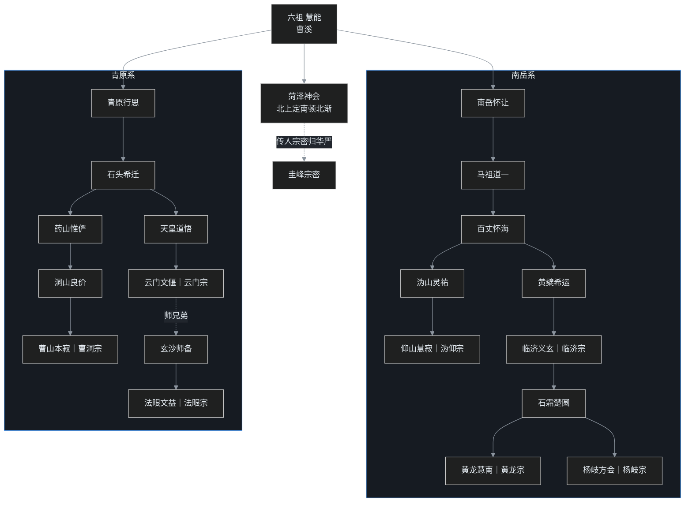

## 小白交底

先把这一篇要讲的摊开：

1. **禅宗**是八宗里最「中国」的一个，也是后来影响最大的一派。它最响亮的口号是「**教外别传、不立文字、直指人心、见性成佛**」。
2. 禅宗的西天源头，禅宗自己推到达摩——「**达摩西来**」。但达摩、慧可、僧璨初三祖在汉地影响其实不大，真正把禅法做起来的是四祖**道信**、五祖**弘忍**，地点在湖北**黄梅**。
3. 六祖**慧能**是禅宗的灵魂人物：一个不识字的卖柴人，凭一首「**本来无一物**」接了衣钵。慧能之后，禅宗「一花开五叶」，开出**五家七宗**。
4. 禅宗表面上大谈「空」，骨子里却是「**有**」——它接续的是**如来藏、真常**的血脉，核心教理是「**即心是佛、本有佛性**」。
5. 禅宗在唐代鼎盛，唐以后却渐渐难以为继；明清以后，民间第一大宗的位置让给了更省事的净土宗。

## 一、禅宗是什么：教外别传，不立文字

八宗之中，禅宗是性格最特殊的一个。别的宗派都依一部或几部核心经典立宗——天台依《法华》、华严依《华严》、三论依《中论》、法相依《解深密》——禅宗却标榜自己「**不立文字**」。

禅宗给自家的定位是四句话：「**教外别传，不立文字，直指人心，见性成佛**」。意思是：真正的心法，不在经卷文字里，而在师徒之间直接的「以心印心」；文字语言有时反而误导修行。

至于这一脉的最初源头，禅宗自己有个极美的说法：灵山会上，佛陀拈起一朵花，弟子迦叶破颜微笑——佛陀便说，我有「正法眼藏、涅槃妙心」，不立文字，付嘱给迦叶。这就是著名的「**拈花微笑**」。要说明的是，这是禅宗**自己追认**的源头，早期经律里并无记载；禅宗要的，是给「以心传心」找一个最古老的根据。

这一脉从天竺一路传来，到第二十八祖（禅宗自己的排法）便是渡海东来的**菩提达摩**。所以达摩既是「西天二十八祖」，又是「**东土初祖**」。

## 二、从达摩到弘忍：楞伽旧传与黄梅崛起

### 初三祖：云水般的日子

达摩把禅法带到中土，传慧可，慧可传僧璨——这就是「东土初三祖」。但初三祖在汉地并没有造成很大影响。二祖慧可、三祖僧璨过的是云水般的游方生活，行止不定，禅法也就没法很正式地发扬光大。

达摩当初传来的，是以**如来藏思想**为基础的「如来禅」，并且留下一部《**楞伽经**》给二祖慧可，作为师徒之间印可、传法的依据。所以最早的禅宗，是「**楞伽传承**」。

### 四祖道信：黄梅开山

禅法真正打开局面，要等到四祖**道信**。唐初，道信在蕲州——今天湖北的黄梅——的破头山建立道场。黄梅正处在长江中游，是东西南北的交通要道；道信在此一住三十多年，专心弘扬禅法，门下弟子众多。

这一搬，意义非凡：从此禅修的重心，从洛阳少林寺、庐山这些旧中心，转到了黄梅。

这里有个关键的转折。道信在江南游学已久，受江东一带**般若学风**的影响，开始重视《**金刚经**》——《金刚经》属于般若法门。课程里记了一个传说：道信在吉州道场居住时，有贼兵围城，道信便教众人齐声念「摩诃般若」，据说终于使贼兵退去。

于是从道信开始，禅宗里就同时有了《楞伽》与《金刚经》两个源头：骨子里是如来藏，言谈中却常带般若。这也解释了为什么禅宗后来动辄讲「空」、讲「破执着」，看上去像个「空宗」——但它的中心思想，其实是建立在「有」的如来藏之上。这一点第六节还要细说。

### 五祖弘忍：东山法门

道信有位得意弟子，就是五祖**弘忍**。弘忍在黄梅的东山（冯茂山）教授禅法，徒众比道信时还多——道信有五百多位弟子，弘忍门下超过五百。师徒两代五十多年的努力，终于使达摩禅跃居为中国禅法的主流，史称「**东山法门**」。

讲到这里，不妨把汉地的禅法谱系扫一眼，才知达摩禅的位置：最早有安世高在洛阳传的声闻禅法；后来有佛陀跋陀罗、鸠摩罗什一系结合大小乘的禅法；有昙鸾的观相念佛；还有佛陀禅师在少林寺教的原始禅。可以说，从原始部派、初期大乘到后期大乘的禅法，几乎都传到了中国——而达摩传来的，是建立在后期大乘如来藏思想上的禅法。

## 三、慧能得法：一首「本来无一物」

弘忍门下有两位高徒：一位是**神秀**，一位是**慧能**。最终接了弘忍衣钵的，是慧能。

### 不识字的卖柴人

慧能祖籍河北，父亲被贬到岭南（广东），慧能就生在岭南。慧能从小丧父，不识字、没读过书，靠劈柴卖柴奉养母亲。

二十二岁那年，慧能送柴到客舍，听见一位客人诵经，当下心里有所触动，便问：「您诵的是什么经？这经从哪里得来？」客人答：「这是《金刚经》，从黄梅五祖处得来。」古时经书都靠手抄、得来不易，慧能便说自己也想去黄梅修学。客人慨然资助，让慧能安顿好母亲，慧能这才上路。

见到弘忍，弘忍看这年轻人不识字、又是岭南人，便唤作「**獦獠**」——唐代对南方土著的称呼——说：「你这南蛮之人，也想来成佛？」慧能回了一句千古名言：

> 人有南北之分，佛性哪有南北之分？

弘忍一听，便知这个不识字的年轻人慧根极利。

### 两首偈

接下来就是禅宗史上最著名的一幕：作偈。弘忍让门下把各自的修行心得写成偈。众望所归的神秀写下：

> 身似菩提树，心如明镜台。
> 时时勤拂拭，勿使惹尘埃。

慧能听见别人诵这首偈，说自己也有感想，因为不识字，便请人代写：

> 菩提本无树，明镜亦非台。
> 本来无一物，何处惹尘埃？

弘忍看了，认为神秀还处处落在「有相」之中，而慧能这一首更契合空义，根基更高。

当夜，弘忍悄悄为慧能讲《金刚经》。慧能听到「应无所住而生其心」一类的开示，豁然有所悟，连叹：

> 何其自性，本自清净；何其自性，本不生灭；何其自性，能生万法……

这里要特别留意一个细微而要紧的地方。《金刚经》讲的空，本来是般若的空性；但慧能——以及后来整个禅宗——体会到的，却是「**本有佛性**」「**自性清净心**」。直到今天，仍有很多人把《金刚经》的空讲成佛性、讲成自性。若把这「自性」解释成空性，「以有空义故，一切法得成」，自然也能说「能生万法」；但禅宗实际的体会，是本有佛性，这与般若经原义是有差异的。课程把这一处点得很清楚。

### 连夜南逃

慧能得了衣钵，弘忍门下那么多人自然不平——为什么不传给一表人才、学问最好的神秀，却传给不识字的慧能？弘忍赶紧让慧能连夜离开，怕有人对慧能不利。慧能于是逃离黄梅，一度混迹猎人队中，最后到了广州。

## 四、风幡之辩与南顿北渐

### 风幡之辩：仁者心动

慧能到了广州法性寺，正听印宗法师讲《涅槃经》。这时发生了一件传颂千古的事：风吹动了幡，一个僧人说是「幡动」，另一个说是「风动」。慧能在旁边接了一句：

> 不是风动，不是幡动，仁者心动。

意思是：是二位的心动了，才觉得幡在动。满座皆惊。

禅宗本就是「真常唯心论」，以心做主，所以归到「心动」。但这里有个现代人的反驳值得一听——**印顺导师**认为，这样的说法并不完全符合佛陀的教导：佛陀讲的是「心物和合缘起」，所以应当是幡也动、风也动、心也动，三者相缘而起，而不是把一切归给心。这是少有的对六祖公开的异议，记在这里对看。

印宗法师一听，断定这年轻人必是六祖。当时慧能还没有落发，印宗便为慧能剃度；剃度之后，印宗反过来拜慧能为师。

此后慧能一生都在南方弘法，主要在韶州（今广东韶关）的曹溪宝林寺——也就是今天的南华寺。所以慧能这一系又称「**曹溪宗**」，韩国禅宗至今自称「曹溪门下」。

### 南顿北渐

为什么叫「南宗」？因为弘忍另一位高足神秀去了北方，在长安、洛阳一带得到贵族大臣的尊崇，武则天还拜神秀为国师。神秀的弟子普寂，甚至被北方信众径称为「七祖」。神秀这一系，史称「**北宗**」。

慧能在南方，神秀在北方，两派本是并行。北宗讲「渐修」，南宗讲「顿悟」，后来概括为「**南顿北渐**」。

把这格局翻转过来的，是慧能的弟子**神会**。神秀、普寂声势最盛之时，神会北上嵩洛，设无遮大会，公开抨击北宗「师承是傍、法门是渐」，主张慧能才是弘忍嫡传、所传才是顿悟。经神会这一番力争，北宗逐渐衰落，南宗成为禅宗正统。

慧能本人说法，由弟子**法海**记录成书，便是著名的《**六祖坛经**》——这也是中国僧人著作中唯一被尊称为「经」的一部。现代学者钱穆曾把《六祖坛经》列为中国人必读的经典之一。

## 五、一花开五叶：五家七宗

慧能门下龙象不少，最杰出的有三位：**菏泽神会**、**南岳怀让**、**青原行思**。神会在洛阳，怀让在湖南衡山，行思在江西。

菏泽神会这一支后来没有大发展——神会虽替南宗争来正统，门下却缺杰出传人；其法脉数传，出了一位圭峰宗密，而宗密后来成了华严宗五祖（中20 已述），并没有把禅宗这一支延续下去。真正发展成大宗的，是南岳怀让与青原行思两支。当时天下禅者，不是到湖南、就是到江西去参禅，「**跑江湖**」这个词就是这么来的——本意是参禅用功，不是卖膏药。

整个谱系如下：

顺着这张图看两支：

**南岳怀让系。** 怀让传马祖道一，马祖传百丈怀海。百丈门下分两路：一路是沩山灵祐、再传仰山慧寂，开出「**沩仰宗**」；另一路是黄檗希运、再传临济义玄，开出声势最大的「**临济宗**」。临济传到石霜楚圆，门下又出两位——黄龙慧南开「黄龙宗」，杨岐方会开「杨岐宗」。后来杨岐一支愈发兴盛、超过黄龙，黄龙宗渐渐不传，杨岐也恢复为「临济宗」的名号。

**青原行思系。** 行思传石头希迁。石头两位主要弟子：药山惟俨、天皇道悟。药山这一支，传到洞山良价、再传曹山本寂，开出「**曹洞宗**」；天皇道悟这一支，传到云门文偃，开出「云门宗」；与云同辈的玄沙师备，传到法眼文益，开出「法眼宗」。

要补一句：上图为了清楚，把中间几代作了简化——例如药山到洞山之间还有云岩昙晟，天皇到云门之间还经过龙潭崇信、德山宣鉴、雪峰义存数代，玄沙到法眼之间还有罗汉桂琛；五家的正式开宗，都在慧能之后一两百年。

所谓「**一花开五叶**」，五家就是：**临济、沩仰、曹洞、云门、法眼**。达摩传来的禅称「如来禅」，这五家祖师所传、各有家风的禅，则称「**祖师禅**」。五家之外再加上黄龙、杨岐，便是「**五家七宗**」；只是黄龙、杨岐后来复归临济。

五家虽同一血脉，家风却各不相同，后来各有一句考语：

| 家 | 家风 | 接引手段 |
|---|---|---|
| **临济** | 机锋峻烈、势如闪电 | 棒喝交驰，惯用「喝」，立「三玄三要」 |
| **沩仰** | 方圆默契、深远如镜 | 师徒画圆相表道，以境相叩、不待言说 |
| **曹洞** | 细密亲切、回互叮咛 | 立「五位君臣」，讲理事偏正回互 |
| **云门** | 孤危耸峻、一语截流 | 「云门三句」，字险而陡，不容拟议 |
| **法眼** | 一切现成、对症发药 | 借华严六相谈理事，先令观三界唯心 |

临济以「喝」最有名——「德山棒，临济喝」，一声喝下要把学人当下的情识齐齐斩断；曹洞则温润绵密，善用「五位」（正中偏、偏中正……）把本体与作用、理与事的关系一层层排给人看。所以后来有「临济将军，曹洞士民」的比方：一个令行禁止，一个细密踏实。云门「三句」——函盖乾坤、截断众流、随波逐浪——先一句摄尽一切，再一刀截断情思，末了又随分方便。这些家风，都是祖师禅在不同学人身上试出来的「接引人的接口」。

马祖道一尤其值得单独点一笔。早年说「即心即佛」，弟子们死死执住这句话，马祖后来又改口「非心非佛」，为的是把学人对「心」「佛」名相的执着也一并打掉。马祖最有名的话是「**平常心是道**」：饥来吃饭困来眠，无造作、无取舍，穿衣吃饭的日用之中即是道。这一脉到百丈怀海，又把禅僧集体生活整理成规矩，即后世所传的「马祖建丛林、百丈立清规」——禅宗从此有了自给自足、不作不食的丛林制度，不必再寄身在律寺的屋檐下。要说明的是，百丈当年所立《禅门规式》原书已佚，今天通行的《敕修百丈清规》是元代重订之本，并非唐代原样。

直到今天，临济与曹洞仍是汉地最大的两支，素有「**临济临天下，曹洞曹一角**」之说——天下法脉多半是临济，曹洞占其一角，而临济的势力还要更大一些。

## 六、禅宗思想：即心是佛，见性成佛

禅宗的义理骨架，可以用八个字概括：「**即心是佛，见性成佛**」。

**这个「心」是什么？** 就是真常心，也就是禅宗常讲的「自性清净心」。这颗心本来清净，只是被无明烦恼盖住了——好比一面镜子，镜子本来明亮，落了灰，人便以为镜子本身是脏的。灰可以擦，镜子的明却不曾丢。

**这个「性」是什么？** 就是佛性，而且是「**本有佛性**」。众生本来就具备佛性、本来就有这颗清净心，所以人人都可以成佛。禅宗「**明心见性**」的说法，「见性」所见的，就是这本来就有的佛性。

**那要怎么见？** 禅宗给的路径是：远离分别戏论。众生在六根对六境时，会生起六识的分别作用——眼见色、耳闻声，于是分出「这是我喜欢的、那是我讨厌的」；喜欢的就去追逐、甚至执迷，讨厌的就起嗔恨，两头都在造业。只要不被这分别作用牵着走，本有佛性、清净真心才显出来，这便是契入佛的智慧。

这一套「本具、返本」的讲法，正是如来藏血脉的本色——与华严、天台所说的「性具」「真心」声气相通，而与「万法唯识、修而后得」的法相一路明显不同。

禅宗从达摩禅发展到祖师禅，也被认为是高度「中国化」、甚至「玄学化」的结果。其中一个重要因素，是吸收了江南的**牛头禅**法；老庄式的「忘言绝虑」，与禅宗的「不立文字」天然契合。

## 七、禅宗为何后来衰落

唐以后，禅宗的传承反而不那么彰明了。课程分析得很平实，主要有两层原因。

**其一，「不立次第」的顿入，只对少数利根有效。** 道宣在《续高僧传》里评价达摩禅，就已经说它幽玄、没有次第、很难掌握。到祖师禅，无论是参话头还是公案，都不容易下手——不讲阶梯、直接顿入，多数人其实接不住。大多数修行者需要的是严明的次第，像登台阶一级级上去。禅宗这种一超直入的法门，天然受众有限。

**其二，文字传承断裂，后人连家风都要回头去学。** 临济的「棒喝」、曹洞的「默照禅」，这些精细家风后来在汉地渐渐失传，反倒要向日本求取。临济后世主「看话禅」（大慧宗杲，参话头），曹洞主「默照禅」（宏智正觉，默坐观照），两宗之间，其后人曾有诤论；争来争去，真修实证的人却越来越少。

再加上外部的挤压：禅宗自己培养出的许多宗师，为了广泛度众、图个方便，纷纷归向简易的净土法门；明清以后，净土势力庞大，在民间取代了禅宗的位置。所以佛教史上常把「禅净合流」「**归禅入净**」看作晚期汉传的一大转折——这正是下一篇要讲的故事。

## 程序员类比

1. **教外别传、不立文字**，像极了团队里那种「核心心法只在师徒口耳之间、不落文档」的老传统。好处是真传一句话、不被过时文档误导；坏处是一旦那位老师傅离职、又没带出徒弟，整条知识链就断了——禅宗后来的失传，正是这种 bus factor＝1 的典型代价。
2. **道信、弘忍两代扎根黄梅、众至五百**，好比一个开源项目靠两位 maintainer 在同一个社区（黄梅）深耕五十多年，把一个小众 fork 做成了主流发行版——「东山法门」就是当年的 fact 标准。
3. **慧能「佛性哪有南北」**，在工程语境里就是：接口面前，调用方一律平等，不管你来自哪个机房、哪个端。身份（獦獠/神秀）不该决定有没有资格接入核心系统。
4. **神秀的「时时勤拂拭」对慧能的「本来无一物」**，像两种相反的运维哲学：一种是不断打补丁、勤清理、维持系统不被污染；一种是直接看穿「系统本空、没有一个常驻的脏东西可擦」。前者稳、可复制；后者高、只对真正读懂架构的人成立。
5. **一花开五叶、五家七宗**，本质是同一个内核（曹溪心法）在不同 maintainer 手里打出的五套「家风」发行版——临济、曹洞各有 flag、各自打包；接口没变，变的是交互风格。这和 Linux 世界的 Debian/Arch/Fedora 同源分流是一个道理。
6. **临济棒喝**很像高压的 chaos engineering / red team：不跟你讲原理，直接一棒把你从惯性思维里打醒，逼你当场跳出 bug。但这种「教学方法」极度依赖老师傅的现场功力，后人学了形、没学到神，就成了乱打——家风失传即如此。
7. **禅宗衰落＝只讲顿悟、不立次第**，工程上的教训是：把「无服务器、零配置、一键上手」当成对所有人的唯一路径，新手反而抓瞎。好的体系一定要给普通人留好阶梯（onboarding），纯粹的「顶尖高手通道」注定后继乏力。

## 吵架现场

**回合一：南顿北渐——到底该不该有次第？**

- **南宗（慧能、神会）**：理不可分，觉悟是一下子的事，北宗「时时勤拂拭」还落在有相、没到家；
- **北宗（神秀、普寂）**：修行就要老实用功、渐次打磨，谈「本来无一物」对多数人太高，落不到脚下。

公允地看：南宗争来了「正统」之名，北宗的渐教却更接近多数人的真实路径；顿与渐，与其说是对错，不如说是为两种根器开的两条路。

**回合二：风到底动不动？**

- **慧能**：不是风动、不是幡动，是仁者心动——归于一心；
- **印顺**：佛说心物和合缘起，幡、风、心三者俱动、相缘而起，不该把外境全消归内心。

课程的态度仍是分层：就宗门体验说，慧能点的是「不被境转」的修行关要；就缘起法义说，印顺守住了「心物相待」的客观分析。两事不必强合。

## 卡壳角

1. **禅宗为什么叫「教外别传」？**
   禅宗自认核心心法不在经教文字之内，而在师徒直接以心印心，故相对于「依教修证」的各宗，自称「教外」别传；但这是禅宗自我定位，不是历史定论。
2. **既然达摩以《楞伽经》印心，怎么后来又重《金刚经》？**
   初三祖是「楞伽传承」；从四祖道信久处江南、受江东般若学风影响，开始重《金刚经》。禅宗从此是如来藏为骨、般若为言，所以言谈常说空、骨子里却是「有」。
3. **「本来无一物」比「时时勤拂拭」高在哪？**
   神秀还承认有个「心如明镜」、有尘埃可擦，落在能所、有相；慧能连「镜台」也空掉，更彻底。但这是就见地说，不代表顿悟法门人人可走。
4. **慧能不识字，怎么能说出那么深的法？**
   禅宗本就「不立文字」，重的是当下直指的智慧而非学问；《坛经》是弟子法海记录整理，并非慧能亲笔。
5. **五家七宗，到今天还剩几家？**
   五家是临济、沩仰、曹洞、云门、法眼；加黄龙、杨岐称七宗。沩仰、云门、法眼、黄龙在汉地先后绝传或并入别宗；杨岐复归临济。今天汉地主要是临济、曹洞两支，日本则把各宗较完整地保存了下来。
6. **禅宗讲「空」，为什么说它其实是「有宗」？**
   它承的是如来藏、真常血脉，肯定有本具的清净心、本有佛性，是「本有」而非「修得」，所以归在真常唯心的「有」；言谈中的「空」，是破执着的方法，不是它的本体论。

## 术语表

| 术语 | 一句话解释 |
|---|---|
| 禅宗 | 八宗中最中国化、最重「以心传心」的一派；口号「教外别传、不立文字、直指人心、见性成佛」 |
| 教外别传 / 不立文字 | 禅宗自认心法在经教之外、不落文字，师徒直接以心印心 |
| 拈花微笑 | 禅宗追认的源头：灵山佛陀拈花、迦叶微笑，付「正法眼藏」；早期经律无载 |
| 菩提达摩 | 东土初祖，南天竺人，梁时来华，传如来藏为基的如来禅，以《楞伽经》授慧可 |
| 慧可 / 僧璨 | 二祖、三祖；过云水游方生活，初三祖在汉地影响尚微 |
| 如来禅 / 祖师禅 | 达摩所传称如来禅；五家祖师各立家风所传称祖师禅 |
| 《楞伽经》 | 初三祖印可传法所依，属如来藏系 |
| 道信 | 四祖，唐初在黄梅破头山建道场、住三十余年，始受江南般若影响重《金刚经》 |
| 弘忍 | 五祖，在黄梅东山（冯茂山）弘法，门众逾五百，称「东山法门」 |
| 黄梅 / 东山法门 | 湖北黄梅，道信、弘忍两代禅修中心；达摩禅由此成主流 |
| 獦獠 | 唐代对南方土著的称呼；弘忍初以此呼慧能 |
| 神秀 | 弘忍高足，北宗之祖，受武则天尊为国师；讲渐修 |
| 慧能 | 六祖，638—713（通行说），岭南人，不识字，闻《金刚经》出家，主曹溪宝林寺 |
| 神秀偈 / 慧能偈 | 「时时勤拂拭」（渐）对「本来无一物」（顿） |
| 法性寺 / 风幡之辩 | 广州法性寺（今光孝寺）；慧能「不是风动，仁者心动」 |
| 印宗法师 | 法性寺法师，为慧能落发、反拜为师 |
| 曹溪宝林寺 | 今广东韶关南华寺，慧能弘法地；禅宗南宗又称曹溪宗 |
| 南顿北渐 / 南宗北宗 | 慧能南宗主顿悟，神秀北宗主渐修 |
| 神会 | 慧能弟子，北上嵩洛抨击北宗、确立南宗正统；菏泽宗 |
| 普寂 | 神秀弟子，曾被北方信众称「七祖」 |
| 《六祖坛经》 | 慧能说法、弟子法海记录；中国僧著中唯一被尊为「经」者 |
| 法海 | 慧能弟子，《坛经》记录者 |
| 菏泽神会 / 南岳怀让 / 青原行思 | 慧能门下三大弟子；后两支成大宗 |
| 跑江湖 | 禅者分赴湖南（怀让）、江西（行思）参禅，语本出于此 |
| 五家 | 临济、沩仰、曹洞、云门、法眼，即「一花开五叶」 |
| 五家七宗 | 五家加黄龙、杨岐；后黄龙、杨岐复归临济 |
| 马祖道一 / 百丈怀海 | 南岳系关键祖师；后世有「马祖建丛林、百丈立清规」之说 |
| 黄檗希运 / 临济义玄 | 百丈—黄檗—临济，开出临济宗 |
| 沩山灵祐 / 仰山慧寂 | 百丈—沩山—仰山，开出沩仰宗 |
| 石霜楚圆 / 黄龙慧南 / 杨岐方会 | 临济楚圆门下分出黄龙宗、杨岐宗 |
| 石头希迁 | 青原行思弟子；其下出曹洞、云门、法眼三宗 |
| 药山惟俨 / 洞山良价 / 曹山本寂 | 石头—药山—洞山—曹山，开出曹洞宗 |
| 天皇道悟 / 云门文偃 | 石头—天皇（历数代）—云门，开出云门宗 |
| 玄沙师备 / 法眼文益 | 玄沙与云门同辈，传法眼，开出法眼宗 |
| 即心是佛 / 见性成佛 | 禅宗核心教理；心＝真常自性清净心 |
| 本有佛性 / 明心见性 | 众生本具佛性；修行即明本心、见本性 |
| 自性清净心 | 本来清净、为烦恼所覆的真常心，镜喻显之 |
| 牛头禅 | 江南法融一系，禅宗吸收其玄风，促成本土化、玄学化 |
| 棒喝 / 默照禅 / 看话禅 | 祖师禅方便：德山棒、临济喝；曹洞默坐观照；临济后世参话头 |
| 三玄三要 | 临济义玄接引学人的句中玄要，令一语之中具多重落处 |
| 五位君臣 | 曹洞洞山所立，以正中偏、偏中正等五位判理事偏正回互 |
| 云门三句 | 函盖乾坤、截断众流、随波逐浪，云门宗的三要诀 |
| 平常心是道 | 马祖道一语；饥食困眠、无造作取舍，日用即是道 |
| 临济临天下，曹洞曹一角 | 后世汉地以临济、曹洞为主，临济势力更大 |

---

下一篇是中22，讲**净土宗与密宗**：昙鸾、道绰、善导怎样把「称念阿弥陀佛」做成最省事的他力解脱路，善导又如何把它带进长安；开元三大士（善无畏、金刚智、不空）怎样把唐密推上高峰，惠果、空海又怎样把这条血脉完整带去日本——以及为什么「归禅入净」最终成了汉传佛教的主流归宿。
