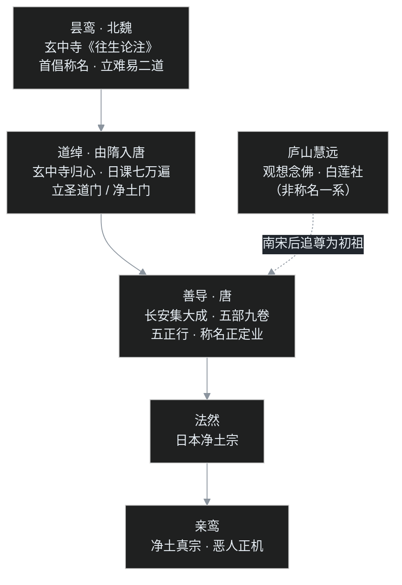
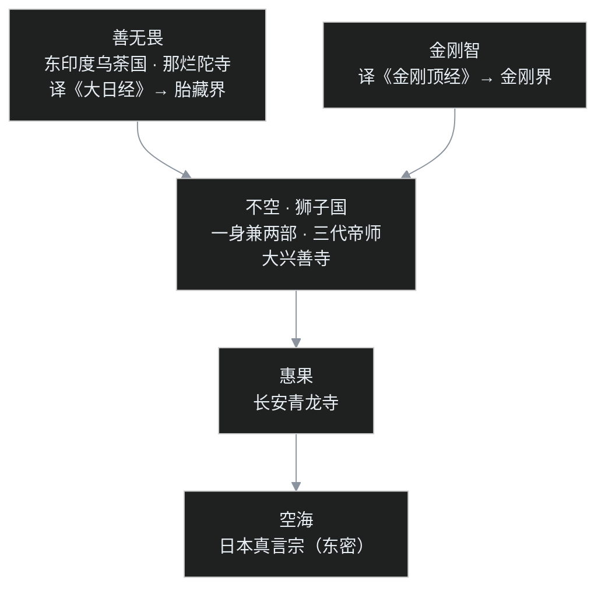

## 小白交底

先把这一篇要讲的摊开：

1. 这一篇给唐代宗派史收尾：八宗里剩下的两大块——**净土宗**与**密宗**。一个最省事，一个最神秘。
2. 两个宗表面上八竿子打不着，骨子里却回答同一个焦虑：末法时代，光靠自己修行，还来得及吗？净土宗的答案是「别硬扛，靠阿弥陀佛」；密宗的答案是「有办法，这副身体当下就能成佛」。
3. 净土宗的祖师名单里藏着一桩错案：真正把念佛法门做出来的两个人——**昙鸾、道绰**——没上榜；被尊为初祖的是庐山慧远，可慧远修的根本不是口称名号。
4. 密宗是唐玄宗时由三位印度大师正式带来的，史称「**开元三大士**」：善无畏、金刚智、不空。它在汉地只红火了百余年，会昌法难后基本绝传；倒是日本和尚空海把全套带回了日本，保存至今。
5. 术语预警：自力与他力、难行道与易行道、三经一论、信愿行、曼陀罗、金胎两部、三密相应、即身成佛。

## 一、一桩祖师错案：谁才是净土宗的真正源头

### 祖师榜上被漏掉的两个名字

先看净土宗自己的祖师榜。南宋以后定下的净土祖师系统，第一位是庐山东林寺的慧远，第二位才是唐代的善导。可若问：中国人念的这句「南无阿弥陀佛」，到底是谁先提倡的？答案不在榜上——是北魏的**昙鸾**，以及昙鸾的继承者、由隋入唐的**道绰**。

昙鸾是雁门（今山西代县）人，生活在北魏，广学般若与方等经典，后来得到菩提流支传授的《观无量寿佛经》，从此归心净土，长期住在并州的**玄中寺**——今天山西交城县的石壁山中。昙鸾留下《往生论注》等著作，在中国最早援引龙树之说，把一切佛法分成两类：靠自己一步一步修行的「难行道」，和凭佛力往生净土的「易行道」。称念阿弥陀佛名号，便是昙鸾提倡的易行道。

### 道绰：四十八岁，玄中寺归心

道绰是并州汶水人，十四岁出家，学的是《大般涅槃经》。道绰十六岁那年，北周武帝灭掉北齐，在齐地废佛、道二教，道绰只好还俗；等到佛教复兴，才再度出家，渐渐成为有名的涅槃学者。

叶扬要划个重点：道绰人生的转捩点在四十八岁。那一年，道绰来到石壁山玄中寺，看到昙鸾当年留下的碑文与著作，大受震动，就此归心净土。玄中寺周围都是农户，道绰深知，对种地的人讲深奥义理不现实，最简单的办法就是教大家念「南无阿弥陀佛」。课程里记了两个细节：一是据说念珠便是道绰推广开来的，领着众人掐珠念佛；二是道绰自己修行极猛，一天要念七万遍佛号，念佛之声响彻山林。

而且禅修也没丢掉——道绰同时修「观想念佛」，就是在禅定中观想阿弥陀佛的相好。这一点很要紧：早期的净土信仰，并不只是动动嘴。

### 善导：把乡村信仰带进长安

道绰晚年，年轻的**善导**专程到玄中寺求教。善导是真正「集大成」的人物，后来把念佛法门带进长安，在城里抄写净土经典几万部，又发挥自己的艺术天分，把极乐世界的景象画成「净土变相」三百多幅，与满城信众结缘。有了看得见的图像，信众对净土的信心大不一样。

这么一来，原本在山西乡下劝化农民的朴素信仰，被善导升级成了长安城里的「都会佛教」，再从长安辐射全国。一个宗派之所以成其为宗派，这一步是关键。

### 为什么榜上是慧远？

问题来了：真正的源头昙鸾、道绰被略过，初祖反而是慧远。慧远在庐山做过什么？中07 已经详讲——慧远在东林寺与一百多人结成白莲社，在阿弥陀佛像前立誓往生；但慧远修的是念佛三昧、观想念佛，并不是口称名号。

课程里给出的解释是：慧远在中国佛教界地位崇高，立慧远做初祖，好比请一位最有声望的人做「形象代言人」。近代学者林子青则指出更深一层：南宋以后佛教重心移到江南，后世选出的祖师，不是江南人、就是在江南弘法，远在北方并州的昙鸾、道绰自然落选——这背后是江南佛教对北方佛教的偏见。

反倒是日本人不买这个账：日本的净土宗、净土真宗，追溯相承，认的是昙鸾、道绰这一系，并不以庐山慧远为初祖。

## 二、净土教说：他力易行道，信愿行三资粮

### 三经一论：家当简单得惊人

净土宗的家当，和三论、天台、法相那些义理大派比，简单得惊人。它依据的是「**三经一论**」：

- **《无量寿经》**：讲阿弥陀佛在因地修行、发四十八大愿、建成极乐世界；
- **《观无量寿佛经》**：讲观想极乐世界与阿弥陀佛的十六种观法，以及往生的九品等次；
- **《阿弥陀经》**：篇幅最短，核心就是执持名号、一心不乱；
- 一论是世亲菩萨造的《往生论》，阐明愿生净土的义理。

### 他力本愿：把成佛「托付」给愿力

净土法门的核心，是「**他力**」二字——不靠自己的力量，靠阿弥陀佛的愿力。

按经中所说，阿弥陀佛成佛之前（法藏比丘）发过四十八大愿，其中最关键的第十八愿，大意是：若我成佛，十方众生，只要信乐发愿、称念我的名号，哪怕只有十念，也必定往生我国。如今阿弥陀佛已成佛，这个愿便有了真实的力量：凡夫只要相信、愿生、称名，就能被这股愿力接引到极乐世界。

这和佛陀本人的遗言气质很不一样。佛陀临涅槃时教的是「自依止、法依止、莫异依止」——自己做自己的岛屿，以正法为依归，不要依赖外力。所以课程里很坦白地说：称名念佛是佛门的「方便法门」，先以最简单的方式把众生接引进来；入门之后，若有能力，再去修自力的法门也不迟。

### 难行道与易行道：陆路与水路

这套「他力」的道理，祖师们有个极漂亮的比喻，源头在龙树菩萨的《十住毗婆沙论》：

- 菩萨道靠自己勤苦修行，就像在陆地上走路，一步一血汗，是「**难行道**」；
- 净土法门凭佛力接引，就像乘船顺水而行，上船之后自然到达，是「**易行道**」。

昙鸾祖述这个区分；到了道绰，又换了一组说法：把凭自力修行的佛法统称「**圣道门**」，把往生净土的方便门称为「**净土门**」。祖师们并不否认圣道门，只是认为：如今已是末法时代，众生根器差，加上古时文盲遍地，拿难行道去教普通人，实在教不动——不如先用净土门把人安顿下来。

### 善导：凡夫称名，皆可往生

善导把这套道理落到最实：凡夫只要一心称名，就可以往生。但要厘清一件事——**往生不等于当下解脱，更不等于成佛**。往生是「转学」到极乐世界，在阿弥陀佛身边继续修行，直到成佛，再回来度化秽土众生。

善导把称名念佛立为最核心的修行，同时开出五种正行：**礼拜、赞叹、读诵、观察、称名**。观察就是观想念佛，其实就是禅修；五正行之中，称名是「正定业」，其余四行都是辅助——要恭敬、要读经、要做功夫，但最吃重的，还是这六个字。

### 信愿行：自己也要使劲

说净土全靠他力，也不尽然。自己这边至少要出三份力，合称「**三资粮**」：

- **信**：相信阿弥陀佛，相信西方极乐世界；
- **愿**：真心发愿往生；
- **行**：老老实实称名念佛，也包括行善积德。

佛的愿力与众生的信愿相应，往生这件事才成立——佛力是接引的手，信愿行是肯伸出去的手，两只手要握到一起。

也正因如此简单：不依赖寺院、不依赖学问，人人能念、处处可修——「谁都修得起」，就是这个法门最大的底气。

## 三、净土到底算不算一个宗：天台养成、日本极致与禅净合流

### 一个学术问题

这里有个让学者们争论的问题：净土，真的是一个独立的「宗」吗？

一个耐人寻味的事实是：善导的著作——世称「**五部九卷**」——在中国本土竟然失传了，一卷都没留下；今天看到的本子，是近代通过日本学者南条文雄等人，从日本回传的。在回传之前的上千年里，中国人读不到善导的书，这套思想如何在一个「净土宗」内传承，其实很成问题；历史上甚至连善导本人的生平都众说纷纭。

### 净土思想，是在天台宗里长大的

课程里给出的判断很有意思：中国的净土思想，主要不是在一个独立的净土宗里长出来的，而是在**天台宗**后期发展成熟的——天台本来就有浓厚的末法观念，在末法的焦虑下，称名、往生这些法门特别发达。换句话说，汉地的净土更像一种各家共修的普遍信仰，并非一开始就有独立门户。再往后，华严、禅、律，几乎没有哪一家不兼谈净土。

### 日本：被推到极致的「绝对他力」

善导的衣钵真正被发扬光大，反而是在日本。镰仓时代，在善导思想的直接启发下：

- **法然**创立日本净土宗，主张「专修念佛」；
- 法然的弟子**亲鸾**，又开出净土真宗，把「他力」推到极致。

亲鸾有一句惊动很多人的话，大意是：「**善人尚且能够往生，何况恶人**。」这就是真宗著名的「**恶人正机**」说。为什么恶人反而更容易往生？因为做了一点善事的人，往往觉得自己不错、还想靠自己努力，对阿弥陀佛的信仰就不那么纯粹；而造尽恶业的人，深知靠自己已经毫无指望，对佛力的信仰反而孤注一掷、最为彻底。在真宗看来，凡夫自己的努力不仅无益，反而是信仰上的障碍。

真宗还有一整套大胆主张：僧侣可以吃肉、可以结婚生子，寺庙父子相传。这与汉地佛教的传统格格不入。近代真宗来华传教，中国佛教界几乎一致抵制，视之为邪说——汉地的净土始终保留着道德本位：往生之外，善事还是要做的。

作为对照，课程里提到一种宗教社会学观察：马克斯·韦伯讲过新教伦理与资本主义精神；美国社会学家罗伯特·贝拉研究日本后认为，真宗在日本扮演了类似的角色，对明治维新和战后的迅速恢复都有过积极引导。一个强调绝对他力的宗教，在伦理本位的中国无法扎根，却在日本长成了大树——这是后话了。

### 禅净合一：戴角虎

在汉地，净土最终是以「合流」的方式胜出的。从唐末五代起，就有「禅净合一」的呼声，代表人物是吴越国的**永明延寿**。延寿有一首流传极广的偈：「**有禅有净土，犹如戴角虎**」——禅好比猛虎，净土好比给虎再添上角，禅净双修的人厉害得不得了。

入宋以后，合流的口子越开越大：从禅净合一，到禅教合一（华严宗的宗密早有此说，可回看华严篇），再到更大规模的三教合一。明清时期，净土彻底压倒禅宗，成为民间第一大宗——「家家阿弥陀，户户观世音」。一个最省事的法门，最终吃下了最大的人群。

## 四、开元三大士：密宗正式登场

### 杂密与体系密

讲完「最省事」的，再来看「最神秘」的。

先厘清一个层次。密教的零星成分，传入中国其实很早：三国时东吴竺律炎、支谦的译本，东晋帛尸梨密多罗的传译，北魏时的一些译经，都夹带过咒语、仪轨一类内容，史称「**杂密**」——零散、不成体系。顺便一说，佛陀对出家人本是严格禁止咒语的，对居士较为宽容；后来佛教受婆罗门教、印度教影响，咒语才越来越多。

真正有体系的密教正式传入汉地，要等到唐玄宗开元年间，标志是三位大师先后来华，史称「**开元三大士**」：善无畏、金刚智、不空。

### 善无畏与《大日经》

**善无畏**来自东印度的乌荼国，本是国王，后来出家，在那烂陀寺修学，成为当时密教的大师。善无畏在开元年间抵达长安，受到玄宗礼敬，译出《大日经》——全称《大毗卢遮那成佛神变加持经》。这部经是密宗胎藏界法门的根本经典，由汉地高僧一行笔受——就是那位编制《大衍历》的天文学家。

### 金刚智与《金刚顶经》

**金刚智**来自印度（南印度摩赖耶国，也有中印度王子的说法），与善无畏前后脚抵达，在长安、洛阳译出《金刚顶经》。这部经是密宗金刚界法门的根本经典。

两位大师各传一部大法：善无畏传胎藏界，金刚智传金刚界。

### 不空：三代帝师，集大成

三大士里影响最大的是**不空**。不空是狮子国人（今天的斯里兰卡），少年时随金刚智来中国，本是金刚智的弟子；后来又兼学善无畏所传的胎藏界法，一身兼两部，算是两位前辈共同的法嗣。不空把密法发扬光大，历事玄宗、肃宗、代宗三朝，是名副其实的「三代帝师」，身后还受封国公——在历代外来译师里，荣宠无出其右。不空译出的密教经典，数量也最多。

三大士驻锡之地，是长安的**大兴善寺**。这座寺在隋文帝时被重修成国家宗教中心，开元年间成为密宗的大本营。

玄宗为什么对密教情有独钟？说起来有点微妙：玄宗本人其实更信道教，对佛教谈不上多热络；但玄宗好祈福、消灾、延寿这一类事，密教恰好最擅长——坛场、咒术，还有取法婆罗门教传统的火供，样样齐备。皇帝好的既然是这一口，理性色彩的义学宗派自然没能打动皇帝，神秘热闹的密教反倒登堂入室。

### 惠果与空海：法门东去

不空的法统，传给汉地弟子**惠果**。惠果在长安青龙寺设灌顶道场，把两部密法传给了一位来唐留学的日本和尚——**空海**。空海回国后创立日本真言宗，也就是今天说的「东密」，密法在日本保存至今。

## 五、密宗修法：金胎两部、三密相应、即身成佛

### 判教：显教与密教

密宗给整个佛教重新排了座次，判为「**显教**」与「**密教**」：

- 显教，就是此前一切大乘宗派所讲的佛法，密宗称之为「三乘教」——声闻、缘觉、菩萨三乘所行；它是「权教」（权，就是方便），是渐次修学的法门，不是究竟。
- 密教自称「一乘教」，直依一佛乘，修行者统统以成佛为目标；它是「顿教」，直显真实究竟。

这个判法自然引起不少争议——把别家全都说成方便、只有自己究竟，未免过于自大。

### 曼陀罗：把宇宙搬上法坛

密宗修法的核心场所，是**曼陀罗**（也译作曼荼罗），本意是「坛」。修法时筑起法坛，把佛、菩萨，以及一切被吸纳进佛教的护法、诸天、鬼神，按极严整的秩序排列安置在坛上，修行者就在坛前举行仪轨。这种形式取法于印度神教的神众集会，在传统佛教的修行方式里，没有先例。

密宗有两部根本曼陀罗，对应两部大法：

- **胎藏界曼陀罗**：意谓众生虽然尚未成佛，却已本具佛的智慧德相，就像胎儿在母胎之中，形体已具——这其实是如来藏「本觉」思想的密教化表达，依《大日经》建立；
- **金刚界曼陀罗**：意谓佛陀的智慧如同最坚硬锋利的金刚，能摧破一切烦恼——这是「智」的一面，依《金刚顶经》建立。

曼陀罗坛上，诸佛菩萨彼此相摄相融、一即一切、一切即一——熟悉华严宗「事事无碍」的读者，应该能闻出相似的味道。

### 三密相应：身口意三条管道

具体怎么修？密宗讲究「**三密相应**」，把身、口、意三条管道同时对准本尊：

- **身密**：手结契印，就是打手印；
- **口密**：口诵真言咒语；
- **意密**：心中观想一位佛或菩萨作为本尊，观想得越来越真切，直到「你就是本尊，本尊就是你」，二者合二为一。

修行者的三密，与本尊的三密互相感应，修行就此达成。

### 即身成佛：最诱人的口号

三密相应的终极果报，是「**即身成佛**」——不必经累劫修行，当下这副父母所生的肉身，就能成佛。

这个口号的杀伤力可想而知：无论谁，听到「这辈子、立刻、成佛」，难免心动；想走捷径的人更是纷至沓来。课程里对此深不以为然，特别提醒：佛陀原始教法讲的是戒、定、慧三学，扎扎实实修，今生纵然不得解脱，也可以生生增上，终有解脱之日；大乘讲的是任重道远的菩萨道，从来不讲即身成佛。把成佛说成一朝一夕的事，对笃实的修行传统反而是种侵蚀。

至于密教更早的印度源头——湿婆信仰、性力崇拜、火供仪轨，以及「以欲离欲」的修行逻辑——印度史的密乘一篇已经详讲（可回看 C 系），这里不再展开。课程里也如实交代：正因这些成分，密教在学术史上常被视为「被污染」的佛教；不过公允地说，这是后世基于立场的评价，唐密在鼎盛期，更多是以护国、祈福、译经的面貌，深度参与了帝国的政治与文化。

## 六、两种捷径，两种命运

故事的结尾，两个「捷径宗」走向了截然相反的终局。

### 密宗之死：成也皇家，败也皇家

安史之乱（天宝十四载，755 年）是一道分水岭。密宗的排场极大、供养极奢华，坛场庄严、法会隆重，本质上是「只有皇家贵族养得起」的宗教。安史之乱后，皇权衰弱、民生凋敝，连饭都吃不饱的百姓，怎么可能再去支撑如此昂贵的信仰？

另一层原因在文化土壤：中国人久受儒家理性与道德观熏陶，对神异神秘的一套本就心存反感。所以待到唐武宗会昌灭佛（845 年），那个只流传于皇室、贵族之间的密宗便一蹶不振，在汉地很快销声匿迹——从开元鼎盛算起，真正的风光不过百余年。

这里还有个微妙细节。密教在印度后期发展出四部：**事部、行部、瑜伽部、无上瑜伽部**，其中无上瑜伽部以性力崇拜为核心。课程里讲到，惠果虽知道这些内容，却不敢在汉地张扬，只以「定慧双修」之类的佛教名相掩饰过去，更没有把这一部传给日本弟子空海。所以唐代汉地的密法，至多发展到瑜伽部；空海带回去的，是相对干净的两部密法——日本至今也没有无上瑜伽部这一脉。

密教再度大规模进入汉地，要等到元代——那是藏传佛教的故事，留待中28 再讲。

### 净土之活：把成本降到零

净土宗的活法正好相反。它的修行成本几乎为零：不依赖宏大的寺院、不靠巨额供养、不需要高深学问，甚至不需要出家人的身份——一个人、一张嘴、六个字，随时随地都能修。

于是会昌法难之后，禅、天台、华严这些高度依赖寺院经济与经典传承的宗派一时凋敝，净土却像野草一样存活、蔓延。再经永明延寿们提倡禅净合一，各家各派的残余香火，纷纷汇归到这片最低的洼地。明清之后，净土终于成为事实上的第一大宗。

一个仰仗他力，把门槛放到最低，活进了千家万户；一个仰仗皇权，把排场做到极盛，随战乱与法难一同枯萎。两个宗都在回答「末法时代，自力还够不够用」，答案里的每一处设计，最终都变成了各自的命运。

## 写在最后

唐代八宗，到此全部登场：三论、天台、法相、华严、律、禅、净土，外加昙花一现的密宗。它们共同构成了中国佛教的「盛夏」。

但盛夏的雷声已经隐隐可闻。就在密宗与净土各擅胜场的同时，一位叫韩愈的士大夫写下《谏迎佛骨表》，从儒家立场向佛教正面发难；而崇道的唐武宗，即将掀起中国佛教史上最严厉的一次法难——会昌法难，二十六万僧尼被迫还俗，寺院经济一朝崩塌。辟佛的士大夫与灭佛的皇帝，怎样共同终结了这个宗派鼎盛的时代？净土为何又能在废墟中独活？中23 专篇讲清楚。

## 术语表

| 词 | 解释 |
|---|---|
| 昙鸾 | 北魏雁门（今山西代县）人，住玄中寺，著《往生论注》，首倡称名念佛、立难行易二道 |
| 道绰 | 由隋入唐的并州人，四十八岁玄中寺归心，日课七万遍、推广念珠，立圣道门/净土门 |
| 善导 | 道绰弟子，入长安集大成，著五部九卷，立五正行、以称名为正定业 |
| 玄中寺 | 山西交城石壁山，昙鸾、道绰道场，净土宗祖庭 |
| 慧远 | 庐山白莲社，主修观想念佛；南宋以后被追尊为净土初祖 |
| 称名念佛 | 口称「南无阿弥陀佛」名号，亦称持名念佛 |
| 观想念佛 | 禅定中观想阿弥陀佛相好与净土庄严，即念佛三昧 |
| 三经一论 | 《无量寿经》《观无量寿佛经》《阿弥陀经》＋《往生论》 |
| 往生论 | 世亲菩萨造，阐释愿生净土的义理 |
| 四十八大愿 | 阿弥陀佛因地（法藏比丘）所发之愿，第十八愿即「十念必生」 |
| 自力 / 他力 | 靠自己修行 vs 凭阿弥陀佛愿力往生 |
| 难行道 / 易行道 | 语出龙树《十住毗婆沙论》：陆路步行为难、水路乘船为易 |
| 圣道门 / 净土门 | 道绰的分法：自力佛法 vs 往生方便门 |
| 信愿行 | 往生三资粮：信心、发愿、称名修行 |
| 五正行 | 善导所立：礼拜、赞叹、读诵、观察、称名（正定业） |
| 五部九卷 | 善导著作的总称，在汉地失传，近代自日本回传 |
| 法然 | 日本净土宗创始人，主张专修念佛 |
| 亲鸾 | 净土真宗创始人，倡「恶人正机」、绝对他力，许僧侣肉食带妻 |
| 恶人正机 | 「善人尚且往生，何况恶人」，真宗核心主张 |
| 永明延寿 | 吴越国高僧，倡禅净合一，「有禅有净土，犹如戴角虎」 |
| 禅净合一 | 唐末五代以来禅与净土合流的趋势 |
| 杂密 | 体系密教正式传入前，零散不成系统的密教成分 |
| 开元三大士 | 善无畏、金刚智、不空 |
| 善无畏 | 开元三大士之一，译《大日经》，传胎藏界 |
| 金刚智 | 开元三大士之一，译《金刚顶经》，传金刚界 |
| 不空 | 狮子国人，一身兼两部，三代帝师，驻锡大兴善寺 |
| 一行 | 唐代天文学家，《大衍历》作者，笔受《大日经》 |
| 惠果 | 不空汉地弟子，于青龙寺传两部密法 |
| 空海 | 日本僧人，回国创立真言宗（东密） |
| 大兴善寺 / 青龙寺 | 长安密教两大道场 |
| 显教 / 密教 | 密宗判教：三乘权教（渐）vs 一乘实教（顿） |
| 曼陀罗 | 又译曼荼罗，即法坛、坛城 |
| 胎藏界 / 金刚界 | 本具佛德（理、因）vs 智慧破烦恼（智、果）两部 |
| 三密相应 | 身结印、口诵咒、意观想，与本尊合一 |
| 即身成佛 | 三密相应之果：当下肉身成佛 |
| 本尊 | 修法时选定为观想、皈依对象的某位佛或菩萨 |
| 净土变相 | 描绘极乐世界种种庄严的图画，善导曾画三百余幅 |
| 灌顶 | 密宗传法、授予修法资格的仪式，惠果曾于青龙寺设灌顶道场 |
| 火供 | 以火焚烧供品的仪轨，源自婆罗门教传统 |
| 密教四部 | 事部、行部、瑜伽部、无上瑜伽部 |
