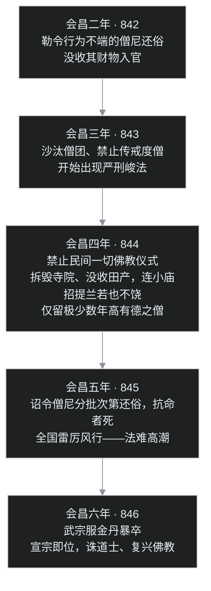
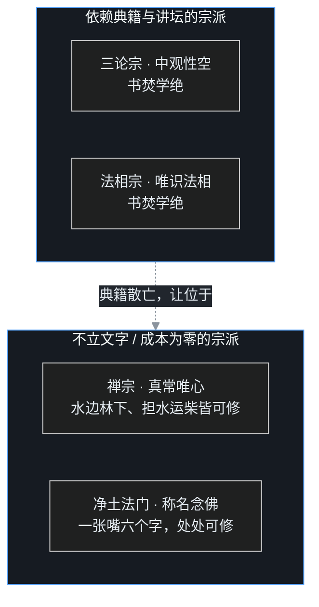

## 小白交底

先把这一篇要讲的摊开：

1. 唐代佛教的盛夏，结束于一支笔与一道诏令：一支笔是韩愈的《谏迎佛骨表》，一道诏令是唐武宗的会昌灭佛——**一个在朝外斥佛，一个在朝内灭佛**。
2. 韩愈是唐宋古文八大家之首，以儒家道统自居，对佛、老开出的药方是「人其人、火其书、庐其居」——让僧道还俗、烧掉经书、没收寺观。但韩愈终其一生只是文章辟佛，并没能撼动佛教。
3. 会昌法难是「三武一宗」四次灭佛里最惨烈的一次：大一统帝国雷厉风行，拆毁大寺四千六百余所、民间招提兰若四万余所，二十六万余名僧尼被迫还俗，佛教几乎被连根拔起。
4. 但唐代老百姓的佛教另有一番热闹：法会、盂兰盆会、悲田养病坊，还有把佛经改写成故事来讲的「俗讲」；俗讲的底本叫「变文」，清末由敦煌藏经洞重见天日，后来的话本、弹词、宝卷、戏曲都受过它滋养。
5. 法难之后，依赖典籍的三论、法相一蹶不振，不立文字的禅宗、称名可修的净土活了下来——**中国佛教的格局，从此改写**。

## 一、韩愈：文起八代之衰，道承孔孟之统

### 古文运动的旗手

先认识这个人。韩愈（768—824），字退之，河阳人，郡望昌黎，世称韩昌黎。韩愈是**唐宋八大家之首**——而且不是普通的第一，古文运动正是由其一手发起，把骈四俪六、堆砌辞藻的文风扭转回先秦两汉的散体古文，苏东坡后来称许韩愈「**文起八代之衰，道济天下之溺**」。

但韩愈绝不仅仅想当文学家。韩愈真正的自我期待，是做**儒家道统的继承人**。

### 道统：一条若隐若现的谱系

在著名的《原道》里，韩愈竖起一条「道统」谱系：儒家之道，由尧传舜、舜传禹、禹传汤、汤传周文王、周武王与周公，再传孔子，孔子传孟子——「**轲之死，不得其传焉**」，孟子一死，这条线就断了。

言下之意再明显不过：千载之下，是我韩愈来接这一棒。「舍我其谁」的气魄，孟子有过，韩愈也有。课程里说得直白：韩愈认为到了唐代，道统就是传到自己身上了。

### 辟佛老：不塞不流，不止不行

道统意识极强的韩愈，把佛教与道教都看成这条正道上的梗阻。《原道》给佛、老开出的处置方案只有九字：

> 不塞不流，不止不行。**人其人，火其书，庐其居**，明先王之道以道之。

翻译成白话：不把佛、道堵住，儒家的圣人之道就推行不开；让僧尼道士还俗成为纳税服役的平民（「人其人」），把二教的经书烧掉（「火其书」），把寺观没收改作民居（「庐其居」），然后用先王之道教化这批人。

需要看清的是韩愈所处的时代：那时从印度移植过来的佛教，早已度过移植期，完成了中国化——八宗全部确立，天台、华严的哲学体系甚至是本土思想从未达到的高度。可韩愈出于强烈的本土道统意识，对佛教的精华不愿了解，开出的是「全面废止」的猛药。课程里有一句评价很冷静：韩愈没有想到，一个民族不可能没有宗教生活。

## 二、元和十四年：佛骨入禁中，举国皆狂

### 法门寺迎佛骨

引爆韩愈的，是法门寺的佛骨事件。

法门寺在长安西边的扶风（今天陕西宝鸡扶风），寺内护国真身塔下供有一节佛指舍利，唐室有迎奉佛骨入宫的传统。元和十四年（819 年），唐宪宗派遣中使持香花，把佛骨迎入皇宫大内供养，随后再送到京城各寺轮流供奉。

### 举国若狂：散财、燃顶、灼身

一场宗教活动，迅速演变成举国若狂的骚动。课程里记的景象触目惊心：

- 老百姓荒废本业，王公士庶奔走舍施，唯恐在后；沿途有人把全部珍宝散在佛骨经过的路上；
- 更有信众**燃顶、燃指**——烧头顶、烧手指，甚至用刀割灼自己的身体，以为这就是对佛的供养。

叶扬这里必须替佛陀说句公道话。佛教出家戒律的根本精神是不杀生——包括不伤害自己；在家人获得福报的正道是布施、持戒与修善，福报是正信正行修来的，绝不是拿伤害身体去「换」来的。民间这种「交易式」狂热，与佛法的理性精神背道而驰。顺带厘清一件事：许多人以为和尚烧戒疤是千年老规矩，其实**唐代没有烧戒疤之制**，燃顶为戒是后世——一般认为迟至元代——才形成的习俗，并非佛门古礼。

### 《谏迎佛骨表》：投诸水火，永绝根本

乱象当前，韩愈上了那篇名垂青史的《谏迎佛骨表》。表文措辞之激烈，千古之下读着都替韩愈捏汗：

- 先说佛不过是「夷狄之人」，与中国语言不通、衣服殊制，「不知君臣之义、父子之情」；
- 再翻历史账：佛教入华之前，帝王在位长、寿命高；佛教流行之后，「事佛渐谨，年代尤促」——越是虔诚信佛的朝代，国祚越短、皇帝寿数越夭；
- 最后给出处置意见：把佛骨「**投诸水火，永绝根本**」，断天下之疑、绝后代之惑，并宣称若佛真有灵、要降灾祸，都由韩愈一人承当。

### 一封朝奏九重天，夕贬潮州路八千

宪宗果然大怒，对大臣说：韩愈说朕奉佛太过，还可以容忍；竟说东汉以后奉佛的天子都短命，这话何等乖谬忤逆！于是要处死刑，经宰相与贵戚求情，最终把韩愈贬到八千里外的潮州（今广东潮州）做刺史。

赴贬所途中，行至蓝关，侄孙韩湘——就是民间八仙里「韩湘子」的原型——赶来送行。韩愈写下《左迁至蓝关示侄孙湘》：

> 一封朝奏九重天，夕贬潮州路八千。
> 欲为圣明除弊事，肯将衰朽惜残年！
> 云横秦岭家何在？雪拥蓝关马不前。
> 知汝远来应有意，好收吾骨瘴江边。

「欲为圣明除弊事，肯将衰朽惜残年」——为给朝廷除掉弊政，一把老骨头何足顾惜。这是韩愈给自己的定评：韩愈真心认为这是在辟邪说、正人心，虽九死而不悔。

### 一桩疑案：韩愈真是服丹药而死？

韩愈排佛最力，于是佛教这边长期流传一种说法：韩愈晚年服食道教丹药，终以自误。这桩公案的源头是白居易的《思旧》诗——诗中怀念几位故去的老友，有「退之服硫黄，一病讫不痊」之句，微之（元稹）等人也在列。

不过历来为韩愈辩诬者不少。课程里采信的考证是：韩愈有家族遗传的痼疾，常年服药调理，所服是药性偏猛的中药，并非道士烧炼的丹药；《思旧》诗一首，竟让「退之服硫黄」成了千古波澜。至于唐代士人服食金石成风、多位帝王死于丹药，则是另一笔可以坐实的账——到会昌那一节再算。

## 三、辟佛为何失败：只罪其迹，不知其中

### 文章之士，撼不动一个宗教

韩愈的辟佛，在当时几乎没有实际影响。原因很实在：韩愈是文章之士，能写檄文，却拿不出一个可以取而代之的、宏大精密的哲学体系。一种宗教满足的是人心对生死、超越的需求，仅靠骂，骂不倒。

韩愈的好友柳宗元就不以为然。柳宗元好与僧人游处，写信直言批评：你所怪罪的，只是佛教表现在外的「迹」——剃发、穿缁衣、不婚娶、不事生产、不供养父母——这些习俗与中华礼法冲突，我看了也不赞成；可你对佛教的「中」——内在的义理精华——完全不研究，「**是知石而不知韫玉也**」：只看见一块璞石粗糙的外皮，不知道石头里包着美玉。

### 孔子存而不论的问题

韩愈要捍卫的儒家，在生死问题上本来就采取「存而不论」的姿态。《论语·先进》记子路问鬼神之事，孔子答：「**未能事人，焉能事鬼？**」子路再问死，孔子答：「**未知生，焉知死？**」

这不是孔子没有答案，而是儒家的选择：先把活着的事、人伦日用的事办好，对死后世界不作玄谈。儒家本就生在忧患之中，最重现实人生。可老百姓对生前死后天然好奇——死亡这件事，终究需要一个解释。

### 佛教补上的那块拼图

佛教传入，恰好把儒家悬置的那块拼图接上了：因果业报、三世轮回告诉人们，众生在轮回中流转，今生的境遇由自己过去的业行决定，未来的走向也同样掌握在自己手里。

这带来一种很积极的人生观：**决定命运的不是神的赏罚，而是自己的业**。再加上禅修与一整套关于心性的精密分析——这是中国思想此前没有的维度。

课程里引了梁启超的一段评论，说得很开阔：中华文明因山海阻隔，长期相对独立地发展；直到佛教输入，中国的聪明才智之士才第一次意识到，诸子六经之外另有学问，另一个民族在某些领域的创造甚至超过我们。佛教是中华文明第一次大规模、深层次的中外文明对话——这层意义，韩愈没有看见。

### 账不该算在佛陀头上

公允地作个小结：法门寺前那种疯狂「交易式」信仰，确实是佛教在民间被扭曲的一面；但这是出于人的愚痴与对佛法的不了解，账不该记在佛陀的教法上。韩愈的愤怒有真实的社会观察做底，却因拒绝理解，把「民间迷信」与「佛教本身」一锅端了。

## 四、庶民佛教：法会、慈善与俗讲变文

### 一年到头的佛教生活

把视角从朝堂转到民间。唐代普通百姓的佛教生活，与今天汉传佛教的样貌已经非常接近：

- **法会时节**：佛诞日、佛成道日、盂兰盆会、受八关斋戒，或为特定祈愿举办斋会；甚至皇室诞辰、国忌日也由寺院举办法会。
- **法会程序**：先赞佛，再诵经，然后祈福，最后回向——这套结构沿用至今。
- **常诵经典**：以《法华经》为主，另有《金刚经》《心经》《药师经》，与现在民间法会也几乎一样。

「斋」本指临时设食供养出家人，称斋会；后来法会与斋会合流，法会结束后向所有参与者供斋，也叫斋会。

### 悲田养病坊：古代的养老院与医院

唐代佛教为落实大乘菩萨道，发展出一整套社会福利事业，最有代表性的是**悲田养病坊**：

- **悲田院**收容鳏寡孤独、废疾无依之人，相当于古代的养老院、孤儿院；
- **养病**一项，重病者可住进来调养，病愈离去；轻症者则由寺院请医诊脉、布施药物，带药回家。

此外还有**宿坊**：古代交通不便，寺院向行旅客商提供住宿，对住不起旅店的穷人尤其重要——一般免费，连吃住一并供给，全凭来客自愿供养。施食、治水、筑路、架桥、种树、济贫，这类公益事业在唐代寺院同样常见。在国家福利体系尚未完备的时代，寺院事实上承担了大量社会救济功能。

### 复讲与俗讲：从培训制度到平民讲席

先厘清两个概念。

**复讲**是一种讲经人才培训制度，东晋道安时已有：师父讲完一段经文，弟子照着所讲复述阐发。好处是保障说法准确、培养讲席人才；代价是讲法日益形式化、制式化，内容也退化成单纯的知识记诵。

**俗讲**则是面向平民的布道艺术。唐代寺院为普及佛法，常举办俗讲，主讲者称俗讲僧，用最平易通俗、趣味盎然的方式讲说经典，在因果报应、奖善惩恶处尤其浓墨重彩。大乘经典想象力瑰丽，天然适合俗讲。

俗讲的表演程式是三段：**都讲先唱一段经文**，主讲僧接着通俗讲解，最后以韵文吟唱收束、复述经义。唐人笔记里留下的记载：俗讲僧口才惊人，讲到善报令满座欢欣，讲到恶报令人惴惴不安，讲到地狱相则听者战栗落泪——感染力极强，许多人当场就改过迁善。

### 变文：把佛经「变」成故事

俗讲要持续讲、反复讲，光靠临场发挥不行，于是与复讲制度结合，慢慢形成固定的讲唱底本，称「讲经文」；这一类讲唱底本，就是后来所说的**变文**。著名的篇目有《八相变文》《降魔变文》《大目连救母变文》《维摩诘经变文》等。

「变」是什么意思？就是**改变、改编**——把深奥难懂的佛经，改编成人人能懂、能看能听的故事；正如敦煌壁画里的「经变图」，是把经文「变」成图画。

### 被遗忘的文体，敦煌让它重生

变文在文学史上有个了不起的位置。中国正统文学里，散文与韵文界限分明；俗讲、变文恰恰是**散韵合体、讲唱夹杂**——这一下把两种文体的界限打散了。后来的话本、弹词、宝卷、白话小说，乃至戏曲里「念白＋唱段」的结构（京剧、梆子、歌仔戏都是先讲一段、再唱一段，唱段与念白相间、彼此生发），都能在变文里找到源头。

可变文因为太通俗、地位不登大雅，随讲唱文学的更新而被遗忘。直到清朝末年——1900 年前后——敦煌藏经洞被发现，洞中封藏千年的变文写卷重见天日，世人才重新认识这种文体，连带明白了话本、戏曲的远祖是谁。

## 五、会昌法难：一个统一帝国的灭佛

### 灭佛的三重底色

现在回到朝堂，讲「三武一宗」里最惨烈的一「武」——唐武宗。

**第一重底色是道教。** 道教攀附老子李耳为教主，李唐皇室又自认是老子后代，所以唐室对道教素来尊崇。武宗即位前就好道术，与两位兄长敬宗、文宗一样；道士**赵归真**早在敬宗朝便已出入宫禁，文宗初一度被流放；武宗即位后复受召入，宠信无比，与道士刘玄靖、邓元起等人一道，天天在皇帝面前抨击佛教。

道教能吸引帝王，还有第二张王牌：长生久视之术。中晚唐的宪宗、穆宗、武宗、宣宗——其中还包括几位信佛的皇帝——死因都直接间接与服食道士金丹有关。贪图长生而吞金服丹，结果速死，是唐代宫廷反复上演的讽刺剧。

**第二重底色是宰相。** 宰相**李德裕**出身赵郡李氏，以儒生自居，信奉道教，素来厌恶佛教，对灭佛极力赞成。宫禁与朝堂两股力量合流，武宗遂下灭佛的决心。

**第三重底色是财赋。** 当时僧团人数庞大、寺产丰饶，不输课、免徭役，间接侵蚀国家财政；僧团中也确有少数违戒败德之人，成了朝廷排佛的口实。

《新唐书·武宗本纪》有一段很不客气的评论：武宗废佛，势锐不可当；可武宗本人却毕恭毕敬地接受道教符箓，服食丹药、追求长生——可见并非什么洞明不受惑的君主，不过是**爱好道教、厌恶佛教，好恶不同而已**。所谓灭佛，骨子里是宗教好恶与对外来宗教的排斥。

### 圆仁目击：一个日本僧的噩梦

会昌法难的详细经过，最珍贵的第一手记录来自一位日本僧人——**圆仁**。圆仁是日本天台宗请益僧，随遣唐使入唐，在大唐游学巡礼，在长安居留期间遭遇灭佛，被勒令还俗。外国僧众被集中管束，没有遭杀害；圆仁的归国申请递了几乎上百次（据其自述），才最终获准东返。

回国后，圆仁写成《入唐求法巡礼行记》，以汉文逐日记录在唐见闻，会昌法难的全过程赖此书留下详尽现场。这部行记与玄奘《大唐西域记》、马可·波罗《东方见闻录》并称，是古代东亚世界的三大旅行记之一。

### 步步升级：会昌二年到六年

灭佛不是一朝一夕，而是逐年加压。课程里据《入唐求法巡礼行记》排出的过程如下：

### 会昌五年的总账本

法难的战果（站在佛教立场，应叫浩劫），以会昌五年的统计最触目惊心：

据《旧唐书》等记载：拆毁国家大寺四千六百余所，拆毁民间招提、兰若四万余所；僧尼被迫还俗者**二十六万零五百人**，全部收为「两税户」——从此按夏秋两季向国家纳税服役。经卷大量焚毁，佛像与铜质法器凡不能保留的，一律熔铸为铜钱、农具。

叶扬拿当时人口做个对照：唐代升平时期人口约有数千万，二十六万僧尼之数不算顶大，却也绝非小数；更要紧的是，这是对整个佛教组织、经济与文化传承的系统性拆除。

### 唯一的例外：河朔三镇

大一统帝国的诏令，也有行不通的角落——河朔三镇。

安史之乱后，河北的卢龙、成德、魏博三镇节度使拥兵自重，户籍赋税不隶中央，朝廷号令本就难以直达。三镇节度使多为佛教徒，诏书到时公然拒绝：此地不灭佛。武宗也无可奈何。正是这片「法外之地」保全了三宝一脉，后来成为佛教复兴的重要火种。

### 浩劫里的普通人

法难的代价最终落在具体的人身上。课程里特别讲了两类惨状：

- **老弱僧尼无以为生**：许多出家人远离乡关、与俗家早已断了往来，青壮年还俗尚可务农纳税，老病之人衣食无着，流为盗贼；一旦被官捕获，又遭严刑拷问，罪加一等。
- **社会救济全面中断**：寺院的悲田养病坊关闭，老人、病人失所照顾。后来李德裕也发现问题严重，赶紧奏请朝廷另设机构安置善后。

## 六、法难之后：谁活了下来

### 大乘三系，灭二存一

法难对中国佛教最深远的影响，不在数字，而在**思想版图**。课程里用大乘佛教三系的框架作了总结：

- **中观性空一系**——汉地的三论宗；
- **唯识法相一系**——玄奘、窥基的法相宗；
- **真常唯心、如来藏一系**——禅宗所接续的血脉。

灭佛之前，三论、天台、法相、华严鼎盛，禅宗的声势远不能与它们相比。灭佛之后，格局翻转。

### 为什么禅能活

原因不复杂，却决定了千年格局：

- 禅宗**不立文字**，不靠经卷与讲坛，也就不怕烧书；禅者山居水边、林下镢头边皆可安坐，加之普请劳作、身体力行，生存力极强。
- 三论、法相那类重义理、重思辨的学问，**书籍焚毁、传承离散，便无从研究**——从此三论、法相在汉地长期消失。

结果是：若单论义学三系，印度大乘三系到汉地，只余真常唯心、如来藏这一系瓜瓞绵延，宋元以下的中国人提到「佛法」，想到的几乎全是「明心见性」「即心是佛」——一种丰富的传统，被读成了单一的面貌。

### 净土同样独活

不依赖寺院经济、人人能修的净土宗，与禅宗一样在废墟中存活。这一禅一净的胜出，前一篇结尾已经埋了线；此后千年，「禅净」几乎就是汉传佛教的代名词。

### 尾声：武宗之死与宣宗兴佛

颇具讽刺意味的是，灭佛最力的武宗，在会昌六年（846 年）三月——灭佛高潮后仅仅半年多——就因服食金丹，暴病而亡，年仅三十余岁。叔父宣宗即位，当年五月便诛杀刘玄靖等十二名道士，下令恢复佛教。

佛教在民间根基极深，虽遭重创，复兴也快；但盛夏的元气终究再难完全复原。而唯识、中观两大思想传统，要等到近代——欧洲佛学研究刺激日本，日本再影响中国——才重新回到汉语知识界的视野。

## 写在最后

唐代八宗的盛夏，到此随法难落幕：义学大宗凋零，禅净接棒，高僧们在山里、在民间继续点灯。

只是唐朝自己也走到了尾声。接下来的五代十国，是中国佛教的「转季」时节：北方有最后一次「三武一宗」之厄——后周世宗限佛；东南有虔诚护教的吴越国王，搜求典籍、营建伽蓝；还有永明延寿这样的高僧，以一代宗师的身份倡「禅净合一」，接续前一篇埋过的禅净双修那条线。乱世里佛教如何转进、重心如何南移？中24 接着讲。

## 术语表

| 词 | 解释 |
|---|---|
| 韩愈 | 768—824，字退之，古文运动领袖、唐宋八大家之首，著《原道》《谏迎佛骨表》力辟佛老 |
| 道统 | 韩愈所标举的儒家传道谱系：尧舜禹汤文武周公孔孟，孟子死后不得其传 |
| 古文运动 | 韩愈、柳宗元倡导，弃骈俪、复先秦两汉散体古文 |
| 人其人火其书庐其居 | 《原道》处置佛老之策：还俗、焚经、没收寺观 |
| 佛骨 / 佛指舍利 | 法门寺真身塔所供，元和十四年宪宗迎入禁中 |
| 法门寺 | 在今陕西宝鸡扶风，长安以西，唐代皇家寺院 |
| 谏迎佛骨表 | 819 年韩愈上宪宗书，请将佛骨「投诸水火」，因此被贬潮州 |
| 潮州 | 今广东潮州，韩愈贬所，「夕贬潮州路八千」 |
| 左迁至蓝关示侄孙湘 | 韩愈贬谪途中诗，「欲为圣明除弊事，肯将衰朽惜残年」 |
| 韩湘 | 韩愈侄孙，民间八仙「韩湘子」的原型 |
| 思旧 | 白居易诗，「退之服硫黄」一句引发韩愈服丹疑案 |
| 柳宗元 | 韩愈好友，批韩愈「知石而不知韫玉」，只罪佛教之迹、不知其中 |
| 未能事人焉能事鬼 / 未知生焉知死 | 《论语·先进》孔子答子路，儒家对鬼神生死存而不论 |
| 梁启超论佛教 | 佛教入华使中华文明首次系统接触另一高等文明 |
| 盂兰盆会 | 依目连救母缘起的法会，唐代民间岁时佛教活动之一 |
| 八关斋戒 | 在家信众短期受持的斋戒 |
| 国忌日 | 帝王、先皇忌辰，由官寺举办法会行香 |
| 斋会 | 本指临时设食供养僧众，后与法会合流、会后供斋 |
| 悲田养病坊 | 唐代寺院所办，收容鳏寡孤独废疾、施医养病 |
| 宿坊 | 寺院附设的客舍，供行旅客商食宿，多免费 |
| 复讲 | 讲经人才培训制度：师父讲后弟子复述，起于东晋道安 |
| 俗讲 | 寺院面向平民的通俗讲经，由俗讲僧主讲，重因果报应 |
| 都讲 / 主讲 | 俗讲程式：都讲唱经，主讲阐发，末以韵文收束 |
| 变文 | 俗讲的讲唱底本，散韵合体，把佛经改编成故事 |
| 「变」 | 改变、改编，如经变图之「变」 |
| 八相变 / 降魔变 / 目连变 / 维摩变 | 唐代著名变文代表篇目 |
| 藏经洞 | 敦煌莫高窟藏经洞，1900 年前后发现，变文写卷重见天日 |
| 三武一宗 | 北魏太武、北周武帝、唐武宗、后周世宗四次灭佛 |
| 唐武宗 | 814—846，崇道灭佛，年号会昌 |
| 赵归真 / 刘玄靖 / 邓元起 | 武宗崇信的道士，怂恿灭佛 |
| 李德裕 | 武宗朝宰相，赵郡李氏，支持灭佛，法难后主持善后 |
| 圆仁 | 日本天台宗请益僧，亲历法难，著《入唐求法巡礼行记》 |
| 入唐求法巡礼行记 | 圆仁汉文日记，会昌法难第一现场记录 |
| 会昌二年至五年 | 842—845，灭佛逐年升级：还俗→沙汰→拆寺→全面还俗 |
| 四千六百余寺 / 四万余兰若 | 会昌五年统计：大寺与民间招提兰若拆毁数 |
| 二十六万零五百人 | 还俗僧尼之数，收充两税户 |
| 两税户 | 按夏秋两季向国家纳税服役的民户 |
| 讲经文 | 俗讲的固定底本，散韵合体；与变文属同一类讲唱文学 |
| 普请 | 禅寺上下集体出坡劳作之制 |
| 戒疤 | 后世（一说元代）燃顶为戒之俗，非佛门古制 |
| 河朔三镇 | 卢龙、成德、魏博，拒奉灭佛诏，保全三宝 |
| 大乘三系 | 中观性空、唯识法相、真常唯心（如来藏） |
| 宣宗 | 武宗叔父，846 即位，诛道士、复兴佛教 |
