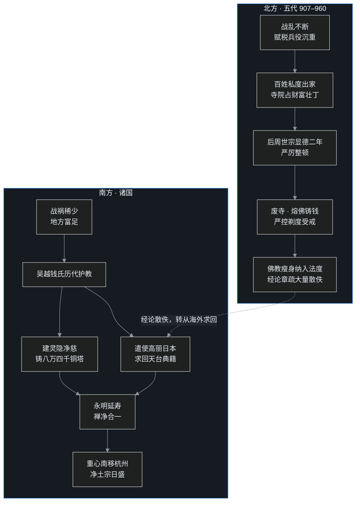

## 小白交底

进入这一篇之前，先把要讲的事情摊成五句话：

1. 唐亡之后的**半个世纪**（907–960），中原换了五个短命王朝，南方割据着若干小国，这就是「五代十国」。它们本质上都是唐末藩镇军阀的延续。
2. 北方战乱不断，活不下去的百姓纷纷出家，私度成风、寺院占着财富和壮丁。五代最后一朝后周的皇帝世宗柴荣，为了富国强兵，发动了中国佛教史上「三武一宗」四次大法难的最后一次。
3. 但世宗灭佛，和前面三次不太一样：皇帝没有要佛教的命，而是做了一次极其严厉的整顿——砍寺院、严控出家、连铜佛像都熔了铸钱。
4. 同一时期的南方却是另一番天地。尤其以杭州为都城的吴越国，几代国王虔诚护教，建寺、造塔、还从高丽和日本把散佚的天台典籍一本本买回来，佛教的重心就此从长安、洛阳迁到了江南。
5. 吴越国里出了一位大宗师永明延寿：延寿本是以坐禅参究心性为本的禅宗（法眼宗）传人，却敞开大门，把靠念佛求生西方净土的净土法门也请了进来。延寿这一步，悄悄拨动了千年后佛教格局的天平。

一面是皇帝抡刀，一面是国王护法；北方在收，南方在养。这个短暂的乱世，成了佛教版图南移的转折点。

## 一、54 年的大乱局

故事还得从唐朝的收场说起。

安史之乱以后，唐朝中央朝廷一年年软下去，地方节度使的腰杆一年年硬起来。这些藩镇手里有兵、有地盘、有赋税，名义上是大唐的臣子，实际上是一个个土皇帝。到了唐哀帝天祐四年，也就是公元 907 年，宣武节度使朱全忠——此人还有个更出名的名字叫朱温——逼唐哀帝禅让，自己登上皇位，国号梁，定都开封。

两百八十九年的大唐，到此落幕。

朱温开的这个头，引出了中原地区一连串的走马灯：后梁、后唐、后晋、后汉、后周，五个朝代先后上场，你方唱罢我登场，国祚长的十几年，短的只有四年。因为这五个朝代名——梁、唐、晋、汉、周——在历史上都被用过，史家就在前面各加一个「后」字以示区别。这就是「五代」。

五代之外，还有「十国」：南方先后存在过吴、南唐、吴越、前蜀、后蜀、闽、楚、南汉、南平九个割据政权，再加上北方唯一一个割据小国北汉，合称十国。它们并非同时并存，而是此兴彼灭。北方五代从 907 年到 960 年赵匡胤建宋，前后不过半个世纪。

要看懂这个时代的佛教，先记住一条：**不管是北方的五代，还是南方的诸国，根子上都是唐末藩镇势力的延续**。军阀治国，规矩跟着刀把子走。南北佛教此后命运的巨大分岔，就从这条根上长出来。

## 二、北方：三武一宗的最后一宗

### 乱世里的出家潮

北方这五十多年，战争几乎没停过。今天这个皇帝来，明天那个皇帝走，赋税和兵役像两座大山，压得百姓喘不过气。老百姓找活路的办法之一，就是出家：进了寺院，有田产可依，也能逃过兵役和赋税。

于是五代朝廷一直悬着一根弦——严禁私度。什么叫私度？就是没有经过政府考试、没有拿到官方许可，私自剃度出家。隋唐以来，国家有度僧制度，想出家得经过官府组织的经文考试，合格了才放行，这叫试经度僧。道理很简单：出家的人多了，纳税和服役的人就少了，国基就空了。

可制度是一回事，执行是另一回事。五代的帝王和王公大臣，自己大多信佛。比如后唐庄宗，被刘皇后影响，信佛信得过了头，皇宫里都搞起了供僧的排场。皇帝如此虔诚，严禁私度的法令自然硬不起来。结果就是合法出家的人不算太多，可战乱中私度的人一点不少。

这不是五代才有的新鲜事。唐代就已经私度泛滥：据宋代佛教史传的记载，唐文宗时私度僧尼已多达 **70 万人**。这个数字非常惊人——要知道会昌五年唐武宗灭佛，勒令还俗的僧尼总数也不过二十六万出头。也无怪朝廷想起来就心里发紧。

寺院占着大量土地和财富，僧团里藏着大量壮丁，再加上历朝都免不了的两类乱象：一是有僧人卖弄神通妖术、图谋不轨，小则满足私欲，大则危及政权；二是有些寺院碍于人情或利养，包庇作奸犯科之人，让罪犯躲进佛门。这两类事层出不穷，在乱世军阀眼里，更是扎眼。

矛盾攒到五代最后一朝后周，终于总爆发。

### 最贤明的皇帝，下最狠的整顿令

后周世宗柴荣，是五代公认最贤明的皇帝，《旧五代史》对柴荣推崇备至。世宗即位时只有三十多岁，雄才大略，一门心思要富国强兵、结束分裂、统一天下。可后周接手的是个烂摊子：北方长期战乱，财政窘迫，兵源不足。

而世宗放眼望去——寺院有钱、有地、有铜器佛像，僧团里有现成的壮丁。佛教于是成了世宗解决困境的首选目标。柴荣还有一层更深的看法：宗教一旦和迷信搅在一起，小则扰乱治安，大则可以间接拖垮一个帝国。佛教本是讲理性、讲智慧的宗教，可弘扬和信奉它的人未必个个理性，迷信的反例并不少见。

显德二年，公元 955 年五月，整顿令正式下达。内容可以归成四档：

**第一档，从「孝」字上卡住出家的门**。诏令规定，凡是双亲年老、又没有别人侍奉的人，一律不准出家。中国人最重孝道，国家用这个标准筛人，既占住了伦理高地，也直接收窄了出家的口子。

**第二档，把出家和受戒彻底纳入国家管控**。想出家，必须经过地方官主持的经文考试，读不熟经、考不合格，不准剃度；即便出家了，要受具足戒、取得正式僧人身份，也必须经过政府批准。换句话说，从剃度到受戒，全程都必须经官方批准，私度的路被彻底封死。

**第三档，收拾宗教极端行为**。当时佛门里流行一些骇人的苦行：焚身、烧臂、燃指供养。唐宪宗迎法门寺佛骨时举国若狂，就有人干这种自残的事，韩愈在《谏迎佛骨表》里痛斥的也正是这一类风气。这件事在教内本有争议：戒律讲爱惜色身，自残之举与戒律精神相悖；可《法华经·药王菩萨本事品》又明写药王菩萨燃身供佛，《梵网经》也倡舍身，所以烧身供养历来是戒律派与经教派的长期公案，真去践行的僧人代不乏人。只是到了乱世，这类行为常与哗众取宠搅在一起。柴荣对此极为反感，诏令：凡有自残苦行、或是卖弄妖术迷惑百姓的，一律勒令还俗，情节严重的还要流放边疆。

**第四档，也是最著名的一档——熔毁天下铜佛像，用来铸钱**。废寺、禁自残、管剃度的诏令颁于五月；同年九月，朝廷再立铜禁，限期令民间把铜器、铜佛像输官，集中采铜、设立钱监铸钱。

### 一场用佛教逻辑打赢的御前辩论

熔佛铸钱，朝野反对声四起。五代战乱，铜钱奇缺，而佛像恰恰是当时最大的铜储备。可在大臣和百姓看来，把佛像毁了，是要遭报应的大事，谁敢动手？

柴荣面对劝谏，说了一番极漂亮的话。大意是：朕听说佛陀向来把这个肉身看成虚妄不实之物，把利益众生当成头等急事。假使佛的真身还在世上，只要对世人有利，佛连自己的肉身都愿意割下来布施——何况这只是一尊铜像呢？佛哪里会舍不得？

这话一出，大臣们哑口无言，没人再敢劝谏。

这是一场高难度的辩论：反对者拿佛教的敬畏堵皇帝的嘴，世宗就反手用佛教自己的故事破局。佛经里到处是佛陀过去生中行菩萨道、割肉饲鹰、舍身饲虎的本生故事，崇佛的人在这套逻辑面前根本无法反驳。皇帝未必真不敬佛，但世宗算得很清楚：佛理支持皇帝这么干。

### 灭佛的账本：两个数字，差了十倍

这场整顿的规模，史书留下了一笔账，而且两本重要史书的数字几乎差了十倍，值得如实摆出来：

- 废除的寺院：宋代佛教史书《佛祖统纪》记作 **3336 所**；而正史《旧五代史》记作 **30336 所**。两个数字相差近十倍，史家历来各有取舍。
- 保留的寺院：《旧五代史》记作 **2694 所**，保留下来的都是规模较大、地位较重要的寺院。
- 登记在册的僧尼：共 **61200 人**。

把这几个数字放在一起，就能看清柴荣灭佛的性质：**这不是把佛教连根铲除，而是一次极其严格的瘦身整顿**。近三千所寺院、六万多名僧尼原封保留，国家也没有禁止任何人出家——只是从此以后，出家必须合法。

对比一下就知道它的特别：前三武的暴力程度其实并不一样——北魏太武帝一役下过「沙门无少长悉坑之」的诛杀令；北周武帝、唐武宗两役则以废毁寺院、勒令还俗为主，屠戮甚轻，北周武帝那次更被史家看作「不流血的整顿」。而柴荣这一次最为温和，刀不沾血，落点纯在制度改造。世宗是「三武一宗」里唯一以法度整顿、而非以诛杀灭教开场的一位，也是最后一位。

### 北方的残局

整顿的初衷是富国强兵，效果也确实有——铜钱铸出来了，户口和兵源松动了。可对北方佛教来说，伤口很深。

一是寺院荒废、经典流失。五代本来就战乱不断，大量写本在战火中散佚，柴荣的整顿又让这个过程加速恶化。隋唐八宗里，那些高度依赖经论的宗派——三论宗、法相宗、华严宗、天台宗的章疏，连同历代祖师的著作，丧失了一大批（天台教籍散佚到要跨海求购的地步，下文再表）；倒是不立文字的禅宗、只靠一句佛号的净土宗，因为不背经典的包袱，受创最轻。

二是僧团纪律被国家威权碾碎。上面定政策的人或许还算理性，下面执行的官吏却往往手段粗暴、不讲道理。僧团不能按自己的戒律和清规生活，终日在恐惧不安中打发日子，纪律自然维持不住。

经典散佚到什么地步？散佚到后来要向高丽、向日本去求、去买，才能把汉地祖师的著作补回来。这件事，正好要由南方的另一位国王来完成。

## 三、南方：钱氏治下的「东南佛国」

### 北方打仗，南方烧香

时间线拉回同一时期的南方——要讲的这位国王，正是吴越国主；而吴越的故事，得先从南方的大环境铺开。

南方战祸少、日子富足，南方的国君又大多信奉佛教，于是高僧大德纷纷南渡，南方佛教一片兴盛。其中最突出的两家，是吴越国和南唐。

先说吴越。吴越国以杭州为都城，版图主要在今天的浙江、苏南一带。它的开国国君钱镠，出身盐贩，在唐末乱世里凭军功割据两浙，907 年受后梁封为吴越王。难能可贵的是，钱镠定下了一条保命又保境的国策：事奉中原王朝、不轻启战端、埋头发展本土。于是当北方打得头破血流时，两浙一带反倒太平富庶。

钱镠和后继者，几乎人人都是虔诚的佛教徒。钱氏在境内大建道场，前后新建、重修的寺院有数百所之多。今天杭州的两大名刹，都和钱家关系极深：

- **灵隐寺**：早在东晋咸和元年（326）就由慧理和尚开山，是江南最古老的寺院之一；吴越末代国王钱俶在位时，对它大举扩建，殿宇林立，一举成为江南名刹。
- **净慈寺**：钱俶在西湖南屏山下专门兴建，最初叫慧日永明院，请来高僧住持——这位住持，正是下一节的主角永明延寿。

钱俶还效仿阿育王的故事，铸造了八万四千座小小的铜塔，每座只有几寸高，塔中藏入《宝箧印陀罗尼经》，分送到各地供养安放。今天文物界所称的「钱弘俶塔」「金涂塔」，实物还有不少存世。

### 从海外把天台典籍「买」回来

吴越对佛教影响最深远的一笔，是把国内打丢了的天台宗典籍，从海外找了回来。

这件事牵出三位人物。第一位是天台宗的螺溪羲寂——天台宗是天台山智顗（即智者大师）开创、以《法华经》为根本经典的宗派；羲寂住在天台山螺溪道场，眼见天台教籍在唐末战乱中散佚殆尽，痛心疾首，立志补齐。第二位是禅宗法眼宗的高僧天台德韶——德韶是吴越国的国师，深受钱俶敬重，传说为智者大师的后身。羲寂把求书的心愿辗转告诉德韶，德韶转头就向钱俶进言：典籍散在海外，应当遣使去求。

第三位就是钱俶。国王听从二人之请，派出使者，带上重礼，跨海前往高丽和日本，四处搜求天台教卷。后来高丽僧人谛观应邀携大批天台典籍来到吴越，并且留在天台山随羲寂学习。散失多年的天台章疏由此回流汉地，几乎要断绝的天台宗，在宋初重新接上了气脉。

钱俶还为羲寂重修了天台山的道场。因为钱氏历代国王持续护持，中国佛教的格局悄然改写：**向来以长安、洛阳为中心的佛教，从此转向杭州发展**。天台、华严、禅、净土、律等各宗各派，都在富庶的两浙一带蓬勃生长。「东南佛国」四个字，就是这个时候立起来的。

### 闽国与南唐：禅宗的天下

吴越之外，南方还有两块禅宗的热土。

一块是闽国，建都福州。开国君王王审知开发福建、安定地方，对福建的经济文化有开辟之功。王审知极度崇佛，把禅宗高僧雪峰义存当国师一样恭敬供养。义存门下极盛，两条龙脉都从此山发源：云门宗创始人文偃是义存的弟子；玄沙师备同样出义存门下，师备传罗汉桂琛，桂琛再传清凉文益。等于说后来横扫南方的云门、法眼两大宗派，源头都在福州雪峰山上。有闽国王室供养，福州禅风之盛，是此前从未有过的局面。

另一块是南唐，建都金陵，也就是今天的南京。南唐中主李璟（元宗）礼敬法眼宗创始人清凉文益，把文益迎到金陵住持报恩禅院、赐号甚厚；南唐定都于此，法眼宗也借王室护持在金陵发扬光大。大名鼎鼎的后主李煜，相传即位前就曾在清凉文益门下受戒，后来崇佛到了举国养僧的地步；据说宋军兵临城下时，后主还在净德院听《楞严经》——这当然成了亡国之由，但也从侧面说明南唐佛教的温度。

把吴越、闽、南唐串起来看，这一时期南方流行的几乎全是禅宗，尤其法眼宗和云门宗最盛。北方在拆庙，南方在开堂，佛教的人才和元气，就这样一点点南移了。

## 四、永明延寿：一位禅师，为净土推开大门

### 从死囚到国师

南方佛教的塔尖人物，是永明延寿。

延寿生于 904 年，俗姓王，生长在余杭。延寿自幼信佛，博通经论，后来做了掌管官府财物的官吏。此人有个出名的故事：笃信放生，竟然挪用官钱买来鱼虾放生，事情败露，被判了死刑。押赴刑场时，延寿面色坦然。当时的吴越国王听说延寿是为了放生而亏空公款、一毫不入私囊，下令释放，听任延寿出家。

出家之后，延寿先投翠岩令参，后来参拜天台德韶，德韶一见便认可延寿的见地，密授玄旨——延寿由此成为禅宗法眼宗的嫡传传人。延寿在明州雪窦山住持传法，法缘日盛。到了吴越末代，钱俶先请延寿复兴灵隐寺，第二年又请延寿住进新建的慧日永明院，也就是净慈寺。延寿在这里住持十五年，度弟子一千七百人，常住僧众常逾千数，世人尊称为「永明和尚」，圆寂后谥号智觉禅师。

### 《宗镜录》：举一心为宗

延寿不是只会机锋的禅师，而是禅宗史上罕见的「学者型」大宗师，著作等身，最重要的两部书是《宗镜录》和《万善同归集》。

《宗镜录》整整一百卷，书名取自两句话：**举一心为宗，照万法如镜**。意思是，千经万论、一切法门，都以这「一心」为根本宗旨，抓住了它，千差万别的万法就像镜子照物一样清清楚楚。

这部大书的结构分三大章：

- **标宗章**：开门见山，讲明什么是「即心即佛」，什么是禅教一致，把宗旨立起来；
- **问答章**：假设种种疑问，层层问答，把修行路上的疑惑一个个掰开；
- **引证章**：大量引用大乘经论和历代祖师的法语来作证，让每一个论点都有出处。

一部禅宗的书，能把经教、唯识、天台、华严熔于一炉，在当时是破天荒的格局。

为什么要写这么一部大书？延寿看到了禅宗的末流之弊。禅宗本讲不立文字、直指人心，可到了五代，根基浅薄的人学禅宗，专学外在的狂样：把呵佛骂祖当洒脱，把劈佛像烧火、南泉斩猫当手段。那些动作是古来大宗师为破执着的非常之举，当事人有那种证量才使得出；后来者没有那个功夫，盲目模仿，只会堕入狂妄野狐。延寿写《宗镜录》，就是要用系统的教理，把这种偏颇的学风扭回来——禅宗从「不立文字」转向「不离文字」，延寿正是最关键的一位转折人物。

### 禅净合一：万善同归

延寿的另一大主张，让自身的影响远远越出禅宗，这就是禅净合一。

延寿虽然是法眼宗的禅师，却认定净土念佛法门简单稳当、最能接引广大根器的众生，于是把净土大大方方请进自己的教化。延寿的《万善同归集》用问答体写成：念佛、拜忏、持咒、礼佛、诵经……一切善行、一切法门，看似路径不同，最终殊途同归，都归向净土、归向一心。

那首在后世流传极广、托名延寿的《禅净四料简》，把这个立场说得最直白：「有禅有净土，犹如戴角虎。」——禅宗的见地加上净土的行持，就像老虎头上长角，所向无敌。这个意象，在讲净土宗的中22 里已经提前打过照面。

延寿以一代禅宗宗师的身份，替念佛法门背书，影响极其深远：从此大量禅师学着用净土法门接引众生，禅净合流成了宋代以后汉传佛教的主流走向。普通百姓不参禅没关系，念一句「南无阿弥陀佛」照样能了生死——门槛一旦这么低，净土宗的信众便爆炸式增长，到明清时期，净土宗彻底取代禅宗，成为汉传佛教第一大宗。

后世净土宗奉延寿为第六代祖师，而延寿的禅宗法脉同样清晰。一个人同时站在两大宗的祖师堂里，整部中国佛教史上都没有几位。

## 一张图看懂：北方收，南方养

把全篇的两条线索并排画出来，五代虽然只有半个世纪，佛教版图却从此换了重心。

北方在压缩、在管控，把佛教收进国家的账本；南方在兴建、在赎书，把佛教的元气和人才一并接住。两条线一收一养之间，长安、洛阳的时代落幕，杭州的时代开场。

## 写在最后

五代十国只有短短半个世纪，像两场大戏之间的过场，可这个过场改变的东西，比很多大一统朝代还多。

它给四次大法难画上了句号。柴荣的整顿是「三武一宗」的最后一宗，此后近一千年，除了宋徽宗初年那道一年即废的改佛诏令（令佛改号「大觉金仙」、僧称德士）之外，中国再没有出现过全国规模的灭佛运动。原因值得玩味：宋代以后，度牒制度和寺院经济被牢牢纳入国家管理，出家人数、寺院产业从「宗教问题」变成了「财政问题」，朝廷用账本能解决的事，就不必动刀；而佛教也早已完成了它的中国化，禅净合一、儒释道三教调和，佛教不再是需要被提防的外来势力，而成了百姓日用伦常的一部分。刀没有再落下，是因为佛教与皇权之间找到了不必动刀的相处方式。

它还把佛教的重心从北方挪到了南方。长安、洛阳在战乱里黯淡，杭州在钱氏的供养下接过大旗，从此江南成了汉传佛教的腹地，灵隐、净慈、天台山的香火，一直烧到今天。

最后，它用永明延寿一个人，预言了此后一千年的法门格局：高深的禅宗慢慢退入书卷和公案，简易的净土走进千家万户。一句佛号，成了亿万中国人与佛教最日常的连接。

乱世很短，转折很长。下一篇，叶扬将走进北宋，看这个结束了分裂的新王朝，怎么用译经院、度牒和《开宝藏》，把佛教重新收编进一个大一统国家的秩序里。

## 术语表

| 词 | 解释 |
|---|---|
| 五代十国 | 907–960 年间，北方先后有后梁、后唐、后晋、后汉、后周五代，南方有九国、加北方北汉共十国；都是唐末藩镇势力的延续 |
| 藩镇 | 唐代地方军事长官节度使割据的势力；安史之乱后中央衰弱、藩镇坐大，终致唐亡 |
| 朱温 | 即朱全忠，原为黄巢部将，降唐后成宣武节度使；907 年篡唐建后梁，五代由此开始 |
| 后周世宗柴荣 | 五代最后一朝后周的皇帝，954–959 在位，五代第一明君；显德二年发动「三武一宗」最后一次灭佛 |
| 三武一宗 | 四次大规模灭佛：北魏太武帝、北周武帝、唐武宗、后周世宗 |
| 显德 | 后周世宗的年号；显德二年即 955 年，灭佛诏令下达之年 |
| 私度 | 未经政府考试许可私自出家；五代为避赋税兵役，私度成风 |
| 试经度僧 | 国家组织的出家考试，读经合格方准剃度；用以控制僧尼人数 |
| 度牒 | 政府发给僧尼的合法身份凭证；宋代以后成为管控佛教、补充财政的工具 |
| 具足戒 | 出家人正式受持的完整戒律，受戒后才算正式僧尼；世宗规定受戒亦须官许 |
| 焚身燃指 | 烧身、烧臂、燃指供养等苦行，本犯杀生戒，系受印度民间信仰影响流入佛门；世宗明令禁止 |
| 熔佛铸钱 | 显德二年九月世宗立铜禁、毁天下铜佛像铸钱；引《资治通鉴》「佛在利人，虽头目犹舍以布施」之说驳倒反对者 |
| 《旧五代史》 | 官修正史，载灭佛废寺 30336 所、存 2694 所、僧尼 61200 人 |
| 《佛祖统纪》 | 宋代佛教史书，载灭佛废寺 3336 所，与《旧五代史》相差近十倍 |
| 吴越国 | 五代十国之一，钱镠所建，都城杭州，907–978；历代国王虔诚护教，境内太平富庶 |
| 钱镠 | 吴越开国国君，出身盐贩，奉行保境安民、事奉中原的国策，奠定两浙太平之局 |
| 钱俶 | 吴越末代国王，又称钱弘俶；扩建灵隐、兴建净慈、铸八万四千铜塔、自海外求回天台典籍；978 年纳土归宋 |
| 灵隐寺 | 杭州名刹，东晋咸和元年（326）慧理开山，吴越钱俶扩建为江南大寺 |
| 净慈寺 | 杭州西湖南屏山下名刹，钱俶初建时名慧日永明院，延寿为第一代住持 |
| 八万四千铜塔 | 钱俶仿阿育王故事所铸小铜塔，高仅数寸，中藏《宝箧印陀罗尼经》，分送各地 |
| 法眼宗 | 禅宗五家之一，清凉文益创立，盛行于南唐、吴越；传至德韶、延寿而大盛 |
| 云门宗 | 禅宗五家之一，文偃创立，住韶州云门山；五代北宋间与法眼宗同盛于南方 |
| 天台德韶 | 法眼宗大德，吴越国师；促成钱俶遣使海外求取天台典籍 |
| 螺溪羲寂 | 天台宗高僧，住天台山螺溪道场；立志补齐散佚教籍，天台宗由之复兴 |
| 谛观 | 高丽僧人，应吴越之请携天台典籍来华，留天台山从羲寂学习 |
| 雪峰义存 | 唐末五代禅宗高僧，住福州雪峰山，闽王王审知师事之；云门文偃、玄沙师备皆出其门 |
| 玄沙师备 | 义存弟子，法眼宗的前辈祖师；经罗汉桂琛传至清凉文益 |
| 清凉文益 | 法眼宗创始人，受南唐王室师事；在金陵先住报恩禅院、后迁清凉寺，谥大法眼禅师 |
| 王审知 | 闽国开国之君，开发福建，尊崇佛教，礼敬雪峰义存 |
| 李煜 | 南唐后主，精词章、极崇佛，即位前曾在清凉文益门下受戒；南唐终为北宋所灭 |
| 永明延寿 | 904–975，法眼宗禅师、净土宗六祖；住持灵隐、净慈，主张禅净合一，著《宗镜录》《万善同归集》 |
| 《宗镜录》 | 延寿所著一百卷巨作，「举一心为宗，照万法如镜」，分标宗、问答、引证三章 |
| 标宗章 | 《宗镜录》第一章，标明即心即佛、禅教一致的宗旨 |
| 问答章 | 《宗镜录》第二章，设问答疑 |
| 引证章 | 《宗镜录》第三章，广引经论祖师语录为证 |
| 《万善同归集》 | 延寿所著，问答体；念佛、拜忏、持咒等一切善行同归净土一心 |
| 禅净合一 | 延寿所倡，禅宗见地与净土念佛并行；后成汉传佛教主流，催生净土为第一大宗 |
| 禅教一致 | 禅宗心法与经教义理不相违背；延寿以《宗镜录》系统阐发，纠正狂禅末流 |
| 《禅净四料简》 | 托名延寿的偈颂，「有禅有净土，犹如戴角虎」即出其中 |
| 一心为宗 | 《宗镜录》核心主张：一切法门皆以一心为根本 |
| 东南佛国 | 五代以后对以杭州为中心的两浙佛教盛况的称呼 |
| 禅宗 | 汉传佛教主流宗派之一，以坐禅参究心性、见性成佛为本；盛于唐宋，分出五家七宗 |
| 净土宗 | 以念佛求生西方极乐净土为宗，法门简易、最利普及；后世成汉传第一大宗 |
| 天台宗 | 智者大师（智顗）开创，以《法华经》为根本经典，因住天台山得名；五代时教籍散佚，靠吴越自海外求回 |
| 智者大师 | 即智顗（538–597），天台宗实际创始人，住天台山；后世尊为「东土释迦」 |
| 阿育王 | 公元前 3 世纪孔雀王朝的护法名王，传说铸八万四千塔供养舍利；钱俶效其故事铸小铜塔 |
| 本生故事 | 佛经中讲述佛陀过去生中行菩萨道的故事，如割肉饲鹰、舍身饲虎 |
| 机锋 | 禅师接引学人时迅捷、不落俗套的应答手段 |
| 公案 | 历代禅师的机缘话头，后世禅宗借之以参究，如南泉斩猫 |
| 唯识 | 即法相宗、瑜伽宗，重在分析心识与万法；《宗镜录》熔唯识等教义于一炉 |
| 陀罗尼 | 梵语音译，即总持、咒；如《宝箧印陀罗尼经》 |
