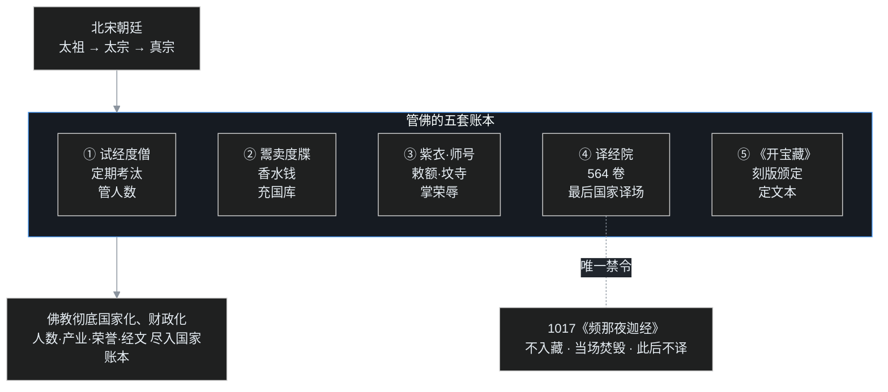

## 小白交底

进入这一篇之前，先把要讲的事情摊成五句话：

1. 960 年，赵匡胤（宋太祖）篡周建宋，定都开封，979 年太宗灭北汉，唐末五代以来的分裂局面就此结束。
2. 北宋朝廷一方面真心护佛——开国头三位皇帝太祖、太宗、真宗都是佛教的保护人；另一方面把佛教管得空前地紧——连一张出家证明（度牒）都成了明码标价的商品。
3. 太宗专门建了译经院，组织之完备史上第一，译经 564 卷；可这些新译经典几乎没有产生影响——印度佛教自己已经衰了，国内最盛的禅、净两宗又不爱啃经典。
4. 更大的事业是《开宝藏》：太祖下令在四川雕版，1076 部、5048 卷，这是中国第一部木刻大藏经。后来高丽、契丹、西夏刻藏，全都以它为蓝本。
5. 还出了一位僧官出身的史学家赞宁，写了《宋高僧传》给僧人立传立史；可近代学者陈垣对赞宁很有意见，嫌其阿附皇权、少了出家人的骨气。

护持是真的，管控也是真的。北宋这一百六十多年，佛教从「需要提防的外来势力」彻底变成了「写进国家账本的一个条目」。

## 一、宋室开张：为什么首都定在开封

故事从一场几乎不流血的政变说起。

959 年，后周世宗柴荣突然病逝，年仅三十九岁，继位的恭帝只有七岁。第二年正月，北汉勾结契丹来犯，禁军统帅赵匡胤奉命御敌，大军走到开封城北陈桥驿，将士把一件黄袍披在赵匡胤身上——这就是「陈桥兵变」。960 年建立的新王朝国号宋，历史上称北宋。

为什么定都开封，而不是周秦汉唐的古都长安、洛阳？课程里给了一个很实在的经济解释：**开封有漕运之利**。黄河、汴河、惠民河、广济河在这一带构成水运网，东南的粮食、物资可以乘船直抵城下。供养一个几十万人口的首都，靠的就是这些货船。反过来看，这说明东南地区经五代的开发，无论人口还是经济都已超过北方；上一篇讲的佛教重心南移，根子就在这里。

不过统一并不是赵匡胤在世时完成的。976 年太祖在「烛影斧声」的疑案中去世，弟弟赵光义（宋太宗）继位。979 年，太宗亲征灭北汉，才把最后一个割据政权收入版图——此时距 755 年安史之乱，已经过去二百二十四年。

北宋的故事，就从这个重归一统、经济文化全面南倾的时刻展开。

## 二、译经院：中国历史上最后一个国家译场

### 东来西去的余波

王朝强盛，对外交流随之活跃，北宋初年还真有一波求法传法的余波。

往西：太祖、太宗两朝，有道圆、行勤等一批僧人远赴天竺求法；道圆往返十八年，还带回了西域的舍利和贝叶经。往东来：印度僧人法天已在蒲州（河中府）译经，天息灾、施护等也抵达开封，带来了大量梵夹。要知道，这时距那烂陀 1203 年（一说 1193 年）的火光只剩两个多世纪，印度本土佛教已进入最后的暮色——这批东来的高僧，其实是印度佛教向外输送的最后一批火种。

### 规格最高的国家译场

得到天息灾等人带来的梵经后，980 年，宋太宗下令在开封太平兴国寺西侧建译经院，后来赐名传法院。

这不是随便找几间屋子的事。北宋译场的分工之细，超过了玄奘的时代：有译主（译场主席，执梵本读出）、证梵义（核梵文原义）、证梵文（核对文字）、笔受（把梵音写成汉字）、缀文（把语序倒装的译笔整理成通顺汉文）、参译（参对两种文字）、刊定（删削冗长）、润文（朝廷大臣总作文字润色），还有监护使臣（代表皇帝监阅）。一道经文从梵文到成文，要经过近十道工序。

整个北宋译经的总账是 **564 卷**——比起唐代译经总量（约两千卷）少得多，但组织程度是历史上最完备的。

### 为什么译出了经典却没影响

奇怪的是，这样高规格的事业，对宋代及此后的佛教几乎没有产生实质影响。原因有三个：

**一是印度佛教自己已经不行了**。此时印度本土正法式微、密教横流，新来的经典大多是密教经轨，无论教理还是禅修体系，都没有多少值得汉地再学的新东西。

**二是汉地佛教的格局已经定型**。八宗在唐代全部成立，而当时最活跃的禅宗、净土宗，一个讲不立文字，一个讲但称名号，本来就不重经教——新译经论对这两家来说，门都敲不响。

**三是新译本身量少，且没有划时代的著作**。唐代有玄奘、义净、不空那样体量的译经巨匠，宋代没有；量小而又无重磅成果，自然影响不了已经根深叶茂的旧宗派。

国家投入大、社会反应冷，这就是「最后一个国家译场」的寂寞。

## 三、一本经，曾被皇帝当场封禁

译经院时期最戏剧性的一幕，是一次「译出来就烧掉」的事件。

天禧元年，也就是 1017 年，译经院把一部来自印度的无上瑜伽密典——《频那夜迦经》四卷——翻成了汉文。频那夜迦（毗那夜迦）在印度教里是象头神的名字，这部经属于密教中以男女双修为主轴的那一类经轨，译经僧人译完以后主动向真宗报告：此经内容淫秽，不宜流通。

当时在位的宋真宗，是北宋最虔诚的皇帝之一，自己写过《崇释论》，还为《四十二章经》作注。真宗为了维护佛教的清净，当即决断：这部经**不准入藏**（不编入大藏经），以后这类经典**一律不再翻译**，译本当场焚毁。

回头看，这道诏令意味深长：它在印度密教后期经论大量涌入的关口，刹住了无上瑜伽经轨的传入——后来藏传佛教中那一套体系，汉地没有跟着走，这张禁令就是分水岭。课程里说「很庆幸」，指的正是这点。

## 四、度牒：出家证明怎样变成商品

### 试经与定期考核

先看北宋管僧的正面。和历代一样，朝廷用考试控制僧团：想出家，小沙弥阶段就得参加试经，读经合格才许剃度；已经出家的也不能一劳永逸——官府定期考核，经文生疏、表现不良的会被淘汰。

目的很明确：防止逃税的、逃兵役的、负案在逃的人涌进佛门。制度设计没问题。

### 「香水钱」：卖牒的开端

可北宋在制度上最大的污点，是沿袭了卖度牒的做法。这件事的发明权不在宋代，而在唐肃宗。

安史之乱军费枯竭，政府在戒坛度僧时收钱：谁想出家，交钱，官府发给正式度牒。这笔钱有个专门的名字——**香水钱**（也作「香火钱」，取「戒香」之意；后世「香火钱」一词的来源之一）。当时朝廷还请出了禅宗菏泽神会——慧能晚年最重要的弟子——来主持这件事，神会以佛门领袖的身份替朝廷筹得大批军饷，为平叛出了大力；但「出家证明可以花钱买」这个极坏的先例，也就此开了。

度牒为什么有人抢着买？因为它背后是一整套经济特权：持牒僧人本人免身丁钱、免徭役；剃度一僧，本户男丁并免兵役、赋税。买牒花一笔，长期省一大笔，这笔账连不想出家的人都算得过来。

### 鲁智深的那张五花度牒

这种现实被一部小说写得活灵活现——《水浒传》。

鲁达（鲁提辖）为救金翠莲父女，三拳打死「镇关西」郑屠，亡命江湖。金翠莲后来做了赵员外的外宅，赵员外为报恩，出钱买了一张**五花度牒**，把鲁达送上五台山文殊院，拜智真长老出家，法名智深。可智深不坐禅、喝酒吃肉、醉打山门，搅得全寺不宁，智真长老也无可奈何——因为来人手里的度牒是官府发的，寺院无权拒收；最后只能一封书信，把智深荐到东京大相国寺了事。

小说这段情节恰好折射现实：**买牒的人未必想出家，寺院却没有拒绝的权力**。逃税的、逃役的、躲官司的，凭一张度牒挤进僧团，僧团素质被持续稀释。

除了度牒，还有三样东西也在「经营」：一是**紫衣、师号**（皇帝赐高僧的紫色袈裟与「某某大师」名号），本来是荣典，后来可以花钱买到；二是**敕额**（皇帝赐的寺院匾额），有了敕额，寺院地位高、香火旺，各寺便钻营争请；三是**功德坟寺**——贵族在自家祖坟旁盖小寺，请僧人看坟、替先人追荐，这种寺院不如法（佛寺本不该是私家香火院），但因为主人有钱有势，最终被制度承认，还享有免税特权。《红楼梦》里贾府的铁槛寺、水月庵，读来就有这个影子。

考试在选僧，卖牒却在放劣僧；两头的政策互相拆台，僧团的风气就这样一步步坏下去。

## 五、《开宝藏》：刻进木板的佛法

### 从手抄到雕版

讲大藏经之前，先补一笔印刷史。

晚唐以前，佛经全靠手工抄录，辗转传抄既费工，又容易脱字错行。唐代印刷术慢慢成熟，现存最早有明确纪年的雕版印刷品，就是敦煌藏经洞发现的《金刚经》——卷末印着「咸通九年四月十五日王玠为二亲敬造普施」，即 **868 年**。该卷于 1907 年被斯坦因带走，今天藏在伦敦大英图书馆。

到了五代、宋初，雕版印刷以四川（益州）最发达，技术也最精。北宋的大藏经，就从这里开局。

### 13 年刻一部藏

开宝四年，也就是 **971 年**，宋太祖敕令在益州开雕大藏经，派内官张从信主持。这是中国历史上第一次用雕版大规模刻印佛经。

工程持续十三年，太祖没能看到完工：太平兴国八年（983）大藏刻成，当时已是太宗朝。成品的规模是：**1076 部、5048 卷**，分约 480 帙，卷轴装。刻好的十余万块版片被运到开封太平兴国寺印经院，从此可以随时刷印。因为开工于开宝年间，这部藏就叫《开宝藏》。

它的意义，是把佛法的保存方式从「抄在纸上的脆弱写本」变成「刻在版上的标准文本」——错字随版片定型，复制成本一落千丈，藏经第一次有了国家统一的标准本。

### 赐遍天下：东亚藏经的「祖本」

《开宝藏》不仅在国内刷印，还作为国礼对外颁赐：983 年，日本僧人奝然入宋，次年受太宗召见，获赐《开宝藏》而归；此后又赐高丽、契丹、西夏以及东女真诸国。

结果就是课程里那句分量很重的判断——**后来东亚世界的一切大藏经，几乎都以《开宝藏》为祖本**：高丽的《高丽藏》初雕本、辽代的《契丹藏》、西夏文大藏、日本的入藏，版式、帙序、经文内容都能追溯到开封这套版片。中国官版藏经对整个汉字佛教圈的标准输出，自此开始。

### 残本今何在

《开宝藏》的木版和大部分印本都在历代战火中湮灭，但残卷仍有零星存世：日本长期保有若干卷轴（曾在战后国际佛教会议上展出，引以为傲）；更重要的是 **1959 年在西藏萨迦寺发现了百余卷开宝藏印本**——北宋朝廷赐给地方或流入藏区的官印本，在高原古寺里沉睡了近九百年。这些残卷纸墨如新，今天分藏于中国国家图书馆等机构，是国宝级文物。

一部藏经的流传，本身就是一部文化交流史。

## 六、给僧人立史：赞宁的《宋高僧传》

### 两部史，一个作者

北宋还诞生了两部重要的佛教制度史著作，作者都是赞宁。

第一部是《宋高僧传》，全称《大宋高僧传》，三十卷。赞宁本是吴越国的僧官，随钱俶纳土归宋后，于太平兴国七年（982）奉太宗之命编纂，端拱元年（988）成书。它上接道宣《续高僧传》——道宣的书记到唐高宗朝，《宋高僧传》则上起唐太宗贞观、下至宋太宗雍熙四年，前后三百多年。

书里把高僧分成十科：译经、义解、习禅、明律、护法、感通、遗身、读诵、兴福、杂科。篇幅最重的是译经、义解、习禅、明律四类——历代僧史的编法一贯如此：**真正值得立传的，是那些在戒、定、慧三学上有实修实证的人**。全书正传五百三十一人、附见一百二十五人（异说或作五百三十三、一百三十）。

第二部是《大宋僧史略》，三卷，太平兴国三年（978）起撰，至真宗咸平二年（999）成书。它和《宋高僧传》不同：记的不是人物生平，而是佛教的**制度、礼仪、典故**——僧官怎么设、剃度何时起、法服什么规矩、入道的各种途径，相当于一部佛教制度小史。对今天研究唐宋僧制的人来说，这部书反而更常用。

### 陈垣为什么批评赞宁

《宋高僧传》保存的唐代禅宗史料极其珍贵——尤其「习禅」篇，很多唐代禅师的行谊只在此书留下记录，近代史学家陈垣在《中国佛教史籍概论》里，推这部分为全书写得最精彩的篇章。

但陈垣对赞宁本人批评得很厉害，标尺是拿前面两部僧史的作者来量：

- 对比慧皎：梁代慧皎编《高僧传》，把此前的「名僧传」改成「高僧传」——「名僧」只是有名，「高僧」重在道德；一字之改，标举的是德性优先。
- 对比道宣：唐代道宣编《续高僧传》，一生主张「沙门不敬王者」，有僧人的骨气。
- 再看赞宁：以吴越降臣身份入宋，奉皇帝诏书编书，又喜与王侯大臣交游；陈垣认为赞宁沾染上五代士大夫的乡愿习气，少了出家人的风骨，所以《宋高僧传》的品格，到底逊于《梁传》《唐传》。

这个批评也连带着一个时代现象：五代至宋初的士大夫，在不同朝代之间更迭做官，往往不太讲究气节。赞宁只是这个大环境里的一个缩影。史书由奉诏的人来写，字里行间的分寸，就值得后人多留一个心眼。

## 一张图看懂：朝廷的五套账本

护持是真：院是皇家建的，藏是皇家刻的。管控也是真：连剃度、袈裟、匾额都在朝廷的赏罚簿上。看懂这五套账本，就看懂了北宋佛教的基本处境。

## 写在最后

北宋一朝对佛教最大的改变，不是某一座寺、某一部经，而是相处的方式：**佛教被彻底「国家化」「财政化」了。**

试经度僧，管的是人数；出卖度牒，算的是收入；赐紫、赐号、敕额、坟寺，把僧人的荣誉也纳入了朝廷的赏罚体系；《开宝藏》则连经文的标准文本都由国家颁定——经此一套，出家人数、寺院产业、经文典范，全部变成了账面上可以统计、可以调控的数字。中24 结尾留的那个问题——「三武一宗之后，刀为什么没再落下」——答案在此：用账本管得住的事，就不必再用刀。这是中国佛教与皇权共处的成熟形态，也是汉传佛教完成制度化的标志。

但硬币还有另一面。北宋末年，笃信道教的宋徽宗在宣和元年（1119）一度下诏：佛改称「大觉金仙」，菩萨称「大士」，僧人称「德士」，比丘尼称「女德」，寺院改作宫观——一场道教化改造；因朝野反对，次年恢复旧制，诏令实际只执行了一年左右，是个短暂的插曲，不是灭佛。北宋也随即在靖康之变中走向终局。

更深的变化发生在学术内部：因为最盛的禅、净两宗不重教义，佛教的义学逐渐衰微，**思想学术界的主角，让给了正在兴起的理学**——从周敦颐、二程，直至南宋朱熹所构建的新儒学，将在此后七百年主导中国思想。佛教没有被打倒，却悄悄从「学术中心」退场，走进了念佛的市井和诗僧的山林。

一个管得井井有条的盛世，往往也是英雄气收敛的时代。下一篇，叶扬将走进南宋——一个偏安江南、国势孱弱却文化极盛的王朝，看五山十刹、士大夫参禅与三教争论如何在临安城外展开。

## 术语表

| 词 | 解释 |
|---|---|
| 陈桥兵变 | 960 年赵匡胤在开封城北陈桥驿被将士黄袍加身，篡后周建北宋 |
| 宋太祖 | 赵匡胤（960–976 在位），北宋开国皇帝；开宝四年敕刻《开宝藏》 |
| 宋太宗 | 赵光义（976–997 在位）；979 灭北汉完成统一；980 建译经院 |
| 太平兴国 | 太宗年号；980 年诏建译经院、982 年院成赐名传法院、983 年《开宝藏》刻成 |
| 天禧 | 真宗年号；天禧元年 1017 年《频那夜迦经》译出即禁 |
| 靖康之变 | 1126–1127 金兵攻陷开封、掳徽钦二帝，北宋灭亡 |
| 译经院 | 980 年太宗诏建于太平兴国寺，982 年院成赐名传法院；中国最后一个国家译场，北宋译经共 564 卷 |
| 传法院 | 即译经院，982 年赐名 |
| 天息灾 | 印度僧人，太平兴国五年（980）来华，北宋译经事业的核心人物之一 |
| 施护 | 印度僧人，与天息灾、法天同时在译经院译经 |
| 法天 | 印度僧人，北宋初年最早在华开译的梵僧之一 |
| 道圆 | 沧州僧，后晋天福中西行，往返十八年，乾德三年（965）归国，献舍利与贝叶经四十夹 |
| 行勤 | 北宋初年奉诏赴印度的僧人之一 |
| 《频那夜迦经》 | 1017 年译出的无上瑜伽密典四卷，译者奏其淫秽，真宗诏不入藏、禁译、焚毁 |
| 毗那夜迦 | 梵语 Vināyaka，印度教象头神；密教中相关经轨以此为名 |
| 宋真宗 | 北宋第三帝（997–1022），最虔诚的北宋皇帝之一；撰《崇释论》、注《四十二章经》 |
| 《崇释论》 | 真宗为弘扬佛教、阐明儒佛一致所作的论文 |
| 试经度僧 | 国家考试选僧，小沙弥即考；北宋并定期考核、淘汰不合格者 |
| 度牒 | 政府发给出家僧尼的身份凭证；北宋亦不时出售以充国库 |
| 香水钱 | 756 年唐肃宗设坛鬻度牒所得的钱，后世卖牒之始；神会曾主持其事 |
| 菏泽神会 | 慧能弟子，禅宗南宗功臣；安史之乱中主持卖牒筹饷 |
| 五花度牒 | 度牒的一种（有多种签押朱印）；《水浒传》赵员外为鲁达买五花度牒出家 |
| 紫衣 | 皇帝赐高僧的紫色袈裟，北宋可花钱捐得 |
| 师号 | 皇帝赐高僧的「某某大师」名号，与紫衣同为荣典，后可买卖 |
| 敕额 | 皇帝赐给寺院的匾额；有敕额则地位尊崇，寺院多争请 |
| 功德坟寺 | 贵族在祖坟旁所立的小寺，请僧守坟追荐；被承认后享免税特权，属变相家庙 |
| 《开宝藏》 | 971–983 年在益州雕造的中国第一部木刻大藏经；1076 部、5048 卷 |
| 益州 | 即今四川成都一带，宋初雕版印刷最发达之地 |
| 张从信 | 开宝四年奉太祖命赴益州主持雕藏的内官 |
| 印经院 | 太平兴国寺内收藏开宝藏版、负责刷印的机构 |
| 咸通九年《金刚经》 | 868 年敦煌出土，现存最早有纪年的雕版印刷品，藏伦敦大英图书馆 |
| 奝然 | 日本僧人，983 年入宋、984 年受太宗召见赐《开宝藏》，携归日本 |
| 《宋高僧传》 | 赞宁奉诏所编 30 卷，续《续高僧传》，记唐太宗贞观至宋太宗雍熙四年（627–987），三百余年；正传 531、附见 125 |
| 十科 | 《宋高僧传》的高僧分类：译经、义解、习禅、明律、护法、感通、遗身、读诵、兴福、杂科 |
| 《大宋僧史略》 | 赞宁所撰 3 卷，专记佛教制度、礼仪、典故 |
| 赞宁 | 919–1001，吴越入宋的僧官史学家；编《宋高僧传》《大宋僧史略》 |
| 陈垣 | 近代史学家，《中国佛教史籍概论》推《宋传》习禅篇、批赞宁乡愿阿皇权 |
| 《中国佛教史籍概论》 | 陈垣论佛教史籍的专著；对《宋高僧传》褒贬并存 |
| 慧皎 | 梁代《高僧传》作者；将「名僧」改为「高僧」，标举德性 |
| 道宣 | 唐代《续高僧传》作者、律宗祖师；主张沙门不敬王者 |
| 大觉金仙 | 宣和元年徽宗诏令对佛的改称，次年恢复 |
| 德士／女德 | 宣和元年徽宗对僧、尼的改称，次年恢复 |
| 理学 | 宋代兴起的新儒学（周敦颐、二程、朱熹等）；北宋后接掌思想学术主导权 |
| 萨迦寺 | 西藏寺院，1959 年发现百余卷《开宝藏》北宋官印残卷 |
| 大藏经 | 佛教一切经典的总汇；经（佛说）、律（戒律）、论（祖师论释）三藏合编，故又称「三藏」 |
| 无上瑜伽 | 密教四部（事、行、瑜伽、无上瑜伽）中最高的一类密法；部分经轨含男女双修内容，《频那夜迦经》即属此类 |
| 梵夹／贝叶经 | 印度佛经原写在贝多罗树叶上，上下以木板相夹，故称梵夹；即梵文原典的代称 |