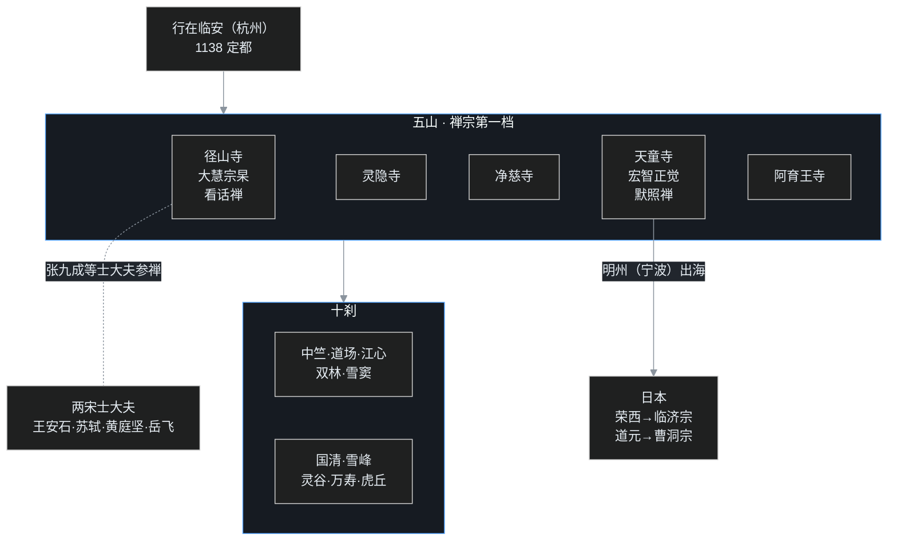

## 小白交底

进入南宋之前，先把这一篇摊成五句话：

1. 1127 年靖康之变，徽、钦二帝被金兵掳走；康王赵构在商丘即位，一路南逃，最终以杭州为「行在」（临时首都），史称南宋，偏安一百五十二年。
2. 南宋佛教最拉风的是禅宗：朝廷给江南禅寺排了官方座次——最高一档五个，称「五山」；下面十个，称「十刹」，几乎全在浙江。
3. 禅宗内部形成两种著名坐禅法：大慧宗杲的看话禅（死磕一个话头）与宏智正觉的默照禅（静坐默照）；日本和尚荣西、道元分别把临济、曹洞两家带回了日本。
4. 两宋的士大夫几乎没有不参禅的——范仲淹、王安石、苏东坡、黄庭坚、岳飞，个个进过禅寺、交过禅师；欧阳修本来排佛，跟一位禅师谈了一次话，从此改观。
5. 皇帝还亲自下场当和事佬：宋孝宗退位后写《原道论》反驳韩愈，主张三教分工——佛修心、道养生、儒治世。

这是一个国势很弱、文化却极盛的时代。禅宗的山头、士大夫的禅诗、三教的和谈，全在江南的烟雨水光里展开。

## 一、靖康之后：一个王朝「行在」杭州

先接上上一篇的结尾。

1127 年，金兵攻破开封，宋徽宗、宋钦宗父子连同宗室、百官被一锅端，押解北上，北宋灭亡。徽宗的第九子康王赵构因为当时不在城里，成了漏网之鱼，在南京应天府（今河南商丘）登基，就是宋高宗。

这位皇帝的前半生几乎都在跑路。建炎年间，金兵渡江南下，高宗从商丘逃到扬州，又逃到杭州、越州（绍兴）、明州（宁波），最后干脆下海，乘船在温州沿海漂了几个月——金兵下海追了三百里，遇大风雨，史称「搜山检海」。这一路惊心动魄，后来统称为「建炎南渡」。

局势稳定后，绍兴八年，也就是 **1138 年**，朝廷正式以临安府（杭州）为「行在」。注意这个用词：名义上的首都仍是沦陷的开封，杭州只是「皇帝临时驻跸之地」——后世多把「临安」二字解作「临时安顿」。这个临时，一临就是一百四十一年，直到南宋灭亡。

为什么是杭州？一是江南富庶、财赋所出；二是杭州有钱塘江和大运河，物资汇集；三是离海近，万一有变，君臣随时可以再下海。安全和经济两头的账，都算在这座城市头上。

历史上把定都杭州的王朝称为南宋（1127–1279）。整个南宋的佛教故事，就围绕这座「行在」和它周边的明州（宁波）、天台、雁荡展开。

## 二、丛林：从马祖、百丈到五山十刹

要讲五山十刹，得先补一段「禅寺是怎么来的」。

### 禅师为什么要从律寺搬出来

早期禅宗和尚并没有自己的庙，而是寄居在律宗寺院里。律寺讲规矩，比丘的行住坐卧都要按戒律来，连吃饭的钟点都卡得很死；参禅的人却讲究处处可用功，跟律寺里那一板一眼的「小小戒」（日常威仪的细节规矩）总闹别扭。

冲突多了，禅师们干脆搬出来，另建专供修行的「禅居」。带头做这件事的，是六祖慧能的徒孙——马祖道一。马祖门下极盛，禅居越建越大，人聚得多了，就成了「丛林」——取僧人聚集如树木成林的意思。

### 百丈清规：一日不作，一日不食

马祖的弟子百丈怀海，为丛林立下了一套中国式的规矩，就是《百丈清规》（唐代原本已佚，今传本为元代重修）。

这套规矩和印度戒律差别很大：印度僧人靠托钵乞食，不事劳作；中国没有托钵的传统，丛林便主张自力更生，上下都要干活。百丈本人最出名的一句话是「**一日不作，一日不食**」——一天不劳动，一天就不吃饭。据说百丈年迈，弟子心疼，把老人的劳动工具藏了起来，百丈那天找不到活干，果真就绝食一天，弟子们只好把工具还回去。

《百丈清规》还立了一条影响深远的制度：丛林的住持不靠师徒私相授受（那是后来「子孙庙」的做法），而是「选贤与能」，公请天下有德行的高僧来主持。这样的丛林叫「十方丛林」，谁有道行谁坐方丈位。农禅并重、选贤住持，使得禅宗寺院像一个个自给自足的大庄园，也像一座座大熔炉——来者不拒，去者不追，只看能不能让人安心办道。

### 五山十刹：朝廷给禅寺排座次

据后世记载，南宋宁宗朝权臣史弥远上奏：江南这些大禅寺，对社会、对国家都有贡献，请朝廷给它们排个等级、定个名分。朝廷准奏，于是有了中国佛教史上著名的「五山十刹」。

最高的五座，称**五山**，全在杭州和明州：

| 序 | 寺 | 今地 |
|---|---|---|
| 1 | 径山寺 | 杭州余杭 |
| 2 | 灵隐寺 | 杭州 |
| 3 | 净慈寺 | 杭州 |
| 4 | 天童寺 | 宁波 |
| 5 | 阿育王寺 | 宁波 |

次一等的十座，称**十刹**：杭州中天竺寺、湖州道场寺、温州江心寺、金华双林寺、宁波雪窦寺、台州国清寺、福州雪峰寺、南京灵谷寺（南宋时称蒋山太平兴国寺）、苏州万寿寺、苏州虎丘寺。

这里有两个细节值得说。第一，**五山全部在杭州、宁波，十刹里也有六座在今浙江境内**——南宋的佛教中心，就是首都所在的浙江。第二，这套制度后来被日本人学了去：日本室町时代也在京都、镰仓定了「五山」，还发展出「五山文学」；而当时入宋的日本和尚，无不以巡礼五山十刹为荣。

五山十刹说明的是两件事：禅宗的独盛，和江南佛教的全面兴盛。

## 三、两种坐禅：默照与看话

五山之中，径山寺和天童寺在南宋各出了一位大宗师，代表禅宗内部两种著名的用功方法。

### 大慧宗杲：死磕一个「无」字

先讲临济宗。大慧宗杲住径山寺，是南宋名望最高的禅师。宗杲提倡的方法叫**看话禅**：从古人公案里提出一两个字当「话头」，咬住不放、一路疑到底。

最常用的话头是赵州和尚的「狗子无佛性」——有人问赵州：狗有没有佛性？赵州答：「无。」修行的人就整天参这个「无」：既是「无」，到底无个什么？疑情越来越重，把平时纷飞的妄念、心里的种种计较全逼进死胡同，「啪」地一声断了，便是开悟的消息。其余如「父母未生我之前，如何是我本来面目」「念佛的是谁」，都是同类的话头。

宗杲性格刚猛，力主抗金，曾因和议与秦桧闹翻，被褫夺僧籍，先后编管衡州、梅州（今广东梅州）共十五余年，秦桧死后才回径山，名声反而更大。士大夫里跟宗杲最紧的是张九成，算是宗杲的在家弟子。

### 宏智正觉：默默忘言，昭昭现前

再讲曹洞宗。宏智正觉住宁波天童寺，提倡的是另一种路数——**默照禅**：默默静坐，不攀缘、不昏沉，只用一片明觉照住自己，妄念起时不随不理，照见它空。

正觉为人极其清瘦严谨，一辈子布衣蔬食。在其住持下，天童寺不断扩建，常住上千人，「禅者如云」，成了南宋的曹洞禅中心。

看话和默照，一重提起疑情、一重放下静观，表面上是两路，宗杲还曾写文章批评一味枯坐是「死水不藏龙」；但两位老人私交并不坏，正觉圆寂前留书托宗杲料理后事，宗杲也如约替其主持了荼毗（火化）。禅门的家风之争，争的是方法，不是意气。

### 日本和尚的两条航路

这两大禅系，很快有了漂洋过海的学生，登陆口都在明州（宁波）。

第一位是**荣西**：两度入宋，在天台山、天童寺从虚庵怀敞受临济黄龙派禅法，回国后创建博多圣福寺、京都建仁寺，被尊为日本临济宗之祖；荣西还带回了茶种和饮茶习惯，写有《吃茶养生记》，日本的「茶禅一味」由此开篇。

第二位是**道元**：1223 年入宋，在天童寺师从曹洞宗的如净禅师，得到「身心脱落」的印证，回国后在福井建永平寺，创立日本曹洞宗，把默照禅那一套严格的禅堂规矩完整搬了回去。直到今天，日本曹洞宗的禅堂训练仍以严谨著称。

一临济、一曹洞；荣西得法于天台山万年寺（其师虚庵怀敞后住天童），道元得法于天童。宁波港这一进一出，南宋禅宗就此成了日本禅宗的母邦。

## 四、士大夫的禅：儒门淡薄，收拾不住

南宋佛教有一个绕不开的景观：**满朝读书人都在参禅**。

### 一长串名单

课程里点到的两宋名臣，几乎是一部宋代名人录：杨亿、范仲淹、富弼、王安石、苏轼、黄庭坚、李纲、李邴、张九成、岳飞、张孝祥……这些人无论被贬到哪里、驻军何处，到了地方总先往名刹里走一趟，向禅师请教。

挑几位细讲：

- **王安石**：变法失败后退居江宁，常向蒋山赞元禅师问法；后来把自己在南京的住宅半山园舍作寺院（报宁寺），礼请真净克文当第一任住持。
- **苏轼（苏东坡）**：一生与禅僧为伍，自己讲「吴越多名僧，与之交好的十个里有九个」。最出名的是和佛印了元的往来。
- **黄庭坚**：认真参禅，拜入临济宗黄龙派晦堂祖心门下，是祖心的在家法嗣；传说其随师父游山，闻木樨（桂花）花香，祖心一句「吾无隐乎尔」（我什么都没瞒你），当下有省。
- **岳飞**：驻军鄂州（武昌）期间，屡过庐山，与东林寺慧海禅师颇有交情。

### 苏东坡与佛印：八风吹不动

苏轼和佛印的故事，最能说明「佛学」和「学佛」的差别。

相传苏轼某日自觉修行有得，写了一首偈：「稽首天中天，毫光照大千；八风吹不动，端坐紫金莲。」——赞佛，也是自赞：世间称、讥、毁、誉、利、衰、苦、乐这「八风」都吹我不动。苏轼很得意，让书童过江把偈送给佛印看。佛印看完，提笔在后面批了两个字：「放屁。」

偈子退回来，苏轼一看，火冒三丈：我这是赞佛的偈，怎么敢说放屁！立刻雇船过江，要去找佛印理论。船刚靠岸，佛印已在门口等着，哈哈一笑：「八风吹不动，一屁过江来。」——你不是八风吹不动吗？怎么一个「屁」字就把你吹过江了？苏轼听罢，大为惭愧。

### 欧阳修为什么晚年改观

士大夫里头，本来最不该进禅门的是欧阳修。欧阳修继承韩愈，是北宋排佛的旗手。

转机出现在一次回乡路上。欧阳修路过庐山，进了圆通寺，与住持居讷（号祖印）一番长谈，被其见识和气度折服，此后书信不断，再也不像从前那样激烈排佛；晚年更是自号「六一居士」。北宋末另一位大臣张商英（号无尽）还专门写了《护法论》，反驳排佛之论，主张儒、释、道三教宗旨本可相通。

### 儒门淡薄，收拾不住

最能概括这股风气的，是王安石与张方平的一段对话（记于宋代禅门笔记）。

王安石问：孔子百年之后有孟子，孟子之后，为什么儒门就再没出什么顶天立地的人物？张方平反问：怎么没有？接着扳着手指说：马祖道一、汾阳善昭、雪峰义存、丹霞天然、云门文偃——这些禅师，哪一个不胜过孟子？

王安石愕然。张方平解释：**不是没有人才，是「儒门淡薄，收拾不住」，杰出的人物见佛门气象宏大、师道严明，都归到禅门去了。**

这段对话半真半假，但确实照见了两宋的实情：禅门的师长、禅门的修行生活，对最优秀的读书人形成了巨大的吸引力。这班人参禅的收获，又回流到笔下——两宋士大夫的诗作里禅意盎然，开出了中国古典诗的一片新境界；而这种读书人学佛、在家弘法的风气，就是宋代最有特色的「居士佛教」。

## 五、教下诸宗：华严中兴、山家山外与净土壮大

禅宗之外，靠经典吃饭的「教下」各宗，在两宋也没闲着。

### 华严：晋水净源中兴

华严宗在会昌之后章疏散佚，北宋初年从高丽请回了不少论著，研究才重新接续。两宋华严的代表人物，前有长水子璇，集大成者是**晋水净源**——净源住杭州慧因寺，重建华严的传承与道场，被尊为华严宗「中兴教主」。慧因寺后来还有一段国际因缘：高丽文宗之子义天和尚入宋求法，就在慧因寺从净源学华严，回国后大力弘传，为高丽天台宗之祖、兼传华严（朝鲜华严本始于七世纪新罗义湘）。净源前后，道亭、观复、师会、希迪四家各有论疏，并称华严「宋四大家」。

### 天台：山家与山外的门户之争

天台宗这一时期则打了一场著名的内部笔墨官司。

起因是智者大师《金光明经玄义》有两个版本：详的叫「广本」，简的叫「略本」。北宋初年，钱塘慈光晤恩一派主张略本才是真的，重在泛论法性；四明（宁波）的知礼则坚持广本，认为必须谈「观心」——天台的家风是「教观双美」：义理要懂，禅修也要跟上，只讲法性不讲观心，等于有教无观，偏离了正宗。

双方引经据典，连带孤山智圆等一批学问僧都卷了进来，论争持续多年，史称**山家山外之争**。最后，以知礼为代表的四明一系自称「山家」（山里的正宗），把钱塘晤恩一派称作「山外」（山外的旁支）——山家一派被后世承认为天台嫡传。附带一提，山外的孤山智圆自号「中庸子」，本身就是主张儒释调和的先驱。

### 净土：悄悄长大的未来第一宗

这一时期真正在「闷声发大财」的，是净土宗。

净土的道理浅（相信阿弥陀佛愿力、愿生西方即可），修行又最省事（念一句「南无阿弥陀佛」；「南无」读 nāmó，致敬、归命之意），门槛低到人人能进。上一篇讲过，两宋各宗都看准净土普及，纷纷把念佛法门融进自家的度众方法里；连本来力主自力、觉得靠佛力是「他力」而不太以为然的禅宗，到两宋也承认称名念佛实在方便，大量采用。

居士们则在各地组织念佛社：北宋初杭州有省常和尚在西湖结「净行社」（莲社），士大夫王旦、苏易简等几十人加入。永明延寿（见中24）开其先，两宋诸宗继其后——涓涓细流汇成大势，到明清两代，净土宗终于超过禅宗，成为汉传佛教信众最多的第一大宗。

## 六、皇帝当和事佬：《原道论》与四大名山

### 孝宗《原道论》：给三公分派活儿

三教关系到南宋，还迎来一位皇帝级别的调解员。

宋孝宗是南宋少见的有为君主，退位为「寿皇」之后，写了一篇《原道论》（初名《原道辨》，一称《三教论》），标题就是冲着韩愈《原道》去的。韩愈当年说佛、道是社会的蠹虫，要「人其人、火其书」；孝宗的意见恰好相反：三教不必你死我活，各管一摊就是——**以佛修心，以道养生，以儒治世**：儒家的礼法用来治理国家，道家（道教）的清静用来调养身体，佛家的智慧用来安定人心。

皇帝亲自给三公分派活儿，等于从权力的顶点确认了三教共存的格局。排佛的声浪，到此彻底让位于三教调和。

### 看不见的对手：理学

但佛教在思想界的地位，其实正在悄悄让出。

就在士大夫热热闹闹参禅的同时，理学（道学）成熟了：周敦颐、张载、程颢、程颐，直到南宋的朱熹、陆九渊，建立了一套严密的新儒学体系。理学家表面上排佛，暗地里却吸收了大量佛教（尤其华严、禅宗）的心性理论和思辨方法，再转头说自家的道统——史称「援佛入儒」。论争的结果是：佛教没有被驳倒，却逐渐退出了学术讨论的中心；读书人要谈身心性命，留在理学里就够了。佛教的重心进一步下沉到禅堂、念佛会和民间香火。

### 四大名山：南海观音的登场

最后补一笔四大名山的完成。

唐代已有山西五台山（文殊道场，唐高宗、玄宗刻意经营）、安徽九华山（因唐代一位金地藏——传为新罗国王子金乔觉——而兴）。北宋为怀柔边疆：对辽则经营五台，宋太宗曾铸五百罗汉像送往；对吐蕃、大理则经营四川峨眉山（普贤道场），派人送宝物袈裟、整修普贤寺。

到南宋，首都杭州离海外小岛很近，第四大名山顺势登场——**普陀山**（观音道场）。普陀的开山故事起于唐代（一说后梁）：日本请经僧慧锷从五台山请得一尊观音像准备迎回日本，船到普陀海面屡遇风浪、寸步难行，慧锷以为观音不肯东渡，便留像供养，这就是「不肯去观音」；南宋因宁波是对外大港、朝廷又近，普陀香火大盛，正式与五台、九华、峨眉并称四大名山。

四大名山各有一位「驻地菩萨」（五台文殊、九华地藏、峨眉普贤、普陀观音），这套「四大名山＋四大菩萨」的格局，正是在两宋凑齐，并一直延续到今天的香火里。

## 一张图看懂：江南禅地图

五山在杭、明，十刹布两浙，法脉从明州出海东渡，禅意又通过士大夫流进诗文。看懂这张地图，就看懂了南宋佛教的基本版图。

## 写在最后

南宋一百五十二年，是一个很奇特的样本：一个王朝被强敌压着打、只剩半壁江山，它的宗教与文化却开出了极繁盛的花。

禅宗在这个时代达到了制度与声望的顶峰：五山十刹由朝廷定名，禅林清规运转严密，看话、默照两大家风双星并耀，连日本的禅宗都得来宁波认祖归宗。士大夫群体以前所未有的热情拥抱禅法，把禅意写进诗、写进词、写进日常生活；皇帝则亲撰《原道论》，替三教的和平共处盖上御玺。

但盛景里藏着两条下行线。在思想学术界，理学借佛教的思辨武装了儒学、又取代佛教成了新的正统，「教下」义学从此边缘化；在民间，简易直捷的净土宗一路壮大，最终在明清取代禅宗的位置。禅，从「读书人围拢的中心」慢慢退回山林；佛，从「必须辩论的对手」慢慢变成「日用而不知的空气」。佛教没有衰落，它只是换了一种方式，更深地织进中国人的生活里。

也是在南宋，北方和西部并不平静：契丹的《契丹藏》、西夏的译经、金代的禅宗，各有各的天地。下一篇，叶扬把目光从临安移向北方，看辽、西夏、金三个王朝的佛教，怎样在草原、绿洲与燕山脚下生长。

## 术语表

| 词 | 解释 |
|---|---|
| 靖康之变 | 1127 年金兵陷开封、掳徽钦二帝北去，北宋灭亡 |
| 宋高宗 | 赵构，南宋开国皇帝；1127 商丘即位，建炎南渡 |
| 建炎南渡 | 高宗为避金兵一路南逃至入海的过程，史称「搜山检海」 |
| 行在／临安 | 1138 年定杭州为临时首都，名义首都仍是开封；「临安」即临时安顿 |
| 五山十刹 | 南宋朝廷为江南禅定的官等次：五山（径山/灵隐/净慈/天童/阿育王）＋十刹 |
| 径山寺 | 杭州余杭，五山之首；大慧宗杲曾住持 |
| 灵隐寺 | 杭州古刹，五山第二；东晋慧理开山 |
| 净慈寺 | 杭州南山，五山之一；道济（济公）相传出于此 |
| 天童寺 | 宁波，五山之一；宏智正觉、如净先后住持 |
| 阿育王寺 | 宁波，五山之一；相传与阿育王造塔（西晋慧达得舍利）的传说有关 |
| 十刹 | 中竺、道场（湖州）、江心、双林、雪窦、国清、雪峰、灵谷、万寿、虎丘 |
| 灵谷寺 | 在南京，南宋称蒋山太平兴国寺，明初赐名灵谷 |
| 马祖道一 | 慧能徒孙，洪州禅创立者；首建丛林、门下极盛 |
| 百丈怀海 | 马祖弟子，制《百丈清规》；倡「一日不作，一日不食」 |
| 《百丈清规》 | 禅宗中国式丛林规矩：农禅并重、选贤住持 |
| 十方丛林 | 住持公请天下贤能的大寺院；对反「子孙庙」（师徒私授） |
| 子孙庙 | 师徒世代相承、如同私家的小庙，为十方丛林所不取 |
| 临济宗 | 禅宗南岳下一大支，家风峻烈、机锋迅猛，两宋最盛；黄龙、杨岐两派出其门 |
| 曹洞宗 | 禅宗青原下一支，家风绵密细密，重静坐观照；天童正觉、如净为南宋代表 |
| 大慧宗杲 | 1089–1163，临济宗，住径山；倡看话禅，因抗金忤秦桧被流放 |
| 看话禅 | 咬住公案话头（如「狗子无佛性」）一路起疑、逼断妄念的禅法 |
| 话头／公案 | 古代禅师的机锋记录，提出其中字句作为参究对象 |
| 宏智正觉 | 1091–1157，曹洞宗，住天童；倡默照禅，住持天童极盛 |
| 默照禅 | 静坐默然、以明觉照住自心、不随妄念的禅法 |
| 荣西 | 日本僧，入宋从虚庵怀敞受临济法；日本临济宗祖，著《吃茶养生记》 |
| 道元 | 日本僧，1223 入宋从天童如净受法；日本曹洞宗祖，创永平寺 |
| 如净 | 南宋曹洞宗天童寺住持，传法于日僧道元 |
| 居士佛教 | 在家学佛的士大夫群体弘法，两宋一大特色 |
| 佛印了元 | 云门宗僧，苏轼方外之交；「八风吹不动，一屁过江来」 |
| 八风 | 称讥毁誉利衰苦乐八种扰动人心的世间境遇 |
| 蒋山赞元 | 王安石问法的金陵禅师 |
| 真净克文 | 临济宗黄龙派僧，住持王安石舍宅所建的报宁寺 |
| 黄龙派／杨岐派 | 临济宗在北宋分出的两大支；两宋士大夫往来的禅师多出黄龙派门下 |
| 晦堂祖心 | 临济黄龙派僧，黄庭坚之师；「吾无隐乎尔」 |
| 慧海 | 庐山东林寺僧，与岳飞有交 |
| 居讷（祖印） | 庐山圆通寺住持；欧阳修见之改观、晚号六一居士 |
| 六一居士 | 欧阳修晚年自号；标志其由排佛而融通 |
| 张商英 | 号无尽，北宋末大臣；撰《护法论》，主三教调和 |
| 《护法论》 | 张商英反驳排佛、主张三教一致的著作 |
| 张方平 | 北宋大臣；与王安石论「儒门淡薄，收拾不住，皆归释氏」 |
| 华严宗 | 依《华严经》立宗，倡法界缘起，唐代贤首国师法藏集其大成 |
| 晋水净源 | 华严宗「中兴教主」，住杭州慧因寺；高丽义天曾来求学 |
| 义天 | 高丽文宗王子，入宋从净源学华严，归国弘传 |
| 宋四大家 | 华严宋四家：道亭、观复、师会、希迪 |
| 天台宗 | 智顗（智者大师）所创，倡一心三观、一念三千，家风为教观双美 |
| 山家山外之争 | 北宋天台内部因《金光明经玄义》广略本、观心问题而起的多年论争 |
| 四明知礼 | 960–1028，山家代表，重观心，被尊为天台正宗 |
| 慈光晤恩 | 钱塘僧，山外前驱，主《玄义》略本、重法性 |
| 孤山智圆 | 976–1022，山外学问僧，号中庸子，主儒释调和 |
| 教观双美 | 天台家风：义理（教）与禅修（观）并重 |
| 省常 | 北宋初杭州僧，西湖结净行社（莲社），士大夫多与 |
| 宋孝宗 | 南宋第二帝；退位后撰《原道论》，主三教分工 |
| 《原道论》 | 孝宗所撰，驳韩愈；以佛修心、以道养生、以儒治世 |
| 理学／道学 | 宋儒新儒学（周敦颐、二程、朱熹、陆九渊）；援佛入儒而取代义学 |
| 援佛入儒 | 理学表面排佛、暗取佛教心性思辨充实儒学 |
| 四大名山 | 五台（文殊）、九华（地藏）、峨眉（普贤）、普陀（观音） |
| 金地藏 | 唐代九华山僧，传为新罗王子金乔觉、地藏化身 |
| 普陀山／不肯去观音 | 浙江海岛观音道场；慧锷请像舟行受阻、留像开山，南宋大盛 |