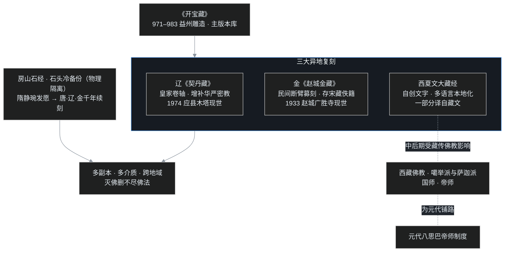

## 小白交底

讲南宋的时候，目光一直留在江南；这一篇，叶扬把镜头转向北方和西北，先摊成五句话：

1. 与两宋同时，北方和西北先后立着三个非汉族王朝：**辽**（契丹，与北宋对峙）、**西夏**（党项，在今宁夏甘肃）、**金**（女真，灭辽又灭北宋，与南宋对峙）。
2. 这三个王朝虽由少数民族建立，却几乎全盘接过汉传佛教，而且个个热衷于——刻大藏经。
3. 辽国皇家雕了《契丹藏》，最华丽；金国由民间一位断臂尼姑募刻《赵城金藏》，八百年后成了海内孤本；西夏干脆自创一套文字，把大藏经整个翻译过去。
4. 还有一桩跨着隋、唐、辽、金的大工程：北京房山云居寺的和尚怕灭佛灭经，把佛经刻在石头上，一千年刻了一万四千多块石版。
5. 西夏中后期，西藏佛教大举传入，藏僧被尊为「帝师」「国师」——这正是下一篇元代八思巴帝师制度的前奏。

一句话：南宋在江南的烟水里谈禅，而北方的契丹、党项、女真正在石头和纸上，悄悄地替佛经做「多处备份」。

## 一、宋的北边，先后站着三个王朝

先把时间坐标摆正。

最早崛起的是**契丹**。契丹是鲜卑人的一支，唐朝初年就住在中国东北，对朝廷时降时叛。唐末，耶律阿保机统一契丹八部，于 916 年称帝，国号契丹；阿保机的儿子耶律德光时改国号为辽。五代后晋的石敬瑭靠契丹帮忙篡位，把北方的燕云十六州割了出去——这一割，让后来的北宋如鲠在喉。宋太宗两次北伐想收回来，都被辽国大将耶律休哥打败，从此宋无力北伐，辽却常南下。

辽的极盛疆域，覆盖今天的东北、内蒙古，以及河北、山西的北部。直到宋徽宗宣和七年，也就是 **1125 年**，辽国的天祚帝被新兴的金国俘虏，辽才灭亡，前后约两百一十年。

接着是**女真**。女真是隋唐时东北靺鞨人的一支，辽国强盛时受封做「生女真节度使」。宋徽宗时，完颜部的酋长阿骨打叛辽，于 1115 年称帝，国号金。金只用十年，1125 年灭辽、1127 年又攻破开封灭了北宋，占据整个黄河流域，与南宋隔淮对峙。直到端平元年，**1234 年**，宋与蒙古联军攻破蔡州（今河南汝南），金哀宗自杀，金亡，享国约一百二十年。

第三个是偏处西北的**西夏**，由党项人建立。唐末党项酋长拓跋思恭帮朝廷平乱有功，被赐姓李、封为定难节度使，据有今陕西西北和宁夏一带。北宋时拓跋思恭的后代李继迁夹在宋辽之间扩张，到孙子李元昊时干脆反宋、占领河西，于 1038 年自称大夏皇帝；庆历四年（1044）宋夏和议，宋封元昊为夏国王，史称西夏。金灭辽后，西夏在 1124 年转而对金称臣。它的国祚反而最硬挺，直到宝庆三年（1227）才被成吉思汗的蒙古大军所灭，前后约一百九十年。

三个王朝，最后都亡于蒙古。而它们有一个惊人一致的举动：**信佛，并且刻藏**。这就引出本篇真正的主角——三部大藏经和一处石头上的佛窟。

## 二、辽：皇家最华丽的《契丹藏》

辽国为什么对佛教这么上心？根子在开国时的移民政策。

### 用佛寺安顿迁来的汉人

辽太祖阿保机把大量汉人迁到内蒙古去充实人口。为了配合这些移民，阿保机干脆盖起汉人熟悉的寺院：早在 902 年，就在龙化州（在今内蒙古东部）建了开教寺；称帝之后，又在上京临潢府（今内蒙古巴林左旗）建天雄寺，并迎请汉地的僧人来主持。寺院既是移民的精神安顿处，也是朝廷笼络汉人的手段。

辽圣宗时，佛教臻于极盛。圣宗好佛法，在辽国各地大建塔寺，今天津蓟县独乐寺、辽宁义县奉国寺都成名于此。僧尼人数随之暴涨，名僧辈出，私自出家的也多了起来，逼得圣宗不得不严禁私度、裁汰不良僧尼。圣宗之后的兴宗，修建了闻名于世的山西大同华严寺，后来分为上下两寺；下寺薄伽教藏殿里的辽代彩塑，尤其是那尊合掌露齿的菩萨，神情灵动，被称作佛教艺术的瑰宝。

辽国诸帝里，道宗最能深入佛教义理，尤其精通华严宗。道宗在位时建了许多塔，今天辽宁境内的辽塔大多是那时所建。其中最著名、享誉中外的，是山西应县的木塔，正式名称叫佛宫寺释迦塔，建于清宁二年，也就是 **1056 年**——通体纯木结构，历经近千年的地震风雨仍屹立不倒，是世界现存最高大的木构建筑之一。

### 三十多年雕出的皇家藏经

辽代在「经」的方面有两件大事，第一件便是雕造自己的大藏经。

这部藏经由汉地僧人主持，从圣宗朝动工，历兴宗、道宗两朝，前后雕了三十多年才告完成。因为是皇家工程，刻得极为华丽庄严。它虽以北宋的《开宝藏》作底本，却增补了不少华严和密教的典籍——这与辽帝精通华严、辽国上下又盛行密教正相吻合。辽国的高僧几乎都是汉人，所以后人评价：**辽代佛教，骨子里就是汉传佛教**。

这部藏经一度只存于记载，人们看不到实物。直到 1974 年，人们在应县木塔的塑像里发现了一批辽代刻经，其中就有十二卷《契丹藏》的大字本——千年孤本，赫然重现。木塔不仅是建筑奇迹，也成了藏经的「保险柜」。

## 三、房山石经：刻进石头的末法恐惧

辽代的第二件大事，是接续一桩隋朝就开始的刻经事业。这桩事业值得单独一节，因为它把「怕佛经失传」的恐惧表达得最彻底。

### 静琬为什么要刻石头

隋朝大业年间，有一位叫静琬（也作智苑）的僧人。静琬所处的时代，刚经历过北魏太武帝、北周武帝两次大规模灭佛，寺院被毁、经卷被烧。静琬由此相信，佛教已进入「末法」衰世，纸本经卷随时可能再遭劫难。怎样才能让佛法传到最久远的后世？静琬选了最笨也最耐久的办法：**把佛经刻在石头上**。

静琬来到今天北京房山的白带山（石经山），凿开岩壁，把经文一部一部刻上石版，再藏进石洞。石头不怕火、不怕水，也不依赖抄经的人——这等于给佛经做了一份「物理隔离的冷备份」。

### 一千年，一万四千多块石版

静琬发的这个愿，后来成了一场跨越千年的接力。静琬的弟子接着刻，唐代续刻、辽代续刻、金代还在刻。辽代有一位通理大师，大力主持云居寺的刻经；金国又从辽国手里把这桩事业继承下去。

到全部工程收尾时，房山石经共刻成石经版 14,278 块，所刻佛经一千多部、三千五百多卷，分别藏在石经山的九个石洞和云居寺的地穴里。二十世纪五十年代，这些石经被系统发掘整理出来，世人才看清这项工程的全貌，被誉为「北京的敦煌」。

刻在石头上的字不会自己说话，但那个动机穿越了一千年仍清晰可感：**只要还有一块石头在，佛法就删不尽**。

## 四、金：万松门下，与断臂募刻的《赵城金藏》

再看灭掉辽和北宋的金国。

### 从皇家冷淡到禅宗鼎盛

女真在立国之前，受邻近的渤海国和高丽影响，境内已经有佛教流传。不过金太祖阿骨打本人对佛教并不热心，直到阿骨打的弟弟金太宗，才开始在山西一带建寺——在应州（今山西应县）建净土寺、在崞县（今原平）建慈氏院、清凉院。今天应县净土寺那座金代大殿里的「天宫楼阁」藻井，精巧绝伦，是稀世的国宝。

金国诸帝里，金章宗最礼遇禅宗。当时黄河流域曹洞宗很兴盛，有一位曹洞宗大德万松行秀，就被章宗请进宫廷讲经。万松行秀著有《从容录》六卷，评唱宋代宏智正觉的颂古，把曹洞宗绵密的家风阐发得淋漓尽致。

万松门下有两位著名的居士弟子，在当时都极有影响。一位是李屏山（名纯甫），金国进士、饱学之士，大力提倡儒、释、道三教合一，写有《鸣道集说》，替佛教回敬宋儒的排击。另一位更是重量级——**耶律楚材**。

### 耶律楚材：以一句谏言救下千万生灵

耶律楚材是契丹人，本是辽国宗室后裔，母亲是汉人，自幼受到极好的教育，聪慧博洽。耶律楚材从万松行秀参禅，自号湛然居士。其在金、元两朝都受重视，成吉思汗尤其欣赏这位契丹才子，却有意不加重用，大概是想留给继任者。

蒙古灭金、刚刚拿下中原时，蒙古贵族中有人提议：汉人于征战无用，不如把汉人都杀掉，把占领的土地改成大牧场。若此议施行，不知几千万汉人将丧命刀下。耶律楚材立刻进谏：留着汉人，汉人能耕田生产，朝廷就有源源不断的赋税、绢帛和粮食；汉地百工各有技艺，又有众多人口，可以供给军需、帮助平定天下。蒙古主采纳了这番话，千万生灵由此得活。后人评价，耶律楚材以佛门的慈悲，成就了一桩「大菩萨」的事业。

### 断臂募刻的民间孤本

与辽国的皇家藏经不同，金代这部大藏经是**民间出资**刻成的。

它的缘起极为感人：金熙宗皇统年间，潞州有一位比丘尼崔法珍，为了募化刻经的善款，自断其臂以示决心，感动了河东路的无数信众。她在解州（今山西西南）天宁寺主持开雕，以北宋的《开宝藏》为底本，又补入一些宋代藏经没有收录的译籍，前后历时近三十年才完成。

这部藏经一直默默保存在山西赵城县霍山的广胜寺里，直到 **1933 年**才被一位叫范成的僧人重新发现，世因地名而称之为《赵城金藏》。抗战时期，日军觊觎这部藏经，八路军又组织力量把它从险境中抢救出来。今藏中国国家图书馆，是天壤间的孤本秘笈；后来编纂《中华大藏经（汉文部分）》，就是以它作为底本。

和辽一样，金国也把房山刻经的事业接续了下来。纸本孤藏与石头经版，金国人在两种介质上都留了副本。

## 五、西夏：造一种文字，译一整部藏

三个王朝里，西夏在「佛教本地化」上走得最远——它先造文字，再用这套文字译出一整部大藏经。

### 举国礼佛的佛国

西夏人本有原始的祈福、占卜、诅咒信仰，而开国的环境又把这个王朝推向佛教。元昊的都城兴庆府（今宁夏银川）本就有佛教流布，元昊占领的河西走廊更是东西方佛教往来的通道，境内各族几乎都信佛，西夏于是很自然地成了佛教国家。

元昊的父亲李德明，当年为母亲治丧，曾向宋朝求请去五台山供养十寺、为亡母修冥福。《宋史》的夏国传里也记载，元昊「晓浮图学」，自己就通晓佛学。元昊推广佛教，不仅建寺塔、译佛经，还规定：每年三季第一个月的初一为「礼佛日」，官民都必须礼佛。元昊的儿子毅宗谅祚即位后，修建了规模宏伟的承天寺，又屡次向宋朝求赐大藏经；1072 年，惠宗秉常派使臣进贡骏马以求藏经，宋神宗退还了马匹、颁赐了一部大藏经。

西夏国君还以明文法律保障寺院的土地财产、赐给僧尼崇高地位和种种特权——这在中国佛教史上相当罕见。以往的帝王纵然崇佛，寺院的田产也只受一般法律保护，并未单立专门条款。

### 造西夏文，译佛经

约在 **1036 年**，元昊下令大臣野利仁荣，依照汉字「六书」的造字原理，创制了一套西夏文字（时称「蕃文」），推行全国。这套文字最重要的用途之一，就是把汉文大藏经翻译过来，译成西夏文大藏经。

这场翻译持续了好几代，从汉文本译出，也有少量经典直接译自藏文本。西夏文藏经后来有了精美的刻本，是中国最早系统翻译的少数民族文字大藏经之一。二十世纪初，探险家在西夏黑水城遗址（在今内蒙古额济纳）掘得大批西夏文佛经和版画，让今人得以重见这套藏经的样貌。

### 藏传东渐：帝师与密教

西夏佛教最初以禅宗、净土、密宗并行；到了中后期，尤其是十二世纪，西藏佛教大举传入，西夏也随之转盛密教。

藏地的高僧——噶举派、萨迦派的上师——相继来到西夏，被王室尊为「国师」，有的更受封为「帝师」。就现存史料看，「帝师」这一称号在中原王朝出现，西夏很可能是最早的。无上瑜伽一类的密法也由此在内地流传。今天宁夏青铜峡那座沿山坡排列的一百零八塔、贺兰山拜寺口的双塔、甘肃张掖大佛寺的巨型卧佛，以及敦煌莫高窟、榆林窟里的密教壁画，都留下了这一时期藏传佛教的深刻印记。

西夏是一座桥：**它先把藏传佛教请进了宫廷，后来蒙古灭夏，这批藏僧和这套「尊僧为帝师」的做法，便顺势传给了元朝**。

## 六、一张图看懂：佛经的「异地灾备」

看懂这张「灾备图」，就看懂了这一篇：北宋的《开宝藏》是主版本库，辽、金、夏各做一份异地复刻，纸本之外又有房山石经这种刻进石头的冷备份——多副本、多介质、跨地域，再大的「灭佛」也无法把佛法删尽。而西夏从藏地引入的那条虚线，则把故事引向了下一个王朝。

## 写在最后

辽、西夏、金这三个常被正史放在「外国传」里的王朝，其实是汉传佛教最虔诚的「备份管理员」。

辽国用皇家的财力，三十多年雕出最华丽的《契丹藏》；金国一位民间比丘尼以断臂募化的苦行，刻下后来独步天下的《赵城金藏》；西夏先造文字、再译全藏，把佛法换了一种语言保存下来；而房山的僧人从隋朝起，把佛经刻进石头，一千年不辍。若用一个程序员熟悉的眼光看，这是一套横跨万里、绵延千年的灾备系统——它不为日常使用而建，却在每一次「删库」之后，真的把数据救了回来。

当然，备份也并非字字不变。各部藏经边刻边补，加入了自己时代所尊的华严、密教；副本之间并非严格一致，而是带着各自的「分叉」。它们保存了佛法，也保存了每一个时代理解佛法的方式。

下一篇，叶扬把目光投向最终一统天下的元朝。蒙古人经西夏这座桥，把西藏佛教请进了帝国的最核心：一位叫八思巴的年轻藏僧成为帝师，掌管全国佛教和西藏事务的宣政院随之设立。草原帝国与雪域佛教的结合，将给中国佛教带来一种前所未有的新格局。

## 术语表

| 词 | 解释 |
|---|---|
| 契丹 | 鲜卑一支，辽的主体民族；唐初居东北，916 年耶律阿保机统一建国 |
| 耶律阿保机 | 辽太祖，统一契丹八部、建立辽国；迁汉人实边并始建佛寺 |
| 耶律德光 | 阿保机之子，在位时改国号为辽；获后晋所割燕云十六州 |
| 燕云十六州 | 后晋石敬瑭割让给契丹的北方十六州，今北京、山西大同一带 |
| 辽圣宗 | 辽代鼎盛期皇帝，广建独乐寺、奉国寺，严禁私度、裁汰僧尼 |
| 辽兴宗 | 圣宗之后，修建大同华严寺 |
| 辽道宗 | 精通华严，广建辽宁诸塔；1056 年建应县木塔 |
| 天祚帝 | 辽末代皇帝，1125 年被金所俘，辽亡 |
| 开教寺／天雄寺 | 辽太祖 902 年在龙化州、后在上京所建的辽代早期汉传佛寺 |
| 独乐寺／奉国寺 | 辽圣宗时名刹，今天津蓟县、辽宁义县 |
| 大同华严寺 | 辽兴宗建，分上下寺；下寺薄伽教藏殿有辽代彩塑瑰宝 |
| 薄伽教藏殿 | 大同华严寺下寺殿名，存辽代彩塑，合掌露齿菩萨为瑰宝 |
| 应县木塔 | 佛宫寺释迦塔，1056 年建，世界最高古木构之一；1974 年内现《契丹藏》 |
| 《契丹藏》 | 辽代皇家大藏经，历圣宗兴宗道宗三十余年，以《开宝藏》为底增补华严密 |
| 私度 | 未经官府批准、自行出家，历代皆禁 |
| 房山石经 | 北京房山云居寺石刻佛经，隋静琬发愿，历唐辽金，共 14,278 块石版 |
| 云居寺 | 房山石经所在古刹；石版藏于石洞与地穴 |
| 静琬 | 隋代僧，因两次灭佛而倡末法，发愿刻石经以传久远 |
| 末法 | 佛教认为佛法渐衰的时期；静琬刻石的思想动因 |
| 通理大师 | 辽代僧，主持云居寺刻经 |
| 靺鞨 | 东北古民族，女真（金）的先民，隋唐时分为多部 |
| 完颜阿骨打 | 金太祖，1115 年叛辽称帝、建立金国 |
| 金太宗 | 阿骨打之弟，始在山西建净土寺、慈氏院等 |
| 金章宗 | 礼遇禅宗，请万松行秀入宫讲经；定僧道三年一试之制 |
| 金哀宗 | 金末代皇帝，1234 年蔡州城破时自杀，金亡 |
| 蔡州 | 今河南汝南，金末都城，宋蒙联军破此而金亡 |
| 净土寺 | 金太宗在应州（今山西应县）所建，天宫藻井为国宝 |
| 万松行秀 | 金代曹洞宗大德，著《从容录》；李屏山、耶律楚材之师 |
| 《从容录》 | 万松行秀评唱宏智正觉颂古的著作，阐曹洞家风 |
| 李屏山 | 名纯甫，金进士，倡三教合一，著《鸣道集说》驳宋儒 |
| 《鸣道集说》 | 李纯甫护持佛教、回应儒者排佛的著作 |
| 耶律楚材 | 契丹人，号湛然居士，万松弟子；谏蒙古止杀、活千万民，历事金元 |
| 《赵城金藏》 | 金代民间刻大藏经，崔法珍断臂募刻，以《开宝藏》为底，海内孤本 |
| 崔法珍 | 金代比丘尼，断臂募化刻经，主持雕造《赵城金藏》 |
| 广胜寺 | 山西赵城古寺，《赵城金藏》原藏处，1933 年发现 |
| 《中华大藏经》 | 当代新编汉文大藏经，以《赵城金藏》为主要底本 |
| 党项 | 西夏主体民族，原居西北 |
| 拓跋思恭 | 唐末党项酋长，助平乱有功，赐李姓、封定难节度使 |
| 定难节度使 | 唐朝给党项首领的封号，据有陕北、宁夏 |
| 李继迁 | 拓跋思恭后裔（宋赐赵姓），北宋时扩张，元昊之祖 |
| 李德明 | 元昊之父，曾为母求供五台山修冥福 |
| 元昊 | 西夏开国皇帝，1038 年称帝；晓浮图学、定礼佛日、令创西夏文 |
| 野利仁荣 | 西夏大臣，1036 年奉元昊之命依汉字六书创制西夏文 |
| 西夏文 | 西夏自制方块文字，用于翻译大藏经 |
| 兴庆府 | 西夏都城，今宁夏银川 |
| 承天寺 | 毅宗谅祚所建宏伟寺院；西夏屡向宋求赐藏经 |
| 礼佛日 | 元昊规定每年三季首月初一官民礼佛之日 |
| 黑水城 | 西夏边塞遗址（今内蒙古额济纳），出土大量西夏文佛经 |
| 张掖大佛寺 | 甘肃古刹，有西夏以来巨型卧佛 |
| 榆林窟 | 敦煌石窟群之一，存西夏密教壁画 |
| 一百零八塔 | 宁夏青铜峡藏传佛教塔群，沿山坡排列 |
| 拜寺口双塔 | 贺兰山西夏佛塔，藏传佛教遗迹 |
| 国师／帝师 | 西夏尊藏僧的称号；西夏帝师或为中原最早，元代因之 |
| 噶举派／萨迦派 | 藏传佛教教派，先后传入西夏，为元代萨迦帝师之先声 |
| 无上瑜伽 | 藏传密教最高一级密法，经西夏传入内地 |