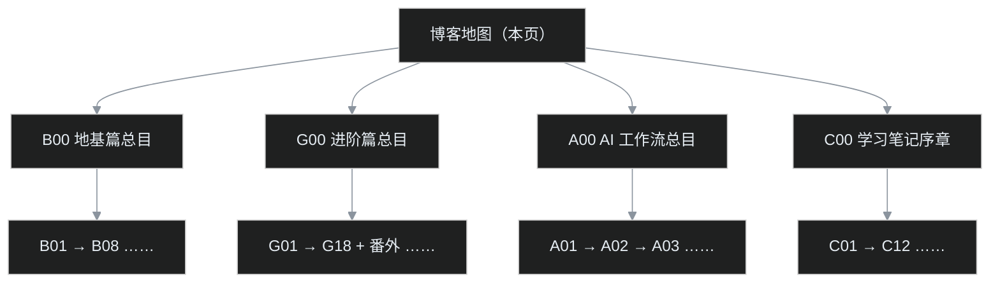

# 博客地图｜系列文章从哪读起

不知道从哪篇开始，就先看这篇。

这是叶扬的博客地图。文章按**系列**组织，每个系列都有一篇「第 0 篇」总目录，篇目明细和完成状态都在各自的总目录里维护；本页只负责把你送到正确的入口，不重复搬运清单——所以它会一直很短。

## 一、三条推荐路线

- **想搭一个自己的博客**（零基础友好）：从 [B00 地基篇总览](/post/30.html) 进门，再跟着 [B01 十八秒建站](/post/32.html) 动手，一路走到 B08 收房，再进 G 系进阶。
- **博客已经搭好，想玩插件、SEO 和源码**：直接进 [G00 进阶总览](/post/5.html)，按里面的路线图挑感兴趣的篇目。
- **想看 AI 怎么干真活、或者看一个程序员怎么啃硬核课程**：进 [A00 AI 工作流](/post/46.html) 或 [C00 学习笔记](/post/45.html)，两条线互不依赖。

## 二、系列总目录

| 系列 | 讲什么 | 进度 | 总目录 |
|---|---|---|---|
| **B 地基篇** | 零起点：注册账号、18 秒建站、config、Issues、评论、Actions、Pages、备份搬家、交房验收 | B00–B08 九篇，已完结 | [B00 总览](/post/30.html) |
| **G 进阶篇** | Gmeek 插件全档案、配置深挖、SEO、自研一串插件（分页、外链、归档、阅读时长、上下篇、Mermaid 按需加载）、给上游提 PR、截图方法论 | G01–G18 加五篇番外，连载中 | [G00 总览](/post/5.html) |
| **A AI 工作流** | 程序员视角的 AI 数据流水线：字幕下载、清洗、语音转写，真实项目、数字全部复核 | A00 起，连载中 | [A00 总览](/post/46.html) |
| **C 学习笔记** | 用费曼学习法把印度佛教史 39 讲复述给小白：术语先白后专、程序员类比、吵架现场、卡壳角 | 序章已发，规划 C01–C12 十二篇，连载中 | [C00 序章](/post/45.html) |

以后新开系列，就在这张表和图里各加一个入口，不动旧结构。

## 三、几个固定页面

- [关于叶扬](/about.html)：这个站和这个人。
- [归档](/archive.html)：全部文章按年份排列的时间线。
- [链接收藏](/link.html)：常用典籍、工具与博客圈子。

## 四、这张地图怎么维护

- **篇目明细和 ✅/⏳ 状态只在各系列第 0 篇里打勾**（[B00](/post/30.html) / [G00](/post/5.html) / [A00](/post/46.html) / [C00](/post/45.html)），本页只放粗粒度进度，避免同一份清单两处维护对不上。
- 本页只在「新系列开线」或「某系列完结」时更新。

祝逛得愉快。
