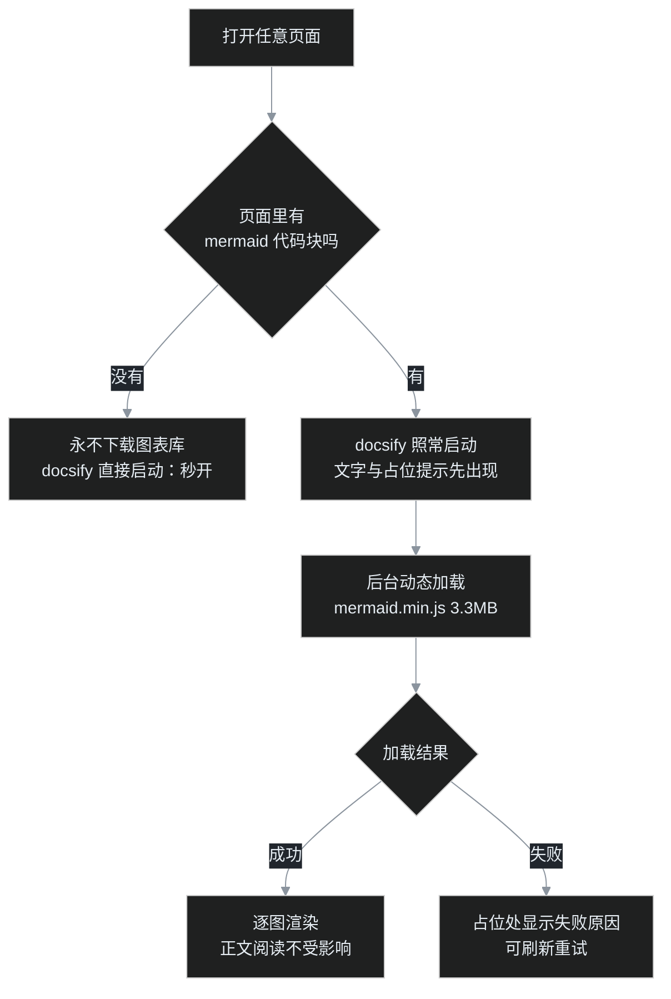

## 小白交底

先把这一篇的来龙去脉摊开：

1. 这是一起「**本地好好的，线上全白**」的性能事故——叶扬的 docsify 草稿审稿站，在自己电脑上秒开，部署到 GitHub Pages 之后，每个页面都要白屏 **36 到 46 秒**才露头。
2. 事情的导火索很小：叶扬发现自己要求过「把每篇文章的生产耗时记下来放到草稿站」，结果翻遍草稿站没找到——一查，之前承诺的「自动同步」压根没接上。
3. 补上同步之后顺手一审线上页面，这才发现站点在线上一直处于半瘫痪状态，而本地因为文件都在本机、秒开，这个问题藏了很久。
4. 最终的病根有点出人意料：不是网络断了，不是文件丢了，而是一个 **3.3MB 的 JavaScript 文件被同步加载，像块大石头堵在站点启动的必经之路上**。
5. 修复方案是前端的常规操作——按需动态加载。无图页面彻底不再碰这个大文件，当场秒开；含图页面先出文字，图表在后台慢慢就位。

## 一、起因：一篇「找不到」的日志

叶扬写博客有个习惯，每篇文章从开写到发布花了多少分钟，都记在仓库里的《文章计时日志.md》里：哪天几点开写、几点发布、串行流水线跑了多少秒，一条条都在。

9 月 28 日，复盘一篇耗时偏久的文章时，叶扬提过一个要求：把这份计时日志也放到 docsify 草稿审稿站上去，方便横向对比。第二天叶扬真去翻了——侧边栏里什么都没有。

一查，情况有点不好意思：当时只往草稿站放了那一篇复盘文章，侧边栏里确实写过一句「以后每篇自动归此」，可这个「自动」从来没有接上。同步脚本只管搬运草稿正文，根本不认识计时日志。中16 往后的耗时数据，全安安稳稳躺在仓库里，一份都没进站。

欠了账就得还。叶扬给同步脚本加了个 `sync_process_docs()`：每次同步草稿时，把仓库里的计时日志一并复制到草稿站的 `process/` 目录，侧边栏自动挂上链接。以后再不用人惦记。


## 二、案发现场：还以为是网络慢

补上同步，推送，等 GitHub Pages 部署完，叶扬打开线上地址验收——然后就看到了上面这张图。

站点的外壳框架还在，右上角的加载小圆圈一直在转，正文区域全黑，什么都没有。一秒、五秒、十秒……一直等到快四十秒，页面才「唰」地一下整个冒出来。

叶扬第一反应是：晚上网络高峰吧？GitHub Pages 在海外，慢一点正常。可是连着试了首页、计时日志、一篇旧草稿——**每一个页面都是同样的四十秒白屏**。如果只是网络延迟，不该这么整齐；整齐到每个页面都一样，说明堵点是每个页面都必须经过的同一段路。

更有意思的是，同样这套文件，在自己电脑上起个本地服务打开，永远是秒开。本地与线上之间，一定有某个差异被漏掉了。

## 三、文件全都在，那页面在等什么

排查的第一步，是确认线上文件到底齐不齐。用 curl 把页面依赖的东西逐个点一遍：

| 资源 | 线上状态 |
|---|---|
| index.html | 200 |
| lib/docsify@4.js（站点框架） | 200 |
| lib/search.min.js（搜索插件） | 200 |
| lib/mermaid.min.js（图表库） | 200 |
| _sidebar.md（侧边栏数据） | 200 |
| README.md（首页内容） | 200 |

一个不少，全是 200。文件没丢，服务器也没装死。

那就换个问法：浏览器拿到这些文件之后，**到底执行到哪一步卡住了**？叶扬用 CDP 连上浏览器，在页面里读 `performance` 的资源计时条目。结果很说明问题——

- docsify 框架和几个插件的文件**确实都下载完了**，耗时各一秒上下；
- 但是，页面没有发出任何一个 docsify 本该发出的请求：`_sidebar.md` 没拉、`README.md` 也没拉。

框架人已经到场，却站在门口一动不动，一声不吭。这说明它根本还没开始执行——**有个东西排在它前面，把整条路占住了**。

这中间还排除过一个干扰项。草稿站挂在 GitHub Pages 的子路径 `/draft-review/` 下，叶扬在页面里手工 fetch 绝对路径 `/_sidebar.md`，拿到的是 404，一度以为是路由配置错了。可是换成 `/draft-review/_sidebar.md` 立刻是 200，再看资源条目里 docsify 框架自己一个请求都没发——文件路径的疑点就此洗清：不是找不到数据，是框架压根没上场。


## 四、抓现行：一块 3.3MB 的大石头

占路的是谁，资源条目里只剩一个嫌疑人：`mermaid.min.js`——画流程图用的图表库，文件体积 **3.3MB**。

先解释它为什么能把整个站点堵死。浏览器解析 HTML 是从上往下一行行走的，遇到普通的 `<script src="...">` 标签，规矩是这样的：**停下手头所有活，先把这个脚本文件下载回来、执行完，才允许继续往后解析**。这是 JavaScript 诞生之初就定下的老规矩，因为脚本可能会改动页面，浏览器不敢自顾自往下解析，得先等这个脚本落地。

草稿站当初的 HTML 里，图表库的标签恰好排在 docsify 前面：

```html
<!-- mermaid 先于 docsify 加载，保证渲染时全局可用 -->
<script src="lib/mermaid.min.js"></script>
<script>
  // ……docsify 的全部启动配置
</script>
<script src="lib/docsify@4.js"></script>
```

在本地这不是事，读本机磁盘，3.3MB 转眼就到。可这个文件放在 GitHub Pages 上，实际下载速度是另一番光景。实测两次：

```text
第一次：总耗时 36.25 秒，平均速度 92 KB/s
第二次：总耗时 45.71 秒，平均速度 73 KB/s
```

看响应头，这是新加坡的 CDN 节点，大文件只跑到七八十 KB 每秒——像是节点压了速度，也可能是跨海链路拥塞，总之慢得很稳定。于是浏览器的执行路线就变成了：解析到图表库标签 → 停住，老老实实干等三四十秒 → 文件终于到齐 → docsify 这才获准启动 → 页面瞬间渲染。**用户看到的白屏，就是这段干等的时间**。而因为每个页面都要经过同一个 HTML 入口，所以每个页面都白得一样整齐。


## 五、处方：让大文件「按需上班」

病根清楚了，处方也不复杂：**既然不是每个页面都有图表，那就别让每个页面都背这块大石头**。只有页面里真的嵌了 mermaid 代码块，才去把图表库请过来；而且请的方式改成动态加载，绝不再挡 docsify 的路。

其实还有个更省事的修法：给那个 script 标签加一个 `defer` 属性，浏览器就会边解析边后台下载，等页面解析完再执行，白屏同样能消除。但叶扬选了更彻底的按需加载——`defer` 只是让下载不挡路，3.3MB 的流量却依旧每个页面在首次访问时都要照付，缓存一过期还得重来；而这个草稿站最常用的场景是**手机审稿**，五十多篇稿子里真正带图表的只有中系一部分。为一张根本不存在的图，让每台手机先扛三兆多，这账不划算。按需加载是把流量也一并省了。

核心是一个十几行的 `ensureMermaid()`：

```js
var mermaidLoading = null;
function ensureMermaid() {
  if (window.mermaid) return Promise.resolve(window.mermaid);
  if (mermaidLoading) return mermaidLoading;      // 已在加载中：复用同一份承诺
  mermaidLoading = new Promise(function (resolve, reject) {
    var s = document.createElement('script');
    s.src = 'lib/mermaid.min.js';
    s.onload = function () {
      if (window.mermaid) resolve(window.mermaid);
      else { mermaidLoading = null; reject(new Error('图表库加载异常')); }
    };
    s.onerror = function () { mermaidLoading = null; reject(new Error('网络请求失败')); };
    document.head.appendChild(s);
  });
  return mermaidLoading;
}
```

动态插进去的 `<script>` 标签不受老规矩约束：浏览器不会为它停下手头的解析，它下载完会自行执行——好在这个库只是把自己注册到全局、并不改动页面，与 docsify 并行互不干扰。docsify 该启动启动，页面该渲染渲染。

含图表的页面，处理顺序也换了：先把图表代码块替换成一个占位提示——「图表库按需加载中，正文可先读」——然后在后台调用 `ensureMermaid()`，等大文件就位，再把每张图逐个渲染出来。加载失败也有交代，占位处会显示失败原因，而不是无限转圈。



## 六、复查：该快的快，该等的明明白白

改完推送，等部署，再把线上页面逐个打开验收。

首页和计时日志这类不含图表的页面，资源请求里**根本不再出现 mermaid.min.js**，打开即是完整页面，白屏彻底消失。


含图表的中系稿子，表现是另一番合理景象：进来先读到完整文字，图表位置端端正正摆着占位提示，写明图表库正在加载；夜里节点宽松时二十秒上下图表就位，高峰时仍要三四十秒，安安静静渲染好。等待还在，但从「整页卡死、不知所谓」变成了「**正文先读、图表稍后**」，而且等待的原因对读者是透明的。


## 写在最后

这起事故最值得记取的一点，不是按需加载怎么写，而是它藏起来的方式：**localhost 从来不等于生产环境。**

本机读磁盘没有网络延迟，3.3MB 也是眨眼到，所有时序问题都被熨平了；一到线上，CDN 的速度限制把同步加载的代价原原本本放大出来。如果只凭本地预览就宣布「好了」，这个白屏可以一直藏下去。

所以叶扬的博客流水线里一直挂着一条铁律：**凡是没在线上真打开过、拍过首屏的页面，都不算完工**。这次又是线上实拍立下的功——它先是抓到了计时日志的欠账，接着顺藤摸瓜，揪出了堵在路上四十秒的大石头。

工具链越顺，人越容易把「本地通过」错当成「事情成了」。多走一步，到真实环境里亲手点开看一眼，常常就是这一步，把事故拦在读者之前。

## 术语表

| 词 | 解释 |
|---|---|
| docsify | 一个把 Markdown 文件直接渲染成文档网站的轻量框架，无需构建 |
| GitHub Pages | GitHub 提供的静态网站托管，免费，背后用 CDN 分发 |
| CDN | 内容分发网络，把文件缓存到各地节点；不同节点对大文件可能有速度策略 |
| CDP | Chrome DevTools Protocol，浏览器调试协议，可用来自动化操控页面、读取性能数据 |
| 阻塞式脚本（同步加载） | 默认的 `<script src>` 会让浏览器暂停解析、下载并执行完该脚本才继续 |
| defer | script 标签属性：文件后台下载、页面解析完再执行，不阻塞渲染，但首访流量照付 |
| 动态加载 | 用 JavaScript 临时创建 script 标签取文件，不阻塞页面解析与渲染 |
| mermaid | 用文本描述生成流程图、时序图的图表库，本站所用版本约 3.3MB |
| performance 条目 | 浏览器记录的每个资源下载耗时明细，可用 `performance.getEntriesByType('resource')` 读出 |
| 按需加载 | 资源只在真正用到时才下载，而非首屏一律拉取 |
| 首屏 | 页面打开后最先看到的区域；首屏性能直接决定读者的等待体感 |
| 计时日志 | 叶扬仓库里记录每篇文章开写、发布耗时的文档，现已自动同步到草稿站 |
