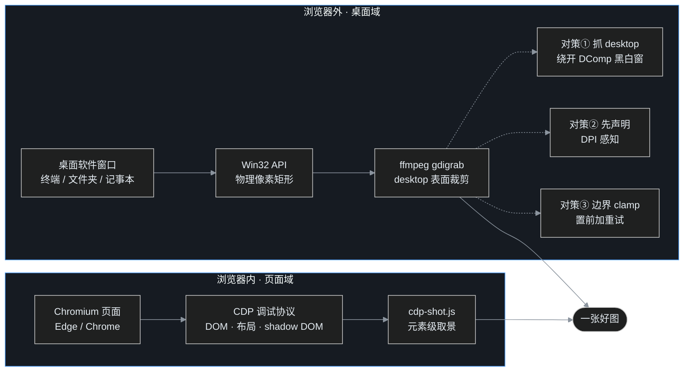

> 番外一里，叶扬造了 cdp-shot.js，浏览器页面想截哪截哪。这天叶扬想截一张终端窗口的图丢到桌面，伸手一抓却抓了个空——浏览器外的屏幕，是另一个江湖。这篇记录三个实打实的坑，以及最终收进 `tools/` 的成品脚本 `shot-window.ps1`。

## 一、浏览器管不到的地方

先划边界：番外一的 cdp-shot.js 走的是 Chrome DevTools Protocol，管的是 Chromium 渲染进程里的页面——DOM、布局、阴影根、模拟手机视口，样样精通。但终端窗口、资源管理器、桌面软件，CDP 连它们的门把手都摸不到。

叶扬这次的目标很朴素：截下当前这个 PowerShell 窗口，存成一张 PNG，放到桌面。

兵器不用另找，机器上已经装着 ffmpeg 7.1.1。ffmpeg 不只是转码瑞士军刀，它在 Windows 上自带一个叫 **gdigrab** 的输入设备，基于经典 GDI，专门抓屏幕（官方文档见文末参考链接）。全屏截图只需要一行：

```bash
ffmpeg -y -f gdigrab -i desktop -frames:v 1 -update 1 desktop.png
```

两个细节先记住：`desktop` 表示整个主显示器；ffmpeg 7 抓单帧必须加 `-update 1`，不加的话它会把输出文件名当成图像序列模板，直接报错。

全屏图打开，终端内容清清楚楚——路子是对的。接下来只要想办法「按窗口矩形裁一刀」。

## 二、坑一：title= 直抓终端，非黑即白

gdigrab 其实自带「按窗口标题抓窗口」的用法，文档示例就是 `-i title="窗口名"`，听起来很美好。叶扬拿 Windows Terminal 一试：

```bash
ffmpeg -f gdigrab -i title="终端窗口标题" -frames:v 1 -update 1 out.png
```

命令成功退出，文件也生成了，4.8 KB。打开一看：


**根因**：Windows Terminal 是 DirectComposition（简称 DComp）硬件合成窗口，画面由 DWM 桌面窗口管理器通过独立的合成表面呈现，传统 GDI 层面根本没有它的窗口内容。gdigrab 的 `title=` 抓的是窗口自绘表面，DComp 窗口交不出东西，于是**非黑即白**——叶扬最早还抓到过「白底加一个鼠标指针」的版本，同样没有半个字。这个表现跟窗口是否在前台、驱动版本都有关系，总之结论明确：不要对 DComp 窗口用 `title=`。

**正解是绕个弯**：gdigrab 抓 `desktop`——那是 DWM 合成之后的整屏表面，DComp 内容在这上面是完整的——再用 `-offset_x`、`-offset_y`、`-video_size` 按窗口矩形裁一刀。

## 三、坑二：高 DPI 屏上，坐标有两套

要按矩形裁，先得拿到窗口矩形。PowerShell 里 P/Invoke 一个 `GetWindowRect` 本是手到擒来，可叶扬第一次拿到的数字怎么算都不对劲：屏幕明明是 1920×1080，API 报回来的却像是个 1280×720 的世界。

**根因**：这台显示器开着 150% 缩放。Windows 为了照顾没做高 DPI 适配的老程序，会对「非 DPI 感知」进程撒一个善意的谎——API 返回的是**逻辑像素**坐标（96 dpi 的虚拟分辨率），显示时再由系统位图拉伸。而 gdigrab 抓的是**物理像素**桌面。两套坐标混用，裁剪区整体缩小、向左上方偏移：


解法只有一行：调用任何窗口 API **之前**，先来一句 `SetProcessDPIAware()`。从此 `GetSystemMetrics` 报的是 1920×1080 的物理世界，`GetWindowRect` 给的也是物理矩形，世界重新对齐。

顺带一提，这台机器上非 DPI 感知进程拿到的 `GetWindowRect` 数值，恰好是物理值除以 1.5——验证根因时这是最直接的证据。

## 四、坑三：越界 8 像素，与一个「访问被拒绝」

物理矩形到手，还有两个小坑排着队。

### 4.1 隐形边框让矩形越界

Windows 11 的窗口四周保留着为阴影和调整尺寸预留的**不可见边框**，`GetWindowRect` 给出的矩形右、下沿会超出真实屏幕——叶扬实测下边界整整多出 8 个像素，gdigrab 一遇到越界区域就撂挑子。用 `GetSystemMetrics(SM_CXSCREEN/SM_CYSCREEN)` 取主屏尺寸，把矩形 clamp 回屏幕内即可。

### 4.2 最小化抓黑，被遮挡抓到别人

`desktop` 表面是所有窗口「叠罗汉」之后最上层的画面：目标窗口**最小化**，这一帧它根本没渲染，抓到的是黑；目标窗口**被遮挡**，抓到的就是遮挡者——叶扬用「不切前台」模式试拍时，一度抓到的是窗口背后的终端内容，还误以为窗口自己透明。所以抓取前要 `ShowWindow(SW_RESTORE)` 恢复窗口、`SetForegroundWindow` 提到前台，再等一拍让动画走完。

### 4.3 error 5：来得快去得也快

置前同样有代价：`SetForegroundWindow` 之后立刻抓，gdigrab 偶发报一行 `Failed to capture image (error 5)`。错误码 5 就是 Windows 的 `ERROR_ACCESS_DENIED`——前台切换的过渡动画短暂锁住了桌面设备上下文。对策简单粗暴：置前后等 1.2 秒再抓；一旦失败，重新置前重试，最多 3 次，实测都能过去。

## 五、成品：shot-window.ps1

三个坑填平，叶扬把整套流程收成了 [`tools/shot-window.ps1`](https://github.com/yeyangchen2009/yeyangchen2009.github.io/blob/main/tools/shot-window.ps1)，和 cdp-shot.js 同住一个工具箱目录，约 140 行，除 ffmpeg 外零依赖：

- `-List`：列出当前所有可抓窗口的进程名与标题，不知道目标叫什么就先看一眼；
- `-ProcessName`：按进程名选窗口（推荐，标题常变也不怕）；
- `-Title`：按标题模糊匹配，和进程名二选一；
- `-Out`：输出文件路径；
- `-NoForeground`：不切换前台——代价是目标窗口不能被别的窗口挡住。

先列窗口：

```powershell
powershell -NoProfile -File tools/shot-window.ps1 -List
```

抓一个经典命令行窗口（这是任务在身时叶扬最常截的画面）：

```powershell
powershell -NoProfile -File tools/shot-window.ps1 -ProcessName cmd -Out window-shot.png
```


拍摄过程还附赠两条 PowerShell 5.1 环境经验，一并记下：

1. **脚本存成 UTF-8 务必带 BOM**。不带 BOM 时 PS 5.1 按 GBK 读取脚本，中文注释的字节错位会直接污染 C# 代码块的语法解析，报出一堆莫名其妙的编译器错误；
2. **`$ErrorActionPreference = 'Stop'` 会误伤原生命令**：ffmpeg 正常往 stderr 吐的 warning 会被包装成终止错误，重试逻辑根本没机会执行。调用 ffmpeg 的段落临时切回 `Continue`，只信 `$LASTEXITCODE`。

目标窗口的选择也有讲究：**经典 Win32 程序最稳**（conhost、Notepad++ 这类一次一个准）；Win11 里 XAML/Mica 材质的新界面表现飘忽——「设置」窗口一次成功，文件资源管理器却偶发主内容区整片透明、直接露出背后窗口，重拍一次又恢复正常。这属于桌面合成器的偶发丢帧，看到怪图先重拍、或换个经典窗口。

## 六、浏览器内外的分工图

现在工具箱里两把「相机」，各管一边：



## 七、小结

一句话划江而治：**浏览器内的归 CDP，浏览器外的归桌面合成表面**。cdp-shot.js 与 shot-window.ps1 如今在 `tools/` 目录里各守半边天。

回头看这三个坑，本质都是「两个世界接缝处的错位」：GDI 与 DirectComposition 之间、逻辑像素与物理像素之间、窗口矩形与屏幕边界/前台状态之间。缝不大，但不蹲下来看，就是过不去。

ffmpeg 当然不是最轻的截图工具，Snipaste、ShareX 各有粉丝。叶扬装它本就是为了视频处理，顺手把单帧截图也收进同一条命令行，便不肯再多养一个常驻软件——工具少一个，心智轻一分。

下一篇番外写什么？看心情，也看接下来又踩了什么坑。

## 参考链接

- [ffmpeg 官方文档：gdigrab 输入设备](https://ffmpeg.org/ffmpeg-devices.html#gdigrab)
- [Microsoft Learn：DirectComposition](https://learn.microsoft.com/en-us/windows/win32/directcomp/)
- [Microsoft Learn：SetProcessDPIAware](https://learn.microsoft.com/en-us/windows/win32/api/winuser/nf-winuser-setprocessdpiaware)
- [Microsoft Learn：GetWindowRect](https://learn.microsoft.com/en-us/windows/win32/api/winuser/nf-winuser-getwindowrect)
- [Microsoft Learn：SetForegroundWindow](https://learn.microsoft.com/en-us/windows/win32/api/winuser/nf-winuser-setforegroundwindow)
- [番外一｜给博客拍证件照：一个零依赖 CDP 截图器的诞生](/post/26.html)
