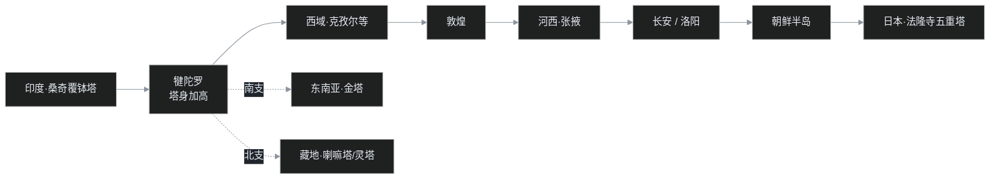
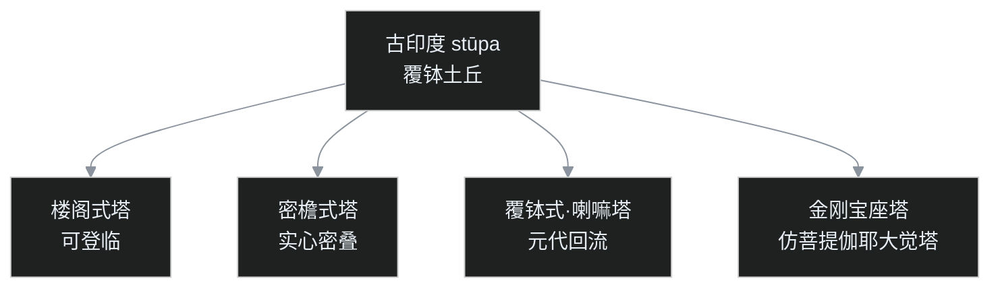

## 小白问题：为什么印度佛塔像个倒扣的碗，中国佛塔却像楼、还能爬？

[番外一](/post/64.html)讲到，佛陀在拘尸那罗涅槃、荼毗之后，八个国家分走了舍利。舍利不能随手一埋，于是有了专门安放它的建筑——塔。

叶扬最初对"塔"毫无疑问：塔嘛，高耸的、多层的、有尖顶的那种楼。可看到印度现存最古老的佛塔照片时愣住了：那根本不是楼，而是一个巨大的、倒扣着的土碗，矮胖矮胖地趴在地上。同一个东西，为什么在印度是个土馒头，到了中国就变成了能爬的高塔？还有那句老话"救人一命，胜造七级浮屠"——这"七级"，到底指七层楼，还是什么别的？

这一趟两千年、几万里的建筑旅行，就从一个土堆讲起。

## 一、一切从一个土堆开始

古印度梵语里管这种土堆叫 **stūpa**，汉译"窣堵坡"，本义就是"堆积、隆起"——堆起的一堆土或石。需要先说清楚一件事：**stūpa 不是佛教发明的。** 它是吠陀时代（佛教出现之前好几百年）就有的东西，本质是个坟冢：安葬重要人物遗骨的土堆，婆罗门教、耆那教等其他宗教传统也建。佛教做的不是发明，而是把这个现成的形制接过来、赋予新的含义。

佛教的第一座塔，是为佛陀本人建的。据《长阿含·游行经》等记载，佛陀荼毗（火化）之后，舍利（火化后的骨烬）要慎重安置：先用一个小型金属容器装起来，叫**舍利函**；为表达敬重，再在舍利函外面堆土建一座可供瞻仰的建筑——这就是舍利塔，佛教建塔传统由此开始。

舍利被当时的八个国家分请而去，史称"**八王分舍利**"：拘尸那罗、罗摩伽、迦毗罗卫（佛陀的母国释迦族）、毗舍离、摩揭陀等八个城邦各得一份，各自起塔供养。这一幕后来成了佛教艺术的经典题材，敦煌莫高窟第 148 窟就有一幅《八王分舍利》壁画：八国的人马簇拥着宝函，神情急切又恭敬。

至于拘尸那罗本地，荼毗的火葬台后来也被用土覆盖成覆钵的形状，到阿育王时代又在外面加了一层砖保护。但这座塔和八国请走的舍利塔不同——里面没有舍利，只有火化留下的碳渣。

## 二、阿育王开塔，与桑奇的"标准件"

两百多年后，孔雀王朝的阿育王几乎统一了整个印度，当年八国所建的舍利塔，尽入阿育王的版图。于是阿育王做了一件影响深远的事：**把旧塔打开，取出舍利，重新分送到帝国各地、以及佛法传布的更远地方**，再起塔供养。从此，舍利塔就成了"佛宝"的象征——佛不在了，塔就是信众瞻仰和忆念佛的锚点。

佛典里说阿育王建了"**八万四千塔**"。这个数字听上去惊人，需要放在【传说层】来读：古印度用"八万四千"形容极多（就像中文说"成千上万"），是修辞性的极言其多，不是一份工程清单；考古上也从未发现过这个数量的塔。真正留存至今、最能代表早期佛塔标准形制的，是印度中央邦的**桑奇大塔**。

桑奇大塔是现存最古老的佛塔之一：阿育王时代始建，后来的巽伽王朝又扩建加高。它的样子就是一个标准的覆钵——梵语叫 **anda**，本意是"蛋"，浑圆的半球趴在圆形基座上；丘体是实心的，舍利函就瘗藏在它的核心，相当于后来地宫的雏形；外面围着一圈石栏杆，四方各开一座雕满浮雕的塔门。

这里有个极有意思的细节：桑奇的浮雕**从不直接雕刻佛陀本人**。要表现佛成道，就刻一棵菩提树；要表现初转法轮，就刻一个法轮；此外还有佛的足迹、金刚宝座——全部用"象征物"代替。这是佛教艺术的"无偶像期"：佛是觉悟、是真理，真理无形，怎么能雕成一个具体的人像呢？佛塔本身，正是这种"以象征代真身"思路的最大作品。

顺带一提，阿育王那个时代还留下了另一类石头纪念物——**石柱**。如果说塔是给信众供养的象征，石柱就是给全民看的告示：高耸的砂岩石柱上刻着法敕，远远就能望见，宣示国王的行迹与政教主张。毗舍离的石柱是今天唯一还完整站立、顶上神兽（石狮）也完好的一根；鹿野苑那根柱身仍立在遗址、只是顶端已经折断，脱落的四狮柱头（今天印度国徽的原型）现存于鹿野苑考古博物馆；蓝毗尼石柱则只剩柱体，神兽早已不知所踪。塔与石柱，是阿育王手里两种不同的石头宣传。

阿育王"分舍利、广建塔"的故事，后来也随佛教东传，在中国催生了一批"阿育王塔"的传说。汉地相传阿育王在全世界（实际指当时人所知的范围）造了若干"阿育王宝塔"，如浙江宁波的阿育王寺，就以寺中所藏"阿育王塔"（内传佛舍利）闻名，历代香火极盛。这些塔当然大多是后世依传说追建、追名，并非真从孔雀王朝传来——但它说明阿育王的"建塔—分舍利"叙事，如何成了整个佛教世界共享的历史记忆。

## 三、解剖一座塔：覆钵、伞盖，和被误会千年的"七级"

要看懂后来所有的塔，得先把桑奇这种早期塔"拆开"。它由下至上是这样几部分：

- **方形基座**；
- **覆钵塔身**（anda）：土或石堆成的半球，藏舍利，是塔的主体；
- 顶端的**方形平台**；
- 平台中央立一根**刹杆**，杆上串着一层层圆环，叫**相轮**，也叫**塔轮**；最顶上还有华盖、宝珠。

其中最关键、也最容易被忽略的，是顶上那把"伞"。古印度的国王和权贵出行，有专人在头顶撑伞盖（伞在烈日下既是实用物，也是尊贵身份的标志）。于是人们在圣人舍利堆成的土丘顶上插一把伞盖——等于立了个标识：**此中所葬，是一位应受尊敬的圣者。** 伞面是布的，容易朽坏，后来就改用金属或石材，做成了相轮的样子。

相轮的层数有讲究：都是**单数**，常见 3、7、9、11、13 级；用金属、石料可以一层层串得很多，层数越多，越显尊贵。日本奈良东大寺旧东塔（木塔，早已烧毁）留下的铜制塔刹，数一数是 9 轮。

这就解开了那句老话的谜：**"造七级浮屠"，说的是塔刹上有七重相轮，根本不是指塔有七层楼。** 印度那种覆钵塔，一层楼都没有，照样可以"七轮"。

更重要的是：**塔刹是辨别佛塔的唯一普世标志。** 塔的身子可以千变万化（下面就会看到各种楼形、檐形），但只要顶上立着带相轮的刹，它就是佛塔；而中亚、西域那种高高的塔，如果顶上是一弯新月或一颗星，那是伊斯兰教的高塔（尖塔），不是佛塔——区别不在塔身，在刹。

塔的象征也由此完整：浑圆的覆钵既象征佛已证入的涅槃，也被看作一座微缩的宇宙山；那根从塔身一直通到最高处的刹杆，则像贯穿天地的"宇宙轴"，把尘世与涅槃连在一条线上。藏地的佛塔相轮常做十三层，称为"**十三天**"，象征从凡夫到成佛所历的十三阶次第——这时的塔，已经不只是一座坟，而成了一整套世界观的立体模型。信众绕塔行走，则要按顺时针方向"右绕"，表示随顺正法、把佛的教法转续下去。

## 四、塔寺合一，然后走上丝绸之路

佛陀在世时的道场——比如王舍城的竹林精舍、舍卫国的祇园精舍——**是没有塔的**，那只是一处处庄园式的修行场所。塔与寺连在一起，是佛涅槃以后的事：人们要守塔、供养塔，便在塔旁修筑僧舍；绕塔、供养逐渐成为僧团生活的一部分，这就是"**塔寺合一**"。早期的佛教伽蓝往往以塔为绝对中心，僧房围绕着塔排布。

到了犍陀罗（今巴基斯坦一带，佛教艺术的大熔炉），塔的塔身被加高、基座上开始出现雕刻，又有了供奉小塔的塔祠。这里还要补一个相关概念——**支提**（caitya）：古印度指供人聚集礼拜的圣坛、纪念性场所；石窟中专门凿出、内部立塔供信众绕行的殿堂，就叫"支提窟"（印度的卡尔利、阿旃陀石窟都有宏伟的支提窟）。它把"塔"和"可供集体礼拜的室内空间"合在一起，可看作塔与寺结合的另一条路径，和露天的覆钵塔并行发展。贵霜王朝的迦腻色迦王（其护法与大乘兴起的关系，见 [C05（上）](/post/52.html)）相传在都城（今白沙瓦一带）建有一座极高的大塔，汉地求法僧称之为"**雀离浮图**"（此名与白沙瓦大塔的记载，见《洛阳伽蓝记》所引宋云、惠生行纪及《大唐西域记》），记其层观壮丽、数里之外即可望见——从桑奇的低矮土丘到这种高耸巨塔，塔在犍陀罗完成了从"坟"到"高层建筑"的关键一跃。此后佛教的塔便沿着丝绸之路一路东行：从犍陀罗，到西域（今新疆，克孜尔等石窟与佛塔遗址），再出玉门关到敦煌，经河西走廊（张掖等地）进入中原。同时，它也向南、向北分出支线（详见后图）。这一路，直线距离上万华里，走了好几百年。

塔往往是佛法进入一片新土地的"先遣"。在大批经典还没被译出之前，先是往来的商队和游方僧带来小型的随身佛塔、造像，人们绕塔、供养，便这样把零散的信众聚集起来——有塔的地方，渐渐就有了僧、有了寺。所以"佛塔先行"几乎是佛教传播的通例：它不需要听者懂某种语言、理解某套义理，只要一座看得见、绕得着的建筑，信仰就有了落脚之处。这也解释了为什么塔的形制能跑得比经典更远、变形也更丰富。

## 五、汉地的大改造：把土馒头重写成楼

塔进入中国，遇到了一个前所未有的建筑传统——**重楼**。中国先秦秦汉以来就擅长建造高层木构：高台、望楼、楼阁，一层层向上垒。于是中国工匠做了一次绝妙的"嫁接"：**下面用汉地的多层木楼，顶上安印度的塔刹。**

"塔"这个字本身，也是这场相遇的产物。stūpa 早期被音译为"窣堵坡""浮图（浮屠）"，汉末译经时取其音节、结合本土含义新造出一个"塔"字，专门指这种建筑。史书记载，汉末丹阳人笮融大建佛寺，《三国志·吴书·刘繇传》记其所造佛塔"**垂铜槃九重，下为重楼阁道**"——九重铜槃就是相轮，重楼阁道就是汉地的高层木构，把这次融合说尽了（今人常把它概括为"上累金盘，下为重楼"）。

按汉地的传统记载，最早的例子是洛阳**白马寺**：东汉明帝感梦求法，白马驮经而来，寺院以塔为中心布局——这正是承袭了印度、西域"以塔为寺之核心"的旧规（后世才慢慢变成以供奉佛像的大殿为中心，塔退居旁侧）。寺中相传有"齐云塔"，后世屡毁屡建。从"塔在中央"到"塔在殿旁"的位移，也悄悄记录了塔与佛殿在寺院里地位的消长。

塔下藏舍利的"地宫"，到唐代发展成一种郑重的制度。最著名的例子是陕西**法门寺地宫**：寺中藏有一节佛指舍利，每隔数十年由皇帝迎请入宫供奉，地宫用巨石封砌，里面瘗埋了舍利宝函与大量金银、琉璃、丝织供物；封闭千年后，到 20 世纪才重见天日。这时候的"塔—地宫—舍利函"层层套合，已经把桑奇那个中空土丘的简单做法，发展成了一套严密的供养体系。

在这个"重楼＋塔刹"的基本思路上，中国又发展出几种主要形制：

- **楼阁式塔**：保留楼阁的样子，层层可登临远眺；西安大雁塔、山西应县木塔、苏州虎丘塔、河北定县料敌塔都属此类。其中应县木塔通体木构、高达六十多米，历近千年的地震与战火仍屹立，被称为"木塔之王"；最古的砖塔嵩岳寺塔则把十二边形的塔身与十五层密檐收成一个极其优美的抛物线，是密檐塔的开山之作；
- **密檐式塔**：底层特别高，以上檐与檐密密相叠、多为实心不能登临；河南嵩岳寺塔、西安小雁塔是代表；
- **覆钵式塔（喇嘛塔）**：元代以后随藏传佛教再度流行的覆钵形制，通体刷白，如北京妙应寺白塔、北海白塔；
- **金刚宝座塔**：高台（宝座）之上五塔并立，模仿的是菩提伽耶大觉塔的格局，如北京真觉寺塔。

[番外一](/post/64.html)提到的菩提伽耶**大觉塔**，本身就是"金刚宝座"的原型——佛成道处的纪念塔，后来成了这种塔式共同追摹的母本。

这一路东传，还留下几座课程里特别点到的名塔：

- **敦煌白马塔**：相传鸠摩罗什从龟兹被迎往长安，途经敦煌时，驮经的白马夜间托梦道别，次日白马死去，罗什为它立塔；塔身的样子已接近后来的藏式覆钵塔；
- **张掖万寿寺塔（张掖木塔）**：西夏时期所建，形制奇特——**下半是汉地楼阁，上半却是中亚、藏地的覆钵**，两种形式合为一身，恰是西夏同时吸纳中原与西域文化的物证；
- **长安大、小雁塔**：大雁塔是玄奘奏请、建于大慈恩寺（寺本为高宗追荐生母文德皇后而立），塔主要用来安置玄奘所译的经典、佛像与舍利，是楼阁式砖塔；小雁塔则是典型的密檐式。

随着塔彻底本土化，它在民间还发展出许多超出佛教的用途：有的塔被当作镇水、镇邪之物（杭州雷峰塔在民间传说里就与"镇妖"叠合），有的"文峰塔""文昌塔"则是为地方祈求文运、兴旺科举而建——佛塔从供养舍利的宗教建筑，慢慢渗进了风水与教化的世俗功能里。

## 六、一路向东，一路向北

塔的旅行没有止步于中原。

向东渡海到朝鲜半岛（佛国寺、弥勒寺皆有多塔并立），再到日本：日本保存了世界上最古老的木构之一——奈良**法隆寺五重塔**；寺院采用金堂与塔配列的"单塔／双塔"伽蓝格局（金堂即大雄宝殿，东西或各立一塔）；东大寺、药师寺的双塔气象宏阔。木构怕火，中国境内的早期木塔几乎全数不存，反而是多地震的日本，把唐风木塔的实物留了下来——这背后另有一套耐震的巧思。五重塔内部有一根从塔顶贯通到底层、下端落在础石上的"**心柱**"（刹杆的延伸），各层与心柱之间并非刚性锁死，而是允许轻微错动。地震来时，五层楼先后晃动、逐层消解力道，心柱则像一根定海神针，让整座塔"摇而不倾"。这种"以柔克刚"的结构逻辑，与中国古建"墙倒屋不塌"的梁柱哲学一脉相通；至于把心柱悬吊起来、与地面绝缘以进一步耗能的做法，则是后世（江户时代以后）五重塔的发展，不宜倒推到最古的塔上。

向南向北也各有分支：藏地把覆钵塔发展为**喇嘛塔**与安放高僧遗骨的**灵塔**——一位大喇嘛圆寂后，遗骨经处理安放于灵塔，塔即其法身与教法的延续，布达拉宫等处至今有层层灵塔殿；东南亚的缅甸、泰国则把佛塔通体鎏金，做成一座座金塔。同一颗印度的种子，在不同土壤里长出了好几个"发行版"。

## 七、一个程序员类比：同一套 API 的跨平台编译

叶扬说，塔的东传，特别像一个核心库做了跨平台移植。

这套系统有个极稳定的**接口**：内部供奉舍利、象征涅槃与觉悟、可供信众右绕、头顶必有相轮——这几条，从桑奇到奈良、从敦煌到缅甸，两千年没变。变的只是**渲染层**：到了汉地，能工巧匠把它渲染成可登临的楼阁；到了藏地，保留覆钵的"原始皮肤"刷成白色；到了日本，被压缩成五重木塔；到了东南亚，通体镀金。塔刹那组相轮，则像是所有平台发行版都强制保留的一枚接口徽章——只要看到它，就知道这是哪个库的产物。

照例，自己先戳三个洞：

1. 说"接口没变"并不准确——汉地的楼阁式塔能登临、能瞭望，塔下还挖出了安放舍利与宝物的地宫，有些地方甚至兼作文昌、风水之用，功能其实早已漂移，不只是"重写界面"；
2. "内核"本身也在变——相轮从早期的一把伞盖，一层层加到 11、13 轮，层数本身就是一场持续的军备竞赛；
3. 最要命的是接口被**滥用**：当"造塔"从纪念佛陀变成了积攒功德的手段，这枚徽章就被当成了可交易的凭证（详见吵架现场）。

## 八、吵架现场：塔到底是纪念物，还是功德期货？

围绕塔，历来有两种很不一样的理解。

一种是**纪念派**：塔是为佛而建的纪念物，绕塔、供养是为了忆念佛的教法、提醒自己涅槃的方向，塔本身只是"指月之指"——指向觉悟，本身不是觉悟。

另一种是**功德派**：造塔本身即是一桩大功德，塔越高、轮越多、用料越贵，功德越大，可以计数、可以回向。"救人一命，胜造七级浮屠"这句话，本来是说人命比造塔更可贵、劝人珍惜生命；但在流传中也从侧面固化了"造七级塔＝一份明码标价的大功德"的印象。

这场古已有之的分歧，今天还在继续：一边是各地复建、新建的大佛大塔，动辄成为旅游地标和门票经济的一环；另一边是文物保护者和部分佛教界人士，更在意塔的历史价值与纪念本意。叶扬不想替古人断输赢——造塔供养的发心可以很真诚，"以塔摄众、以塔护教"在历史上也确实保全过佛法；但当庄严异化成攀比、纪念异化成交易时，最好回头想想桑奇那座土馒头最初的用途：它不过是想留住一位老师的一点点遗骨，好让后来的人记得，曾经有人这样活过、这样觉悟过。

## 九、卡壳角：叶扬卡住的三个地方

**1. "八万四千塔"，该怎么读？**

初读到这个数字，叶扬纠结它到底是真是假。后来想通了：真要拿它当考古指标，肯定对不上，也没有意义；但它真实反映了阿育王时代佛法大兴、塔寺遍布的历史记忆。读古文献，得先分清一句话是"会计报表"还是"抒情形容"——这一句显然是后者。这与番外一讲的佛传"四层级"是同一个道理：让传说回到传说层，它就不会骗人。

**2. 塔到底是坟，还是楼？**

这是个看似简单、其实没法二选一的问题。它有坟的部分（地宫、舍利，源自墓葬），有楼的部分（楼阁式塔层层可登），还有信仰徽章的部分（塔刹相轮）。中国的塔，是这三种身份的"三合一混血"。非要用"坟"或"楼"一个标签去套，反而会错过它最有趣的地方——它本就是文明嫁接长出的新物种。

**3. 为什么那么古老的木塔，今天几乎看不到了？**

中国南北朝隋唐的木塔曾经遍地林立，可现存最早的木塔（应县木塔）已是辽代，唐代及以前的木构高塔基本无存。原因不复杂：木材怕雷火（塔高耸，最易遭雷击）、怕兵燹（历次灭佛与战火）、怕地震与虫蛀，年深日久也会朽坏。所以今天想"看见"唐以前木塔的样子，除了壁画与文献，反而要去日本的法隆寺、药师寺——一座建筑的旅行史，最后竟成了另一地的保存史——建筑的命运，有时比它所纪念的人还要曲折。

## 十、两张图、两张表，与一组术语

**表一：中国佛塔的四种主要形制**

| 形制 | 特征 | 能否登临 | 名例 |
|---|---|---|---|
| 楼阁式 | 层层如楼，外有门窗平座 | 可登临 | 大雁塔、应县木塔、虎丘塔、料敌塔 |
| 密檐式 | 底层高，以上檐层密集 | 多实心，不可登 | 嵩岳寺塔、小雁塔 |
| 覆钵式（喇嘛塔） | 白色覆钵，塔身高耸 | 一般不可登 | 妙应寺白塔、北海白塔 |
| 金刚宝座式 | 高台上五塔并立 | 台座可登 | 北京真觉寺塔（仿大觉塔） |

**表二：东传名塔年表（约建年代）**

| 约建年代 | 塔 | 地点 | 形制 | 看点 |
|---|---|---|---|---|
| 前 3 世纪始建 | 桑奇大塔 | 印度桑奇 | 覆钵 | 现存最古佛塔之一，无偶像象征雕刻 |
| 约 5–6 世纪（历代重修） | 大觉塔 | 菩提伽耶 | 金刚宝座原型 | 佛成道处，金刚宝座塔母本 |
| 523 年 | 嵩岳寺塔 | 河南登封 | 密檐 | 现存最古老的砖塔 |
| 652 年（704 改建） | 大雁塔 | 西安 | 楼阁式砖塔 | 玄奘奏请，安置经像舍利于大慈恩寺 |
| 约 7 世纪末 | 法隆寺五重塔 | 日本奈良 | 木构五重 | 世界最古木构之一，670 年火灾后重建 |
| 707–710 年 | 小雁塔 | 西安 | 密檐式砖塔 | 与大雁塔齐名 |
| 1056 年 | 应县木塔 | 山西应县 | 楼阁式木塔 | 现存最高、最古木塔 |
| 1271–1279 年 | 妙应寺白塔 | 北京 | 覆钵式 | 阿尼哥主持，藏式回流标志 |

**术语钩子（15 条）**

- **窣堵坡 / stūpa**：古印度的坟冢土堆，佛塔的源头与梵语原名，非佛教首创。
- **塔 / 浮屠（浮图）**：汉末译经时新造的字；"浮屠"为早期音译。
- **覆钵 / anda**：倒扣碗状的半球塔身，梵文本义"蛋"。
- **塔刹 / 相轮（塔轮）**：塔顶的刹杆与层层圆环，佛塔的普世标志。
- **伞盖**：相轮的起源，古印度象征尊贵的仪仗。
- **舍利 / 舍利函 / 地宫**：荼毗后的骨烬；装舍利的小容器；汉地塔下安放舍利的墓室。
- **八王分舍利**：佛灭后八国分请舍利、各自起塔的史事。
- **右绕**：顺时针绕塔行礼，表示随顺正法。
- **桑奇大塔**：现存最古佛塔之一，以象征物代替佛像。
- **犍陀罗**：佛塔东传的关键中转站，塔身加高、雕刻发达。
- **塔寺合一**：佛涅槃后塔与僧舍逐渐结合的制度；佛世精舍本无塔。
- **支提 / 支提窟**：供集体礼拜的圣坛或石窟殿堂，内立小塔、可供绕行。
- **楼阁式 / 密檐式**：汉地两大塔型，前者可登临、后者檐密而实心。
- **金刚宝座**：高台五塔之制，源于菩提伽耶大觉塔。
- **喇嘛塔 / 灵塔**：藏传佛教的覆钵塔与安放高僧遗骨之塔。
- **五重塔 / 八万四千塔**：日本木塔典型；阿育王建塔传说中的极言之数。

塔在东传途中被一层层重写，而驱动这场旅行的佛教本身，后来在印度的命运如何？[C09 密乘与 1203](/post/60.html) 讲了那一场终局；塔从"纪念"滑向"功德"的过程，也是 [C12 三链合一](/post/63.html) 所结账的变质线的一部分。整个学习笔记（含番外）的地图，在 [C00 总目](/post/45.html)。
