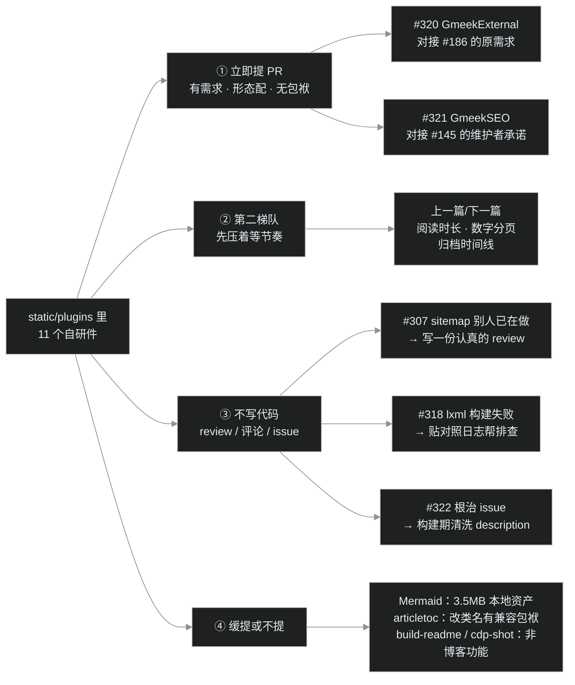

# 番外二｜我给 Gmeek 提了三个 PR：一次开源回馈的完整流水线

G17 收官那天晚上，叶扬翻着 `static/plugins/` 目录里一排 `.js` 文件，突然意识到一件事：这一个多星期叶扬给博客写了一大堆功能——目录、归档、分页条、上一篇下一篇、阅读时长、Mermaid 自动加载、外链新标签、SEO 四件套——但它们自始至终只服务了一个博客，就是叶扬自己的。

Gmeek 是开源的，白嫖这么久，是不是该回馈点什么？

不过"我写了代码"和"这代码适合进上游"之间，隔着一整套筛选流程。有的功能自带 3.5MB 资产，上游不可能收；有的功能别人已经在做了，再提一遍是添乱；还有的代码在自己站里跑得好好的，换个人用立刻翻车——这个后面有实锤。

这篇番外记录完整过程：怎么把 11 个自研件挨个过筛，最后产出 **3 个 PR、1 个根治 issue、2 条高信息量评论**，以及途中抓到的两桩"只有给别人用时才暴露"的 bug。

## 一、先摸清上游的脾气

提 PR 之前先观察，这是叶扬踩过很多坑之后的肌肉记忆。

Gmeek 官方插件只有 6 个，收录机制非常轻：把 `.js` 丢进仓库的 `plugins/` 目录，用户在 `config.json` 的 `script` 字段引一下就算安装——`articletoc.js` 就是外部作者 Tiengming 的作品被官方收录的，有社区先例。维护者更新频率低（最近一次代码提交停在 2026 年 2 月），但项目不是死的：今年还合并过 PR，issue 里也会认真回复。

这是现在的 PR 队列，最上面三条绿名字都是叶扬的——截图时 #320 才开了 32 分钟，热乎的。注意队列里的时间尺度：**这个项目的 PR 合并周期以月甚至年计，急不得**。

更早之前叶扬已经在 issue 区做过一轮侦察，收获很大。比如 #145，一个 2024 年 7 月的 SEO 需求老帖，三条需求分别是外链 rel、外链跳转页、sitemap：

就是在这个帖子里，维护者亲口回了一句："这些功能都可以通过插件的方式来实现，我有空写一个试试。"

然后七个月过去了，那个插件还没出现。

**维护者没空兑现的承诺，是社区贡献者最好的入场券**：需求明确、维护者公开背书、还没人动手。另外，昨天开的 #319（无标签 issue 触发 KeyError 的三行修复）已经在队列里当探路石——如果这个最小的 PR 能被合并，说明贡献通道还活着。

## 二、十一个自研件过筛子

把候选全部摊开，按统一标准过筛。标准就三条：

1. **有上游 issue 呼声吗？** 自嗨功能不进上游，得有别人的真实需求佐证；
2. **形态匹配吗？** 上游插件都是单文件、零构建、依赖走 CDN、样式内联或复用 Primer；
3. **有兼容性包袱吗？** 会改变现有用户页面表现的，先在 issue 里递话，不直接上代码。

过筛结果分成四个梯队：

几个落选的理由值得一说：

- **Mermaid 加载器**：我们刻意把 3.5MB 的 mermaid.min.js 放本地（南科大镜像抽风的阴影，见 [G15](/post/24.html)），上游插件的传统是 CDN 引入，理念冲突。思路已经在 #180 分享，代码不强推。
- **articletoc 的类名隔离修复**：改类名会波及所有已经自定义过 `.toc` 样式的老用户，有兼容包袱；而且原作者 Tiengming 本人的 #272 还在队列里，外人不宜插队。这个在 #100 里递过话，等维护者接。
- **README 拼接器、cdp-shot 截图器**：它们是"仓库工程"和"写作工具"，不是博客功能，本就不属于 Gmeek。

## 三、两个 PR 是怎么写的

### 3.1 #320 GmeekExternal：最小的试水

[#186](https://github.com/Meekdai/Gmeek/issues/186) 的第一条需求原话就是"用新标签页打开链接（支持设置区分站内和站外）"。最终交付 42 行，零依赖零 CSS：

两个设计决策有点说法：

- **内外链判定不用字符串 `includes`**，交给 `new URL(href, location.href)` 按 hostname 比较。绝对地址、协议相对地址（`//host/...`）、根相对、纯相对路径都能正确归类；自定义域名、project pages 子路径部署也成立。
- **补 `noopener`，但刻意不加 `nofollow` / `noreferrer`**。`nofollow` 是 SEO 投票语义，外链给不给权重该由作者决定；`noreferrer` 会抹掉来源统计，而现代浏览器里 `noopener` 已足够防 reverse tabnapping。#145 里维护者自己也是"需要时手写 a 标签"的路子——插件不该替用户做 SEO 决定。

PR 描述按固定四件套写：**背景（链接到具体 issue）、功能、刻意不做的事、安装方法 + 线上 demo**。让维护者在一分钟内看懂"这是什么、为什么该合、怎么装"。

### 3.2 #321 GmeekSEO：重头戏，但要把边界写在脸上

[#321](https://github.com/Meekdai/Gmeek/pull/321) 对接 #145 的另一半，也就是 [G17](/post/27.html) 那四件套：canonical、清洁摘要、Twitter Card、BlogPosting 结构化数据。

提给上游的版本，PR 描述里专门有一节"已知边界"，主动说明：canonical 和 JSON-LD 是运行时注入，`curl` 静态源码看不到，依赖 Google/Bing 的渲染队列；并且明说**更彻底的修法在模板层**——构建期就把 description 洗干净、把 canonical 写进 HTML，插件只是零侵入的过渡方案。

为什么一边承认有更好的方案，一边还要提插件？因为插件今天装上就能用，模板改动不知道排到什么时候；两个方案不冲突，选择权交给维护者。开源贡献里最忌讳的，就是把 workaround 伪装成正解塞给对方。

## 四、实锤：准备 PR 的过程抓到自己两个 bug

这是全篇最有教程价值的一节。

在自己站里跑了好几天的 GmeekSEO，换成"假如一个什么都没配的用户装上它"的视角走查，立刻翻出两个通用性问题：

1. **固定页识别正则只支持用户站。** 本站是 `owner.github.io`，about 页路径是 `/about.html`，旧正则 `^/[A-Za-z0-9_-]+\.html$` 正好命中；但 Gmeek 还支持 project pages 形态，页面部署在 `/repo/about.html`，子路径直接不匹配，插件会静默罢工。改成取路径末段（`pathname.split('/').pop()`）再判断，两种部署形态通吃。
2. **没配 ogImage 的用户会得到空字符串图片字段。** 本站 config 里有 `og.png`，JSON-LD 的 `image` 一直是真值；但不配 ogImage 是框架允许的，这时插件会输出 `"image": ""`，Google 富结果测试直接判错误。改成 `image || undefined`，`JSON.stringify` 序列化时自动省略该字段。

两个修复先在 PR 分支改好，又**同步回本站、全局重建、线上验证**，保证自己跑的和提给上游的是同一份代码（commit `9e9f21e`，重建 run 成功，headSha 核对一致）。

教训很直白：**你自己的环境配置永远是齐的，通用性 bug 只有认真想象"一个什么都没配的用户装上去会怎样"时才现形。** 这也是给开源项目提 PR 最大的私人收益——它逼着你的代码从"我能用"升级成"任何人都能用"。

## 五、不写代码的贡献，有时比 PR 更有用

### 5.1 帮别人的 PR 做 review：#307

sitemap 我们站早有外挂版（`sitemap_gen.py`，[G04](/post/8.html) 就用上了）。但翻到 [#307](https://github.com/Meekdai/Gmeek/pull/307) 之后叶扬决定不重复提：人家 3 月就开了 PR，代码读下来完成度很高。那能做什么？——写一份认真的 review。

叶扬把 `Gmeek.py` 的 `createPlistHtml` 翻出来逐条对照：分页页数的 `ceil` 边界在 15/30/31 篇三种情况下是否与模板循环一致、`labelColorDict` 会不会污染遍历（结论：主流程返回后才塞字典，时序安全）、runOne 增量构建时旧文章和固定页 merge 得全不全、两种 Pages URL 形态、`docs/` 输出位置——五条"我核对过、确认没问题"，加两条非阻塞建议（删文的 runOne 分支不刷新 sitemap；框架缺一个带 `Sitemap:` 声明的 robots.txt）。

对低频维护的项目来说，一个带着验证过程的"这个 PR 可以合"，往往比再开一个 PR 有价值得多。等 #307 合并，我们自己的外挂版就回迁过去。

### 5.2 帮人排查"伪 bug"：#318

[#318](https://github.com/Meekdai/Gmeek/issues/318) 报告 lxml 6.1.3 在 Python 3.8 下没有预编译 wheel，构建必挂。叶扬当天的构建日志里恰好有反证：ubuntu-24.04 + Python 3.8.18 成功下载了 `lxml-6.1.3-cp38-manylinux` wheel。

贴日志、问环境（怀疑是 glibc 低于 2.28 的老系统，或是本地 Windows）、再给出钉版本和升级 Python 的临时方案。issue 区里很有价值的一类回复就是："我这边复现不了，这是我的对照数据。"

### 5.3 workaround 之外，再单开一个根治 issue：#322

[G17](/post/27.html) 就实锤过：文章页的 meta description 直接取 `issue.body` 第一个句号前的原文，`#`、`>`、`` 全进搜索摘要。GmeekSEO 插件运行时能洗干净，但静态源码里还是脏的，不渲染 JS 的爬虫读不到。

于是另开 [#322](https://github.com/Meekdai/Gmeek/issues/322)：代码位置（`Gmeek.py:347` + `templates/post.html` 第 4、6 行）、现象、复现路径、约十行标准库就能实现的构建期修法，全部写清楚。插件 PR 是今天的解药，根治 issue 是明天的手术刀，两个都留下，并在 PR 评论里互相挂了链接。

## 六、节奏、礼仪，和一个截图彩蛋

最后沉淀几条这次摸到的门道：

- **一个插件一个 PR，绝不打包。** 小项目 review 成本本来就高，塞在一起只会让它们互相连坐——一个有争议，全部卡住。
- **别一次性轰炸。** 第二梯队四个先压着，看维护者对 #319/#320/#321 的响应节奏再说。给停更七个月的项目一次甩六个 PR，那是压力，不是热情。
- **PR 描述替维护者把 merge 理由写好**：解决哪个 issue、怎么装、线上 demo、已知边界，四件套齐活。
- **状态要诚实。** 截至本文发布，三个 PR 全部 **Open 等待合并**，没有任何一行进入官方仓库。以后无论被合并、被要求修改还是被婉拒，叶扬都会回到[路线图 #5](https://github.com/yeyangchen2009/yeyangchen2009.github.io/issues/5) 更新状态。

截图彩蛋：本文 7 张配图全部用[番外一](/post/26.html)那个零依赖截图器拍的 GitHub 页面——截图器第三次自举。过程中还翻车两次：GitHub 新版 issue 页把评论塞进了 **shadow DOM 里的虚拟滚动列表**，`scrollIntoView` 在无头浏览器里把页面拍成了"重影墙"（同一条评论在画面里重复十几遍），最后靠"渐进滚动触发懒加载 + 页面自身 hash 路由定位"才驯服。这个技术坑以后单独写，这篇的主角是 PR。

## 小结：一张可以直接抄的回馈清单

1. 先翻 issue：找维护者亲口承诺过但没做的、长期 open 的真实需求；
2. 观察上游形态：单文件、零构建、CDN 风格、无本站硬编码，照着来；
3. 过三道筛：有需求吗？形态配吗？有兼容包袱吗？
4. 换"小白用户"视角走查代码，专抓配置缺失类的通用性 bug；
5. 别人已经在做的，去做 review，别重复造轮子；
6. 遇到伪 bug 报告，贴对照日志帮人排查；
7. workaround 插件和构建期根治 issue 一起给；
8. 小步提交、别轰炸、按维护者的节奏来；
9. 没合并就写"待合并"，诚实是开源社区的硬通货。

人生苦短，我用 AI——但回馈开源这件事上，AI 能帮我写代码，过筛、决策和礼仪，得我自己来。

## 参考链接

- PR：[#319 修复无标签 issue 的 KeyError](https://github.com/Meekdai/Gmeek/pull/319)、[#320 GmeekExternal](https://github.com/Meekdai/Gmeek/pull/320)、[#321 GmeekSEO](https://github.com/Meekdai/Gmeek/pull/321)
- issue：[#322 构建期清洗 description 的根治建议](https://github.com/Meekdai/Gmeek/issues/322)、[#307 sitemap 内建生成](https://github.com/Meekdai/Gmeek/pull/307)、[#318 lxml wheel 排查](https://github.com/Meekdai/Gmeek/issues/318)、需求来源 [#145](https://github.com/Meekdai/Gmeek/issues/145) 与 [#186](https://github.com/Meekdai/Gmeek/issues/186)
- 站内相关：[G17 SEO 收尾战](/post/27.html)、[番外一 无头截图流水线](/post/26.html)、[G15 Mermaid 翻车记](/post/24.html)
- 验收工具：[Google Rich Results Test](https://search.google.com/test/rich-results)
