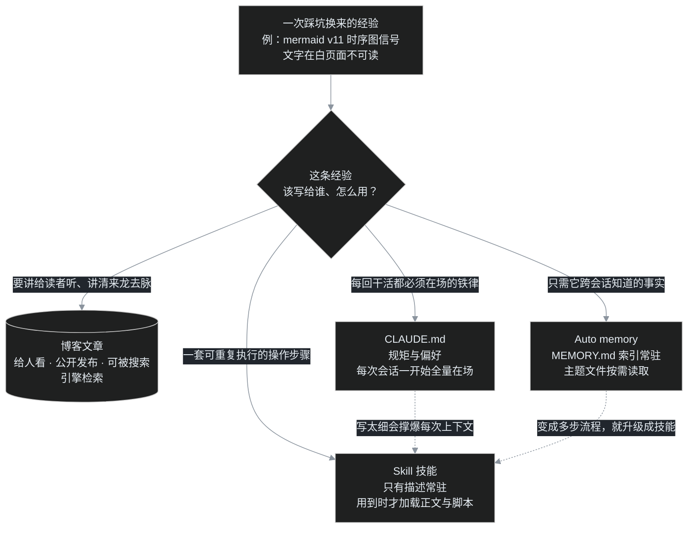

> 上一篇番外四的结尾，叶扬留了个话头：这些踩坑经验，为什么有的写成了博客，有的写进了 CLAUDE.md，有的沉淀成了随叫随到的 Skill。这一篇就来把这四者的分工彻底讲清楚——而且，就用本系列自己当标本。
>
> 先声明：这不是一篇教你"驯服 AI"的玄学文章。所有机制都有官方文档为凭，文末会放出出处链接，你可以逐条核对。

## 零、从一张看不清的图说起

写 B04 的那天晚上，mermaid 的一张时序图把叶扬难住了：actors 和注释框都好好的，**唯独横飞的信号文字几乎看不见**，浅灰色的字直接"印"在透明背景上，文章页又是白底，四个字概括——若隐若现。

一开始以为是配色变量没给够，把官方列的 `actorBkg`、`signalColor`、`signalTextColor`、`labelBoxBkgColor` 逐个试了一遍，完全没用。最后查清楚：这是 mermaid v11 的渲染机制问题——**sequenceDiagram 的信号文字是浅色 SVG 原生文本，天生没有背景盒元素**，你给再多颜色变量，也找不到一个盒子可以刷底色。而 flowchart 的节点是不透明深色填充、边标签自带深色底盒，白页面上照样字字清晰。

下面这张，就是当晚的 A/B 实测：上半 flowchart 一目了然，下半时序图的信号文字你得凑近了找。


结论很硬：**本博客所有示意图一律 flowchart TD，慎用 sequenceDiagram。**

折腾了一个多小时的教训，叶扬没让它烂在聊天记录里。但有意思的是，这一条经验最后同时落进了四个不同的地方。为什么需要四个地方？这正是本篇的主角。

## 一、AI 为什么需要"记忆"

得先理解一个有点反直觉的事实：**每次开启新的 Claude Code 会话，它面对的都是一扇"全新的上下文窗口"。**

这话什么意思？你可以把一个会话想象成一间会议室：这一轮里聊的所有东西——你教它的规矩、一起踩的坑、改过的文件——都摊在会议桌上，它记得清清楚楚。可一旦会话结束（或者对话太长被自动压缩），桌子一收，下一位进来的，是个业务熟练但**对你的项目一无所知**的接班同事。

所以官方在《[How Claude remembers your project](https://code.claude.com/docs/en/memory)》里开宗明义：有两套机制把知识跨过会话地传下去——

- **CLAUDE.md 文件**：你写给它的、持久生效的指令；
- **Auto memory（自动记忆）**：它根据你的纠正和偏好，自己写下的笔记。

再加上本篇的另外两个角色——**博客文章**与 **Skill 技能**，一条经验就有了四层归宿。

## 二、四层归宿：一条经验该往哪儿放

先看一张分工图。它本身就是用本文力荐的 flowchart TD 画的，而且此刻正由你博客里那个 3.5MB 的 mermaid 运行时实时渲染——算是一个小小的自我证明。



用大白话翻译这张图：

| 归宿 | 谁来写 | 什么时候"在场" | 适合装什么 |
|---|---|---|---|
| **博客文章** | 你，写给别人看 | 读者打开网页时 | 想公开讲清的来龙去脉、教程、复盘 |
| **CLAUDE.md** | 你，给它立规矩 | **每次会话一开始就全量加载** | 简短的铁律、偏好、约定 |
| **Auto memory** | Claude 替你记 | 索引常驻，正文按需 | 跨会话的事实、结论、你给过的反馈 |
| **Skill** | 你和它共建 | 只有一句描述常驻，**用到才加载全文** | 多步骤操作手册、可执行脚本 |

注意两条虚线：CLAUDE.md 写太细，会白白占掉每一次会话的上下文预算；一条记忆如果已经长成"第一步、第二步、第三步"的操作流程，就该从 memory 升级成 Skill。下面逐层拆。

## 三、CLAUDE.md：每次都在场的"办公室规矩"

CLAUDE.md 是**你亲手写的指令文件**，Claude 每次会话开始就把它读进来，当作必须遵守的背景。它是四层里最"强势"的一层——但官方也特意提醒：它本质上是**上下文（context），不是强制配置（enforced configuration）**，也就是说它靠"被读到"起效；如果你想要的是"无论如何都禁止某个动作"那种硬性闸门，那得用 PreToolUse 钩子（hook），不在本文范围。

这台机器上的用户级规矩文件在 `~/.claude/CLAUDE.md`，通篇就是一条 Mermaid 图表约定：


可以看到，这份规矩的特点是**短、是命令、没有废话**：用暗色主题、画布 `#0d1117`、子图 `#161b22`、每个 mermaid 块开头必须加那段 init。它不解释"为什么"，只规定"怎么做"——这正是 CLAUDE.md 的正确用法。

关于它还有几个实用知识点：

- **分四级**：受管理策略（managed policy）、用户级（`~/.claude/CLAUDE.md`，对你所有项目生效）、项目级（仓库里的 `./CLAUDE.md`，可提交给团队共享）、本地级（`./CLAUDE.local.md`，只在本机不提交）。越具体的优先级越高。
- **宜短不宜长**：官方建议单个文件控制在约 200 行以内。因为它每次全量加载，越长越费上下文。
- **能引入别的文件**：用 `@路径` 可以导入，最多四层跳转；输入 `/context` 能当场查看究竟加载了哪些。

最妙的是，本篇这条 mermaid 经验恰好暴露了 CLAUDE.md 的一个"天敌"——**过时**。文件最后那句"时序图可再追加 `actorBkg`/`signalTextColor` 等同色系变量"，就是写规矩时以为有效、结果被 v11 实测推翻的条款。规矩也得跟着工具版本一起维护，否则它会每次会话都认认真真地把一条错办法塞进上下文。这一条该怎么改，第七章揭晓。

## 四、Auto memory：它自己维护的跨会话笔记本

如果说 CLAUDE.md 是你立的规矩，Auto memory 就是**它自己替你记的笔记**。官方路径在：

```text
~/.claude/projects/<项目名>/memory/
```

本项目的记忆目录长这样（叶扬裁掉了一条与本篇无关的私人记录）：


看懂这张图，就懂了 memory 的全部结构：

- **一个主题一个 `.md` 文件**，文件头用 YAML 标明类型（`user`/`feedback`/`project`/`reference`），正文是一条完整的事实。
- **`MEMORY.md` 是总索引**，每条记忆只占一行（标题链接 + 一句话提要）。会话开始时，自动读进上下文的**只有这个索引**（官方限制前 200 行或 25KB），它因此很短、很省；当某条记忆与当前任务相关时，才会去打开对应的主题文件细读——这跟 Skill 的"按需加载"是同一种节俭思路。
- 四类内容分工：你是谁、什么背景（user）；你给的工作方式反馈（feedback）；项目的目标与约束（project）；外部资源的指针（reference）。

该记什么、不该记什么，有条清晰的边界：**凡是能从代码、git 历史、项目里直接读出来的东西，不记**；CLAUDE.md 里已经写明的规矩，也不重复记。memory 存的是那些"代码里看不出来的结论和来龙去脉"。比如"本站 mermaid 是 v11.17.2、冷加载要 80 多秒、示意图一律 flowchart"这种用时间换来的判断，就值得记；而"post.html 第 91 行有个评论按钮守卫"这种翻代码就有的，不必记。

两个要提醒的点：记忆文件就是普通 Markdown，发现哪条记错了、过期了，直接改/删即可（也可以用 `/memory` 命令管理）；另外它**只存在本机、不随账号跨设备同步**，换电脑不会自动跟过去。

## 三与四的差别，一句话：**CLAUDE.md 是你命令它的，memory 是它讲给未来的自己听的。**

## 五、Skill：描述常驻、正文随叫随到

最后一层，也是番外四真正的主角——Skill（技能）。

什么时候该做技能？官方给了一个非常好判断的信号：**当你发现自己在反复把同一段指令、同一份清单、同一套多步流程往对话框里粘贴时，当 CLAUDE.md 的某一节已经从"一条事实"膨胀成"一套流程"时**，就该把它抽成技能。

一个技能本质上就是一个目录，目录名就是技能名；目录里的 `SKILL.md` 用 YAML frontmatter 写清楚名字和一句 `description`，正文才是完整手册。本机这个截图技能位于 `~/.claude/skills/screenshot/`：


这里藏着 Skill 最精妙的设计——**渐进式披露（progressive disclosure）**。请回看上面那张 frontmatter 图：`name` 只有一个词，可 `description` 写得很卖力，详细列举"截图、截屏、拍一张、窗口图、网页截图……"一大堆触发场景。为什么？因为：

- **平时**，所有技能只有 `description`（连同 when-to-use 信息，截断到约 1536 字符）待在上下文里。正文那几百行、那些脚本，一个字节都不占。
- **一旦判断用得上**——可能是你显式敲 `/screenshot`，也可能是它读到"帮我截个图"后根据描述自动触发——完整的 `SKILL.md` 才被加载进来，而且加载后会在本轮持续在场。

这就同时解决了 CLAUDE.md 的两个死结：怕写多了费上下文（技能正文平时不在场）、又怕写少了不够用（真用时整本手册都来了）。官方建议一份 `SKILL.md` 控制在 500 行以内。

技能还**不只是一个 Markdown**。它能自带支撑文件：更长的 `reference.md`、示例、乃至可以直接执行的脚本。这个截图技能目录里，就带着番外四介绍过的借窗脚本 `ui-shot.ps1`：


脚本开头那段大写的 SAFETY 注释也值得一看——番外四强调的安全边界（不开调试端口、不碰凭据、绝不点提交按钮、用完还原现场），直接刻在了工具的源码里。技能因此可以把"知识"和"动手能力"打包在一起：Markdown 负责判断与步骤，脚本负责稳定执行。

存放位置上，放在 `~/.claude/skills/<名字>/` 是**用户级**，你所有项目都能用；放在某个仓库的 `.claude/skills/` 是项目级，还能随仓库分享给队友。

## 六、这些说法的官方出处

叶扬不喜欢把机制讲成"听说"。上面所有结论都能在 Claude Code 官方文档里查到，文档站已迁至 `code.claude.com`：


- **技能**：[Extend Claude with skills](https://code.claude.com/docs/en/skills)——"Unlike CLAUDE.md content, a skill's body loads only when it's used, so long reference material costs almost nothing until you need it."（与 CLAUDE.md 不同，技能正文只在用到时加载，长篇参考资料在用不上时几乎零成本。）同页还讲了 frontmatter 字段、支撑文件、个人级/项目级路径、以及如何禁止模型自动触发。


- **记忆**：[How Claude remembers your project](https://code.claude.com/docs/en/memory)——同一页对照了 CLAUDE.md 与 auto memory，给出存储位置、工作方式、`/memory` 管理，并明确"Claude treats them as context, not enforced configuration"（把它们当作上下文而非强制配置），要硬拦截请用 PreToolUse hook。

## 七、一个坑，四份归宿

回到开场那张看不清的时序图。现在可以揭晓：这一个多小时的教训，是怎样同时落进四个地方的——

1. **博客文章（给读者）**：B01、B04 里原来的时序图已经换成 flowchart，本篇又把"为什么必须换"从头到尾讲给你听。代码会过时，但这篇讲清原理的文章会一直在。
2. **CLAUDE.md（给每一次会话）**：那份 Mermaid 约定需要修订——把"时序图可追加 `actorBkg` 等同色系变量"这句已被 v11 证伪的话，改成"示意图一律 flowchart TD；确需时序图时，信号文字需自备不透明底盒"。**规矩短，且要跟得上版本。**
3. **Auto memory（给跨会话的自己）**：记忆库的教程规划里已经记下这条结论——"mermaid v11 教训：示意图一律 flowchart，不用 sequenceDiagram（亮色页面信号文字不可读），B04 与 B01 均已改"。一句话、一个结论、一次踩坑的编号，供以后任何会话快速调取。
4. **Skill（给双手）**：截图技能的 `SKILL.md` 里新增了两段操作纪律：面对 mermaid 这类重型运行时，**别用固定等待秒数去赌**（3.5MB 库冷加载曾测到 84.8 秒），要暖缓存 + 轮询等图真出现；改图前**先在本地建单 HTML 预检**，别把"编辑 issue→等构建→重拍"的昂贵循环当家常便饭。

同一条经验，讲给人听的进博客，必须当场遵守的进 CLAUDE.md，只需知道的结论进 memory，需要反复执行的动作进 Skill。下次你再教给 AI 什么东西时，先问那句流程图里的问题：**这条，该写给谁、怎么用？**

### 翻车急诊室

| 症状 | 病因 | 处方 |
|---|---|---|
| 它老记不住某件事，每个新会话都要重讲 | 你只是在聊天里说过，没写进任何持久层 | 每次都要遵守的短规矩 → CLAUDE.md；只是要它知道的事实 → 让它写进 memory |
| 技能从来不自动触发，只有手动 `/名字` 才行 | `description` 没把触发场景写清楚 | 把"什么时候该用"用大白话、多给几个口语触发词写进描述（参考截图技能） |
| CLAUDE.md 越写越长，动辄几百行 | 把操作流程也塞进去了 | 多步骤流程抽成 Skill，CLAUDE.md 只留铁律，官方建议单文件 <200 行 |
| 某条记忆明显错了/过时了 | memory 是会过期的笔记 | 记忆就是普通 Markdown，直接编辑或删除，或用 `/memory` 管理；规矩同理，记得回头修订 CLAUDE.md |
| 换了台电脑，记忆全没了 | memory 只存本机、不跨设备同步 | 把需要带走的放在项目级 CLAUDE.md / 项目级 Skill 里随 git 走，用户级 memory 不负责同步 |

### 小结

- AI 的"记忆"分四层：**博客写给人、CLAUDE.md 每次在场立规矩、memory 跨会话记事实、Skill 按需加载装流程**；
- CLAUDE.md 与 memory 都是上下文而非强制配置，前者你写、后者它记；
- Skill 靠"描述常驻、正文按需"既省上下文又能在需要时给出整本手册，还能自带脚本；
- 经验要分层沉淀，而且每一层都需要定期回头维护——**过时的规矩和错误的记忆，比没有更碍事。**

下一篇回到地基主线，正式开写 **B05：Actions 篇**——B04 埋了个伏笔：为什么文章刚收到评论，列表上的评论数字却不立刻涨？答案就藏在 GitHub Actions 的触发机制里，到时候连"印刷厂几点上班、怎么加班"一起讲透。在那前后，等 G04 收录满一周拿到真实数据（约 9 月 21 日后），还会补一篇 Google 收录实战番外。

## 参考链接

- [How Claude remembers your project（记忆与 CLAUDE.md）](https://code.claude.com/docs/en/memory)
- [Extend Claude with skills（技能）](https://code.claude.com/docs/en/skills)
- 上一篇番外：[番外四｜不开调试端口、不碰密码：Win32 自动化借你已登录的浏览器截个图](/post/33.html)
- 相关主线：[B04｜门铃与名片：给博客装上评论区，再做一张 About 关于页](/post/36.html)
