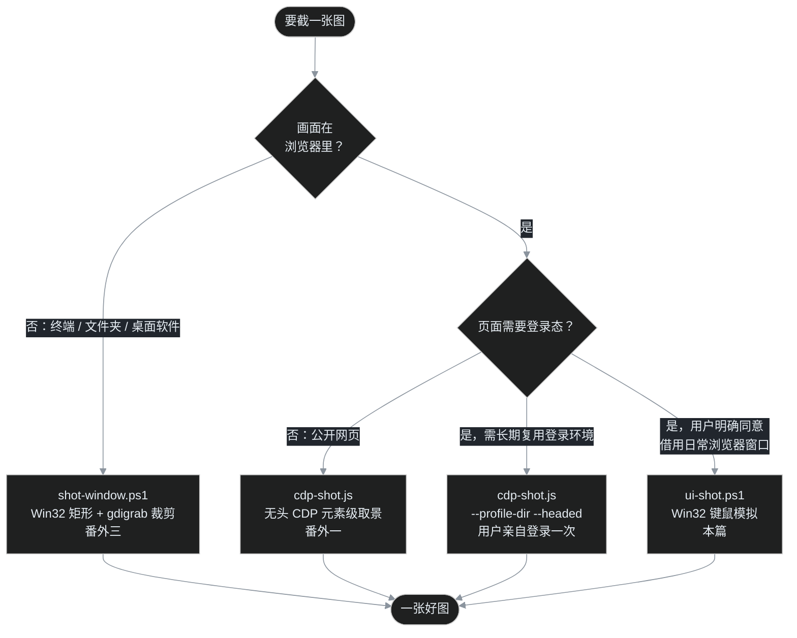

> [B01 建站实录](/post/32.html) 发布时，四张必须登录 GitHub 才能看到的页面图，叶扬先用占位图顶上，并跟读者打了张欠条。第二天叶扬发来一句话：「我在用的 Edge 第二个窗口已经是登录好的 GitHub 界面，你能自己去操作截那 4 个图吗？」——能，但这意味着 AI 要把手指伸进一个真人的登录态会话里。这篇记录整个过程：六场翻车，和一条名叫「点到为止」的安全边界。

## 一、任务与三条自我约束

四张图分别是：用模板建仓的表单、仓库 Settings 里的 Pages 发布源、新建 Issue 时勾选「博客」标签、Actions 页手动触发工作流的下拉。共同点是：**全都要求登录**，无头浏览器访问只会被一脚踢到登录页。

叶扬递过来的是日常使用的 Edge 窗口——里面登录着 GitHub、开着一堆私人标签页、收藏夹栏挂着书签。接过这个任务前，先立三条自我约束：

1. **不经手凭据**：不要求输入账号密码，不过问 2FA 验证码，登录态完全来自叶扬自己的浏览器会话；
2. **不动浏览器配置**：不给日常 Edge 加启动参数、不开远程调试端口、不重启进程——那等于把正在用的浏览器从叶扬手里抽走；
3. **不按任何提交按钮**：`Create repository`、`Submit new issue`、绿色的 `Run workflow`，一个都不点。可以展开下拉、勾选草稿标签、点空白处，但绝不能让任何请求真正发出去。

## 二、旧兵器为什么都不顺手

工具箱里本来有两把「相机」。

[番外一](/post/26.html)的 `cdp-shot.js` 走 Chrome DevTools 协议，在无头浏览器里截页面，元素级取景样样精通。可 CDP 有个前提：浏览器实例得带着远程调试端口启动，或者干脆由脚本自己拉起一个新实例。日常 Edge 没有调试端口，事后也无法附加；自己拉起的新实例用的是全新 profile，里面没有任何人的登录态。B01 拍摄期间试过「专用 profile + 有头窗口」，结果碰上 Edge 首启的「正在所有设备同步浏览数据」模态挡页，还得请叶扬亲手在弹窗里登录——既然要惊动真人，这条路就已经输了一半。

[番外三](/post/31.html)的 `shot-window.ps1` 走 ffmpeg gdigrab 抓桌面合成表面，对窗口截图百发百中。但它**只会按快门**：不会输入网址、不会展开下拉、不会勾选标签。给它一个停在正确页面的窗口，它能截得很好；让它自己走到那个页面，它无能为力。

两条路一夹，第三条路露了出来：**直接模拟真人操作那个已登录的窗口**——找到窗口、提到前台、按 F11 全屏、命令行让浏览器开新标签、模拟鼠标点开下拉，最后 gdigrab 裁剪。用的全是 Win32 祖传 API，浏览器甚至感知不到操作者是人还是脚本。

## 三、Win32 老三样

脚本最终收成了 [`tools/ui-shot.ps1`](https://github.com/yeyangchen2009/yeyangchen2009.github.io/blob/main/tools/ui-shot.ps1)，和前两篇番外的工具同住 `tools/` 目录，除 ffmpeg 外零依赖。核心 API 只有三组：

- **找窗口**：`EnumWindows` 枚举所有顶层窗口，配合 `GetWindowThreadProcessId` 按进程 ID 过滤。为什么要枚举？因为 Edge 的多个窗口同属一个 `msedge.exe` 进程，`Get-Process` 只给一个 `MainWindowHandle`，而目标偏偏是「第二个窗口」；
- **置前**：后台进程直接调 `SetForegroundWindow` 经常被 Windows 拒绝（前台锁），需要先用 `AttachThreadInput` 把自己的输入队列 attach 到当前前台线程，再 `BringWindowToTop` + `SetForegroundWindow`；
- **模拟键鼠**：`keybd_event` 发 F11（VK=0x7A）和 Ctrl 组合键，`mouse_event` 发点击；中文文本不走键盘，`Set-Clipboard` 加 Ctrl+V 粘贴，绕开输入法。

思路一句话讲完了。接下来是流水账——这套组合拳**没有一拳直接打中**。

## 四、翻车流水账

### 4.1 第一脚踢偏：F11 按错了窗口

枚举窗口发现目标 Edge 进程下有两个顶层窗口：一个是 GitHub 页，另一个标题里当时挂着「Anki 学习资料」。叶扬要的是前者。定位代码偷懒用了**排除法**：标题里不含「Anki」的那个就是目标。

运行，F11，截图——拿回来的窗口标题是「AI破局俱乐部」。

原来另一个 Edge 窗口是个多标签窗口，顶层标题跟随活动标签变化，此时活动标签早就不是 Anki 了。排除词失效，F11 结结实实按在了无关窗口上，把人家的页面切进了全屏。

补救很快（再按一次 F11 退回原状），教训刻进石头：**按特征选窗口，只能用「我要的窗口稳定拥有什么」做正向匹配，绝不能用「别的窗口大概没有什么」做排除**。GitHub 页的标题里永远挂着登录用户名，于是改成正向匹配 `yeyangchen2009`，一次找准。成品脚本里 `-WindowTitle` 参数只接受正向子串，并且在帮助注释里把这条规矩写死。

### 4.2 按键信杳如黄鹤：SendKeys 静默失灵

窗口找对了，下一步是导航。最初的写法是经典三件套：`WScript.Shell` 的 `SendKeys` 发 Ctrl+L 聚焦地址栏、Ctrl+V 粘贴网址、回车访问。脚本无报错退出，截图一看——还停在原来的个人主页，地址栏里连个光标都没有，整套按键**凭空消失了**。

合成输入在全屏 Chromium 窗口上的焦点处理相当玄学，逐个键调试没有尽头。叶扬换了个思路：**不模拟按键，直接利用浏览器的单实例机制**——在命令行运行：

```powershell
Start-Process msedge.exe 'https://github.com/...'
```

已经有 Edge 实例在跑时，新进程不会另开炉灶，而是把 URL **委派给现有实例**，在最近活动的窗口里新开一个前台标签打开。先把目标窗口 ForceForeground，新标签就必定落进目标窗口。没有按键，没有焦点问题，甚至不用碰剪贴板。

### 4.3 真假全屏：矩形会骗人

新标签打开了，拍回来的图却露着完整的浏览器外壳——标签栏、地址栏、一整排收藏夹书签。F11 不是按过了吗？

查窗口矩形：`(0,0,1920,1080)`，铺满全屏，于是脚本判定「已全屏」，没有补按 F11。但铺满屏幕有两种成因：真 F11 全屏是一种；**任务栏设置成自动隐藏时，普通最大化窗口同样铺满**，这是另一种。两者的画面差着一整个浏览器外壳。

光看矩形会被骗，得看窗口样式位。`GetWindowRect` 之外再查 `GetWindowLong(GWL_STYLE)`：真全屏窗口的样式里没有 `WS_CAPTION`（标题栏）和 `WS_THICKFRAME`（可调边框），普通最大化窗口两个位都在。加了样式位双重判定后，真假全屏立刻分辨清楚。

紧接着发现第二个连锁反应：**命令行新开标签这个动作本身，会把 Edge 从 F11 全屏里踢出来**。于是脚本的 `-EnsureFs` 逻辑定成：导航之后重新查一次样式位，掉出全屏就补按 F11，每次拍之前都确保是全屏态。

### 4.4 滑出条赖着不走：鼠标沉底没用，点一下空白才行

全屏之后还有个小脾气：鼠标碰到屏幕上沿时，Edge 会滑出一条半透明工具栏（标签栏+地址栏）方便操作，鼠标移开后它本该自动消失。可这条滑出条多次卡住不走，悬在画面顶部。

先试「物理驱赶」：把鼠标瞬移到屏幕底部，再用 `mouse_event` 的相对移动事件左右抖动六下，等两秒——纹丝不动。（这里还踩了个小坑：`mouse_event` 的位移参数是 `uint`，PowerShell 传不进负数，最终在 C# 里用 `unchecked((uint)dx)` 让负位移以补码形式混进去。）

真正管用的办法朴素得可笑：**在网页空白处点一下**。原因是滑出条卡住时，输入焦点停在浏览器外壳（chrome）上，外壳认为用户还在「操作浏览器」；点一下页面空白，焦点交还给网页渲染区，滑出条立刻收了回去。这个动作从此固定成拍摄前的标准仪式。

### 4.5 盲点的代价：一张跳去文档站的图

第四张图要在 Pages 设置页点空白处收工具栏。坐标怎么来的？凭感觉估了一个 `(1500,600)`，点下去，截图——画面变成了 GitHub Docs 的《Configuring a custom domain》文档页。

盲点恰好落在设置页里「了解自定义域名」的链接文字上，一次真实跳转，标签页都换了。好在是只读页面，关掉标签无损，原路返回重拍。

这条教训改了工作流，也写进了脚本参数的注释：**没拍过的页面，先拍一张「布局图」，用 Read 亲眼看一遍、量准坐标，再点第二下**。此后每一张图都是两步走：先布局，后操作。下拉按钮、标签复选框、`Run workflow` 按钮的坐标全部来自实测像素，零猜测。


### 4.6 黑帧：合成表面的瞬态空白

Pages 页重开后拍布局图，拿到一张纯黑画面，只剩一个鼠标指针——ffmpeg/gdigrab 层面一切正常，exit code 也是 0。

这其实是番外三的老熟人：新标签切换的瞬间，DirectComposition 合成表面正在重建，那一帧窗口内容就是空的，桌面合成器画出来一片黑。它不是错误，是时机问题。等三秒让表面重建完成，重拍，页面安然就位。**遇到黑帧不要怀疑人生，等一等重拍即可。**


顺带记两个 PowerShell 5.1 小坑：C# 内联代码里没有 `string.Like()` 这种方法（`Like` 是 PowerShell 运算符，写在 C# 里直接编译失败）；PowerShell 5.1 也不支持三元运算符 `?:`，条件表达式得老老实实写 `if`。

## 五、点到为止：一条安全边界

六场翻车之外，这篇真正想留下的是那份操作纪律。AI 的手伸进真人登录态会话时，**「能点」和「该点」之间必须有一条清清楚楚的线**。

**点得的**：展开下拉菜单（看完再点空白收起，不选项）、在尚未提交的草稿 Issue 上勾选标签（纯前端状态，不提交就没有请求）、点网页空白处收工具栏、用 Ctrl+W 关掉自己亲手开的标签、Ctrl+加减号调缩放、F11 切全屏——全是可逆的只读操作。

**点不得的**：`Create repository`、`Submit new issue`、绿色 `Run workflow`、`Unpublish site`、一切删除/保存/发布按钮。第四张图要求「下拉展开、绿色按钮可见」，按钮就停在画面里，鼠标绝不落下去。文字输入也只往标题框里灌一句示例标题，密码框、搜索框一概不碰。

**干完要还原现场**。四张图拍完，执行收尾清单：Ctrl+W 关掉新开的四个标签、Ctrl+0 把缩放复位到 100%、确认只剩叶扬原来的那个标签、停在原来的个人主页、保持全屏态，最后再拍一张「还原图」亲眼核验。借了人家的桌面，走的时候要比来时还整齐。

**隐私检查是每张图的必经工序**。4.3 节那张露出浏览器外壳的失败图，顶部收藏夹栏挂着一串私人书签——它从诞生起就被判了弃用，文章里不会出现。每一张候选图都用 Read 亲眼看：画面里有没有不该出镜的标签标题、书签、文件名、通知弹窗。拍摄脚本只负责产出，「能不能用」永远是人（和替叶扬把关的 AI）逐张判定。

最终上线的四张成品：


## 六、三条路，一张决策树

至此，「截图」这件小事在叶扬的工具箱里长出了三条路径，各管一类目标：



注意第三条路入口上挂着前置条件——**用户明确同意**。这不是客套：操作的是别人的登录态、别人的私人浏览器，每一次点击都可能产生真实后果。授权、边界、可还原，三者缺一不可。

## 七、闭环：占位图工作法与技能沉淀

这次任务还兑现了 B01 埋下联调设计。当时四张登录态页面来不及拍，叶扬先做了四张暗色「占位图」：一张虚线框卡片，写清楚目标 URL、画面要素、注意事项（比如「不要点创建」），文件名直接定成最终名 `b01-*.png` 随文章上线。这次实拍成品**同名替换**，文章正文一个字都没改——占位图工作法的核心就是把「文章发布」和「图片补齐」解耦，欠条随时可还。

`tools/ui-shot.ps1` 的参数覆盖了完整流程，常用几个：

- `-WindowTitle` / `-Hwnd`：正向标题子串或显式句柄定位窗口；
- `-EnterFullscreen` / `-ExitFullscreen`：幂等切换 F11（已在目标状态不重复按）；
- `-Url`：命令行委派新标签导航，配 `-EnsureFs` 导航后自动补回全屏；
- `-ClickX/-ClickY`：物理像素点击；`-Paste`：剪贴板粘贴文本；`-ZoomOut 2`：缩到 80% 让长表单一屏入镜；
- `-CloseTab`、`-ZoomReset`：还原现场；`-Info`：打印窗口矩形、样式位、前台标题做诊断。

脚本和全部踩坑（八条实测规矩、安全边界、收尾清单）已经一并沉淀成本机的 `screenshot` 技能「路径 C」。下次再遇到登录态页面，这套手艺开箱即用，不必重新踩一遍。

## 八、小结

「点到为止」在这篇里是双关：鼠标确实要点，点开下拉、点勾标签、点空白处；但**点到为止**——提交按钮一步之遥，手要收得住。

回头看，Win32 模拟键鼠是几十年前的老技术，没有任何新奇之处。这篇真正的主题从来不是 API，而是 **AI 代操作真人会话时的分寸感**：最小权限（只碰完成任务必需的窗口和控件）、全程可见（每个动作都有截图为证）、处处可逆（Ctrl+W、Ctrl+0、F11 都能回到原状）、授权先行。技术翻车可以重拍，信任翻车没有重拍键。

下一篇番外，叶扬打算聊聊这些踩坑手册是怎么变成 AI 技能的——为什么有的经验写进博客，有的要写进 CLAUDE.md，有的要做成随叫随到的 Skill。三者的分工，值得单独讲一篇。

## 参考链接

- [B01｜18 秒建站实录：从一个 GitHub 账号到第一篇文章上线](/post/32.html)
- [番外一｜给博客拍证件照：一个零依赖 CDP 截图器的诞生](/post/26.html)
- [番外三｜浏览器外的屏幕怎么截：ffmpeg gdigrab 抓窗口三坑记](/post/31.html)
- [Microsoft Learn：EnumWindows](https://learn.microsoft.com/en-us/windows/win32/api/winuser/nf-winuser-enumwindows)
- [Microsoft Learn：GetWindowThreadProcessId](https://learn.microsoft.com/en-us/windows/win32/api/winuser/nf-winuser-getwindowthreadprocessid)
- [Microsoft Learn：AttachThreadInput](https://learn.microsoft.com/en-us/windows/win32/api/winuser/nf-winuser-attachthreadinput)
- [Microsoft Learn：keybd_event / mouse_event](https://learn.microsoft.com/en-us/windows/win32/api/winuser/nf-winuser-keybd_event)
- [Microsoft Learn：GetWindowLong 与窗口样式](https://learn.microsoft.com/en-us/windows/win32/winmsg/window-styles)
- [ffmpeg 官方文档：gdigrab 输入设备](https://ffmpeg.org/ffmpeg-devices.html#gdigrab)
- [Microsoft Edge 键盘快捷方式](https://support.microsoft.com/en-us/microsoft-edge/keyboard-shortcuts-in-microsoft-edge-50d3edab-30d9-c7e4-21ce-37fe2811ab1b)
