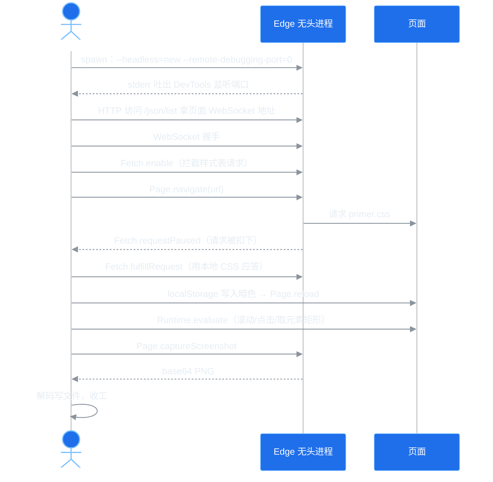

# 番外｜给博客拍证件照：零依赖无头截图流水线，与一桩白底怪案

> 正篇收官之后，叶扬给 9 篇老教程补浏览器实拍截图，顺手给自己挖了个坑：手机浮层要现场点开、流程图比视口还高、九张图全部要暗色主题、还得是 2x 高清——手动截图九遍等于自虐。于是花了半天造了一台"自动相机"：不装 puppeteer、不装 playwright、`node_modules` 里一个包都没有，300 行代码指挥系统自带的 Edge 把照片拍完。过程中还撞上一桩"暗色开关全开、页面却惨白如纸"的怪案，破案过程比截图本身有意思。这篇番外把流水线和案子都记下来。

## 一、九张图，九种状态

先看需求有多碎。给老教程配图不是"截个屏幕"那么简单：

| 图 | 页面 | 麻烦之处 |
|---|---|---|
| G16 scrollspy | 文章页 | 要滚到指定章节，等蓝色竖线激活 |
| G14 手机目录 | 文章页 | 要 390px 手机视口，还得**先点一下 ☰** 浮层才出现 |
| G15 mermaid 流程图 | 文章页 | 图比视口高，得等 JS 渲染完，再把**视口外**的整图裁出来 |
| G13 分页条 | 首页 | 要滚到页面最底部再上移一点 |
| G10 时间线归档 | 固定页 | 运行时 fetch 数据渲染，拍早了只有"加载中" |
| 其余 4 张 | 文章页 | 全部暗色主题、全部高清 2x |

共性是：**状态要摆好，时机要等对**。人工操作九遍，下次再补图又是九遍。写个脚本，一次投入，终身白嫖——这符合本系列的家训。

## 二、选型：不伺候 puppeteer

无头截图的常规答案是 puppeteer / playwright。叶扬没选它们，原因很现实：

1. **安装时要下载一整套 Chromium**，国内网络下这一步经常卡在 99%，还得配镜像；
2. 为了截九张图请进一个几百 MB 的 `node_modules`，纯属高射炮打蚊子；
3. 本机**本来就装着 Edge**，内核就是 Chromium，凭什么再下载一个？

Chrome/Edge 自带一套叫 **Chrome DevTools Protocol（CDP）** 的远程控制协议——F12 开发者工具能用什么，外部程序就能用什么：导航、执行 JS、设视口、截图，全都是协议里的方法。用命令行参数把浏览器以"远程调试模式"启动，再通过一个 WebSocket 给它发 JSON 指令，就是无头浏览器的全部秘密。puppeteer 本质上也只是这个协议的一个封装库而已。

还有一个好消息：**Node 22 起全局内置了 `WebSocket`**，以前需要 `ws`  npm 包才能连 CDP，现在零依赖直连。最终这台相机只有一个文件、零个外部包：[tools/cdp-shot.js](https://github.com/yeyangchen2009/yeyangchen2009.github.io/blob/main/tools/cdp-shot.js)。

## 三、最小可用版：四个动作

协议流程比想象的简单，时序如下：



几个关键细节：

**启动时让浏览器自己选端口**。`--remote-debugging-port=0` 表示端口随机分配，浏览器会把实际端口和 WebSocket 地址打印到 stderr——从 `DevTools listening on ws://127.0.0.1:xxxx/...` 这行里正则抠出端口即可。随机端口的好处是不会和你正在开的 Edge、和上一次没杀干净的进程打架。

**用临时 profile**。`--user-data-dir` 指向一个 `mkdtemp` 出来的临时目录，截图完整个删掉，绝不污染你日常浏览器的 cookie 和登录态。

**核心指令就四条**：

```javascript
await send('Page.enable');
await send('Emulation.setDeviceMetricsOverride',
    { width: 1440, height: 900, deviceScaleFactor: 2, mobile: false });
await send('Page.navigate', { url });
const shot = await send('Page.captureScreenshot', { format: 'png' });
fs.writeFileSync(out, Buffer.from(shot.data, 'base64'));
```

`send` 就是往 WebSocket 发 `{id, method, params}`，再按 id 等回包，二十行封装。截图回来是 base64，解码落盘。到这一步为止，一切顺利——直到叶扬想截暗色主题。

## 四、一桩白底怪案

### 4.1 症状：开关全开，页面惨白

Gmeek 的暗色主题存在 localStorage 的 `meek_theme` 键里（[G08](/post/14.html) 讲过这套三态机制）。无头浏览器第一次启动是白纸一张，所以脚本先导航到目标页，写入键值再刷新：

```javascript
await send('Page.navigate', { url });
await evalJs(`localStorage.setItem('meek_theme','dark')`);
await send('Page.reload', { ignoreCache: true });
```

刷新之后叶扬检查状态，每一项都正确得无可挑剔：

- `document.documentElement.getAttribute('data-color-mode')` → **`dark`**
- `localStorage.getItem('meek_theme')` → **`dark`**

但截出来的图是这样的（故意滚动到 G16 那篇、复现现场）：


注意图里的魔幻景象：**外层页面白底黑字，而正文里嵌着的 G16 截图本身是深色的**——一张暗色截图躺在惨白的页面上，像两个平行宇宙。表格头、目录卡片全部失去配色，`getComputedStyle(document.body).backgroundColor` 直接是透明的 `rgba(0,0,0,0)`。

属性钩子挂对了，颜色却没生效。这说明暗色不是"没打开"，而是**定义颜色的那套 CSS 变量根本不存在**。

### 4.2 侦探四步

叶扬的排查逐层深入：

1. **数暗色规则**：注入一段 JS 数 `document.styleSheets` 里所有 CSS 规则，找 `--color-fg-default`、`[data-color-mode=dark]`——**0 条**。样式表加载了，但里面没有暗色定义；
2. **看计算值**：`getComputedStyle(document.body).getPropertyValue('--color-fg-default')`——**空字符串**。变量确实没定义；
3. **查网络计时**：`performance.getEntriesByName('.../primer.css')` 里这条请求的 `responseStatus` 是 **0**。0 不是 HTTP 状态码，它的意思是"请求没走到收到响应那一步就没了"；
4. **对照实验**：同一个 URL，在命令行用 `curl` 下载——**200，文件完好**。

结论锁定：**只有无头浏览器进程拉不到这份 CSS，系统其他网络工具都能拉到。**

### 4.3 嫌疑人：无头浏览器的网络环境

Gmeek 默认从南科大镜像加载 Primer CSS（国内加速的好意，[总揽 #5](/post/5.html) 配置表里记过）。叶扬这台机器上装着 Clash，系统代理开关恰好处于关闭状态——这套"装了代理软件但系统代理没开"的组合，让无头 Edge 的网络栈行为变得很微妙：它似乎按某种代理发现机制尝试走本地代理端口，连接被拒绝或挂起，请求于是以 status 0 收场。

按常识该用启动参数修：

- `--no-proxy-server`：明确告诉浏览器别用任何代理——**没用**；
- `--ignore-certificate-errors`：万一是证书问题——**也没用**。

具体是哪一层把连接吞掉的，叶扬没有刨根问底到内核源码（诚实交代）。但自动化工程里有个老教训：**网络环境是最不可控的依赖，与其修好它，不如绕开它。**

### 4.4 破案：在协议层当一次中间人

绕开的办法相当"降维打击"：既然浏览器发不好这个请求，那就**别让它发**。CDP 里有一个 `Fetch` 域，能让浏览器在请求发出前先请示调试器：

```javascript
// 1. 开启拦截，URL 模式匹配 primer.css
await send('Fetch.enable', {
    patterns: [{ urlPattern: '*Primer/21.0.7/primer.css*' }]
});

// 2. 收到 Fetch.requestPaused 事件时，用本地文件直接应答
ws.addEventListener('message', e => {
    const m = JSON.parse(e.data);
    if (m.method === 'Fetch.requestPaused') {
        send('Fetch.fulfillRequest', {
            requestId: m.params.requestId,
            responseCode: 200,
            responseHeaders: [{ name: 'Content-Type', value: 'text/css; charset=utf-8' }],
            body: fs.readFileSync('primer.css').toString('base64')
        });
    }
});
```

`Fetch.fulfillRequest` 的语义是"这个请求你不用发了，响应我给你"——状态码、响应头、base64 响应体全部由脚本提供。浏览器拿着本地 CSS 正常解析，**请求根本没离开过网卡**，什么代理什么镜像全部与它无关。

本地那份 primer.css 是事先用 curl（它网络正常）下载的 832KB 副本。加上拦截后重新截图，同一个位置：


深底白字，万物归位。这个案子的方法论价值超出截图本身：**CDP 的 Fetch 域给了你"浏览器与网络之间的中间人"位置**，本地应答是确定性最高的测试手段——断网、改响应、注入故障、mock 接口，都是同一个机制。以后再遇到"自动化浏览器网络抽风"，不必修网络，直接让它请求本地。

## 五、三个取景技巧

### 5.1 2x 高清：deviceScaleFactor

视口设 1440×900，但把 `deviceScaleFactor` 设成 2，截出来就是 2880×1800 的图，Retina 屏看不糊：

```javascript
await send('Emulation.setDeviceMetricsOverride', {
    width, height, deviceScaleFactor: 2,
    mobile: width <= 1249   // 与本站 TOC 插件的小屏断点严格对齐
});
```

### 5.2 元素级取景：clip + 视口外截图

mermaid 流程图渲染后高达 2300px，远超 900 视口。CDP 支持截指定矩形，而且 `captureBeyondViewport: true` 允许矩形落在视口之外——**不用把页面滚到元素位置，整张图任何坐标都能裁**。

脚本约定：`--eval` 传入的 JS 如果返回一个 `{x, y, width, height}` 对象，就把它当取景矩形。于是等图 + 测量的逻辑可以这样写：

```javascript
(async () => {
    for (let i = 0; i < 25; i++) {
        if (document.querySelector('.mermaid-wrap svg')) break;
        await new Promise(r => setTimeout(r, 300));  // 轮询等 mermaid 渲染
    }
    const r = document.querySelector('.mermaid-wrap svg').getBoundingClientRect();
    return {
        x: r.x - 8,
        y: r.y + scrollY - 8,   // getBoundingClientRect 是视口坐标，裁全页要加 scrollY
        width: r.width + 16,
        height: r.height + 16
    };
})()
```

`getBoundingClientRect()` 返回的是相对**当前视口**的坐标，而 clip 相对整页，y 值必须补回 `scrollY`；四周留 16px 呼吸边距。这是拍元素截图最容易错的一个符号。

### 5.3 手机浮层：先点再拍

G14 的 ☰ 目录浮层默认隐藏，点按钮才出现。手机视口（390×844）下用 `--click` 传选择器，脚本在截图前执行一次点击并等待动画：

```bash
node tools/cdp-shot.js https://站点/post/21.html g14.png 390 844 \
  --theme dark --css tools/primer-21.0.7.css \
  --css-match '*Primer/21.0.7/primer.css*' \
  --click '.toc-mobile-icon'
```

桌面端要滚到指定章节同理，`--eval 'window.scrollTo(0, 5553),"ok"'` 即可；G16 那张 scrollspy 蓝竖线就是滚到位、等 50ms 节流的 scrollspy 反应过来之后才按的快门。

### 5.4 时机：sleep 是最简单可靠的同步

脚本里没有监听什么 `load` 事件之后的精密回调链，就是朴素的固定等待：导航后等 3.5 秒，让运行时插件（tocbot、mermaid、归档页 fetch）全部完工，再摆动作。拍九张图多花半分钟，换来零竞态、零漏拍。**自动化截图不是性能测试，可重复比快重要。**

## 六、九连拍完，怎么验收

九张图的拍摄参数各不相同，但拍完后的验收口径是统一的：

1. **图片本身逐张肉眼过**：暗色对不对、元素全不全、有没有半截被裁；
2. **上线后 HTTP 状态**：九张 PNG 全部 200；
3. **文章页里数图**：图片插入九篇老教程后，逐篇确认 `` 命中，同时**数 mermaid 图块数量与改稿前一致**——编辑 issue 正文是大动作，要证明没把原有内容弄丢。正确口径是数产物里的 `<div class="highlight highlight-source-mermaid"><pre` 结构，而不是 grep 字符串（正文里讨论 mermaid 也会出现这个词，[G15](/post/24.html) 已经为这种误判公开勘误过一次）。

图片放进 `static/screenshots/`，Gmeek 构建时整目录原样复制到站点根（机制见 [G11](/post/18.html)），文章里直接用 `/screenshots/xxx.png` 引用。九篇 issue 的编辑严格**串行**：一篇改完等增量构建成功，再改下一篇，避免九个自动提交互相踩踏。

## 七、脚本与复用

成品在仓库里：[tools/cdp-shot.js](https://github.com/yeyangchen2009/yeyangchen2009.github.io/blob/main/tools/cdp-shot.js)，约 245 行，Node ≥ 22 运行，零 npm 依赖，Windows/macOS/Linux 三端自动探测 Edge 或 Chrome。同目录下还附了一份当时下载的 [primer-21.0.7.css](https://github.com/yeyangchen2009/yeyangchen2009.github.io/blob/main/tools/primer-21.0.7.css)（832KB，Primer 本体是 MIT 协议），克隆仓库即可复现整套流程，不用再自己去镜像站拖文件。注意 `tools/` 只存在于源码仓库，Gmeek 只部署 `static/`，这份 CSS 不会上线占流量。常用姿势：

```bash
# 桌面暗色视口截图（CSS 走本地应答，离线可拍）
node tools/cdp-shot.js https://站点/ out.png 1440 900 \
  --theme dark --css tools/primer-21.0.7.css --css-match '*Primer/21.0.7/primer.css*'

# 手机端点击浮层后截图
node tools/cdp-shot.js https://站点/post/21 out.png 390 844 \
  --theme dark --click '.toc-mobile-icon'

# 元素区域截图（eval 返回矩形）
node tools/cdp-shot.js https://站点/post/24 out.png 1440 1000 \
  --theme dark --settle 4500 --eval '(async()=>{ /* 取元素矩形 */ })()'

# 整页长图
node tools/cdp-shot.js https://站点/ out.png 1440 900 --full
```

它不是 Gmeek 专属工具：`--theme-key`、`--theme-value` 可以换成本地存储键名给任何站点注入暗色；不需要 CSS 拦截时不传 `--css` 就是普通无头截图；浅色站点直接省略 `--theme`。

两个已知边界，提前告知：

- headless 浏览器用的是系统字体栈，极少数站点的本地字体表现可能与你日常浏览器有细微差异；
- `--eval` 在页面上下文里执行，跨域、登录态这些限制与普通网页控制台完全相同——拍需要登录的页面要先往临时 profile 里导 cookie，本博客公开内容用不上。

## 小结

这台"相机"的全部技术含量可以压缩成三句话：

1. **系统自带的 Edge/Chrome 加 `--remote-debugging-port` 就是全套无头浏览器**，CDP over WebSocket 直连即可，Node 22+ 连 npm 包都不用装；
2. **视口、倍率、暗色、点击、元素取景都是协议方法**，截图回包是 base64；
3. **自动化里网络最不可控，而 CDP 的 Fetch 域让你可以本地应答请求**——这是本次最值回票价的收获，截图之外，断网测试、接口 mock 都用得上。

九张配图补完，老教程们终于不是"纯文字连篇"了。番外继续待命：约 2026-09-21 之后是已承诺的 [G04](/post/10.html) 收录实战番外，用真实数据回答"RSS 当 sitemap 到底有没有用"；G17 SEO 收尾战按计划暂停。选题池都在[总揽 #5](/post/5.html) 里挂着，不会丢。

## 参考

- 本站截图器源码：<https://github.com/yeyangchen2009/yeyangchen2009.github.io/blob/main/tools/cdp-shot.js>
- Chrome DevTools Protocol 手册：<https://chromedevtools.github.io/devtools-protocol/>
- Fetch 域（请求拦截与本地应答）：<https://chromedevtools.github.io/devtools-protocol/tot/Fetch/>
- Page.captureScreenshot（含 clip 与 captureBeyondViewport）：<https://chromedevtools.github.io/devtools-protocol/tot/Page/#method-captureScreenshot>
- Emulation.setDeviceMetricsOverride（视口与倍率）：<https://chromedevtools.github.io/devtools-protocol/tot/Emulation/#method-setDeviceMetricsOverride>
- Chrome 新 headless 模式介绍：<https://developer.chrome.com/docs/chromium/new-headless>
- 配图部署机制：[G11 运维两小件](/post/18.html)；mermaid 按需加载：[G15 Mermaid 翻车记](/post/24.html)；三态主题：[G08 自研插件（一）](/post/14.html)
- 系列总揽：[Gmeek 插件与功能全景调研（第 0 篇）](/post/5.html)
