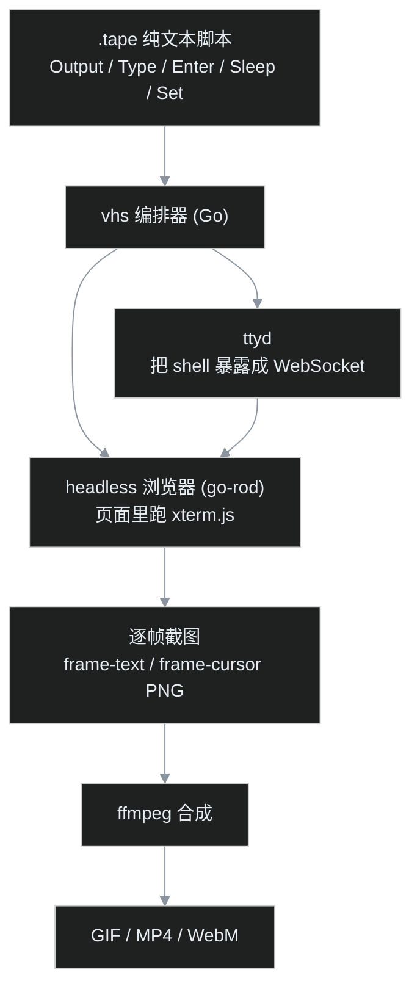

> 上一篇《零后端全站搜索》把"搜索"从服务端搬进了访客浏览器。这一篇轮到另一件日常小事：想给一段终端操作录个演示，能不能不打开录屏软件？答案是写一个 5 行的纯文本文件。

## 一、小白问题：录个终端，为啥要专门搞个工具

先想象一个特别常见的场景。

叶扬写了一个命令行小工具，想给 README 配一段演示。传统做法是：打开录屏软件 → 调出终端 → 深吸一口气 → 开始操作。过程中，鼠标不小心滑进画面了，重来；微信弹窗闪了一下，重来；第三条命令打错一个字母，重来；好不容易录完，发现终端字体太小、窗口尺寸歪歪扭扭，还是重来。

这还不是最麻烦的。半年后工具改了参数，README 里那段演示过时了——得把上面整套流程再走一遍，而且几乎不可能录出跟当年一模一样的节奏。

问题出在哪？录屏软件的思路是"记录像素"，它把终端当成一块普通屏幕来拍。可终端会话根本不是屏幕，它是**文本字节流**：敲进去的字符是文本，跑出来的输出也是文本。既然原料是文本，演示这件事本来就应该可以"写"，而不是"录"——写进一个纯文本文件，能进 git，能 review，能在 CI 里随时重新渲染。

VHS 就是把这个思路做到底的工具。

## 二、VHS 是谁，winget 两条命令装完

VHS 出自 Charm 之手——就是做 Gum、Bubble Tea 那套终端 UI 工具的那个团队，GitHub 上两万多 star。它的用法一句话讲完：写一个 `.tape` 脚本，声明要敲什么命令、每步等多久，vhs 负责把整个终端会话渲染成 GIF、MP4 或 WebM。

安装在 Windows 上很省心，winget 里就有：

```bash
winget install charmbracelet.vhs
winget install tsl0922.ttyd
```

第二条是它的运行依赖。VHS 的内部架构其实是"四件套"拼起来的：



看懂这张图，后面所有的坑都能对号入座。流程是：vhs 先启动 ttyd，ttyd 在本地开一个 WebSocket 端口，背后跑着真正的 shell（Windows 上默认是 cmd）；同时 vhs 用 go-rod 拉起一个无头浏览器，页面里是 ttyd 配套的 xterm.js 终端，连上 WebSocket。随后 `.tape` 里的每条 Type、Enter，本质都是往这个终端投喂按键；浏览器按固定帧率对终端画面截图；最后 ffmpeg 把成百上千张 PNG 合成视频。

程序员对这套东西应该有天然的熟悉感：`.tape` 是源代码，vhs 是编译器驱动，截图是中间产物 `.o` 文件，ffmpeg 是链接器，GIF 是最终的可执行产物。源代码改一行，重新"编译"一次就行——这正是它比录屏软件强的根本原因。

装完可以跑一句 `vhs --version` 验证。它在启动录制时会检查 ffmpeg 在不在 PATH 里，并检查 ttyd 的版本（要求不低于 1.7.2）。ffmpeg 如果没装，Windows 上推荐去官网下一个 build，解压把 bin 目录加进 PATH。另外第一次真正运行 tape 时，go-rod 可能会自行下载一个无头 Chromium，属正常现象，等它下完即可。

## 三、第一条 tape：五行换一个 GIF

来写最小例子，整个文件只有 5 行：

```tape
Output first.gif

Type "echo hello, this is vhs"
Enter
Sleep 1s
```

逐行看：

- `Output first.gif`：声明渲染产物。还可以同时写多行 Output，一次录制产出多种格式。
- `Type "..."`：模拟键盘逐字输入，不是粘贴——观众能看到字符一个个蹦出来。
- `Enter`：回车，没什么悬念。
- `Sleep 1s`：停 1 秒。这行给命令执行和观众阅读留出时间。

跑它：

```bash
vhs first.tape
```

终端里会回显解析后的脚本，然后打印 `Creating first.gif...`，当前目录下就多出来一个 GIF：


从这一刻起，"录屏"这件事就变成了"编辑一个文本文件"。命令想换？改字符串。节奏嫌快？加 Sleep。整个过程没有鼠标、没有弹窗、没有手抖，只要把终端握手的余量留够（坑 3 会讲），每次渲染结果都一致。

## 四、Windows 三连坑（本文最值钱的部分）

如果故事到这里就结束，那这篇文章未免太顺。真实情况是：在 Windows 上，叶扬连撞三个坑，每一个都查了上游源码才搞明白。挨个讲。

### 坑 1：ttyd 一连接就崩，报 error 267

第一次跑 tape，vhs 在 Setup 阶段直接 panic 退出，堆栈落在 go-rod 的 MustEval 上——页面刚加载，连接就断了。手动启动 ttyd 模拟了一遍，浏览器一发起连接，ttyd 立刻退出，日志里的关键一句是：

```text
CreateProcessW failed with error 267: The directory name is invalid.
```

错误码 267 是 Windows 的 ERROR_DIRECTORY：ttyd 要启动 shell 时，拿到的工作目录是无效路径。这是 ttyd Windows 版一个挂了很久的 bug（上游 issue [tsl0922/ttyd#1292](https://github.com/tsl0922/ttyd/issues/1292) 虽已关闭，但给 ttyd 设置默认工作目录的修复 [tsl0922/ttyd#1413](https://github.com/tsl0922/ttyd/issues/1413) 至今没有合并，又赶上 ttyd 两年多没发新版，winget 里的 1.7.7 版本仍带着这个毛病），VHS 这边对应的修复 PR [charmbracelet/vhs#773](https://github.com/charmbracelet/vhs/pull/773) 至今还是 OPEN——修法是在启动 ttyd 时显式传工作目录参数 `-w .`。

既然新版没发、PR 没合，最干净的绕行办法是做一个包装器。新建一个 `wrap` 目录，里面放 `ttyd.cmd`：

```bat
@echo off
"C:\...\ttyd.exe" -w . %*
```

然后让这个目录在 PATH 里排在真 ttyd 前面。vhs 调用 `ttyd` 时找到的就是包装器，`-w .` 被悄悄注入，`%*` 把 vhs 自己的一长串参数原样透传。

这里还有个 Windows 专属的次级坑：在 Git Bash 里给 PATH 前置目录，必须写成 Unix 风格：

```bash
export PATH="/f/Data/gmeek-site/Temp/vhs-work/wrap:$PATH"
```

如果图省事写成 `F:/Data/...`，MSYS 不会做路径转换，原生进程拿到的 PATH 里那串是无效的，vhs 会一脸真诚地告诉你 `ttyd is not installed`。

### 坑 2：v0.12.0 笑着说成功，文件根本不存在

包装器做好，ttyd 不崩了，Type/Enter/Sleep 全部正常执行，屏幕打印：

```text
Creating first.gif...
Host your GIF on vhs.charm.sh: vhs publish <file>.gif
```

进程退出码 0。一翻目录——`first.gif` 不存在。

一个工具报告成功却没产物，这种 bug 最坑人。排查走了两步。

**第一步，先确认帧抓到了没有。** VHS 的帧存在系统临时目录下、`vhs` 开头的随机目录里（注意浏览器自己的 profile 目录是 `vhs-` 开头带连字符的，别抓错）。趁录制还在进行，把帧目录里的 PNG 复制出来看：54 帧，每帧都是真画面——第一帧里终端刚打出 `> e`，逐字输入的过程清清楚楚。所以这不是上游传闻的"canvas 空帧"问题（[charmbracelet/vhs#721](https://github.com/charmbracelet/vhs/issues/721)，headless Chrome 里 WebGL 不可用时 canvas 层会抓到空白帧，修复 PR [#722](https://github.com/charmbracelet/vhs/pull/722) 同样 OPEN）。帧是好的，问题出在最后的合成。

**第二步，读 ffmpeg 是怎么被调起来的。** VHS 渲染走的是 `Render()` 函数，里面用 `exec.CommandContext(ctx, "ffmpeg", ...)` 构造命令。关键在于这个 `ctx` 从哪来——读 evaluator.go 的主流程：

```go
ctx, cancel := context.WithCancel(ctx)
ch := v.Record(ctx)
// ... 执行完 tape 里的所有命令 ...
teardown()                       // 内部调用 cancel()
if err := v.Render(ctx); err != nil {  // ctx 此时已经取消
```

看明白了：`teardown()` 在 Render 之前执行，顺手把 ctx cancel 了；然后 Render 拿着这个**已经取消的 context** 去启动 ffmpeg。Go 的 CommandContext 发现 ctx 已取消，ffmpeg 刚起步就被终止——于是打印了 "Creating..."，却永远不会有文件。而 Render 对 ffmpeg 的失败只是悄悄记日志、自己仍然返回 nil，所以进程退出码还是 0。

这是 v0.12.0 引入的回归：v0.11.0 的同一处代码是 `v.Render()`，根本不收 ctx，内部自己用活的 context。上游 issue [charmbracelet/vhs#787](https://github.com/charmbracelet/vhs/issues/787) 报告的也是这件事，而且报告者用的是 ubuntu-24.04——跟平台无关，Linux、Windows 一起中招。

绕行方案因此非常明确：**不用 v0.12.0，钉死 v0.11.0**。GitHub Releases 直接下：

```bash
gh release download v0.11.0 --repo charmbracelet/vhs \
  --pattern "vhs_0.11.0_Windows_x86_64.zip"
```

换上 v0.11.0 再跑，15.8KB 的 GIF 顺利产出。

### 坑 3：第一个字母神秘失踪

钉了版本，又冒出一个诡异现象：在某些次录制里，`echo` 变成了 `cho`，终端回一句 `bash: cho: command not found`。tape 文件逐字检查，明明写得好好的。

这是个时序竞争（race）：vhs 打印完解析结果立刻开始 Type，而此刻无头浏览器里的终端刚跟 ttyd 建立连接，xterm.js 还没完全就绪，第一下按键就喂给了空气。大部分时候启动足够快，按键不丢——所以这坑时隐时现，格外折磨人。

修法简单得不值钱，但必须知道：**第一条 Type 之前先 Sleep**，给终端留足握手时间：

```tape
Sleep 800ms
Type "echo 'theme: Github'"
```

三个坑汇总成一张表，后来者照单抓药：

| 坑 | 现象 | 根因 | 绕行 | 上游状态 |
|---|---|---|---|---|
| ttyd 崩溃 | 一连接就退出，error 267 | ttyd 1.7.7 工作目录处理 bug | ttyd.cmd 包装器注入 `-w .`，PATH 用 `/f/` 风格 | vhs PR #773 OPEN |
| 无产物 | "Creating..." 后 exit 0，无文件 | v0.12.0 给 Render 传了已取消的 ctx，ffmpeg 被杀 | 换用 v0.11.0 | issue #787 OPEN |
| 首字丢失 | 偶尔 echo 变 cho | 终端连接未就绪即开始 Type | 第一条 Type 前 Sleep 800ms | 时序竞争 |

## 五、让片子像样：主题、字体、格式、速度

跑通之后，默认样式其实还很素。VHS 真正好玩的是用 `Set` 指令把整片"美术风格"参数化。demo 的配置头长这样（后面照旧接 Type / Enter / Sleep，这里省略）：

```tape
Output demo.gif
Output demo.mp4
Output demo.webm

Set Theme "Catppuccin Mocha"
Set FontSize 22
Set Width 1100
Set Height 640
Set Padding 24
Set TypingSpeed 70ms
Set Shell bash
# 下面接 Type / Enter / Sleep，同第三节
```

几个要点挨个说。

**主题**。VHS 内置了三百多个终端主题，从 Dracula、Nord 到各种 Catppuccin 变体都有，一行切换。但主题名是区分大小写、且拼写常常不按直觉来的：GitHub 主题实际叫 `Github`，Gruvbox 暗色叫 `GruvboxDark`，Nord 干脆是小写 `nord`——写错了 vhs 会报 "did you mean ..." 或 "theme does not exist"。同一段内容、四个主题实拍：


**格式与体积**。同一段 4.76 秒的 demo，三种格式实测体积：

| 格式 | 体积 | 怎么选 |
|---|---|---|
| GIF | 61 KB | 最大，但任何页面、聊天工具都能直接放，兼容性无敌 |
| MP4 | 34 KB | 网页 `<video>` 首选，无音轨、配合 `muted autoplay` 可自动播；但需要 HTML 标签，聊天工具大多不内联支持 |
| WebM | 25 KB | 最小，现代浏览器都支持 |

一次录制、三个 Output 同时产出，选型没有试错成本。

**两种速度别搞混**。`Set TypingSpeed 70ms` 管的是录制阶段——每个按键之间间隔多久，改它会改变录制总时长；`Set PlaybackSpeed 2` 管的是渲染阶段——录制照常，成品按倍数快放。实测 2 倍速：4.76 秒压到 1.84 秒，而体积不降反升（GIF 61KB → 82KB）。听着反直觉，道理是视频压缩靠相邻帧"差不多"来省数据，快放之后每帧之间差异变大、每秒塞的信息更密，压缩率自然下降。

**截图是即时的**。除了视频，还可以用 `Screenshot demo-end.png` 在脚本任意位置拍一张静态图。要注意它截的是**那一刻**的画面，不等任何东西——叶扬第一版 demo 在最后一条命令后立刻 Screenshot，结果 ls 的输出还没渲染出来，画面停在命令行上。想拍到完整输出，老规矩，先 Sleep。配合 Mocha 主题的最终成片：


动态版长这样：


## 六、asciinema：另一条路线，录的是文本不是画面

VHS 解决的是"把文本渲染成视频"。还有一个同源但更激进的思路：**干脆不要视频，直接录文本**。这就是 asciinema。

它的产物 `.cast` 文件是纯文本，v2 格式简单到一眼看完：第一行是一段 JSON 头，记录终端行列数等元信息；之后每行是一个事件数组——`[时间戳, "o", 数据]`，即"第几秒，终端输出了什么"。一次完整的终端会话，本质就是一串带时间戳的文本块。

先看 Windows 生态的现实：asciinema 官方 3.x 只发布了 macOS 和 Linux 二进制，没有 Windows 版；Windows 上有兼容工具 PowerSession，实测它对管道喂入的非控制台 stdin 处理不稳，直接报 ReadFile failed；老牌的 asciinema 2.x（Python 编写）又依赖 Unix pty，在 Windows 上用不了。

但理解了格式就会发现，根本不需要录制器——`.cast` 是文本，**直接手写**一份：

```json
{"version": 2, "width": 90, "height": 16}
[0.1, "o", "$ echo 'asciinema records TEXT, not video'\r\n"]
[0.7, "o", "asciinema records TEXT, not video\r\n"]
[1.1, "o", "$ for i in 1 2 3 4 5; do echo \"line $i\"; done\r\n"]
[1.7, "o", "line 1\r\nline 2\r\nline 3\r\nline 4\r\nline 5\r\n"]
[2.2, "o", "$ "]
```

整个文件 303 字节。这可能是对"文本格式"最彻底的证明：一个终端演示，在任何文本编辑器里凭空就能造出来，能 diff，能 review。

手写的东西格式对不对？用官方的 agg（asciinema 的 cast→GIF 渲染器，winget 可装）验证：

```bash
agg hand.cast hand.gif
```

303 字节的文本被渲染成 12.7KB 的 GIF，内容一字不差：


cast 真正不可替代的用法是**嵌进网页**。官方播放器 asciinema-player 把 cast 渲染成一个可交互的终端控件：先通过 CDN 或 npm 引入 `asciinema-player.css` 和 `asciinema-player.min.js`，下面代码里的 `castText` 就是 cast 文件的文本内容（也可以直接传 cast 文件的 URL 让播放器自行 fetch）：

```html
<div id="term"></div>
<script>
AsciinemaPlayer.create({data: castText}, document.getElementById('term'),
  {autoPlay: true, loop: true, theme: 'dracula'});
</script>
```

实拍效果，注意底部那条控制栏：


播放/暂停、时间码、可拖拽的进度条、快捷键按钮、全屏——全在。访客还能直接在终端画面里**选中并复制命令文本**，因为播放器里本来就是文本。这些是任何 GIF、MP4 都给不了的。

于是 VHS 和 asciinema 的分工非常清楚：

| 诉求 | 选择 |
|---|---|
| README 头部、社交群里发，要求点开就自动播、零门槛 | VHS 渲染 GIF |
| 教程正文，读者可能要暂停读输出、复制命令、按自己节奏看 | cast + asciinema-player |
| 源头要可维护的纯文本，同时又想要 GIF 到处分发 | 维护 cast，用 agg 导出 GIF |
| 需要漂亮主题、圆角、留白这些"包装" | VHS（agg 的样式选项少得多） |

## 七、什么时候值得用，什么时候别用

收尾算账。

**值得用的场景**：CLI 工具的 README 演示、教程文章里的操作步骤、团队内部的可复现文档。共同特征是内容是纯终端、且你预期它会变——`.tape` 和 cast 进版本库，改一次重新渲染一次，边际成本几乎为零。

**别用的场景**：演示里有鼠标操作的图形界面，VHS 管不到；一次性的口头沟通，截个静态图反而更快；输出不确定、无法脚本化的交互（比如要真人临场判断的调试），硬写成脚本只会反复返工。

最后补一句 CI 的价值。这篇文章里 Windows 本地连踩三坑，但把 `.tape` 放进 GitHub Actions 的 Linux runner 上，叶扬实测 ttyd 的坑不会出现、首字 race 也没再复现（无头环境反而干净），只要记得把 vhs 版本钉在 v0.11.0 绕开 ctx 回归即可。官方推荐的团队用法正是这样：每次发版自动重新渲染演示，README 里的 GIF 永远跟最新代码一致。演示从此不是"录出来的资产"，而是"构建出来的产物"。

下一篇实操轮到文件同步与备份的瑞士军刀——rclone：一个命令行工具统一对接七十多种存储后端，把"备份到网盘"也变成可脚本化的工程。

### 术语表

| 术语 | 解释 |
|---|---|
| `.tape` | VHS 的脚本格式，纯文本，描述按键、等待、输出与样式 |
| ttyd | 把命令行 shell 通过 WebSocket 共享出去的服务，VHS 用它驱动真实终端 |
| go-rod | Go 的浏览器自动化库，VHS 用它拉起无头 Chrome/Edge 渲染 xterm.js |
| xterm.js | 浏览器里的终端模拟器，VHS 画面的实际渲染者 |
| ConPTY | Windows 的伪终端机制，ttyd/PowerSession 在 Windows 上靠它与 shell 通信 |
| cast v2 | asciinema 的会话文件格式：JSON 头加带时间戳的输出事件，纯文本 |
| agg | asciinema 官方的 cast → GIF 渲染器 |
| TypingSpeed / PlaybackSpeed | 前者控制录制时按键间隔，后者控制成品快放倍数 |
