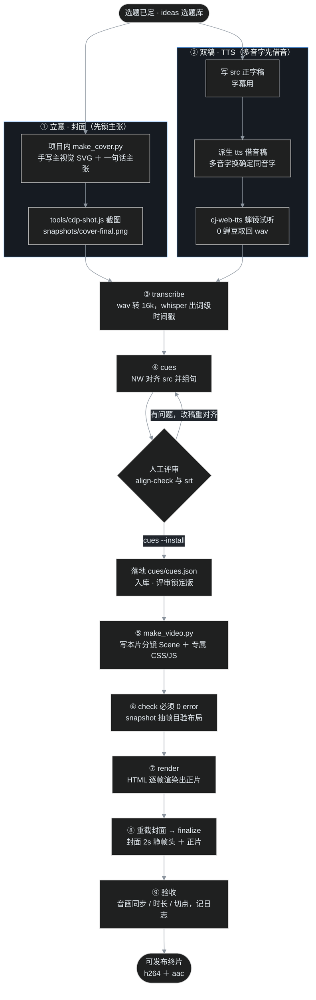
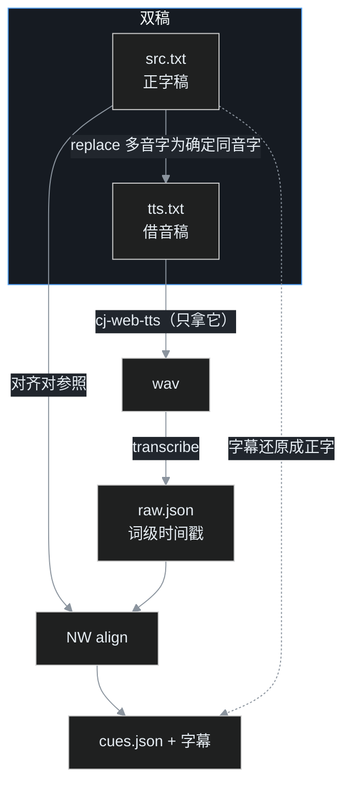
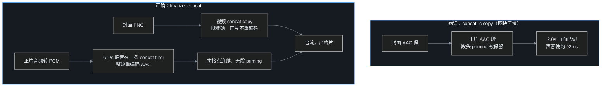

# 中国佛教史短视频 · 制作工作流接手指南

> 最近更新：2026-10-08（随第 03 篇《达摩》固化多音字借音与音画对齐两条硬规矩）
> 适用：所有在 `videos/` 下制作的「HTML+GSAP → MP4」口播短视频。

读完这篇，你应当能：看懂整条流水线怎么串、每个脚本/模块是干什么的、拿到一个新选题后从零做出可发布的成片，并知道哪里有坑。

---

## 1. 这套工作流在做什么

把一篇口播稿（约 1100–1800 字、6 分钟级）做成一支 **1920×1080 / 30fps / h264+aac** 的短视频：

- **画面**：用 HTML + CSS + GSAP 写"幻灯片式"分镜，由开源工具 [HyperFrames](https://github.com/heygen-com/hyperframes) 在无头浏览器里逐帧渲染成 MP4；
- **声音**：用「叶扬」克隆音色，在蝉镜平台**网页试听**（0 蝉豆）取回 wav；
- **字幕**：用 faster-whisper 做词级时间戳，再和正字稿做 Needleman-Wunsch 对齐，得到"句内逐字到点高亮"的底部字幕。

设计原则是**深模块**：重复的骨架沉到公共包 `videopipe/`，每片只手写"这片独有"的分镜与主视觉。所有画布尺寸、帧率、编码、路径的魔法数字都以 `videopipe/config.py` 为单一来源。

### 技术栈与版本（钉死，别随手升级）

| 组件 | 版本 / 说明 |
|---|---|
| HyperFrames | **`0.8.107`**（`npx hyperframes@0.8.107`，版本写死，防像素微差） |
| GSAP | `3.14.2`（唯一源 `assets/gsap/gsap.min.js`，`stage_gsap()` 复制进项目根后以本地 `src` 引用） |
| faster-whisper | `>=1.0`，CPU/int8，`base` 模型（约 145MB） |
| Python | 3.10+，依赖见 `videos/requirements.txt` |
| Node | 22+（脚本用到内置 WebSocket / 原生 fetch） |
| ffmpeg / ffprobe | 须在 PATH（本仓库实测 7.x） |
| 中文字体 | 系统楷体 `KaiTi`；标题霞鹜文楷 Bold（`assets/wenkai/`）；印章马善政（`assets/fonts/`） |

---

## 2. 全景：九步流水线



要点：**①封面先行**（在昂贵的渲染前先锁死"一句话主张＋主视觉"，也是早期验收锚点）；**③④是"取时间轴"**；**⑤–⑧是"画面与成片"**；其中 **③④⑧ 已收成 `videopipe` 命令行**，不必每片手抄一次性脚本。

---

## 3. 目录结构与文件归属

```
videos/
├── README.md                  速查手册（步骤/坑的精简版）
├── requirements.txt           Python 后端依赖
├── new_project.py             ★脚手架：python new_project.py <name>
├── ideas/                     选题库（人物/主题 + 三季排播总表）
├── assets/                    跨片共享资产
│   ├── fonts/                 马善政（印章用，入库）
│   ├── wenkai/                霞鹜文楷 Bold（css + woff2 分片，入库）
│   └── local-fonts/           其余系统字体（gitignore）
├── templates/project/         脚手架模板（new_project 复制它）
├── docs/
│   ├── hyperframes-agent.md   HyperFrames agent 约定
│   └── workflow.md            ← 本文
├── videopipe/                 ★公共包（13 个模块，全部入库）
└── projects/<片>/             每支视频一个项目目录
    ├── make_cover.py          入库  封面生成器（从已有片复制改写）
    ├── make_video.py          入库  ★分镜生成器（本片主体）
    ├── cover.html             gitignore（make_cover 产物）
    ├── index.html             gitignore（make_video 产物）
    ├── hyperframes.json       入库  HyperFrames 配置
    ├── package.json           入库  npx 命令脚本（check/render…）
    ├── meta.json              入库  项目元数据
    ├── src/                   入库
    │   ├── <片>-src.txt         正字稿（字幕 + transcribe 对参照）
    │   └── <片>-tts.txt         借音稿（只给 TTS 用）
    ├── cues/cues.json         入库  ★评审锁定版对齐（支撑无音频重建）
    ├── oneoffs/               入库  正音表、片特定一次性脚本
    ├── media/                 gitignore  wav、终片 mp4
    ├── build/                 gitignore  16k、raw.json、build/cues.json、srt、封面头
    ├── renders/               gitignore  render 出的正片
    └── snapshots/             gitignore  cover-final.png、抽帧 png
```

**入库 / 不入库的判断**：生成器（`make_*.py`）、源稿（`src/`）、锁定对齐（`cues/cues.json`）、配置（`*.json`）、正音表是"源代码"，入库；所有可由它们重建的产物（`index.html`、`cover.html`、`media/`、`build/`、`renders/`、`snapshots/`、`*.wav`、`*.mp4`）一律 gitignore。

> 注意：封面 PNG `snapshots/cover-final.png` 不入库。接手时需自己跑 `make_cover.py` 生成 `cover.html`，再用 `cdp-shot.js` 截图，`finalize` 才能找到它。

---

## 4. 分步详解

### 0. 一次性环境准备

```bash
# Python 依赖
pip install -r videos/requirements.txt
# Node / ffmpeg 需自行装好并在 PATH；hyperframes 由 npx 按需拉取 0.8.107
```

蝉镜取音二选一：

- **网页试听（默认，0 成本）**：`cj-web-tts.js` 用独立浏览器 profile，首次加 `--wait-login` 由你本人登录蝉镜，登录态留在 profile 里复用；
- **开放平台 API（付费）**：凭证放 `tools/.chanjing.env`（`CHANJING_APP_ID` / `CHANJING_SECRET_KEY`），可用 `python tools/chanjing.py token` 验证。

国内拉 whisper 模型如超时，设环境变量 `HF_ENDPOINT=https://hf-mirror.com`。

### ① 封面：先立意，再画图

```bash
cd videos
python new_project.py damo            # 仅新片需要；已存在则跳过
```

`new_project.py` 复制 `templates/project/`，替换 `__NAME__`/`__CREATEDAT__`，建好 `media/build/renders/snapshots` 输出目录。模板**不含** `make_cover.py`，从相邻成片（如 `projects/liangwudi/make_cover.py`）复制一份改写。

```bash
cd projects/damo
python make_cover.py                  # 生成 cover.html
```

封面是「宏观阿尔法」风格：宣纸米白底 + 圆润大字标题（霞鹜文楷 Bold）+ 铅笔素描主视觉（逐片手写 SVG）+ 金色工程制图元素（准星/刻度/箭头/虚线圆弧）+ 朱砂印章。公共骨架在 `videopipe/cover.py`，`make_cover.py` 只写本片独有的布局数值、主视觉 SVG、文字。

接着截图（在**仓库根目录**跑，URL 用完整 `file:///`）：

```bash
# 仓库根
node tools/cdp-shot.js \
  "file:///F:/Data/gmeek-site/videos/projects/damo/cover.html" \
  "videos/projects/damo/snapshots/cover-final.png" \
  1920 1080 --scale 1 --settle 4500
```

`--settle 4500` 给 webfont 加载留时间。截完用 Read 打开 PNG 目验。

### ② 双稿 + TTS：多音字先借音（硬规矩）

**铁律顺序：`src` 正字稿 → `tts` 借音稿 → 只拿 `tts` 跑 TTS → 用 `src` 做字幕。** 绝不能直接拿正字稿合成。

1. 写 `src/<片>-src.txt` 正字稿（一个小句一行，是字幕和第④步对齐的对参照）；
2. 用脚本做简单 `.replace(...)` 派生 `src/<片>-tts.txt`：只把易错多音字的**字形**换成读音确定的同音字，语义、断句不变；
3. 在 `oneoffs/<片>-pronunciation.md` 记正音表（哪个词、读什么、借什么字）；
4. **只拿 `tts.txt`** 跑蝉镜试听：

```bash
# 仓库根；首次加 --wait-login 30 自行登录
node tools/cj-web-tts.js \
  videos/projects/damo/src/damo-tts.txt \
  videos/projects/damo/media/damo-yeyang.wav \
  C-df5d6f1a95904a91a8e086b6f2fd8a53 \
  --profile Temp/cj-profile
```

「叶扬」克隆音色码 `C-df5d6f1a95904a91a8e086b6f2fd8a53`（cicada2.0）。**绝不点「立即生成」（扣豆），只走「试听」**。合成后务必抽听借音处确认读音，再进③。

借音先例：

| 正字（src/字幕） | 借音（tts） | 锁定读音 |
|---|---|---|
| 楞伽经 | 楞**茄**经 | qié |
| 那首偈 | 那首**记** | jì |
| 当差 | 当**拆** | chāi |
| 降将 | **祥**将 | xiáng |

### ③ transcribe：词级时间戳

在 `videos/` 下：

```bash
python -m videopipe transcribe projects/damo
# 产物：build/16k.wav、build/raw.json、build/transcript.txt
```

做的事：wav → ffmpeg 转 16k 单声道 → 用 wave 读 PCM（绕开 PyAV 与 faster-whisper 的二进制不兼容）→ faster-whisper 出**词级**时间戳 → 存 `raw.json`。TTS 音频干净连续，默认不开 VAD。

### ④ cues：对齐 + 组句（先评审，后落地）

```bash
python -m videopipe cues projects/damo
# 产物只在 build/：cues.json、cues.srt、align-check.txt
```

做的事：读正字稿与 `raw.json` → 多字词时间均摊 → **Needleman-Wunsch** 全局对齐（字形 3 分 / 同音 2 分 / 韵母 1 分 / 不匹配 −2 / 插入 −1）→ 未命中字在相邻命中字之间线性插值 → 按标点组句、做单调修正。

**评审**：打开 `build/align-check.txt`（对齐命中率）与 `build/cues.srt`（逐条时间轴）核对。借音字在字幕里必须全部还原成 src 正字；留意有没有「连续 GAP」（whisper 长句会无声吞字，见 §6 坑）。确认无误再落地：

```bash
python -m videopipe cues projects/damo --install
# 落地为 cues/cues.json（入库）
```

### ⑤ make_video.py：写本片分镜

这是每片工作量最大、也最需要手写的一步。`make_video.py` 只写"这片独有"的东西：一列 `Scene(id, start, end, body)`、场景专属 CSS、场景动画 JS；页面骨架/主题/字幕/clip 外壳全部复用 `videopipe`。

固定套路：

```python
from videopipe import (ProjectPaths, load_cues, Scene, render_scenes,
                      scene_fade_js, char_track, assemble_css,
                      render_page, audio_tag, XUANZHI)

P = ProjectPaths.at(Path(__file__).resolve().parent); P.ensure()
data = load_cues(P.cues_json)
cues, chars, total = data["cues"], data["chars"], data["duration"]
THEME = XUANZHI

SCENES = [
    Scene("sc-1", 0.00, 15.02, "<本片手写 HTML/卡片/SVG>"),
    # …首尾严格相接的若干幕
]
```

- 场景边界（start/end）从 `cues` 的时间取，**首尾严格相接**，幕间用交叉淡变；
- PPT 式卡片与叙事 SVG 穿插：勾选 checklist、左右对比卡、大数字卡、终端窗口、时间轴、卷轴、商品卡等；
- 生成 index.html：组装 `audio_tag(...)` + `render_scenes(SCENES)` + 底部 `char_track`（逐字字幕），交 `render_page(...)` 写出。

```bash
cd projects/damo
python make_video.py                 # 生成 index.html
```

### ⑥ check + snapshot：门控与抽帧

```bash
npx hyperframes@0.8.107 check
```

**必须 0 error 才往下走。** Warning 里有一批"基线项"可接受（各片都有）：`gsap_infinite_repeat`、`composition_file_too_large`、`timeline_track_too_dense`、`nested_structure_needs_subcomposition`。迁移/重写时对照老片的 warning 集合，多出来的要查。

抽帧（`--at` 是**逗号分隔**，多 `--at` 标志只取最后一个）：

```bash
npx hyperframes@0.8.107 snapshot \
  --at=44,120,218,245,285,312 \
  --no-end --no-browser-gpu
# 产物：snapshots/frame-*.png + contact-sheet.jpg（拼图供目验）
```

`--no-browser-gpu` 用 SwiftShader 保确定性；自动会加末尾帧，`--no-end` 关闭。逐幕 Read `contact-sheet.jpg`，确认无元素出界、重叠、黑帧。

> ⚠ **`snapshot` 会清空整个 `snapshots/` 目录**：每次跑只保留本次抽帧产物，会把①步早先截好的 `cover-final.png` 一起删掉。所以①截的封面只是"立意看版"，**真正给 finalize 用的封面要在所有 snapshot 之后、⑧之前最后重截一次**（见⑧开头）。

### ⑦ render：逐帧渲染正片

```bash
npx hyperframes@0.8.107 render
# 产物：renders/<片>_<时间戳>.mp4
```

这是最耗时的一步（无独显软/核显，1080p 六千到一万多帧，约 12–17 分钟，建议挂后台）。HyperFrames 会按页面情况选捕获方式：

- 无 `filter:blur` → 快的 **drawElement streaming**（单 worker 流式编码）；
- 有 blur / 特殊滤镜 → 回退较慢的 screenshot 捕获（仍然正确）。

> 注意 render 产物文件名带时间戳，不是 `<片>-body.mp4`，所以下一步要显式 `--body`。

### ⑧ 重截封面 → finalize：封面头 + 正片，音画严格对齐

snapshot 已把封面删掉，先重生成并重截（`cover.html` 与 PNG 都是确定性产物，重截与①逐字节一致）：

```bash
cd projects/<片>
python make_cover.py
node tools/cdp-shot.js "file:///…/projects/<片>/cover.html" \
     "projects/<片>/snapshots/cover-final.png" 1920 1080 --scale 1 --settle 4500

cd videos
python -m videopipe finalize projects/damo \
  --body "projects/damo/renders/damo_2026-10-08_13-12-55.mp4"
# 产物：media/<片>-yeyang-cover.mp4，自动 probe 并断言时长
```

做的事：把封面 PNG 做成精确 2s 静帧头，与正片拼接。**视频走无损 copy，音频整段重编码**，以消除拼接点 priming 导致的"图快声慢"（原理见 §6.2）。看到 `RESULT PASS` 即可。

### ⑨ 验收

抽终片的封面头（约 1s）与正片首帧（约 2.6s）确认衔接：

```bash
ffmpeg -y -ss 1.0 -i media/damo-yeyang-cover.mp4 -frames:v 1 c.jpg
ffmpeg -y -ss 2.6 -i media/damo-yeyang-cover.mp4 -frames:v 1 b.jpg
ffprobe -v error -show_entries stream=codec_type,start_time \
        -show_entries format=duration media/damo-yeyang-cover.mp4
```

两条流 `start_time` 都应是 `0.000000`；正片首个成声帧应落在精确 2.000s。验收通过后记 timing-log / 记忆，再进入发布（发布节奏由人决定，工具不催）。

---

## 5. 脚本与模块清单（每个是干什么的）

### 5.1 公共包 `videopipe/`（13 个模块，深模块）

| 模块 | 职责 | 关键 API |
|---|---|---|
| `config.py` | 画布/帧率/编码/路径/标点的**单一常量来源**；`ProjectPaths` 标准目录布局 | `WIDTH/HEIGHT/FPS`、`X264/AAC`、`ProjectPaths.at()` |
| `page.py` | HTML 文件外壳：doctype/head/meta/GSAP/`#root`/timeline 注册 | `render_page()`、`audio_tag()`、`jsnum()` |
| `theme.py` | 外观主题（底色/字体/字幕参数）+ 通用 CSS 装配 | `Theme`、`assemble_css()`、预置 `XUANZHI`/`DARK_GOLD_GH`/`DUNHUANG_WARM`/`SILK_PRO`/`DARK_GOLD_XJ` |
| `scene.py` | 场景四元组 + clip/scene-inner 渲染（StaticGuard 规避）+ 淡变 JS | `Scene`、`render_scenes()`、`scene_fade_js()` |
| `subtitle.py` | 底部字幕轨：整句淡变 + 句内逐字到点高亮；另有中央大字/整句轨 | `char_track()`、`center_char_clips()`、`sentence_track()`、`Fragments` |
| `cover.py` | 封面公共骨架（宏观阿尔法风格）：通用 CSS/纸纹/SVG 外层 | `render_cover()`、`CoverLayout` |
| `audioio.py` | 音频读写：转 16k 单声道、PCM 读取、ffprobe 时长 | `to_16k_mono()`、`read_pcm16()`、`probe_duration()` |
| `whisper_asr.py` | faster-whisper 封装：词级时间戳，CPU/int8 单例 | `transcribe()`、`save_raw()/load_raw()`、`Transcript/Word/Segment` |
| `align.py` | ASR 词时间戳 → 正字稿 NW 对齐（字形+拼音打分、插值） | `align()`、`check_report()`、`Scores/Alignment` |
| `cues.py` | 组句 cue、单调修正、cues.json / SRT 读写 | `group_cues()`、`enforce_monotonic()`、`save_cues()/load_cues()`、`to_srt()` |
| `concat.py` | 封面静帧头 + 拼接：含**音画对齐版** finalize | `make_cover_head()`、`concat_copy()`、`finalize_concat()` |
| `verify.py` | 结构提取 + 新旧 index.html 零差异对比 | `compare()`、`structure()` |
| `__main__.py` | **命令行入口**：`transcribe` / `cues` / `finalize` 三子命令 | `python -m videopipe …` |

### 5.2 项目内脚本（每片一份，入库）

| 文件 | 作用 |
|---|---|
| `make_cover.py` | 封面生成器。调 `videopipe.cover` 的公共骨架，只写本片布局/主视觉 SVG/文字。`python make_cover.py` → `cover.html` |
| `make_video.py` | **分镜生成器（本片主体）**。写 `Scene` 列、专属 CSS/JS，组装音频/场景/字幕，`python make_video.py` → `index.html` |
| `src/<片>-src.txt` | 正字稿。字幕 + transcribe 对参照 |
| `src/<片>-tts.txt` | 借音稿。只给 TTS 用 |
| `cues/cues.json` | 评审锁定版对齐（`{duration, chars, cues:[{s,e,t}]}`），支撑无音频重建 |
| `oneoffs/<片>-pronunciation.md` | 多音字/专名正音表与借音预案 |
| `hyperframes.json` / `package.json` / `meta.json` | HyperFrames 配置 / npx 命令脚本 / 项目元数据 |

### 5.3 脚手架

| 文件 | 作用 |
|---|---|
| `videos/new_project.py` | `python new_project.py <name>`：复制 `templates/project/`，建标准目录。模板含 `make_video.py` 骨架与三份配置；**不含** `make_cover.py`，需从相邻成片复制 |

### 5.4 外部工具（仓库根 `tools/`，跨工作流共用）

| 脚本 | 作用 | 在本流水线用于 |
|---|---|---|
| `cj-web-tts.js` | 蝉镜「网页试听」自动化，0 蝉豆取回 wav（UI 模式默认；`--api` 带 JWT 复刻调用链） | ② 取 TTS 音频 |
| `cdp-shot.js` | 零依赖无头浏览器截图器（CDP，Node22 内置 WebSocket） | ① 截封面 PNG（也用于博客配图） |
| `chanjing.py` | 蝉镜开放平台客户端（标准库）；**仅只读子命令** `token / list-audio / list-dp` | 0 验凭证、查音色 |
| `mermaid-to-png.js` | 把 Markdown 里 mermaid 块批量渲染成暗色 PNG | 与视频成片无直接关系（博客/知乎配图用） |

### 5.5 CLI 速查

```bash
# —— videopipe（在 videos/ 下，project 传项目目录）——
python -m videopipe transcribe projects/<片>            # ③
python -m videopipe cues projects/<片>                  # ④（只写 build/）
python -m videopipe cues projects/<片> --install        # ④ 落地 cues/cues.json
python -m videopipe finalize projects/<片> --body <正片> # ⑧
# 任一命令加 -h 查看全部可覆盖参数（--wav/--src/--cover/--body/--out/--hold…）

# —— HyperFrames（在项目目录下）——
npx hyperframes@0.8.107 preview                         # 本地实时预览
npx hyperframes@0.8.107 check                           # 五段门控
npx hyperframes@0.8.107 snapshot --at=44,120 --no-browser-gpu
npx hyperframes@0.8.107 render                          # 逐帧渲染
```

---

## 6. 核心机制与必知坑

### 6.1 多音字借音（数据流）

蝉镜 TTS 只吃纯文本，没有 SSML/注音参数。所以用"双稿"把"读什么"和"显示什么"分离：



### 6.2 音画对齐：为什么音频要整段重编码

封面头与正片是**两段独立 AAC**。若用 ffmpeg concat `-c copy` 直接拼，正片段头部的 **encoder priming**（几十毫秒静音采样）会被原样保留在 2.0s 拼接点：画面在精确 2.000s 已切进正片，声音却晚到，形成固定"图比声快"并贯穿全片（达摩片实测 92ms）。



验收标准：两条流 `start_time` 均为 `0.000000`，切点首个成声帧＝2.000s。已发布老片（梁武帝等）用的是旧 `concat_copy`，不回改。

### 6.3 GSAP 两大铁坑

- **StaticGuard**：被 HyperFrames 自管显隐的 `.clip` 元素，不能再动画其 autoAlpha；要在 clip 内再包一层 `.scene-inner`，淡入淡出只对 inner 做 `opacity`。
- **SVG transform 基点**：被 GSAP 动画 `x/y` 的 `g` **不可自带 `transform`**（GSAP 会把 translate 解析成内部坐标，`set x:0` 会瞬移到 SVG 原点，导致人物飞出画外）。基点交给**不动画的外层** `<g transform="translate(x,y)">`，内层被动画的 `g` 无 transform、从 0 起步。

### 6.4 其余必知

| 项 | 规矩 |
|---|---|
| **确定性** | 生成脚本禁 `Math.random`/`Date.now`；固定切点、抽帧加 `--no-browser-gpu`，同输入须逐字节一致 |
| **字幕安全线** | 底部 subshade 高 240px，画面元素 bottom 须 ≥240（底缘 ≤840px），否则触发 `text_occluded/content_overlap` |
| **逐字高亮偏晚** | faster-whisper 对克隆 TTS 的词时间戳系统偏晚约 80ms（声先、字幕迟）。`char_track(..., word_lead=config.WHISPER_WORD_LEAD)` 只把逐字变色提前，整句不动；默认 0、历史片不受影响。改后须整片重渲染 |
| **长句吞字** | whisper 偶把长 segment 整段漏识别（出现连续 GAP）。切出该段用 `condition_on_previous_text=False + vad_filter=True` 单独转录，再把时间戳补回 |
| **沙箱内存** | 受限沙箱里 4K libx264（render、封面头）会报 `x264 malloc failed`，需在非沙箱跑；whisper 不受影响 |
| **blur 性能** | `filter:blur` 会让渲染从 drawElement 回退慢速 screenshot；老片刻意保留的 blur 不得顺手统一 |
| **选择器** | 分镜 JS 里别把 class 误写成 id（check 会报一类不易察觉的错） |

---

## 7. 从零到成片：可直接照抄的命令流水

```bash
# —— 在 videos/ 下 ——
python new_project.py <片>                                      # 建项目
cd projects/<片>
python make_cover.py                                            # → cover.html
# 仓库根截封面（立意看版；注意之后 snapshot 会把它删掉，finalize 前要重截）：
node tools/cdp-shot.js "file:///…/cover.html" \
     "videos/projects/<片>/snapshots/cover-final.png" 1920 1080 --scale 1 --settle 4500
# 写 src/<片>-src.txt，派生 tts.txt；仓库根取音：
node tools/cj-web-tts.js videos/projects/<片>/src/<片>-tts.txt \
     videos/projects/<片>/media/<片>-yeyang.wav C-df5d6f1a95904a91a8e086b6f2fd8a53 \
     --profile Temp/cj-profile
# —— 回 videos/ 下 ——
python -m videopipe transcribe projects/<片>
python -m videopipe cues projects/<片>                          # 评审 build/ 产物
python -m videopipe cues projects/<片> --install                # 确认后落地
# 写 projects/<片>/make_video.py，再：
cd projects/<片> && python make_video.py
npx hyperframes@0.8.107 check                                   # 必须 0 error
npx hyperframes@0.8.107 snapshot --at=<各幕中点,逗号分隔> --no-end --no-browser-gpu
npx hyperframes@0.8.107 render                                  # → renders/<片>_<时间戳>.mp4
# snapshot 已删封面，最后重截一次：
python make_cover.py
node /f/Data/gmeek-site/tools/cdp-shot.js "file:///…/cover.html" \
     "projects/<片>/snapshots/cover-final.png" 1920 1080 --scale 1 --settle 4500
cd ../..
python -m videopipe finalize projects/<片> --body "projects/<片>/renders/<片>_<时间戳>.mp4"
# → media/<片>-yeyang-cover.mp4，RESULT PASS，⑨ 验收后即可发布
```

---

## 8. 常见问题

- **打开浏览器提示「不受支持的命令行标志 --ignore-certificate-errors」**：该标志本就无效且已从 `cdp-shot.js / cj-web-tts.js / mermaid-to-png.js` 移除；再遇到检查是否有别处残留或本机 Chrome 快捷方式被加了该参数。
- **cj-web-tts 返回 `code=10201 用户不存在`**：不是登录过期，是缺 `Authorization: <JWT>` 头。走默认 UI 模式（脚本自动处理），或用 `--api`（脚本会从 `localStorage.token` 补头）。
- **蝉镜 profile 启动后浏览器秒退 code=0**：同 profile 有残留 Edge 进程单实例转发。按命令行匹配 profile 名结束残留进程树后重试。
- **check 报 `gsap_css_transform_conflict`**：被动画元素自带 CSS transform。把 translate 移到外层不动画元素，或改用 `fromTo`（该规则豁免）。
- **成片音画不同步**：先确认是用 `finalize`（音画对齐版）而非旧 `concat_copy`；再看两条流 `start_time` 是否都为 0。

---

> 维护约定：工作流有新增/改动，先在真实成片上验证，再同步更新本文与 `videos/README.md`；公共包保持"接口小、内部厚"，新魔法数字一律进 `config.py`，不要散落回项目脚本。
