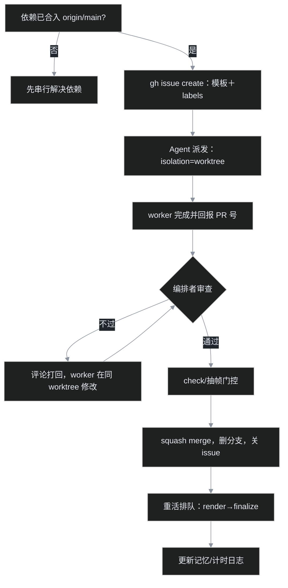

# 多 Agent 并行生产手册（视频流水线）

> 适用：HyperFrames 视频教程系列及同类「源驱动」视频项目。
> 目标：让编排者（Claude main loop）能用 GitHub issue 把任务派给多个 worker agent，
> 靠 git worktree 隔离并行推进，同时守住质量、资源与 Git 铁律。
> 2026-10-09 固化，配套 `.github/ISSUE_TEMPLATE/video-task.yml`。

## 一、先认清：什么能并行，什么不能

单集流水线是一条**强串行依赖链**：

```
封面 → TTS → transcribe → cues → make_video → check → render → finalize → 发布
```

前一步的产物是后一步的输入，单集内部无法并行。并行只发生在**相互独立的工作项之间**（如 hf-03 的分镜脚本与另一集的图文教程）。

| 工作类型 | 可否并行 | 资源消耗 | 备注 |
|---|---|---|---|
| 写口播 / 分镜脚本 / 图文 | ✅ 多 agent | 低 | 最适合并行 |
| `check` / `snapshot` | ⚠️ 最多同时 2 个 | 中（无头浏览器） | snapshot 用 `--no-browser-gpu` |
| TTS / transcribe | ⚠️ 避免同时 | 中（网络 / CPU） | 蝉镜只许试听，转录吃内存 |
| `render` | ❌ 全局一次一个 | 极高（约 27 分钟满核） | 单 worker drawElement，并行必互拖 |
| `finalize` / B 站发布 | ❌ 编排者串行 | 低 | outward-facing，人工授权 |

**本机并发上限：轻活 ≤3 个 worker；重活（render）排队串行。**

## 二、三种角色

| 角色 | 职责 | 禁止事项 |
|---|---|---|
| **编排者**（main loop） | 拆 issue、派单、审查/合并 PR、串行执行 render/finalize/发布、更新记忆 | —— |
| **worker agent** | 认领一个 issue，在专属 worktree 完成，push 分支并开 PR | 禁止 merge PR、禁止发布、禁止改公共文件、禁止碰 cookie |
| **用户** | 选题、节奏、outward-facing 操作授权 | —— |

worker 的产出是 **PR**，不是直接合并；任何 agent 完成都不等于已发布。

## 三、Issue 契约（每个派单 issue 必填）

一个 issue 就是一份人机合同，缺项不派单：

1. **目标**：要完成什么（一句话）＋为什么；
2. **文件边界**：允许改动的路径白名单（如 `videos/projects/hf-03/**`）；
3. **依赖**：必须先合入的 PR / issue 链接；
4. **DoD（完成定义）**：可勾验的清单——如 `check` 0 error、抽帧无溢出、字数区间；
5. **禁止事项**：默认条款（见第六节）＋本任务特殊限制。

## 四、编排者 SOP



操作要点：

1. **派单前**：确认依赖已在 `origin/main`。worktree 默认从主干取最新基准，依赖没合，worker 一开工就缺东西；
2. **建 issue**：用模板，打标签（`parallel-ready`＋系列标签），记录预期 DoD；
3. **派发**：Agent 工具，`isolation: "worktree"`，prompt 用第七节模板，让 worker 先 `gh issue view <编号>` 读契约；
4. **回收**：worker 只开 PR、回报 PR URL；编排者逐 PR 审查、跑门控；
5. **合并**：一个 PR 一次 squash merge，合并后 `git pull`、删本地远程分支、关 issue；
6. **重活**：多支 PR 合并后，render/finalize 由编排者**按队列串行**跑；
7. **收尾**：更新记忆与《文章计时日志.md》。

## 五、Worktree 约定

- 每个 worker 一个专属 worktree、一条分支，分支名遵循全局规范：`feat/hf-03-...`、`fix/...`；
- 基准＝`origin/main` 最新（派单前先 `git checkout main && git pull`）；
- worker 只在自己 worktree 工作，不动主工作区；
- PR 合并、分支删除后，worktree 随之销毁；未变更的 worktree 自动清理，有改动的先核对；
- 主工作区保持在主干或明确的修复分支上，**不与 worker 的分支混用**。

## 六、公共文件保护（默认禁止条款）

并行 worker **默认禁止改动**：

- `videos/videopipe/**`（公共管线包）
- `.github/**`（工作流、模板、标签）
- `videos/README.md`、`videos/ideas/**`（大纲与排播）
- 其他项目目录（如 worker 做 hf-03，不得碰 hf-02）

公共改动＝**独立分支、独立 PR、先串行落地**，落地后其他 worker 再从主干取。worker 干到一半发现「必须改公共文件」，停下并在 issue 里报告，不自行扩边界。

安全红线同样适用：不碰 `cookies.json` / `.chanjing.env`、不发布、不读凭证内容；蝉镜只许试听。

## 七、Worker prompt 模板

编排者派发时照此填写：

```text
你负责 issue #<编号>。开始前：
1. gh issue view <编号> —— 完整阅读目标、文件边界、依赖、DoD、禁止事项；
2. 你在独立 git worktree（分支 <分支名>，基准 origin/main）中工作，只在文件边界内改动；
3. 禁止：merge PR、任何发布（B站/知乎）、改动公共文件（见 videos/parallel-playbook.md 第六节）、
   读取任何凭证文件；
4. 完成后：自检 DoD（含相应门控），git push，gh pr create（正文写清改动与验收结果），
   在 issue 下评论 PR 链接；
5. 遇到必须超出文件边界才能继续的情况，停下来回报，不要猜测、不要自行扩大范围；
6. 禁 Math.random/Date.now，切点固定；正式 render 用硬件 GPU，check/snapshot 用 --no-browser-gpu；
7. 最终回复只给事实：PR URL、门控结果、遗留问题。
```

## 八、失败与异常处理

- worker 失败或结论可疑：编排者可重派一次（fresh worktree），或降级为主工作区亲自处理；
- **不预测、不假定**未完成 worker 的结果；
- PR 冲突：以主干为准 rebase，冲突涉及公共文件时编排者介入；
- 资源撞车（误启多个重活）：立即停掉后启动的，保正在跑的那个；
- 发布类操作一律不交给 worker 自动完成。

## 九、落地清单（固化内容）

- [x] 本手册 `videos/parallel-playbook.md`
- [x] Issue 模板 `.github/ISSUE_TEMPLATE/video-task.yml`
- [ ] 标签（需用户授权后创建）：`parallel-ready` / `blocked` / `rendering` / `hf`
- [ ] 首次试运行：2 个轻活 worker（如 hf-03 分镜 + 一篇图文），验证后再放大

> 注：标签未创建前，issue 模板内的 `labels:` 引用不生效——建 issue 时手动去标签，或先授权建标签。
