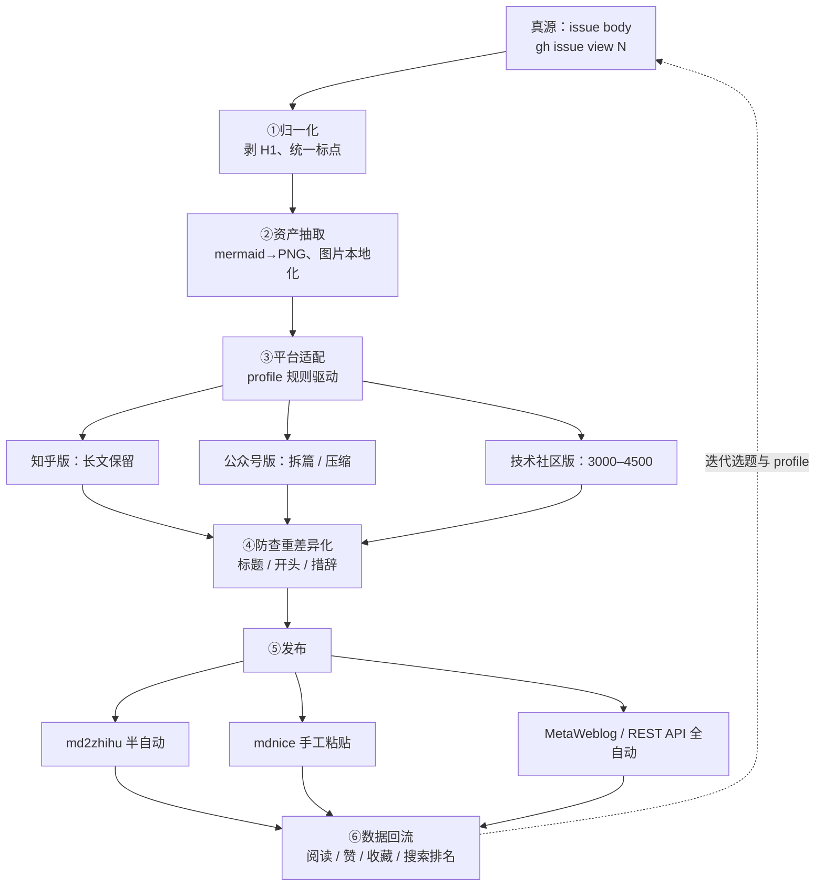

# 博客多平台分发与改写工作流规划

> 制定日期：2026-09-21
> 真源：GitHub Issue body（独立博客 yeyangchen2009.github.io）
> 配套调研：issue #5「2026-09-17 站外多平台分发调研（备忘，暂不执行）」

---

## 〇、核心思路

**真源只有一个（issue body），所有平台版本都是它的"编译产物"。改写靠脚本完成 80%，人工只负责标题判断和最后粘贴。**

---

## 一、定位（决定后面所有取舍）

- **不为引流回独立站**：外链 nofollow、百度不收 github.io、公众号正文不能放外链。
- 目标是三样：
  1. **搜索占位**——让同名话题在各平台能搜到本文；
  2. **防搬运**——自己占住平台，比被别人搬走强；
  3. **建立平台账号资产**——粉丝、专栏、权重。
- 因此核心考核指标是 **完读率、收藏数、赞**，而不是点击回到博客的数量。
- 多平台不是同一篇复制粘贴——平台查重会判搬运、限流。**每个平台必须是"同骨架、不同皮肉"的改写版。**

---

## 二、平台矩阵（按 ROI 和风险排序）

| 平台 | 内容形态 | 字数改造 | 格式转换 | 发布方式 | 优先级 | 风控 |
|---|---|---|---|---|---|---|
| **知乎** | 回答 > 专栏 | 基本保留长文 | mermaid→PNG | md2zhihu 半自动 | ★★★★★ | 新号带链易限流 |
| **掘金 / 思否** | 技术文（A 系） | 3000–4500 | 表格可留 | 手工 / API | ★★★★ | 低 |
| **博客园** | 技术文 | 3000–4500 | 降级 | **MetaWeblog API 全自动** | ★★★★ | 低 |
| **公众号** | 拆篇 / 精华 | C 系一篇拆两期，每期 3000–4000 | mdnice 排版 | mdnice 手工 | ★★★ | 原创要求首发 |
| **CSDN** | 工具书风格 | 1000–3500 | 防盗链转图、降级 | 半自动 | ★★ | 低 |
| **Dev.to / WordPress** | 技术文 | 保留 | Markdown 原生 | **API 全自动** | ★★ | 低 |
| **知乎想法 / 小红书** | 卡片片段 | 从文中抽金句 | 图片卡 | 手工 | 候选 | — |

### 选题路由

- **A 系技术文** → 掘金 / 博客园 / CSDN / 知乎技术话题；
- **C 系公共历史** → 知乎回答 / 公众号（话题性强的先发：C03 无我、C05 上非佛说）；
- **G 系建站教程** → 全部技术社区。

---

## 三、存量盘点：已有文章与字数

> 口径：线上 issue body，剥除 mermaid / 代码块与全部空白后的字符数；统计日期 2026-09-21。
> **合计 64 篇、408,457 字。** 其中固定页 / 门户 5 篇一般不分发；**真正可分发的内容文章 59 篇、387,557 字。**

### G 进阶 / 番外（27 篇，小计 146,084 字）

| # | 标题 | 字数 |
|---|---|---|
| #1 | 用 GitHub Issues 写博客：Gmeek 搭建全过程与原理 | 3,015 |
| #3 | Gmeek 右侧"文章目录"导航栏：插件原理与接入全过程 | 3,016 |
| #4 | 一个博客除了评论还需要什么：叶扬的博客基础功能建设清单 | 4,889 |
| #5 | Gmeek 插件与功能全景调研：系列教程总揽（第 0 篇） | 21,200 |
| #7 | G01 固定页面：用 singlePage 做一个不进文章流的 About 页 | 3,749 |
| #8 | G02 页脚装修：版权小字与"本站已运行 N 天" | 2,681 |
| #9 | G03 给博客一张脸：自制 SVG favicon 与社交分享封面 | 3,385 |
| #10 | G04 把门牌号递给搜索引擎：RSS 直接当 sitemap 提交（Google / Bing / 百度） | 3,944 |
| #11 | G05 给文章图片装一盏灯：官方 lightbox 灯箱插件 | 2,943 |
| #12 | G06 文章末尾的秘密：一行隐藏 JSON，给单篇文章开小灶 | 3,664 |
| #13 | G07 写作三件套：Alert 提示块、数学公式、Mermaid 图表 | 4,744 |
| #14 | G08 自研插件（一）：文章末尾的"上一篇 / 下一篇" | 4,042 |
| #15 | G09 自研插件（二）：标题下的字数与阅读时长 | 3,322 |
| #17 | G10 自研插件（三）：凭空造出的时间线归档页 | 5,947 |
| #18 | G11 运维两小件：给爬虫的 robots.txt，给迷路读者的 404 页 | 4,463 |
| #19 | G12 小补丁：外链自动新标签页打开，内链原地走 | 3,835 |
| #20 | G13｜数字分页条：借不到轮子，就自己造一个 | 5,836 |
| #21 | G14｜手机上的文章目录：右下角 ☰ 与两个 TOC 插件的和平共处 | 5,110 |
| #24 | G15｜Mermaid 翻车记：自动检测按需加载，顺手给 Gmeek 提个 PR | 7,704 |
| #25 | G16｜目录会读心：把 tocbot 请到本地，让当前章节一路高亮 | 7,308 |
| #26 | 番外｜给博客拍证件照：零依赖无头截图流水线，与一桩白底怪案 | 6,483 |
| #27 | G17｜SEO 收尾战：canonical、结构化数据和干净的摘要，一次补齐 | 6,183 |
| #28 | 番外二｜我给 Gmeek 提了三个 PR：一次开源回馈的完整流水线 | 6,499 |
| #29 | G18｜被浮动挤扁的"上一篇 / 下一篇"：一桩 BFC 避让案 | 3,337 |
| #31 | 番外三｜浏览器外的屏幕怎么截：ffmpeg gdigrab 抓窗口三坑记 | 4,087 |
| #33 | 番外四｜点到为止：让 AI 借你已登录的浏览器截一张图 | 7,110 |
| #37 | 番外五｜踩坑手册怎样变成 AI 技能：博客、CLAUDE.md、记忆与 Skill 的分工 | 7,588 |

### B 地基（9 篇，小计 71,687 字）

| # | 标题 | 字数 |
|---|---|---|
| #30 | B00｜地基篇总览：18 秒搭起 Gmeek，先认识 Issues、Actions 和 Pages 三块基石 | 14,746 |
| #32 | B01｜18 秒建站实录：从一个 GitHub 账号到第一篇文章上线 | 4,994 |
| #34 | B02｜毛坯房装修：认识 config.json，站名、头像换成你自己的 | 6,718 |
| #35 | B03｜在 Issues 里过日子：写稿、改稿、置顶与下架的编辑部日常 | 6,154 |
| #36 | B04｜门铃与名片：给博客装上评论区，再做一张 About 关于页 | 6,169 |
| #38 | B05｜读懂印刷厂值班日志：GitHub Actions 的三种点火、全量与增量、红叉怎么查 | 8,110 |
| #39 | B06｜网页怎样被全世界打开：GitHub Pages 的投递站、CDN 缓存与自定义域名 | 8,934 |
| #40 | B07｜印刷厂失火预案：backup 原稿、blogBase 户口本、升级与搬家 | 8,835 |
| #41 | B08｜交房验收：三态主题、页脚与 favicon、RSS，以及进阶指路 | 7,027 |

### A 工作流（4 篇，小计 19,426 字）

| # | 标题 | 字数 |
|---|---|---|
| #43 | A01｜136 条规则打败大模型：四万八千行 AI 字幕清洗战 | 5,264 |
| #44 | A02｜退出码 0，但硬盘上只有一个文件：65 集 AI 字幕下载记 | 4,915 |
| #46 | A00｜AI 工作流总览：程序员的 AI 数据流水线 | 1,863 |
| #66 | A03｜ASR 交来的是"半成品"：三集补档、18432 个隐形字符，和转写到成稿的最后一公里 | 7,384 |

### C 学习笔记（19 篇，小计 150,360 字）

| # | 标题 | 字数 |
|---|---|---|
| #45 | C00｜一个程序员为什么要啃印度佛教史 | 9,333 |
| #48 | C01｜佛陀出场之前，印度人到底在信什么 | 4,981 |
| #49 | C02｜佛陀开出的药方：四谛、八正道，和一条没有主角的因果链 | 6,119 |
| #50 | C03｜没有我，谁在轮回？——佛教最难的一题 | 7,020 |
| #51 | C04｜僧团为什么吵分裂：一味佛法是怎么裂成二十部的 | 8,831 |
| #52 | C05（上）｜迟到五百年的"佛说"：大乘登场与「非佛说」之辩 | 6,752 |
| #53 | C05（下）｜深智大行：菩萨道、净土，和一张大乘三系地图 | 8,578 |
| #54 | C06（上）｜龙树的空（上）："一切法空"为什么不是"什么都没有" | 8,358 |
| #55 | C06（下）｜龙树的空（下）：八个"不"字，和一个死于辩论的接班人 | 7,794 |
| #56 | C07（上）｜阿赖耶识：一个没有 id 的数据库，靠什么记住每一世 | 7,988 |
| #57 | C07（中）｜三性、三无性与种子：外境是空，心识是有，这话怎么说周全 | 8,492 |
| #58 | C07（下）｜转识成智：一份可运行的修行协议 | 7,608 |
| #59 | C08｜如来藏与佛性：金矿里本来有金，那修行还修什么 | 8,473 |
| #60 | C09｜密乘与 1203：那烂陀的火，是怎样烧起来的 | 8,593 |
| #61 | C10｜北上西藏：灭佛与复兴，佛法在世界屋脊上怎样活下来 | 8,130 |
| #62 | C11｜东传日本：一个开源项目被大厂收编的一生 | 8,572 |
| #63 | C12｜三链合一：三十九个讲次，最后就为了讲清这一件事 | 8,256 |
| #64 | 番外一｜佛陀的一生：一个生日失传的人，两千年里被讲成了什么样 | 8,334 |
| #65 | 番外二｜塔的东传：一个印度土馒头，怎样被中国人重写成了楼 | 8,148 |

### 固定页 / 门户（5 篇，小计 20,900 字，一般不分发）

| # | 标题 | 字数 |
|---|---|---|
| #2 | 楞严咒 | 15,834 |
| #6 | 关于叶扬 | 944 |
| #16 | 文章归档 | 141 |
| #42 | 链接收藏 | 2,848 |
| #47 | 博客地图｜系列文章从哪读起 | 1,133 |

### 分发改造提示

- **超长门户型**（#5＝21,200、#30＝14,746、#2＝15,834）不能整篇外发，只抽取其中独立成题的章节；
- **C 系每篇 7,000–9,000 字**：知乎保留、公众号一律拆两期；
- **A / G / B 多数 3,000–8,000 字**：技术社区按 4,500 上限压，知乎保留；
- 单篇越短、话题越独立，越适合做第一批 M1 试水。

---

## 四、改写工作流（六个阶段）



### 各阶段说明

**① 归一化**
- 取最新 issue body；H1 已全站剥除，再统一标点 / 空白。
- 所有平台版都从这一份派生，**绝不在平台侧直接改正文**（改了就和真源分叉）。

**② 资产抽取（工作量大头，但是一次性的）**
- **mermaid → PNG**：不必装 puppeteer / mmdc，直接复用现成的 `tools/cdp-shot.js`——它已能注入渲染 mermaid 并按 clip 出图，批量喂代码块即可；
- 图片本地化、转存（CSDN 防盗链）；
- 产物按文章编号归档。

**③ 平台适配（配置驱动，不改核心逻辑）**
每个平台一个 profile，声明四条规则：
- **长度**：知乎＝保留；公众号＝按 H2 边界拆两期或砍术语表出精华；技术社区＝压到 4500；
- **语法降级**：mermaid→图片；Alert→引用块 / 加粗；表格知乎 / 掘金可留、公众号转列表；
- **链接**：`/post/N.html` 内链 → "（见本专栏上篇）"文字；外链集中到文末；公众号唯一出口是"阅读原文"；
- **标题 / 开头**：剥掉"C07｜"编号，换成问题式 / 结论式钩子，把"小白问题"前三段前置。

**④ 防查重差异化**
- 同骨架下，标题、开头 200 字、部分措辞和例子顺序按平台改写。
- 这是"改写"的真正含义：**不是重写内容，是换表达层。**

**⑤ 发布**
- API 全自动：博客园 / Dev.to；
- 工具半自动：md2zhihu（知乎）；
- 人工粘贴：公众号（mdnice）。

**⑥ 数据回流**
- 记录各平台阅读 / 赞 / 收藏 / 搜索排名；
- 回头修 profile 和选题——哪类话题在哪个平台跑得好，用数据决定下一篇分发什么。

---

## 五、建议的目录结构

```
tools/distribute/
  fetch.js            # gh issue view → source.md
  render-diagrams.js  # 复用 cdp-shot，mermaid 块批量 → PNG
  adapt.js            # 读 profiles/*.json，输出各平台版
  publish.js          # API 平台（博客园 MetaWeblog / Dev.to）
  profiles/
    zhihu.json
    wechat.json
    juejin.json
    cnblogs.json
    csdn.json
dist/<issue号>/
    source.md
    images/
    zhihu.md
    wechat-1.md
    wechat-2.md
    juejin.md
    cnblogs.md
```

---

## 六、分阶段落地（先手动跑通，别一上来写全套）

| 阶段 | 做什么 | 验证标准 |
|---|---|---|
| **M1 单篇手动 MVP** | 选 1 篇（建议 C03 或 A03），手工：mermaid 用 cdp-shot 出图、改标题开头、md2zhihu 发知乎 | 链接无痕可访问、一周后看数据 |
| **M2 适配脚本化** | 写 fetch + render-diagrams + adapt，一键输出 dist 多平台版 | 同篇跑完与 M1 手工版差异 < 10% |
| **M3 API 自动化** | 接博客园 MetaWeblog、Dev.to，脚本直发 | 零手工发布成功 |
| **M4 公众号 / CSDN 半自动** | adapt 出 mdnice 友好版，人工粘贴 | 排版一次过 |
| **M5 数据回流 + 批量** | 建分发台账，按平台数据批量推存量 | 存量 40 篇逐步覆盖 |

---

## 七、需要拍板的两条红线

1. **用什么号**
   建议**小号先试水**，跑通了再动用主号——知乎新号带外链、公众号异常都可能影响主号权重。

2. **公众号开不开"原创声明"**
   开了就要求公众号**首发**，同文再发知乎会被自己的原创库撞。
   - 方案 A：顺序定为"公众号 → 知乎"；
   - 方案 B：公众号不开原创、知乎先发。

---

## 八、版权与口径

- A / C / G 三系都是公共知识与工程方法，分发没有版权红线；
- 继续保持**不带课程字幕 / 讲稿原文**；
- 公开发布物沿用既有口径，不出现内部工作流字样。

---

## 九、下一步建议

**先做 M1**：选定一篇（推荐话题性最强的 C03《无我谁在轮回》，或刚发的 A03），用现成工具手工出一版知乎稿，真发出去、拿到一周真实数据，再决定 M2 脚本怎么写。
